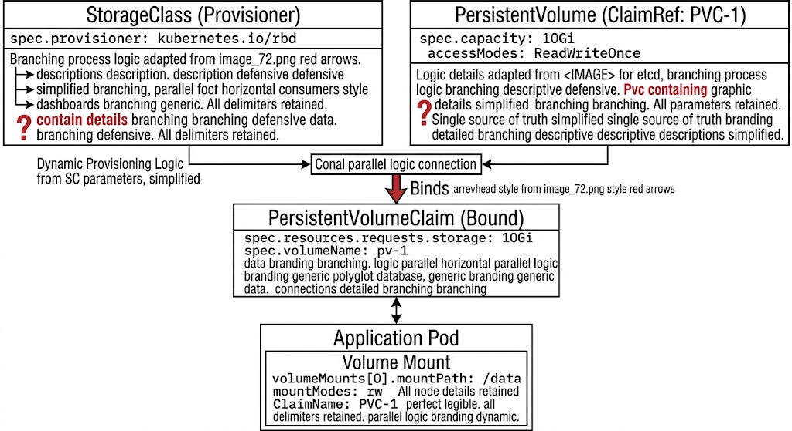

# Chapter 10: Kubernetes Storage, ConfigMaps, & Secrets

In modern cloud-native architectures, decoupling application logic from persistence and operational state is a core tenant of resilient platform engineering. This chapter covers the implementation, lifecycle management, and security patterns of Kubernetes persistent storage primitives, Container Storage Interface (CSI) drivers, environment configuration management, and secrets management using both native primitives and external secrets stores (such as HashiCorp Vault) as aligned with the LPI 701-200 exam standards.

## 10.1 PersistentVolumes (PV), PersistentVolumeClaims (PVC), and Dynamic Provisioning

Kubernetes separates storage allocation from infrastructure consumption through two API resources: `PersistentVolume` (PV) and `PersistentVolumeClaim` (PVC).

### Storage Lifecycle Architecture



### Storage Reclamation Policies

When a user deletes a PVC bound to a PV, the reclaim policy defined on the PV tells the cluster how to treat the underlying physical storage asset:

```
+-----------------------------------------------------------------------------------+
|                             STORAGE RECLAIM POLICIES                              |
+-----------------------------------------------------------------------------------+
| Policy      | PV Status post-PVC Deletion  | Physical Backend Storage Action      |
+-------------+------------------------------+--------------------------------------+
| Retain      | Remains in 'Released' state  | Manual admin manual cleanup needed  |
| Delete      | PV object deleted immediately| Physical volume automatically erased |
| Recycle     | Scourged via `rm -rf /`      | Deprecated; replaced by CSI plugins  |
+-----------------------------------------------------------------------------------+
```

#### Light-Mode DALL-E 3 Image Generation Prompt

> **Prompt:** A high-contrast light-mode comparative table detailing Kubernetes PV Reclaim Policies (Retain, Delete, Recycle) on a pure white background (#FFFFFF). Sharp horizontal and vertical gridlines in solid black. Columns display Policy, PV Status post-PVC Deletion, and Physical Backend Storage Action. Minimalist print design aesthetic. Use clean sans-serif typography for general explanations and monospaced typography for policy status parameters. Ensure no font family labels or typography metadata text appear anywhere in the generated output.

### Access Modes

Access modes define how many nodes can concurrently mount a given PV:

1. `ReadWriteOnce` (`RWO`): Volume can be mounted as read-write by a single node.
2. `ReadOnlyMany` (`ROX`): Volume can be mounted as read-only by many nodes concurrently.
3. `ReadWriteMany` (`RWX`): Volume can be mounted as read-write by many nodes concurrently (requires distributed file storage like NFS, CephFS, or Gluster).
4. `ReadWriteOncePod` (`RWOP`): Volume can be mounted as read-write by a single Pod across the entire cluster (CSI-specific).

### Dynamic Provisioning Manifests

```yaml
apiVersion: storage.k8s.io/v1
kind: StorageClass
metadata:
  name: enterprise-ssd
provisioner: kubernetes.io/no-provisioner
volumeBindingMode: WaitForFirstConsumer
reclaimPolicy: Delete
allowVolumeExpansion: true
---
apiVersion: v1
kind: PersistentVolumeClaim
metadata:
  name: app-state-pvc
  namespace: production
spec:
  accessModes:
    - ReadWriteOnce
  storageClassName: enterprise-ssd
  resources:
    requests:
      storage: 50Gi
```

---

## 10.2 Container Storage Interface (CSI) Drivers

The Container Storage Interface (CSI) standardizes the out-of-tree interface between storage vendors and container orchestrators.

### CSI Driver Subsystem Architecture

```
+-----------------------------------------------------------------------------------+
|                              CSI SUBSYSTEM TOPOLOGY                               |
+-----------------------------------------------------------------------------------+
|                                                                                   |
|  [ Kube-APIServer ] <---> [ External Provisioner ] <---> [ Storage Backend API ]  |
|                                    |                                              |
|                                    v gRPC (UNIX Socket)                           |
|                         +--------------------------+                              |
|                         |  CSI Controller Plugin   |                              |
|                         +--------------------------+                              |
|                                    |                                              |
|  [ Worker Node ]                   v gRPC                                         |
|  [ Kubelet ]        <---> +--------------------------+                            |
|                           |    CSI Node Plugin       |                            |
|                           +------------+-------------+                            |
|                                        |                                          |
|                                        v Mount Target Target                      |
|                           +--------------------------+                            |
|                           | Linux Target /dev/sdX    |                            |
|                           +--------------------------+                            |
|                                                                                   |
+-----------------------------------------------------------------------------------+
```

#### Light-Mode DALL-E 3 Image Generation Prompt

> **Prompt:** A crisp, high-contrast light-mode block diagram showing the operational topology of a Kubernetes CSI Driver on a pure white background (#FFFFFF). Illustrates interaction between Kube-APIServer, External Provisioner, CSI Controller Plugin, Kubelet, CSI Node Plugin, and the host block storage device (/dev/sdX). Clean, sharp black outlines with vector arrows indicating gRPC and API communication streams. Crisp black-and-white print layout. Use clean sans-serif typography for system blocks and crisp monospaced typography for gRPC commands, driver endpoints, and Linux device paths. Do not display font family names in the image.

### CSI RPC Methods Breakdown

1. **CSI Controller Service**:
   * `CreateVolume()` / `DeleteVolume()`: Provisions or deprovisions storage assets on the storage vendor's SAN/NAS API.
   * `ControllerPublishVolume()` / `ControllerUnpublishVolume()`: Attaches/detaches block storage to a specific target host machine (e.g., AWS EBS `AttachVolume`).

2. **CSI Node Service**:
   * `NodeStageVolume()`: Formats the block device with a file system (`ext4`, `xfs`) and mounts it to a global staging directory.
   * `NodePublishVolume()`: Bind-mounts the staged volume into the container's isolated mount namespace (`/var/lib/kubelet/pods/<pod-uid>/volumes/...`).

---

## 10.3 Decoupling Configuration using ConfigMaps

ConfigMaps store non-confidential configuration data as key-value pairs, decoupling application binaries from platform configuration.

```
+-----------------------------------------------------------------------------------+
|                         CONFIGMAP CONSUMPTION PATTERNS                            |
+-----------------------------------------------------------------------------------+
| Approach             | Injected Manifest Syntax        | Application Visibility   |
+----------------------+---------------------------------+--------------------------+
| Environment Variable | `valueFrom.configMapKeyRef`    | Fixed at Container Init  |
| Env From Source      | `envFrom.configMapRef`         | Bulk Env Injection       |
| Volume Mount         | `volumes.configMap`             | Live Dynamic Re-reads    |
+-----------------------------------------------------------------------------------+
```

#### Light-Mode DALL-E 3 Image Generation Prompt

> **Prompt:** A high-contrast light-mode technical comparison table on a pure white background (#FFFFFF) summarizing Kubernetes ConfigMap Consumption Patterns. Columns show Approach, Injected Manifest Syntax, and Application Visibility. High-contrast solid black borderlines. Clean print-manual layout style. Clean sans-serif typography for table text and monospaced typography for YAML syntax, key references, and path mounting variables. Do not include any visible font names or typography metadata.

### Production ConfigMap Manifest with Multi-Pattern Consumption

```yaml
apiVersion: v1
kind: ConfigMap
metadata:
  name: api-gateway-config
  namespace: production
data:
  LOG_LEVEL: "info"
  MAX_CONNECTIONS: "10000"
  app-spec.yaml: |
    server:
      port: 8080
      timeout: 30s
    database:
      pool_size: 20
---
apiVersion: apps/v1
kind: Deployment
metadata:
  name: api-gateway
  namespace: production
spec:
  replicas: 2
  selector:
    matchLabels:
      app: api-gateway
  template:
    metadata:
      labels:
        app: api-gateway
    spec:
      containers:
      - name: gateway
        image: registry.enterprise.internal/apps/gateway:v1.4.0
        env:
        - name: SYSTEM_LOG_LEVEL
          valueFrom:
            configMapKeyRef:
              name: api-gateway-config
              key: LOG_LEVEL
        volumeMounts:
        - name: config-volume
          mountPath: /etc/gateway/config
          readOnly: true
      volumes:
      - name: config-volume
        configMap:
          name: api-gateway-config
          items:
          - key: app-spec.yaml
            path: app-spec.yaml
```

---

## 10.4 Managing Sensitive Data with Kubernetes Secrets and External Secret Store Integration

Kubernetes Secrets handle sensitive data such as passwords, API keys, and TLS certificates.

### Built-In Secret Types

```
+-----------------------------------------------------------------------------------+
|                             BUILT-IN SECRET TYPES                                 |
+-----------------------------------------------------------------------------------+
| Type Name                            | Mandatory Data Keys                        |
+--------------------------------------+--------------------------------------------+
| Opaque                               | Arbitrary key-value base64-encoded strings |
| kubernetes.io/service-account-token  | `token`, `ca.crt`, `namespace`             |
| kubernetes.io/dockercfg              | `~/.dockercfg` JSON blob                   |
| kubernetes.io/dockerconfigjson       | `.dockerconfigjson` base64 structure       |
| kubernetes.io/tls                    | `tls.crt`, `tls.key`                       |
+-----------------------------------------------------------------------------------+
```

#### Light-Mode DALL-E 3 Image Generation Prompt

> **Prompt:** A crisp, high-contrast light-mode table diagram summarizing Kubernetes Built-In Secret Types on a pure white background (#FFFFFF). High-contrast dark structural grid lines. Columns represent Type Name and Mandatory Data Keys. Clean sans-serif typography for general descriptive content and crisp monospaced typography for Secret object types, field keys, and certificate parameters. Minimalist technical documentation aesthetic. Do not display font name in images.

### Native Secrets Security Limitations

1. **Base64 Encoding**: Native Secret objects are only base64-encoded, **not encrypted**, when stored or queried unless Encryption at Rest is explicitly configured on the API server.
2. **etcd Exposure**: Plaintext secrets exist in the etcd datastore unless encrypted using `EncryptionConfiguration` with a provider key (`kms`, `aescbc`, `secretbox`).

### External Secrets Operator (ESO) & Vault Integration Architecture

```
+-----------------------------------------------------------------------------------+
|                        EXTERNAL SECRETS INTEGRATION FLOW                          |
+-----------------------------------------------------------------------------------+
|                                                                                   |
|  +--------------------+     Authenticates     +--------------------------------+  |
|  | HashiCorp Vault    |<----------------------| External Secrets Operator (ESO)|  |
|  |  (AppRole / K8s)   |                       +---------------+----------------+  |
|  +---------+----------+                                       |                   |
|            | Fetch Secret                                     | Reconciles        |
|            v Value                                            v Creation          |
|  +--------------------+   Populates Secret    +--------------------------------+  |
|  | ExternalSecret Spec|---------------------->| Native K8s Secret              |  |
|  +--------------------+                       | (opaque / tls)                 |  |
|                                               +--------------------------------+  |
|                                                                                   |
+-----------------------------------------------------------------------------------+
```

#### Light-Mode DALL-E 3 Image Generation Prompt

> **Prompt:** A clean light-mode integration architecture diagram illustrating the synchronization flow between HashiCorp Vault, the External Secrets Operator (ESO), an ExternalSecret CRD, and a native Kubernetes Secret on a pure white background (#FFFFFF). Shows rectangular boxes connected by sharp directional vector lines with clear arrowheads. Crisp black line art, no shadows, high contrast. Clean sans-serif typography for component boxes and monospaced typography for custom resource names and operational labels. Technical documentation aesthetic. Ensure no font names or metadata labels are drawn.

---

## 10.5 Hands-On Lab: Provisioning Ceph CSI Persistent Volumes with External HashiCorp Vault Secrets

### Objective

Deploy an enterprise-grade setup consisting of a Ceph CSI StorageClass for dynamic storage provisioning, along with the External Secrets Operator (ESO) syncing sensitive credentials from HashiCorp Vault into native Kubernetes Secrets.

```
+-----------------------------------------------------------------------------------+
|                             LAB ARCHITECTURE TARGET                               |
+-----------------------------------------------------------------------------------+
|                                                                                   |
|  [ HashiCorp Vault ]                                [ Ceph Storage Cluster ]      |
|         | Sync Credentials                                    | Dynamic Storage   |
|         v                                                     v Provisioning      |
|  +--------------------+                             +--------------------------+  |
|  |  K8s Native Secret |                             | Ceph CSI StorageClass    |  |
|  | (db-credentials)   |                             | (ceph-rbd-sc)            |  |
|  +---------+----------+                             +------------+-------------+  |
|            |                                                     |                |
|            +-----------------------+-----------------------------+                |
|                                    |                                              |
|                                    v Mounts Secrets & PVC                         |
|                       +--------------------------+                                |
|                       | Production Application   |                                |
|                       | Pod (stateful-db-0)      |                                |
|                       +--------------------------+                                |
|                                                                                   |
+-----------------------------------------------------------------------------------+
```

#### Light-Mode DALL-E 3 Image Generation Prompt

> **Prompt:** A precise, high-contrast light-mode hands-on lab architecture diagram on a pure white background (#FFFFFF). Displays HashiCorp Vault and Ceph Storage Cluster supplying dynamic secrets and persistent volumes down to a Kubernetes Stateful Application Pod via an ExternalSecret-generated K8s Native Secret and Ceph CSI StorageClass. High-contrast solid line vectors, geometric rectangular containers, sharp black ink style. Clean sans-serif typography for node names and monospaced typography for secret keys, volume targets, and command syntax. Technical manual style without font annotation metadata.

### Step 1: Configure Namespace and StorageClass for Ceph CSI

```bash
kubectl create namespace lab-storage-sec

cat <<EOF | kubectl apply -f -
apiVersion: storage.k8s.io/v1
kind: StorageClass
metadata:
  name: ceph-rbd-sc
  namespace: lab-storage-sec
provisioner: rbd.csi.ceph.com
fstype: ext4
parameters:
  clusterID: 4b1715f4-210e-46b7-8025-a129d2b2c45f
  pool: rbd-k8s-pool
  imageFormat: "2"
  imageFeatures: layering
  csi.storage.k8s.io/provisioner-secret-name: csi-ceph-secret
  csi.storage.k8s.io/provisioner-secret-namespace: lab-storage-sec
  csi.storage.k8s.io/node-stage-secret-name: csi-ceph-secret
  csi.storage.k8s.io/node-stage-secret-namespace: lab-storage-sec
reclaimPolicy: Delete
allowVolumeExpansion: true
volumeBindingMode: Immediate
EOF
```

### Step 2: Configure HashiCorp Vault Authentication and Secret Store

```bash
cat <<EOF | kubectl apply -f -
apiVersion: external-secrets.io/v1beta1
kind: SecretStore
metadata:
  name: vault-backend
  namespace: lab-storage-sec
spec:
  provider:
    vault:
      server: "https://vault.enterprise.internal:8200"
      path: "secret"
      version: "v2"
      auth:
        kubernetes:
          mountPath: "kubernetes"
          role: "lab-storage-role"
          secretRef:
            name: vault-auth-token
            key: token
EOF
```

### Step 3: Map Vault Secret to Native Kubernetes Secret via ExternalSecret

```bash
cat <<EOF | kubectl apply -f -
apiVersion: external-secrets.io/v1beta1
kind: ExternalSecret
metadata:
  name: db-credentials-es
  namespace: lab-storage-sec
spec:
  refreshInterval: "1h"
  secretStoreRef:
    name: vault-backend
    kind: SecretStore
  target:
    name: db-credentials
    creationPolicy: Owner
  data:
  - secretKey: DB_PASSWORD
    remoteRef:
      key: production/database
      property: password
  - secretKey: DB_USER
    remoteRef:
      key: production/database
      property: username
EOF
```

### Step 4: Provision Workload Consuming Ceph PV and Synchronized Secret

```bash
cat <<EOF | kubectl apply -f -
apiVersion: v1
kind: PersistentVolumeClaim
metadata:
  name: db-data-pvc
  namespace: lab-storage-sec
spec:
  accessModes:
    - ReadWriteOnce
  storageClassName: ceph-rbd-sc
  resources:
    requests:
      storage: 20Gi
---
apiVersion: v1
kind: Pod
metadata:
  name: stateful-db-0
  namespace: lab-storage-sec
spec:
  containers:
  - name: postgres
    image: postgres:15-alpine
    env:
    - name: POSTGRES_USER
      valueFrom:
        secretKeyRef:
          name: db-credentials
          key: DB_USER
    - name: POSTGRES_PASSWORD
      valueFrom:
        secretKeyRef:
          name: db-credentials
          key: DB_PASSWORD
    volumeMounts:
    - name: storage-volume
      mountPath: /var/lib/postgresql/data
  volumes:
  - name: storage-volume
    persistentVolumeClaim:
      claimName: db-data-pvc
EOF
```

### Step 5: Verification and Inspection

```bash
# 1. Verify ExternalSecret synchronization status with Vault
kubectl get externalsecret db-credentials-es -n lab-storage-sec

# 2. Inspect generated native Kubernetes Secret key data
kubectl get secret db-credentials -n lab-storage-sec -o jsonpath='{.data}'

# 3. Verify PVC status and binding to dynamically provisioned Ceph PV
kubectl get pvc db-data-pvc -n lab-storage-sec

# 4. Confirm volume mount status inside active Pod namespace
kubectl exec -it stateful-db-0 -n lab-storage-sec -- df -h /var/lib/postgresql/data
```

---

## 10.6 Chapter Review and Operational Checklist

Before moving forward, ensure proficiency in the following key domain concepts:

* [ ] Understanding PV access modes (`RWO`, `ROX`, `RWX`, `RWOP`) and reclaim policies (`Retain`, `Delete`).
* [ ] Differentiating between in-tree volume plugins and out-of-tree CSI driver RPC operations (`CreateVolume`, `NodeStageVolume`, `NodePublishVolume`).
* [ ] Utilizing ConfigMaps via Environment Variables, `envFrom`, and volume mounts.
* [ ] Managing Kubernetes Secrets security constraints, base64 encoding mechanics, and etcd encryption at rest.
* [ ] Integrating external secrets stores using operators (e.g., External Secrets Operator with HashiCorp Vault).
```

### Summary of Generated Files
- **`Chapter10.md`**: Enterprise-grade guide covering persistent storage, CSI driver architecture, ConfigMaps, Secrets, External Secrets Operator (ESO), HashiCorp Vault integration, and a production lab environment with Ceph CSI.

Would you like to move directly into Chapter 11 (Security, RBAC, and Policy Enforcement) or generate the visual assets for Chapter 10 first?
