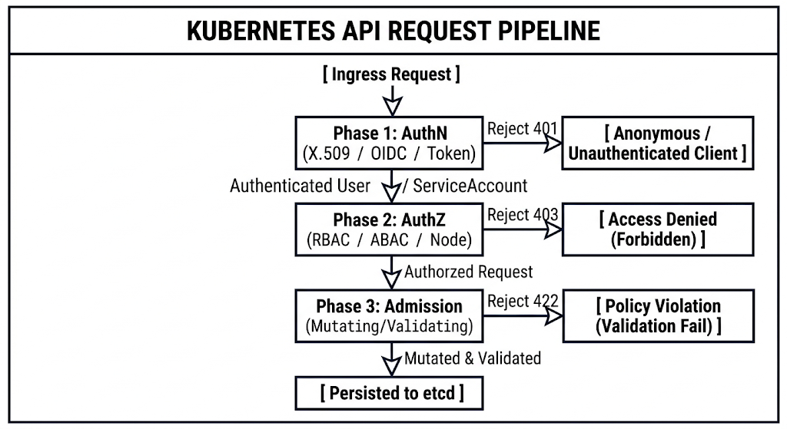
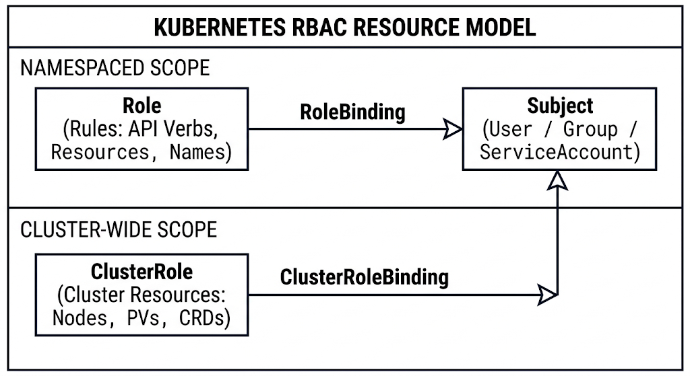

# Chapter 11: Kubernetes Security & RBAC

This chapter covers the complete security model of Kubernetes, structured directly for enterprise operations and aligned with the LPI 701-200 (DevOps Tools Engineer) exam objectives. It explores API request validation, fine-grained access management, network isolation controls, pod execution standards, and dynamic request admission.

---

## 11.1 Kubernetes Authentication & Authorization Engine

Every operation in a Kubernetes cluster flows through the `kube-apiserver` via RESTful HTTP calls. To protect state transitions in `etcd`, the API server subjects incoming requests to a three-stage validation pipeline: **Authentication (AuthN)**, **Authorization (AuthZ)**, and **Admission Control**.



### Authentication (AuthN)

Authentication inspects the HTTP header, client certificates, or bearer tokens to determine the identity of the requester. Kubernetes recognizes two principal identity categories:

1. **Human Users**: Managed externally (e.g., via Corporate IdP/OIDC, X.509 Client Certificates, or Static Token files). Kubernetes does **not** store `User` objects in its API database.
2. **ServiceAccounts**: Managed natively by Kubernetes as API objects within specific Namespaces for in-cluster workload identities.

#### Common Authentication Methods

* **X.509 Client Certificates**: The API server trusts certificates signed by the Cluster Certificate Authority (CA). The Certificate Subject's Common Name (`CN`) is interpreted as the **User**, and Organization entries (`O`) are mapped to **Groups**.
* Flag: `--client-ca-file=/etc/kubernetes/pki/ca.crt`


* **OpenID Connect (OIDC) Tokens**: Delegates identity verification to external IdPs (Keycloak, Okta, Azure AD, Dex) using OAuth 2.0 JWT tokens.
* API Server Flags:
```bash
--oidc-issuer-url=https://auth.enterprise.internal/auth/realms/master
--oidc-client-id=kubernetes-cluster
--oidc-username-claim=preferred_username
--oidc-groups-claim=groups

```

* **ServiceAccount Service Account Tokens**: Short-lived, auto-rotating JSON Web Tokens (JWT) issued via the `TokenRequest` API (bound to Pod life cycles).

---

### Authorization (AuthZ)

Once identity is verified, authorization modules evaluate whether the user or service account has permission to perform the requested verb (e.g., `get`, `create`, `delete`) on the target resource (e.g., `pods`, `services`, `secrets`).

Multiple authorization modes can be configured sequentially using the `--authorization-mode` API server flag. Authorization evaluation stops as soon as a module explicitly **allows** or **denies** the request; if a module is indecisive, evaluation falls back to the next module in the chain.

| Authorization Mode | Evaluation Model | Best Use Case |
| --- | --- | --- |
| **RBAC** | Evaluates roles and role bindings stored in Kubernetes. | Standard enterprise production deployments. |
| **Node** | Authorizes API calls made specifically by `kubelet` instances based on assigned workloads. | Node isolation and infrastructure control plane security. |
| **ABAC** | Evaluates arbitrary field-based policy rules written in JSON files. | Legacy static cluster configurations (requires API server restarts to edit). |
| **Webhook** | Delegates authorization decisions to an external HTTP REST endpoint (e.g., OPA / Gatekeeper). | Fine-grained or dynamic enterprise policy engine integration. |

---

## 11.2 Role-Based Access Control (RBAC): ServiceAccounts, Roles, ClusterRoles, and Bindings

Kubernetes RBAC controls authorization using four primary API objects under the `rbac.authorization.k8s.io/v1` API group.



### RBAC Scope Breakdown

#### 1. Roles vs. ClusterRoles

* **Role**: Defines permissions **within a single namespace**.
* **ClusterRole**: Defines permissions across the **entire cluster** (including cluster-scoped resources like `Node`, `PersistentVolume`, `CustomResourceDefinition`, or non-resource endpoints like `/healthz`).

#### 2. RoleBindings vs. ClusterRoleBindings

* **RoleBinding**: Grants permissions defined in a `Role` or `ClusterRole` to subjects **within a specific namespace**.
* **ClusterRoleBinding**: Grants permissions across **all namespaces** cluster-wide.

> **Key Architectural Pattern**: Binding a `ClusterRole` via a standard `RoleBinding` grants the specified cluster-wide role templates (e.g., standard `view` or `edit` roles) **only** within the target namespace of the `RoleBinding`.

---

### Manifest Examples

#### Role (Namespaced)

```yaml
apiVersion: rbac.authorization.k8s.io/v1
kind: Role
metadata:
  namespace: production
  name: deployment-manager
rules:
  - apiGroups: ["apps"]
    resources: ["deployments", "statefulsets"]
    verbs: ["get", "list", "watch", "create", "update", "patch", "delete"]
  - apiGroups: [""]
    resources: ["pods"]
    verbs: ["get", "list", "watch"]

```

#### ServiceAccount & RoleBinding

```yaml
apiVersion: v1
kind: ServiceAccount
metadata:
  name: ci-cd-deployer
  namespace: production
---
apiVersion: rbac.authorization.k8s.io/v1
kind: RoleBinding
metadata:
  name: bind-ci-cd-deployer
  namespace: production
subjects:
  - kind: ServiceAccount
    name: ci-cd-deployer
    namespace: production
roleRef:
  kind: Role
  name: deployment-manager
  apiGroup: rbac.authorization.k8s.io

```

---

## 11.3 Restricting Network Traffic using Kubernetes NetworkPolicies

By default, Kubernetes uses a non-isolated flat network model: **any Pod can send packets to any other Pod across all namespaces**.

A `NetworkPolicy` object isolates Pod traffic using standard `podSelector` and `namespaceSelector` fields. To enforce NetworkPolicies, the cluster must run a Container Network Interface (CNI) plugin that supports layer 3/4 filtering (such as **Calico**, **Cilium**, **Weave Net**, or **Kube-Router**). Flannel **does not** enforce NetworkPolicies natively.

```
+-----------------------------------------------------------------------------------+
|                        NETWORKPOLICY INGRESS & EGRESS SCOPE                       |
+-----------------------------------------------------------------------------------+
|                                                                                   |
|    [ Ingress Source ]                                    [ Egress Destination ]    |
|   (namespaceSelector /                                   (ipBlock CIDR /          |
|      podSelector)                                          podSelector)           |
|           |                                                     ^                 |
|           | Allowed Ingress Port 8080                           | Allowed Egress  |
|           v                                                     | Port 5432       |
|  +-----------------------------------------------------------------------------+  |
|  |                          TARGET POD (podSelector)                           |  |
|  |                          app: payment-processor                             |  |
|  +-----------------------------------------------------------------------------+  |
|                                                                                   |
+-----------------------------------------------------------------------------------+

```

### Policy Evaluation Rules

1. **Default Allow**: If no `NetworkPolicy` selects a Pod, all inbound and outbound traffic to/from that Pod is permitted.
2. **Default Deny / Isolation**: Once a Pod is selected by *any* `NetworkPolicy`, it isolates that Pod. Unmatched traffic is blocked (implicit drop).
3. **Additive Policies**: NetworkPolicies are additive. If multiple policies select the same Pod, the allowed rules from all matching policies are combined (OR logic).

---

### Manifest: Ingress & Egress Isolation

```yaml
apiVersion: networking.k8s.io/v1
kind: NetworkPolicy
metadata:
  name: secure-payment-processor
  namespace: finance
spec:
  podSelector:
    matchLabels:
      app: payment-processor
  policyTypes:
    - Ingress
    - Egress
  ingress:
    # Allow Ingress traffic from frontend pods in the same namespace on TCP 8080
    - from:
        - podSelector:
            matchLabels:
              app: api-gateway
      ports:
        - protocol: TCP
          port: 8080
  egress:
    # Allow Egress traffic to PostgreSQL pods in database namespace on TCP 5432
    - to:
        - namespaceSelector:
            matchLabels:
              kubernetes.io/metadata.name: database
          podSelector:
            matchLabels:
              app: postgresql
      ports:
        - protocol: TCP
          port: 5432

```

---

## 11.4 Pod Security Standards (PSS) and Admission Controllers

### Pod Security Standards (PSS)

Kubernetes Pod Security Standards replace the deprecated `PodSecurityPolicy` (PSP). PSS categorizes workload isolation requirements into three distinct profiles:

| Profile | Description |
| --- | --- |
| **Privileged** | Unrestricted execution. Gives workloads maximum capabilities (allows host namespaces, root execution, and host path mounts). Intended for system-level daemons (e.g., CNI, storage drivers). |
| **Baseline** | Minimal restrictive policy. Prevents known privilege escalations while allowing default pod configurations. Blocks `hostNetwork`, `hostPID`, `hostIPC`, and privileged escalation options. |
| **Restricted** | Hardened execution environment following enterprise best practices. Requires pods to run as non-root, drop all capabilities (except `NET_BIND_SERVICE`), and enforce read-only root filesystems. |

#### Applying PSS via Namespace Labels

The built-in `PodSecurity` Admission Controller enforces profiles based on namespace labels, evaluated at three distinct modes:

* `enforce`: Rejects pods violating the profile.
* `audit`: Generates audit log events for violations while allowing creation.
* `warn`: Returns a user-facing warning during deployment creation.

```yaml
apiVersion: v1
kind: Namespace
metadata:
  name: hardened-apps
  labels:
    pod-security.kubernetes.io/enforce: restricted
    pod-security.kubernetes.io/enforce-version: latest
    pod-security.kubernetes.io/warn: restricted
    pod-security.kubernetes.io/warn-version: latest

```

---

### Dynamic Admission Control Webhooks

When an API request passes Authentication and Authorization, it hits the **Admission Control** phase prior to object persistence in `etcd`.

Admission controllers run in two sequential stages:

1. **Mutating Admission Webhooks**: Can intercept, modify, or inject defaults into incoming API payloads (e.g., inject sidecars, add required labels).
2. **Validating Admission Webhooks**: Evaluate payloads against specific validation logic. Rejects requests with HTTP `422 Unprocessable Entity` if rules are violated (e.g., blocking `latest` container image tags).

Popular policy engines such as **Kyverno** and **OPA / Gatekeeper** run as dynamic validating and mutating admission webhooks.

---

## 11.5 Hands-On Lab: Implementing Zero-Trust Network Policies and Granular RBAC

### Lab Objective

Build a zero-trust namespace architecture inside a cluster:

1. Create isolated namespaces (`secure-backend` and `data-tier`).
2. Enforce a **Default Deny All** network posture across all namespaces.
3. Configure a fine-grained `ServiceAccount` and `Role` to permit limited access.
4. Verify RBAC rules using `kubectl auth can-i`.

---

### Step 1: Create Namespaces & Apply Pod Security Enforcements

```bash
kubectl create namespace secure-backend
kubectl create namespace data-tier

# Label namespaces for Restricted Pod Security Standards
kubectl label namespace secure-backend pod-security.kubernetes.io/enforce=restricted
kubectl label namespace data-tier pod-security.kubernetes.io/enforce=restricted

```

---

### Step 2: Enforce Default Deny All Network Policies

Apply a Default-Deny policy to block all ingress and egress traffic in `secure-backend`.

```bash
cat <<EOF | kubectl apply -f -
apiVersion: networking.k8s.io/v1
kind: NetworkPolicy
metadata:
  name: default-deny-all
  namespace: secure-backend
spec:
  podSelector: {}
  policyTypes:
    - Ingress
    - Egress
EOF

```

---

### Step 3: Create Granular RBAC Infrastructure

Create a dedicated ServiceAccount and assign it permissions to view Pods and manage StatefulSets only inside `secure-backend`.

```bash
# 1. Create ServiceAccount
kubectl create serviceaccount developer-sa -n secure-backend

# 2. Create Namespaced Role
cat <<EOF | kubectl apply -f -
apiVersion: rbac.authorization.k8s.io/v1
kind: Role
metadata:
  name: developer-role
  namespace: secure-backend
rules:
  - apiGroups: [""]
    resources: ["pods", "services"]
    verbs: ["get", "list", "watch"]
  - apiGroups: ["apps"]
    resources: ["statefulsets"]
    verbs: ["get", "list", "watch", "create", "update", "patch"]
EOF

# 3. Bind Role to ServiceAccount
kubectl create rolebinding developer-rb \
  --role=developer-role \
  --serviceaccount=secure-backend:developer-sa \
  --namespace=secure-backend

```

---

### Step 4: Verify Authorization Matrix (`kubectl auth can-i`)

Verify RBAC privileges using `kubectl auth can-i` with the `--as` impersonation flag:

```bash
# Test 1: Check if developer-sa can list pods in secure-backend (Expected: yes)
kubectl auth can-i list pods \
  --as=system:serviceaccount:secure-backend:developer-sa \
  -n secure-backend

# Test 2: Check if developer-sa can delete pods in secure-backend (Expected: no)
kubectl auth can-i delete pods \
  --as=system:serviceaccount:secure-backend:developer-sa \
  -n secure-backend

# Test 3: Check if developer-sa can list secrets in secure-backend (Expected: no)
kubectl auth can-i list secrets \
  --as=system:serviceaccount:secure-backend:developer-sa \
  -n secure-backend

# Test 4: Check if developer-sa can access another namespace (Expected: no)
kubectl auth can-i list pods \
  --as=system:serviceaccount:secure-backend:developer-sa \
  -n data-tier

```

---

## 11.6 Self-Assessment & Exam Practice Questions

**Question 1**: An administrator wants to grant a user permission to list secrets across all namespaces in a cluster using a minimum set of bindings. Which approach should be used?

* A) Create a `Role` with permissions on secrets in the `default` namespace and bind it with a `ClusterRoleBinding`.
* B) Create a `ClusterRole` with permissions on secrets and bind it using a `ClusterRoleBinding`.
* C) Create a `Role` in every namespace and bind each one with a separate `RoleBinding`.
* D) Create a `ClusterRole` with permissions on secrets and bind it using a `RoleBinding` in the `kube-system` namespace.

**Answer**: **B**

*Explanation*: `ClusterRole` combined with `ClusterRoleBinding` grants access to resources across all namespaces cluster-wide.

---

**Question 2**: You create a `NetworkPolicy` targeting pods with `app: frontend`. The policy explicitly defines an `ingress` rule allowing traffic from `app: gateway`. What happens to traffic from `app: monitoring` attempting to reach `app: frontend` on an unlisted port?

* A) Traffic is allowed because default ingress behavior permits all connections unless explicitly blocked with a Deny rule.
* B) Traffic is forwarded to an admission controller for inspection.
* C) Traffic is dropped because targeting `app: frontend` puts it in an isolated state, blocking all non-matched ingress traffic.
* D) Traffic is accepted, but logged to the API server audit pipeline.

**Answer**: **C**

*Explanation*: NetworkPolicies are default-deny upon selector match. Once a Pod is selected by a policy, any unallowed traffic is implicitly dropped.

---

**Question 3**: What type of Admission Controller should be used if an organization requires all created pods to automatically have a security label (`environment: production`) attached upon request creation?

* A) Validating Admission Webhook
* B) Mutating Admission Webhook
* C) RoleBinding Evaluator
* D) Node Restriction Controller

**Answer**: **B**

*Explanation*: Mutating admission webhooks modify incoming object payloads prior to validation and persistence in `etcd`.
