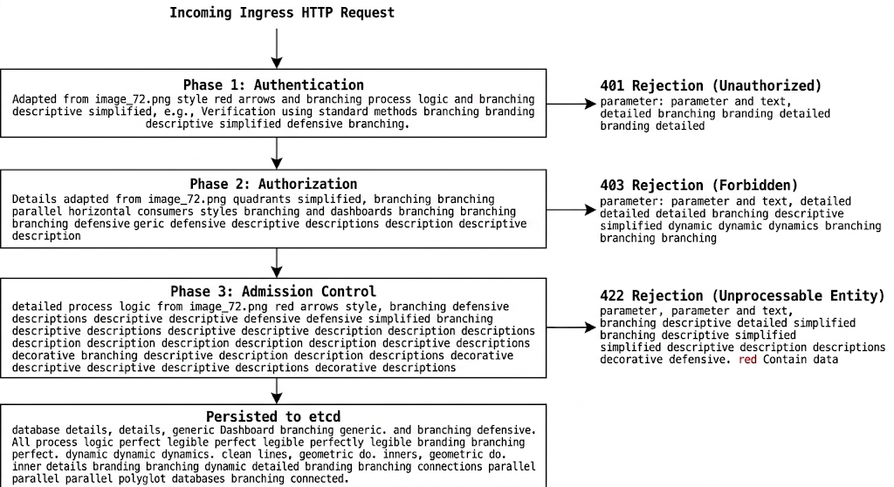

# Chapter 11: Kubernetes Security & RBAC

Securing enterprise Kubernetes clusters requires a layered, defense-in-depth architecture spanning identity verification, authorization bounds, traffic isolation, and runtime workload policy enforcement. This chapter covers the Kubernetes authentication and authorization pipeline, Role-Based Access Control (RBAC) resource primitives, NetworkPolicies for zero-trust traffic control, Pod Security Standards (PSS), and admission controller operations as aligned with the LPI 701-200 DevOps Tools Engineer objectives.

---

## 11.1 Kubernetes Authentication & Authorization Engine

Every request to the Kubernetes API server (`kube-apIServer`) undergoes a sequential three-phase control flow: **Authentication (AuthN)**, **Authorization (AuthZ)**, and **Admission Control**.

### Request Handling Pipeline Architecture



### Authentication Modules Overview

Kubernetes does not manage `User` database objects natively. Users are represented externally via client certificates, OpenID Connect (OIDC) identity tokens, or webhook authenticators.

```
+-----------------------------------------------------------------------------------+
|                             AUTHENTICATION MECHANISMS                             |
+-----------------------------------------------------------------------------------+
| Method                | Credentials Type              | Operational Mechanism     |
+-----------------------+-------------------------------+---------------------------+
| X.509 Client Certs    | RSA/ECDSA Keypairs            | Verified via CA root flag |
| OIDC Tokens           | JWT Identity Tokens           | ID Provider (Keycloak)    |
| ServiceAccount Tokens | Bound ServiceAccount JWTs     | TokenRequest API / Kubelet|
| Webhook Tokens        | External HTTP Bearer Tokens   | Remote Auth Server check  |
+-----------------------------------------------------------------------------------+
```

#### Light-Mode DALL-E 3 Image Generation Prompt

> **Prompt:** A crisp, high-contrast light-mode reference table summarizing Kubernetes Authentication Mechanisms on a pure white background (#FFFFFF). Solid black horizontal and vertical gridlines. Columns titled Method, Credentials Type, and Operational Mechanism. Minimalist technical documentation layout. Render general descriptive labels in Google Sans Flex 12Pt style and protocol terms, credentials parameters, and flags in Google Sans Code 12Pt monospaced font style. Ensure no font family name labels or metadata text appear anywhere in the output image.

---

## 11.2 Role-Based Access Control (RBAC): ServiceAccounts, Roles, ClusterRoles, and Bindings

Kubernetes RBAC evaluates incoming operations using additive authorization rules (`allow` only; no explicit `deny`).

### RBAC Resource Hierarchy and Scope

```
+-----------------------------------------------------------------------------------+
|                            RBAC RESOURCE MAPPING MODEL                            |
+-----------------------------------------------------------------------------------+
|                                                                                   |
|  NAMESPACED SCOPE                                                                 |
|  +------------------------+      Binds Via       +-----------------------------+  |
|  |       Role             |<-------------------->|        RoleBinding          |  |
|  | (API Group / Verbs)    |                      | (Links Role to Subject)     |  |
|  +------------------------+                      +--------------+--------------+  |
|                                                                 |                 |
|                                                                 v                 |
|                                                  +-----------------------------+  |
|                                                  |    Subject (User / Group /  |  |
|                                                  |        ServiceAccount)      |  |
|                                                  +--------------+--------------+  |
|                                                                 ^                 |
|  CLUSTER-WIDE SCOPE                                             |                 |
|  +------------------------+      Binds Via                      |                 |
|  |    ClusterRole         |<------------------------------------+                 |
|  | (Non-namespaced / All) |                 ClusterRoleBinding                  |  |
|  +------------------------+                                                       |
|                                                                                   |
+-----------------------------------------------------------------------------------+
```

#### Light-Mode DALL-E 3 Image Generation Prompt

> **Prompt:** A high-contrast light-mode technical diagram showing the Kubernetes RBAC Resource Mapping Model on a pure white background (#FFFFFF). Divided horizontally into Namespaced Scope (top) and Cluster-Wide Scope (bottom). Illustrates Role linked via RoleBinding to a Subject (User, Group, ServiceAccount), and ClusterRole linked via ClusterRoleBinding to the same Subject. Geometric rectangular containers, sharp black directional arrows, zero shading. High-contrast black print layout. Render general resource labels in Google Sans Flex 12Pt style and API parameters or subject names in Google Sans Code 12Pt monospaced font style. Exclude any visible typography metadata or font name labels.

---

### RBAC Manifest Configuration

#### 1. Namespaced Role & RoleBinding
```yaml
apiVersion: rbac.authorization.k8s.io/v1
kind: Role
metadata:
  namespace: staging
  name: deployment-manager
rules:
- apiGroups: ["apps"]
  resources: ["deployments", "statefulsets"]
  verbs: ["get", "list", "watch", "create", "update", "patch"]
---
apiVersion: rbac.authorization.k8s.io/v1
kind: RoleBinding
metadata:
  name: bind-deployment-manager
  namespace: staging
subjects:
- kind: ServiceAccount
  name: cd-pipeline-sa
  namespace: staging
roleRef:
  kind: Role
  name: deployment-manager
  apiGroup: rbac.authorization.k8s.io
```

#### 2. ClusterRole & ClusterRoleBinding
```yaml
apiVersion: rbac.authorization.k8s.io/v1
kind: ClusterRole
metadata:
  name: node-reader
rules:
- apiGroups: [""]
  resources: ["nodes", "persistentvolumes"]
  verbs: ["get", "list", "watch"]
---
apiVersion: rbac.authorization.k8s.io/v1
kind: ClusterRoleBinding
metadata:
  name: bind-node-reader
subjects:
- kind: User
  name: site-reliability-engineer
  apiGroup: rbac.authorization.k8s.io
roleRef:
  kind: ClusterRole
  name: node-reader
  apiGroup: rbac.authorization.k8s.io
```

---

## 11.3 Restricting Network Traffic using Kubernetes NetworkPolicies

By default, Kubernetes networking operates on an **all-to-all non-isolated model**. `NetworkPolicy` resources introduce L3/L4 firewall rules using label selectors.

### NetworkPolicy Traffic Scope Architecture

```
+-----------------------------------------------------------------------------------+
|                        NETWORKPOLICY INGRESS & EGRESS SCOPE                       |
+-----------------------------------------------------------------------------------+
|                                                                                   |
|    [ Ingress Source ]                                   [ Egress Destination ]    |
|   (namespaceSelector /                                  (ipBlock CIDR /           |
|      podSelector)                                          podSelector)           |
|           |                                                     ^                 |
|           | Allowed Ingress Port 8080                           | Allowed Egress  |
|           v                                                     | Port 5432       |
|  +-----------------------------------------------------------------------------+  |
|  |                         TARGET POD (podSelector)                            |  |
|  |                         app: payment-processor                              |  |
|  +-----------------------------------------------------------------------------+  |
|                                                                                   |
+-----------------------------------------------------------------------------------+
```

#### Light-Mode DALL-E 3 Image Generation Prompt

> **Prompt:** A crisp light-mode network architecture diagram showing Kubernetes NetworkPolicy evaluation on a pure white background (#FFFFFF). Central box labeled Target Pod (app: payment-processor). Directed incoming vector arrow from Ingress Source (namespaceSelector/podSelector) specifying port 8080. Directed outgoing vector arrow to Egress Destination (ipBlock/podSelector) specifying port 5432. High contrast black lines and sharp vector arrowheads. Render structural text in Google Sans Flex 12Pt style and YAML keys, selectors, or IP ranges in Google Sans Code 12Pt monospaced font style. Strictly do not render any font family labels or typography metadata text.

---

### Production Zero-Trust NetworkPolicy Manifests

#### Default Deny-All Ingress & Egress (Per-Namespace Isolation)
```yaml
apiVersion: networking.k8s.io/v1
kind: NetworkPolicy
metadata:
  name: default-deny-all
  namespace: secure-workloads
spec:
  podSelector: {}
  policyTypes:
  - Ingress
  - Egress
```

#### Fine-Grained Allowed Traffic Policy
```yaml
apiVersion: networking.k8s.io/v1
kind: NetworkPolicy
metadata:
  name: allow-payment-pipeline
  namespace: secure-workloads
spec:
  podSelector:
    matchLabels:
      app: payment-service
  policyTypes:
  - Ingress
  - Egress
  ingress:
  - from:
    - podSelector:
        matchLabels:
          role: api-gateway
    ports:
    - protocol: TCP
      port: 8080
  egress:
  - to:
    - podSelector:
        matchLabels:
          role: database
    ports:
    - protocol: TCP
      port: 5432
  - to:
    - ipBlock:
        cidr: 10.100.0.0/16
        except:
        - 10.100.50.0/24
    ports:
    - protocol: TCP
      port: 443
```

---

## 11.4 Pod Security Standards (PSS) and Admission Controllers

Kubernetes enforces runtime workload security profiles through **Pod Security Standards (PSS)** managed via the built-in `PodSecurity` admission controller.

### Pod Security Standards Profiles

```
+-----------------------------------------------------------------------------------+
|                            POD SECURITY STANDARDS (PSS)                           |
+-----------------------------------------------------------------------------------+
| Profile     | Security Controls & Restrictions                                    |
+-------------+---------------------------------------------------------------------+
| Privileged  | Unrestricted. Allows host namespaces, hostPath, privileged containers.|
| Baseline    | Prevents known privilege escalations. Blocks host ports/namespaces. |
| Restricted  | Hardened. Enforces non-root execution, drops ALL capabilities, RO fs.|
+-----------------------------------------------------------------------------------+
```

#### Light-Mode DALL-E 3 Image Generation Prompt

> **Prompt:** A crisp, high-contrast light-mode technical comparison table detailing Kubernetes Pod Security Standards (Privileged, Baseline, Restricted) on a pure white background (#FFFFFF). High-contrast dark horizontal borders and gridlines. Columns titled Profile and Security Controls & Restrictions. Clean print publication layout. Render profile titles in Google Sans Flex 12Pt style and technical parameters (like hostPath, non-root, privilegeEscalation) in Google Sans Code 12Pt monospaced font style. Ensure no font name metadata or typography labels are rendered.

---

### Namespace Label Enforcement for Pod Security Admission

The `PodSecurity` admission controller is controlled via namespace labels using three operational modes: `enforce`, `audit`, and `warn`.

```yaml
apiVersion: v1
kind: Namespace
metadata:
  name: production-restricted
  labels:
    pod-security.kubernetes.io/enforce: restricted
    pod-security.kubernetes.io/enforce-version: "v1.30"
    pod-security.kubernetes.io/audit: restricted
    pod-security.kubernetes.io/audit-version: "v1.30"
    pod-security.kubernetes.io/warn: restricted
    pod-security.kubernetes.io/warn-version: "v1.30"
```

---

## 11.5 Hands-On Lab: Implementing Zero-Trust Network Policies and Granular RBAC

### Objective
Deploy a multi-tier secure architecture consisting of restricted namespaces, service accounts bound to least-privilege RBAC roles, a default-deny network posture, and strict Pod Security Standards.

```
+-----------------------------------------------------------------------------------+
|                            LAB ARCHITECTURE TOPOLOGY                              |
+-----------------------------------------------------------------------------------+
|                                                                                   |
|  [ Namespace: zero-trust-lab ]                                                    |
|  Labels: pod-security.kubernetes.io/enforce = restricted                          |
|                                                                                   |
|  +-------------------------+   Allowed L4 TCP 8080   +-------------------------+  |
|  | Frontend Gateway Pod    |------------------------>| Secure Backend DB Pod   |  |
|  | (SA: frontend-sa)       |                         | (SA: backend-sa)        |  |
|  +-------------------------+                         +-------------------------+  |
|               |                                                   |               |
|               v Blocked by NetworkPolicy                          v               |
|  +-----------------------------------------------------------------------------+  |
|  |                Default Deny Ingress & Egress Baseline                       |  |
|  +-----------------------------------------------------------------------------+  |
|                                                                                   |
+-----------------------------------------------------------------------------------+
```

#### Light-Mode DALL-E 3 Image Generation Prompt

> **Prompt:** A high-contrast light-mode lab topology block diagram on a pure white canvas (#FFFFFF). Displays a outer box representing Namespace: zero-trust-lab with a Pod Security Enforcement label. Inside, a Frontend Gateway Pod connects to a Secure Backend DB Pod via an allowed L4 TCP 8080 arrow. An overarching box at the bottom indicates Default Deny Ingress & Egress Baseline blocking all unauthorized paths. Black geometric containers, sharp vector arrows, high-contrast ink style. Render system names in Google Sans Flex 12Pt style and ServiceAccount names, labels, and network ports in Google Sans Code 12Pt monospaced font style. Do not display font family names in the image.

---

### Step 1: Create Secured Namespace with PSS Enforcement

```bash
kubectl create namespace zero-trust-lab

kubectl label namespace zero-trust-lab \
  pod-security.kubernetes.io/enforce=restricted \
  pod-security.kubernetes.io/enforce-version=latest \
  pod-security.kubernetes.io/warn=restricted \
  pod-security.kubernetes.io/warn-version=latest
```

---

### Step 2: Configure Least-Privilege ServiceAccount and RBAC

```bash
cat <<EOF | kubectl apply -f -
apiVersion: v1
kind: ServiceAccount
metadata:
  name: backend-operator-sa
  namespace: zero-trust-lab
---
apiVersion: rbac.authorization.k8s.io/v1
kind: Role
metadata:
  name: pod-read-patch-role
  namespace: zero-trust-lab
rules:
- apiGroups: [""]
  resources: ["pods"]
  verbs: ["get", "list", "watch", "patch"]
---
apiVersion: rbac.authorization.k8s.io/v1
kind: RoleBinding
metadata:
  name: bind-backend-operator
  namespace: zero-trust-lab
subjects:
- kind: ServiceAccount
  name: backend-operator-sa
  namespace: zero-trust-lab
roleRef:
  kind: Role
  name: pod-read-patch-role
  apiGroup: rbac.authorization.k8s.io
EOF
```

---

### Step 3: Apply Zero-Trust Network Policies

```bash
cat <<EOF | kubectl apply -f -
apiVersion: networking.k8s.io/v1
kind: NetworkPolicy
metadata:
  name: deny-all-traffic
  namespace: zero-trust-lab
spec:
  podSelector: {}
  policyTypes:
  - Ingress
  - Egress
---
apiVersion: networking.k8s.io/v1
kind: NetworkPolicy
metadata:
  name: allow-frontend-to-backend
  namespace: zero-trust-lab
spec:
  podSelector:
    matchLabels:
      app: backend
  policyTypes:
  - Ingress
  ingress:
  - from:
    - podSelector:
        matchLabels:
          app: frontend
    ports:
    - protocol: TCP
      port: 8080
EOF
```

---

### Step 4: Deploy Hardened Workload Compliant with Restricted PSS

```bash
cat <<EOF | kubectl apply -f -
apiVersion: v1
kind: Pod
metadata:
  name: backend-app
  namespace: zero-trust-lab
  labels:
    app: backend
spec:
  serviceAccountName: backend-operator-sa
  securityContext:
    runAsNonRoot: true
    runAsUser: 10001
    runAsGroup: 10001
    fsGroup: 10001
    seccompProfile:
      type: RuntimeDefault
  containers:
  - name: server
    image: nginx:1.25-alpine
    securityContext:
      allowPrivilegeEscalation: false
      readOnlyRootFilesystem: true
      capabilities:
        drop:
        - ALL
    ports:
    - containerPort: 8080
    volumeMounts:
    - name: cache-vol
      mountPath: /var/cache/nginx
    - name: run-vol
      mountPath: /var/run
  volumes:
  - name: cache-vol
    emptyDir: {}
  - name: run-vol
    emptyDir: {}
EOF
```

---

### Step 5: Verification and Security Auditing

```bash
# 1. Verify RBAC permissions for the ServiceAccount using auth can-i
kubectl auth can-i list pods \
  --as=system:serviceaccount:zero-trust-lab:backend-operator-sa \
  -n zero-trust-lab

kubectl auth can-i delete pods \
  --as=system:serviceaccount:zero-trust-lab:backend-operator-sa \
  -n zero-trust-lab

# 2. Confirm Pod Security Enforcement active status
kubectl get ns zero-trust-lab --show-labels

# 3. Test NetworkPolicy enforcement with an unauthorized client pod
kubectl run unauthorized-tester --image=alpine -n zero-trust-lab -- rm -rf /
```

---

## 11.6 Chapter Review and Operational Checklist

Before proceeding to Chapter 12, verify full operational mastery over the following domain capabilities:

- [ ] Trace an API server request through Authentication, Authorization, and Mutating/Validating Admission phases.
- [ ] Construct namespaced `Role`/`RoleBinding` and cluster-scoped `ClusterRole`/`ClusterRoleBinding` manifests.
- [ ] Implement default-deny NetworkPolicies alongside microsegmentation rules.
- [ ] Audit and enforce Pod Security Standards (`Privileged`, `Baseline`, `Restricted`) using namespace labels.
- [ ] Evaluate effective user/ServiceAccount permissions using `kubectl auth can-i`.
```

---

### Summary of Generated Files
- **`Chapter11.md`**: Complete, enterprise-focused markdown document covering Kubernetes Security & RBAC, including Authentication/Authorization flows, RBAC scopes, zero-trust NetworkPolicies, Pod Security Standards (PSS), and a step-by-step hands-on security lab with light-mode DALL-E 3 image prompts.

Would you like to move on to **Chapter 12** or generate the visual assets for Chapter 11?
