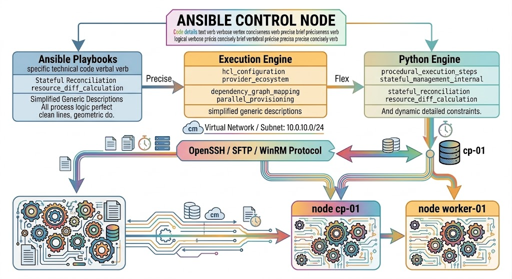

# Chapter 14: Ansible Architecture & Core Playbooks

This chapter covers the architecture, configuration management principles, inventory control mechanisms, and playbook execution models of Ansible. It directly addresses Subject Area 701 (Configuration Management and Automation) of the **LPI 701-200 DevOps Tools Engineer Exam Objectives**.

## 14.1 Agentless Configuration Management Engine & SSH Control

Unlike agent-based configuration management tools (such as Puppet or Chef) that require a daemon running on managed nodes, Ansible utilizes an **agentless architecture**.



### Operational Mechanics

1. **Control Node:** The system where Ansible is installed. Ansible processes playbooks, parses inventories, resolves dependencies, and renders templates locally on the Control Node.
2. **Transport Layer:** Communication with managed nodes occurs via standard protocols:
   * **OpenSSH / SFTP / SCP:** Default transport mechanism for Linux/Unix platforms.
   * **WinRM / WinPSSession:** Used for native Windows target management.
3. **Execution Model:** Ansible connects to managed nodes over SSH, transfers small ephemeral Python scripts (modules) to a temporary directory on the target, executes those scripts, extracts JSON formatted results, and cleans up the temporary files.

### Requirements for Managed Nodes
* **POSIX/Linux Targets:** Standard SSH daemon and a Python interpreter installed (`Python >= 3.9`).
* **Windows Targets:** PowerShell 3.0+ and WinRM configured for remote management.

### Enterprise SSH Tuning (`ansible.cfg`)

To operate efficiently across thousands of enterprise targets, the default SSH transport settings must be tuned in `ansible.cfg`:

```ini
[defaults]
inventory       = ./inventory
remote_user     = devops_admin
private_key_file = ~/.ssh/id_ed25519_enterprise
host_key_checking = True
forks           = 50            ; Parallel connections per task execution

[privilege_escalation]
become          = True
become_method   = sudo
become_user     = root
become_ask_pass = False

[ssh_connection]
pipelining      = True          ; Reduces SSH operations required to execute a module
ssh_args        = -o ControlMaster=auto -o ControlPersist=60s -o StrictHostKeyChecking=accept-new
```

* **Pipelining (`pipelining = True`):** Bypasses the file-transfer step (`SFTP`/`SCP`) by piping Python scripts directly into the SSH session stdin. This significantly improves task execution performance across large fleets.
* **ControlPersist (`ControlPersist=60s`):** Reuses established SSH sockets for subsequent commands executed against the same target within the specified idle window.

## 14.2 Inventory Files (Static vs. Dynamic Inventory Engines)

Ansible manages targets defined in an **inventory**. An inventory maps managed targets to logical groups for targeted configuration execution.

### Static Inventories

Static inventories use INI or YAML file formats to list hosts and host groups.

#### INI Format (`inventory/hosts.ini`)
```ini
[webservers]
web-node-01.example.com ansible_host=10.0.1.10
web-node-02.example.com ansible_host=10.0.1.11

[dbservers]
db-node-01.example.com ansible_host=10.0.2.20

[production:children]
webservers
dbservers

[production:vars]
env=production
ansible_port=22
```

#### YAML Format (`inventory/hosts.yaml`)
```yaml
all:
  children:
    webservers:
      hosts:
        web-node-01.example.com:
          ansible_host: 10.0.1.10
        web-node-02.example.com:
          ansible_host: 10.0.1.11
    dbservers:
      hosts:
        db-node-01.example.com:
          ansible_host: 10.0.2.20
      vars:
        db_port: 5432
```

### Dynamic Inventory Engines

In cloud environments (AWS, Azure, GCP, OpenStack), static IP addresses and hostnames change frequently. **Dynamic Inventory Plugins** query cloud provider APIs at runtime to dynamically build host lists and group metadata using tags.

#### Enterprise Dynamic Inventory Configuration: AWS EC2 Plugin (`aws_ec2.yaml`)

To use the dynamic inventory plugin, name the file ending with `aws_ec2.yaml` or `aws_ec2.yml`:

```yaml
plugin: amazon.aws.aws_ec2
regions:
  - us-east-1
  - us-west-2

# Filter target instances by state and tags
filters:
  instance-state-name: [running]
  tag:Environment: production

# Group hosts logically using Jinja2 expressions
keyed_groups:
  - key: tags.Role
    prefix: role
  - key: tags.Environment
    prefix: env
  - key: placement.availability_zone
    prefix: az

# Set connection properties dynamically
compose:
  ansible_host: private_ip_address
```

#### Testing Inventory Parsing

```bash
# Verify static or dynamic inventory output in JSON format
ansible-inventory -i aws_ec2.yaml --list

# View logical graph structure of target groups
ansible-inventory -i aws_ec2.yaml --graph
```

## 14.3 Writing Idempotent Ansible Tasks and Playbooks

**Idempotency** ensures that executing an Ansible task multiple times results in the same system state as running it once, without causing unintended side effects or redundant changes on subsequent runs.

### Task Status Lifecycle

When an Ansible task completes on a managed node, it returns one of three primary states:
1. **`ok`:** Target is already in the desired state; no changes were made.
2. **`changed`:** Target was modified to reach the desired state.
3. **`failed`:** Task encountered an error and execution stopped on that host.

### Writing Idempotent Tasks (Declarative vs. Imperative)

Most native Ansible modules (e.g., `ansible.builtin.copy`, `ansible.builtin.package`, `ansible.builtin.service`, `ansible.builtin.user`) are inherently idempotent. However, command-execution modules (`ansible.builtin.command`, `ansible.builtin.shell`, `ansible.builtin.raw`) are imperative and will trigger a `changed` status on every execution unless explicitly constrained.

#### Non-Idempotent (Anti-Pattern)
```yaml
# BAD: Executes every time and always returns status "changed"
- name: Uncompress software archive
  ansible.builtin.shell: tar -xzf /tmp/app.tar.gz -C /opt/app/
```

#### Idempotent Guard Pattern

```yaml
# GOOD: Constrained using creates or checks
- name: Uncompress software archive idempotently
  ansible.builtin.unarchive:
    src: /tmp/app.tar.gz
    dest: /opt/app/
    remote_src: true
    creates: /opt/app/bin/executable
```

#### Idempotent Shell Execution Pattern
```yaml
- name: Run initialization script only if marker file is missing
  ansible.builtin.shell: /opt/app/init.sh && touch /opt/app/init.marker
  args:
    creates: /opt/app/init.marker
```

## 14.4 Variables, Facts, Handlers, and Conditionals

### Variable Precedence Hierarchy

Ansible allows variables to be defined in multiple locations. When the same variable name exists in multiple scopes, Ansible evaluates them according to a strict precedence order (listed below from lowest to highest precedence):

1. Command-line role defaults (`roles/x/defaults/main.yml`)
2. Inventory group vars (`group_vars/all.yml`, `group_vars/groupname.yml`)
3. Inventory host vars (`host_vars/hostname.yml`)
4. Playbook `vars` block
5. Playbook `vars_files`
6. Task-level variables (`vars` inside a task)
7. Role variables (`roles/x/vars/main.yml`)
8. Registered task variables (`register: variable_name`)
9. Extra CLI variables (`-e "var_name=value"`) — **Highest Precedence**

### Ansible Facts

Facts are system-level variables automatically gathered from target systems by the `ansible.builtin.setup` module at the start of a playbook execution.

```yaml
- name: Display target machine details using gathered facts
  ansible.builtin.debug:
    msg: "Node {{ ansible_facts['hostname'] }} runs {{ ansible_facts['distribution'] }} {{ ansible_facts['distribution_version'] }} on IP {{ ansible_facts['default_ipv4']['address'] }}"
```

To improve execution performance on hosts where facts are not used in tasks, disable fact gathering:

```yaml
- name: Perform fast tasks without fact gathering
  hosts: all
  gather_facts: false
  tasks:
    - name: Ping host
      ansible.builtin.ping:
```

### Conditionals (`when`)

Tasks can be conditionally executed based on variables, facts, or registered results:

```yaml
- name: Install Apache web server on RedHat-based systems
  ansible.builtin.dnf:
    name: httpd
    state: present
  when: ansible_facts['os_family'] == "RedHat"

- name: Install Apache web server on Debian-based systems
  ansible.builtin.apt:
    name: apache2
    state: present
  when: ansible_facts['os_family'] == "Debian"
```

### Handlers

Handlers are special tasks that execute only when notified by another task returning a status of `changed`. They are grouped and run at the very end of the play execution phase to optimize execution speed (e.g., preventing unnecessary service restarts).

```yaml
tasks:
  - name: Update Nginx Configuration File
    ansible.builtin.template:
      src: templates/nginx.conf.j2
      dest: /etc/nginx/nginx.conf
      owner: root
      group: root
      mode: '0644'
    notify: Restart Nginx Service

handlers:
  - name: Restart Nginx Service
    ansible.builtin.service:
      name: nginx
      state: restarted
```

## 14.5 Hands-On Lab: Writing an Idempotent Multi-Tier Application Server Playbook

### Scenario Overview
In this lab, you will write a complete, production-grade, idempotent Ansible playbook that configures a multi-tier application stack consisting of:
1. **Frontend Tier:** Nginx Reverse Proxy
2. **Application Tier:** Node.js Application service running with systemd

### Step 1: Lab Directory Structure Setup

Create a dedicated directory structure following Ansible best practices:

```bash
mkdir -p multi-tier-lab/inventory
mkdir -p multi-tier-lab/group_vars
mkdir -p multi-tier-lab/roles/nginx/tasks
mkdir -p multi-tier-lab/roles/nginx/templates
mkdir -p multi-tier-lab/roles/nginx/handlers
mkdir -p multi-tier-lab/roles/app/tasks
mkdir -p multi-tier-lab/roles/app/templates
cd multi-tier-lab
```

### Step 2: Configure Static Inventory and Variables

#### `inventory/hosts.ini`
```ini
[webservers]
web-01.lab.internal ansible_host=127.0.0.1 ansible_port=2222

[appservers]
app-01.lab.internal ansible_host=127.0.0.1 ansible_port=2223

[multi_tier:children]
webservers
appservers

[multi_tier:vars]
ansible_user=devops
ansible_ssh_private_key_file=~/.ssh/id_rsa
```

#### `group_vars/all.yml`
```yaml
app_port: 3000
app_directory: /opt/node_app
node_version: "18"
domain_name: "app.enterprise.internal"
```

### Step 3: Develop the Nginx Frontend Role

#### `roles/nginx/handlers/main.yml`

```yaml
---
- name: Reload Nginx Service
  ansible.builtin.service:
    name: nginx
    state: reloaded
```

#### `roles/nginx/templates/nginx_proxy.conf.j2`

```nginx
server {
    listen 80;
    server_name {{ domain_name }};

    location / {
        proxy_pass http://127.0.0.1:{{ app_port }};
        proxy_set_header Host $host;
        proxy_set_header X-Real-IP $remote_addr;
        proxy_set_header X-Forwarded-For $proxy_add_x_forwarded_for;
    }
}
```

#### `roles/nginx/tasks/main.yml`
```yaml
---
- name: Ensure Nginx package is installed
  ansible.builtin.package:
    name: nginx
    state: present

- name: Deploy Nginx reverse proxy configuration
  ansible.builtin.template:
    src: nginx_proxy.conf.j2
    dest: /etc/nginx/conf.d/app_proxy.conf
    owner: root
    group: root
    mode: '0644'
  notify: Reload Nginx Service

- name: Ensure Nginx service is enabled and started
  ansible.builtin.service:
    name: nginx
    state: started
    enabled: true
```

### Step 4: Develop the Application Tier Role

#### `roles/app/templates/app.service.j2`
```ini
[Unit]
Description=Node.js Application Service
After=network.target

[Service]
Type=simple
User=appuser
WorkingDirectory={{ app_directory }}
ExecStart=/usr/bin/node {{ app_directory }}/index.js
Restart=on-failure
Environment=PORT={{ app_port }}

[Install]
WantedBy=multi-user.target
```

#### `roles/app/templates/index.js.j2`
```javascript
const http = require('http');
const port = process.env.PORT || {{ app_port }};

const server = http.createServer((req, res) => {
  res.statusCode = 200;
  res.setHeader('Content-Type', 'text/plain');
  res.end('Multi-Tier App Running Successfully\n');
});

server.listen(port, () => {
  console.log(`Server running on port ${port}`);
});
```

#### `roles/app/tasks/main.yml`
```yaml
---
- name: Create isolated system group for application
  ansible.builtin.group:
    name: appuser
    state: present
    system: true

- name: Create isolated system user for application
  ansible.builtin.user:
    name: appuser
    group: appuser
    state: present
    system: true
    shell: /sbin/nologin
    create_home: false

- name: Ensure application deployment directory exists
  ansible.builtin.file:
    path: "{{ app_directory }}"
    state: directory
    owner: appuser
    group: appuser
    mode: '0755'

- name: Deploy Node.js application index script
  ansible.builtin.template:
    src: index.js.j2
    dest: "{{ app_directory }}/index.js"
    owner: appuser
    group: appuser
    mode: '0644'
  notify: Restart Application Service

- name: Deploy systemd unit file
  ansible.builtin.template:
    src: app.service.j2
    dest: /etc/systemd/system/nodeapp.service
    owner: root
    group: root
    mode: '0644'
  notify:
    - Reload Systemd Daemon
    - Restart Application Service

- name: Ensure Node.js application service is started and enabled
  ansible.builtin.service:
    name: nodeapp
    state: started
    enabled: true
```

#### `roles/app/handlers/main.yml`
```yaml
---
- name: Reload Systemd Daemon
  ansible.builtin.systemd:
    daemon_reload: true

- name: Restart Application Service
  ansible.builtin.service:
    name: nodeapp
    state: restarted
```

### Step 5: Master Site Playbook (`site.yml`)

Create the orchestrator playbook in the root project folder:

```yaml
---
- name: Configure Application Tier Hosts
  hosts: appservers
  become: true
  roles:
    - app

- name: Configure Web Frontend Tier Hosts
  hosts: webservers
  become: true
  roles:
    - nginx
```

### Step 6: Validate and Run the Playbook

```bash
# 1. Validate playbook syntax
ansible-playbook -i inventory/hosts.ini site.yml --syntax-check

# 2. Perform a dry-run execution (Check Mode)
ansible-playbook -i inventory/hosts.ini site.yml --check

# 3. Execute the actual playbook configuration
ansible-playbook -i inventory/hosts.ini site.yml

# 4. Re-run the playbook to verify complete IDEMPOTENCY
# Expected output: changed=0 for all hosts
ansible-playbook -i inventory/hosts.ini site.yml
```
