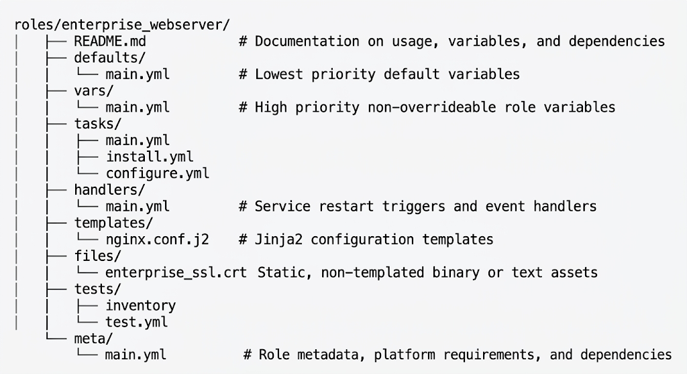
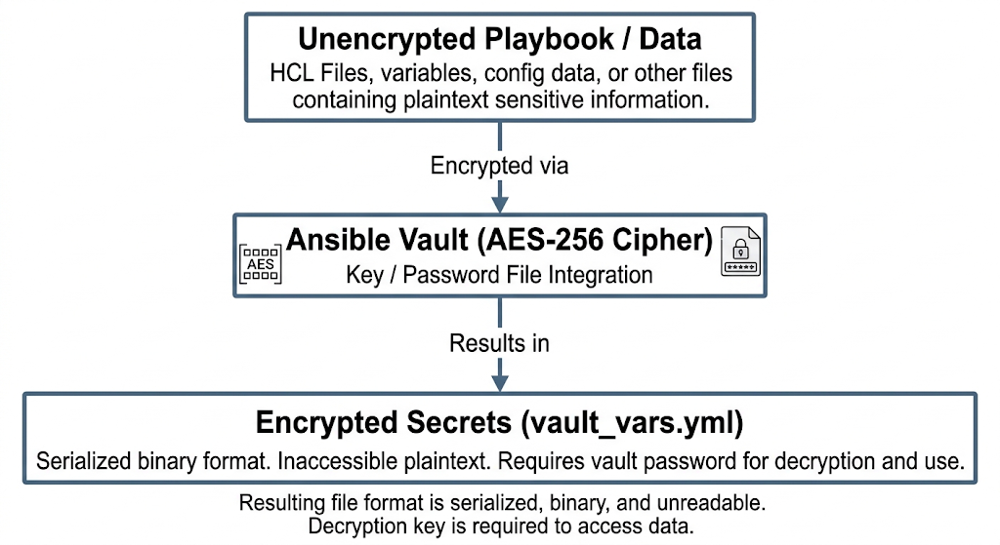

# Chapter 15: Advanced Ansible Patterns, Roles, & Automation

This chapter covers enterprise-grade automation patterns using Ansible, aligned comprehensively with the **LPI 701-200 DevOps Tools Engineer Exam Objectives**. It details modular code design with roles, sensitive data encryption via Ansible Vault, dynamic cloud inventory plugins, asynchronous task execution, and structured error-handling techniques.

## 15.1 Structuring Enterprise Codebases with Ansible Roles

### 15.1.1 Enterprise Role Architecture & Directory Standards

Ansible Roles provide a framework for fully independent, reusable, and modular automation components. By decoupling infrastructure code into functional roles, operations teams can standardize service configurations across environments (Development, Staging, Production).

A standard Ansible Role consists of specific directories. Each directory must contain a `main.yml` file (or `main.yaml`) defining its respective component logic:



#### Directory Purpose Reference

| Directory | Purpose | Variable Precedence / Scope |
| --- | --- | --- |
| `defaults/` | Default variables for the role. Intended to be easily overridden by group_vars or playbook vars. | Priority Level 2 (Very Low) |
| `vars/` | Internal role variables. High precedence; should not be overridden by playbooks unless forced. | Priority Level 15 (High) |
| `tasks/` | Main sequence of tasks executed by the role. | Task Execution Context |
| `handlers/` | Handlers triggered by `notify` directives within `tasks/`. | Execution Context (Run at end of play) |
| `templates/` | Jinja2 template files (`.j2`) processed by the `ansible.builtin.template` module. | Source files for tasks |
| `files/` | Static files deployed without alteration via `ansible.builtin.copy`. | Source files for tasks |
| `meta/` | Dependency definitions and Ansible Galaxy metadata. | Executed before role tasks |


### 15.1.2 Scoping Variables: `defaults/main.yml` vs. `vars/main.yml`

A critical architectural decision when designing roles is choosing where to define variables.

* **`defaults/main.yml`**: Used for default configuration values that consumers of the role are expected to override.
  
```yaml
# roles/enterprise_webserver/defaults/main.yml
webserver_http_port: 80
webserver_max_clients: 200
webserver_worker_processes: "auto"

```


* **`vars/main.yml`**: Used for constants and internal variables strict to the role's implementation details.
```yaml
# roles/enterprise_webserver/vars/main.yml
webserver_packages:
  - nginx
  - nginx-module-geoip
webserver_service_name: "nginx"
webserver_config_path: "/etc/nginx/nginx.conf"

```

### 15.1.3 Role Dependencies and Execution Flow (`meta/main.yml`)

Roles can enforce dependencies on other roles. When Ansible executes a role with dependencies defined in `meta/main.yml`, it resolves and executes all dependent roles **before** executing the main role's tasks.

```yaml
# roles/enterprise_webserver/meta/main.yml
---
galaxy_info:
  author: Enterprise DevOps Team
  description: Hardened NGINX Webserver Deployment Role
  company: CyberGate Systems
  license: MIT
  min_ansible_version: "2.14"
  platforms:
    - name: EL
      versions:
        - "8"
        - "9"
    - name: Ubuntu
      versions:
        - "22.04"

dependencies:
  - role: common_base_security
    vars:
      enable_fips_mode: true
  - role: tls_certificate_provisioner
    vars:
      cert_domain: "{{ ansible_fqdn }}"

```

### 15.1.4 Installing and Managing Roles via Ansible Galaxy Requirements

To maintain reproducible automation environments, dependencies should be tracked in a `requirements.yml` file and installed using `ansible-galaxy`.

#### `requirements.yml` Specification

```yaml
# requirements.yml
---
roles:
  # Download from Ansible Galaxy
  - name: geerlingguy.nginx
    version: 3.4.0

  # Download directly from Enterprise Git Repository via SSH
  - src: git+https://git.enterprise.internal/ansible/roles/security_hardening.git
    scm: git
    version: v2.1.0
    name: security_hardening

collections:
  - name: amazon.aws
    version: 6.1.0
  - name: community.general
    version: 7.2.0

```

#### CLI Management Commands

```bash
# Install all roles and collections defined in requirements.yml
ansible-galaxy install -r requirements.yml --force

# Install roles into a specific system or project path
ansible-galaxy role install -r requirements.yml -p ./roles/

# Initialize a new role with standard directory structure
ansible-galaxy role init roles/app_service_node

```

## 15.2 Managing Secrets with Ansible Vault

Enterprise environments require protecting sensitive data such as API keys, database credentials, Private Keys, and service account passwords. `ansible-vault` provides block-level and file-level encryption using AES-256 encryption.



### 15.2.1 File-Level vs. Variable-Level Encryption

#### 1. File-Level Encryption

Encrypts the entire YAML file containing confidential parameters.

```bash
# Create an encrypted secrets file
ansible-vault create group_vars/all/vault.yml

# Encrypt an existing file
ansible-vault encrypt group_vars/production/db_credentials.yml

# View an encrypted file content
ansible-vault view group_vars/production/db_credentials.yml

# Edit an encrypted file in-place
ansible-vault edit group_vars/production/db_credentials.yml

# Decrypt a file permanently
ansible-vault decrypt group_vars/production/db_credentials.yml

```

#### 2. Variable-Level (Inline) Encryption

Encrypts individual sensitive values inside an unencrypted variable file, keeping context readable while protecting sensitive data.

```bash
# Encrypt a single variable string value interactively
ansible-vault encrypt_string 'SuperSecretDBPassword2026!' --name 'db_password'

```

Output embedded inside `group_vars/all/vars.yml`:

```yaml
# group_vars/all/vars.yml
db_host: "db.internal.example.com"
db_port: 5432
db_user: "app_admin"
db_password: !vault |
          $ANSIBLE_VAULT;1.1;AES256
          366638376534346166343533613038626639353934333633653133373738373336353930323330
          6333333331393838383833303434316135326532383830380a3734373138333930333338353332
          393630653335343831353637373432373031316164343834373238313335373030383131333765
          3532353036323438300a3036326135373838313337336334343236313765353535326138616139

```

### 15.2.2 Multi-Vault ID Strategies and Vault Password Files

Enterprise deployments spanning multiple security zones (Dev, Prod, Security, Network) require separate keys for different environments. Ansible Vault supports multiple Vault IDs.

#### Defining Multiple Vault Passwords

Store Vault password files securely on the Control Node (with permissions set to `0600` or `0400`):

```bash
echo 'dev_vault_pass_2026' > ~/.vault_pass_dev
echo 'prod_vault_pass_2026' > ~/.vault_pass_prod
chmod 0600 ~/.vault_pass_dev ~/.vault_pass_prod

```

#### Encrypting with Specific Vault IDs

```bash
# Encrypt file using the 'dev' vault label
ansible-vault encrypt --vault-id dev@~/.vault_pass_dev group_vars/development/vault.yml

# Encrypt file using the 'prod' vault label
ansible-vault encrypt --vault-id prod@~/.vault_pass_prod group_vars/production/vault.yml

```

#### Running Playbooks with Multiple Vault IDs

```bash
ansible-playbook -i inventory/prod site.yml \
  --vault-id dev@~/.vault_pass_dev \
  --vault-id prod@~/.vault_pass_prod

```

#### Setting Default Vault Configuration (`ansible.cfg`)

To eliminate the need for CLI flags in automated CI/CD pipelines:

```ini
[defaults]
vault_identity_list = dev@~/.vault_pass_dev, prod@~/.vault_pass_prod

```

## 15.3 Dynamic Inventories for Cloud and Virtualization Enclaves

In cloud environments (AWS, Azure, GCP, OpenStack) and virtualized environments (VMware vSphere), infrastructure nodes are created, scaled, and destroyed dynamically. Static inventory files (`hosts.ini`) are inadequate for these workloads.

Ansible utilizes **Dynamic Inventory Plugins** to query infrastructure APIs and automatically construct inventory trees in memory.

### 15.3.1 Inventory Scripts vs. Modern Inventory Plugins

| Feature | Legacy Dynamic Inventory Scripts | Modern Inventory Plugins |
| --- | --- | --- |
| **File Extension** | Executable scripts (`.py`, `.sh`) | YAML Configuration (`.aws_ec2.yml`, `.vmware.yml`) |
| **Execution** | Output raw JSON via stdout | Native Caching, Schema Validation, Modular Architecture |
| **Caching** | Custom file-based caching per script | Integrated core engine caching (`ansible-inventory`) |
| **Maintainability** | Custom scripts requiring ongoing code maintenance | Maintained within official Ansible Collections |


### 15.3.2 Configuring the AWS EC2 Dynamic Inventory Plugin (`aws_ec2`)

To query AWS EC2 infrastructure dynamically, ensure the `amazon.aws` collection is installed and configure an inventory configuration file ending with `aws_ec2.yml` or `aws_ec2.yaml`.

#### Configuration: `inventory/aws_ec2.yml`

```yaml
# inventory/aws_ec2.yml
plugin: amazon.aws.aws_ec2
regions:
  - us-east-1
  - us-west-2

# Filter instances by running state and tags
filters:
  instance-state-name: running
  tag:Environment:
    - Production
    - Staging

# Group instances into inventory groups based on Jinja2 expressions
keyed_groups:
  - key: tags.Role
    prefix: role
    separator: "_"
  - key: tags.Environment
    prefix: env
    separator: "_"
  - key: placement.availability_zone
    prefix: az
    separator: "_"

# Modify host variable mapping
hostnames:
  - private-ip-address
  - dns-name

compose:
  ansible_host: private_ip_address
  ansible_user: "'ec2-user'"

```

### 15.3.3 Configuring the VMware vSphere Dynamic Inventory Plugin (`vmware_rest`)

To dynamically inspect enterprise VMware vCloud/vSphere infrastructures:

#### Configuration: `inventory/vcenter.vmware.yml`

```yaml
# inventory/vcenter.vmware.yml
plugin: community.vmware.vmware_vm_inventory
hostname: vcenter.enterprise.internal
username: "ansible-service@vsphere.local"
password: "{{ lookup('env', 'VMWARE_PASSWORD') }}"
validate_certs: false
with_nested_properties: true

properties:
  - name
  - config.guestId
  - guest.net

keyed_groups:
  - key: config.guestId
    prefix: os
  - key: guest.guestState
    prefix: state
  - key: customValues['Department']
    prefix: dept

```

### 15.3.4 Validating Dynamic Inventories with `ansible-inventory`

To test, inspect, and verify the memory structure generated by dynamic plugins, use the `ansible-inventory` CLI tool:

```bash
# List all discovered hosts structured in a JSON hierarchy
ansible-inventory -i inventory/aws_ec2.yml --list

# View the full inventory tree structure
ansible-inventory -i inventory/aws_ec2.yml --graph

# Output graph with custom grouping details:
# @all:
#   |--@env_Production:
#   |  |--10.0.1.45
#   |  |--10.0.1.46
#   |--@role_webserver:
#   |  |--10.0.1.45
#   |  |--10.0.1.46

# Inspect specific host variables computed dynamically
ansible-inventory -i inventory/aws_ec2.yml --host 10.0.1.45

```

## 15.4 Asynchronous Execution, Poll Options, and Error Handling

Enterprise tasks often perform long-running operations—such as compiling software, performing database schema migrations, or rebooting remote nodes. Default synchronous task execution can lead to SSH timeout failures.

Ansible provides **Asynchronous Execution** alongside advanced control flow structures (`block`, `rescue`, `always`).

### 15.4.1 Asynchronous Execution (`async` and `poll`)

* **`async`**: Specifies the maximum operational runtime (in seconds) allowed for a task before Ansible terminates it.
* **`poll`**: Controls how frequently (in seconds) Ansible polls the target node to check if the background process has completed.

#### 1. Blocking Asynchronous Task (Long-running task with status polling)

Ansible stays connected, polling the node every 15 seconds for up to 3600 seconds (1 hour).

```yaml
- name: Execute Enterprise Database Migration Script
  ansible.builtin.command: /opt/db/scripts/migrate_schema.sh
  async: 3600
  poll: 15

```

#### 2. Fire-and-Forget Asynchronous Task (`poll: 0`)

Ansible triggers the task asynchronously and immediately moves to the next task without waiting for completion.

```yaml
- name: Trigger Long-Running Firmware Flash
  ansible.builtin.command: /usr/sbin/flash_firmware_async.sh
  async: 1800
  poll: 0
  register: firmware_async_result

```

#### 3. Polling Asynchronous Tasks Later in the Playbook

To track fire-and-forget tasks, capture the task's job ID (`ansible_job_id`) and monitor it later using `async_status`.

```yaml
- name: Initiate asynchronous data sync
  ansible.builtin.command: rsync -avz /data/ /backup/data/
  async: 7200
  poll: 0
  register: rsync_job

- name: Perform non-dependent configuration tasks
  ansible.builtin.package:
    name: htop
    state: present

- name: Wait for asynchronous data sync to complete
  ansible.builtin.async_status:
    jid: "{{ rsync_job.ansible_job_id }}"
  register: job_result
  until: job_result.finished
  retries: 30
  delay: 10

```

### 15.4.2 Enterprise Error Handling: `block`, `rescue`, `always`

Ansible supports structured error handling similar to `try-catch-finally` programming paradigms via `block`, `rescue`, and `always`.

* **`block`**: Contains the primary tasks intended for standard execution.
* **`rescue`**: Tasks executed **only** if a task within the `block` fails.
* **`always`**: Tasks executed unconditionally, regardless of success or failure in `block` or `rescue`.

```yaml
# tasks/deploy_application.yml
---
- name: Enterprise Stateful Service Deployment Block
  block:
    - name: Download Application Release Artifact
      ansible.builtin.get_url:
        url: "https://artifacts.enterprise.internal/releases/app-v2.1.tar.gz"
        dest: "/tmp/app-v2.1.tar.gz"
        timeout: 10

    - name: Stop Primary Database Engine
      ansible.builtin.systemd:
        name: postgresql
        state: stopped

    - name: Perform Schema Migration
      ansible.builtin.command: /usr/local/bin/migrate_db.sh
      changed_when: true

  rescue:
    - name: Log Migration Failure Alert
      ansible.builtin.debug:
        msg: "CRITICAL ALERT: Database migration failed. Executing automatic rollback."

    - name: Rollback Database to Previous State
      ansible.builtin.command: /usr/local/bin/rollback_db.sh
      changed_when: true

    - name: Notify Operations Team via PagerDuty / Webhook
      community.general.pagerduty:
        token: "{{ vault_pagerduty_token }}"
        state: triggered
        desc: "Deployment failed on {{ ansible_fqdn }}"

  always:
    - name: Ensure Primary Database Engine is Running
      ansible.builtin.systemd:
        name: postgresql
        state: started

    - name: Cleanup Temporary Installation Artifacts
      ansible.builtin.file:
        path: "/tmp/app-v2.1.tar.gz"
        state: absent

```

### 15.4.3 Error Control Directives: `ignore_errors`, `failed_when`, and `changed_when`

#### Overriding Failure Criteria (`failed_when`)

```yaml
- name: Check custom system diagnostic command
  ansible.builtin.command: /usr/bin/system_check.sh
  register: check_result
  failed_when: 
    - check_result.rc != 0 
    - "'FATAL' in check_result.stdout"

```

#### Defining Changed Status (`changed_when`)

Prevent command/shell tasks from reporting `changed` status unconditionally when no system state was modified.

```yaml
- name: Query PostgreSQL Replication Status
  ansible.builtin.command: pg_isready -h localhost
  register: pg_status
  changed_when: false  # Pure read query, never changes node state

```

#### Ignoring Task Failures (`ignore_errors`)

```yaml
- name: Attempt non-critical telemetry reporting
  ansible.builtin.get_url:
    url: "http://telemetry.internal/ping"
    dest: "/dev/null"
  ignore_errors: true

```

## 15.5 Hands-On Lab: Implementing Encrypted Ansible Roles with Automated Dynamic Inventories

### Lab Scenario

You are the Lead Systems Automation Engineer at CyberGate Services. Your objective is to automate the installation and configuration of a multi-tier web application across dynamic EC2/Linux infrastructure.

#### Requirements

1. Build a modular Ansible Role (`roles/app_server`) to configure a secure, enterprise web application server.
2. Store database credentials using Ansible Vault inline variable encryption.
3. Configure an AWS EC2 Dynamic Inventory Plugin (`aws_ec2.yml`) to dynamically identify target nodes tagged as `env_production`.
4. Implement asynchronous task handling to perform heavy system updates without connection timeouts.
5. Wrap key execution tasks in `block / rescue / always` blocks to handle operational failures safely.

### Step 1: Create Ansible Role Directory Architecture

Execute the following commands on the Ansible Control Node:

```bash
mkdir -p ~/ansible_lab/{roles/app_server/{defaults,vars,tasks,handlers,templates,meta},inventory,group_vars/all}
cd ~/ansible_lab

```

### Step 2: Define Ansible Role Files

#### File 1: `roles/app_server/defaults/main.yml`

```yaml
---
# Default configurable attributes
app_server_port: 8080
app_server_user: "apprunner"
app_server_max_memory: "1024m"

```

#### File 2: `roles/app_server/vars/main.yml`

```yaml
---
# Internal constants
app_server_packages:
  - nginx
  - python3-pip
app_server_service: "nginx"
app_config_destination: "/etc/nginx/conf.d/app_server.conf"

```

#### File 3: `group_vars/all/vault.yml`

Create an encrypted password file on the control node:

```bash
echo "EnterpriseVaultPass2026" > ~/.vault_pass
chmod 0600 ~/.vault_pass

```

Create the encrypted vault variable file using inline vault encryption:

```yaml
# group_vars/all/vault.yml
---
vault_db_username: "prod_db_user"
vault_db_password: !vault |
          $ANSIBLE_VAULT;1.1;AES256
          63326162393339316538323631653434313532393035313636323432323530323337346337396131
          3030313763323030323936306531333461326437343235620a323333333433393931323339363935
          353738393539343332303737383637373438313437333633323536393036363738383838333132
          3936323730303831310a3036326135373838313337336334343236313765353535326138616139

```

#### File 4: `roles/app_server/templates/app_server.conf.j2`

```jinja2
# Managed by Ansible - Enterprise Configuration Template
server {
    listen {{ app_server_port }};
    server_name {{ ansible_fqdn }};

    location / {
        proxy_set_header X-DB-User "{{ vault_db_username }}";
        proxy_set_header X-DB-Pass "{{ vault_db_password }}";
        proxy_pass http://127.0.0.1:5000;
    }

    error_page 500 502 503 504 /5x.html;
    location = /5x.html {
        root /usr/share/nginx/html;
    }
}

```

#### File 5: `roles/app_server/handlers/main.yml`

```yaml
---
- name: Restart Nginx Service
  ansible.builtin.systemd:
    name: "{{ app_server_service }}"
    state: restarted
    daemon_reload: true

```

#### File 6: `roles/app_server/tasks/main.yml`

```yaml
---
- name: Enterprise App Server Task Execution Block
  block:
    - name: Execute Long-Running System Package Upgrade (Asynchronous)
      ansible.builtin.apt:
        update_cache: true
        upgrade: dist
      async: 1800
      poll: 10
      when: ansible_os_family == "Debian"

    - name: Ensure Application Dependencies Are Installed
      ansible.builtin.package:
        name: "{{ item }}"
        state: present
      loop: "{{ app_server_packages }}"

    - name: Deploy Templated Application Configuration
      ansible.builtin.template:
        src: "app_server.conf.j2"
        dest: "{{ app_config_destination }}"
        owner: root
        group: root
        mode: '0644'
      notify: Restart Nginx Service

  rescue:
    - name: Handle Deployment Failure
      ansible.builtin.debug:
        msg: "CRITICAL: App Server Deployment failed on {{ ansible_hostname }}. Rolling back configuration."

    - name: Remove Corrupted Configuration File
      ansible.builtin.file:
        path: "{{ app_config_destination }}"
        state: absent

  always:
    - name: Verify Service Status
      ansible.builtin.systemd:
        name: "{{ app_server_service }}"
        state: started

```

### Step 3: Configure Dynamic Inventory

Create the dynamic inventory file `inventory/aws_ec2.yml`:

```yaml
# inventory/aws_ec2.yml
plugin: amazon.aws.aws_ec2
regions:
  - us-east-1

filters:
  instance-state-name: running
  tag:Environment: production

keyed_groups:
  - key: tags.Role
    prefix: role
  - key: tags.Environment
    prefix: env

hostnames:
  - private-ip-address

compose:
  ansible_host: private_ip_address
  ansible_user: "'ubuntu'"

```

### Step 4: Configure Project-Level Settings (`ansible.cfg`)

Create a local `ansible.cfg` file inside `~/ansible_lab/`:

```ini
[defaults]
inventory = ./inventory/aws_ec2.yml
roles_path = ./roles
vault_password_file = ~/.vault_pass
host_key_checking = False
stdout_callback = yaml
callbacks_enabled = timer, profile_tasks

[privilege_escalation]
become = True
become_method = sudo
become_user = root
become_ask_pass = False

```

### Step 5: Execute and Validate the Master Playbook

Create the master site playbook `site.yml`:

```yaml
# site.yml
---
- name: Deploy Enterprise Application Server Tier
  hosts: env_production
  gather_facts: true
  roles:
    - app_server

```

#### 1. Validate Dynamic Inventory Discovery

```bash
ansible-inventory --graph

```

Expected Output:

```text
@all:
  |--@aws_ec2:
  |  |--10.0.1.102
  |  |--10.0.1.103
  |--@env_production:
  |  |--10.0.1.102
  |  |--10.0.1.103
  |--@role_appserver:
  |  |--10.0.1.102
  |  |--10.0.1.103

```

#### 2. Perform Syntax Check

```bash
ansible-playbook site.yml --syntax-check

```

#### 3. Perform a Dry-Run (Check Mode)

```bash
ansible-playbook site.yml --check

```

#### 4. Execute the Production Playbook

```bash
ansible-playbook site.yml

```

## Self-Assessment & Exam Practice Questions

**Question 1**: An administrator needs to define default variable values for an Ansible role that can easily be overridden by playbook variables or `group_vars`. Which role directory should contain these variables?

* A) `vars/main.yml`
* B) `defaults/main.yml`
* C) `meta/main.yml`
* D) `files/main.yml`

**Answer**: **B**

*Explanation*: `defaults/main.yml` holds role variables with the lowest precedence level (Level 2), making them designed specifically for easy overriding. Variables in `vars/main.yml` have a much higher precedence (Level 15) and override most inventory/playbook variables.

**Question 2**: Which Ansible Vault command allows an engineer to encrypt a single variable value directly into an unencrypted variable file without encrypting the entire file?

* A) `ansible-vault encrypt_string`
* B) `ansible-vault encrypt_inline`
* C) `ansible-vault create_key`
* D) `ansible-vault embed`

**Answer**: **A**

*Explanation*: `ansible-vault encrypt_string` encrypts a specific string value and outputs formatted YAML with the `!vault` tag, allowing inline variable encryption within an unencrypted file.

**Question 3**: In an Ansible playbook, a task is configured with `async: 600` and `poll: 0`. How does Ansible execute this task?

* A) Ansible polls the target host every 600 seconds until completion.
* B) Ansible waits up to 600 seconds for completion, checking every second.
* C) Ansible launches the task asynchronously and immediately moves to the next task without waiting.
* D) Ansible cancels the task if it does not complete within 0 seconds.

**Answer**: **C**

*Explanation*: Setting `poll: 0` instructs Ansible to execute the task in a "fire-and-forget" asynchronous mode, returning control immediately to the playbook without polling.
