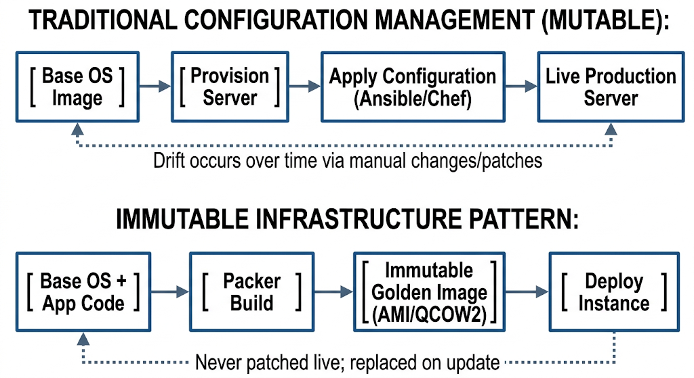
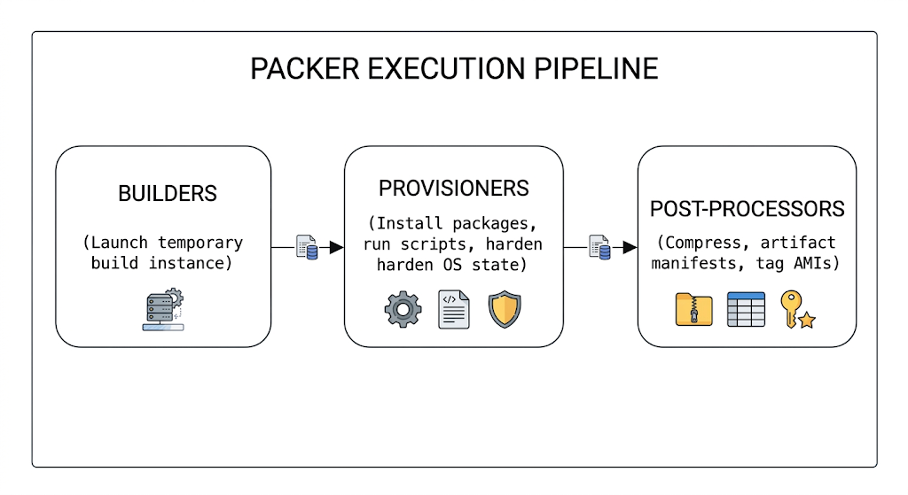

# Chapter 16: Automated Immutable Image Pipelines

This chapter explores the architectural concepts, component mechanisms, and operational workflows required to build automated, immutable machine image pipelines for enterprise environments. It comprehensively covers the requirements of the **LPI 701-200 DevOps Tools Engineer Exam Objectives** under Subject Area 701.

## 16.1 Packer and Cloud-init in Immutable Infrastructure

In traditional configuration management, server instances are provisioned as bare operating systems and subsequently configured in-place using tools like Ansible, Puppet, or Chef. Over time, this model can suffer from **configuration drift**, where subtle variations emerge across instances due to failed updates, manually applied hotfixes, or non-deterministic package installations.



### The Immutable Infrastructure Paradigm

To eliminate configuration drift and reduce deployment risks, modern enterprise architectures implement **Immutable Infrastructure**. Under this paradigm:

* Infrastructure components (virtual machines, cloud instances, containers) are never updated or patched in-place.
* When code or configuration updates are required, a brand-new **Golden Image** is compiled, tested, and deployed to replace the existing instances.
* Live instances are treated as disposable units ("cattle, not pets").

### Role of HashiCorp Packer and Cloud-init

* **HashiCorp Packer:** Serves as the build-time engine. It automates the creation of identical machine images across multiple platforms (AWS AMI, OpenStack QCOW2, VMware OVA, GCP Images) from a single source specification.
* **Cloud-init:** Serves as the launch-time boot engine. It performs early-stage initialization on cloud instances during their first boot cycle (e.g., setting hostnames, expanding storage partitions, configuring network interfaces, injecting SSH public keys).

## 16.2 HashiCorp Packer Architecture: Builders, Provisioners, and Post-Processors

Packer uses HashiCorp Configuration Language (HCL2) to define automated image creation pipelines. Understanding Packer's internal architecture is essential for building modular and maintainable build templates.

### Core Architectural Components



#### 1. Plugins & Packer Block

Packer uses a plugin-based architecture. Required plugins must be declared in the `packer` block and initialized via `packer init`.

```hcl
packer {
  required_version = ">= 1.9.0"
  required_plugins {
    amazon = {
      version = ">= 1.2.0"
      source  = "github.com/hashicorp/amazon"
    }
    openstack = {
      version = ">= 1.1.0"
      source  = "github.com/hashicorp/openstack"
    }
  }
}

```

#### 2. Source Blocks (Builders)

Source blocks configure specific infrastructure platforms to spin up temporary virtual machines or instances, execute provisioners against them, and snapshot the final state into an image artifact.

Common enterprise builders include:

* `amazon-ebs`: Launches an EC2 instance in AWS, runs provisioners over SSH/WinRM, and creates an AMI.
* `qemu`: Bootstraps local ISO files inside a QEMU/KVM virtual machine to output disk images (`.qcow2`, `.raw`).
* `vsphere-iso`: Interacts directly with VMware vCenter APIs to install OS images onto ESXi hosts.

#### 3. Build Blocks & Provisioners

The `build` block binds defined `sources` together and passes them through a sequential list of **provisioners**. Provisioners install software, apply security baselines, and prepare the machine image for production.

Common provisioners:

* `shell`: Executes local or remote bash scripts.
* `ansible`: Runs Ansible playbooks directly against the temporary build target.
* `file`: Uploads files or directory trees into the image during compilation.

#### 4. Post-Processors

Post-processors execute after the image artifact has been snapshot and created. They handle artifact conversion, manifest indexing, checksum generation, or pushing metadata to image registries.

```hcl
source "amazon-ebs" "debian" {
  ami_name      = "golden-debian-13-v${formatdate("YYYYMMDDhhmm", timestamp())}"
  instance_type = "t3.micro"
  region        = "us-east-1"
  source_ami_filter {
    filters = {
      name                = "debian-13-amd64-*"
      root-device-type     = "ebs"
      virtualization-type = "hvm"
    }
    most_recent = true
    owners      = ["136560790209"] # Official Debian AWS Account ID
  }
  ssh_username = "admin"
}

build {
  sources = ["source.amazon-ebs.debian"]

  provisioner "shell" {
    inline = [
      "sudo apt-get update",
      "sudo apt-get install -y auditd fail2ban curl"
    ]
  }

  post-processor "manifest" {
    output     = "manifest.json"
    strip_path = true
  }
}

```

## 16.3 Automating OS Provisioning via Cloud-Init and Kickstart

When bootstrapping machine images from raw operating system ISO binaries (unattended installation), specialized installer responses are required to automate interactive OS prompts (partitioning, timezone, user creation, network configuration).

### Automated Installer Frameworks

| Installer Paradigm | Primary Target Operating Systems | Primary Configuration Mechanism |
| --- | --- | --- |
| **Kickstart** | RHEL, Rocky Linux, AlmaLinux, Fedora | Single text configuration file (`ks.cfg`) passed via HTTP/Boot Commands |
| **Debian Preseed** | Debian (legacy debian-installer) | Text answer file (`preseed.cfg`) passed via boot arguments |
| **Cloud-Init Subiquity** | Ubuntu Server (20.04+) & Debian Cloud | YAML-formatted `user-data` / `meta-data` served via an HTTP server |

### Cloud-Init Data Directives (`user-data`)

Cloud-init uses YAML configuration files to customize system initialization on first boot. The configuration file must always start with `#cloud-config`.

#### Enterprise `user-data` Example

```yaml
#cloud-config
hostname: prod-node-01
fqdn: prod-node-01.enterprise.internal
manage_etc_hosts: true

users:
  - name: sysadmin
    gecos: System Administrator
    sudo: ALL=(ALL) NOPASSWD:ALL
    groups: [sudo, wheel]
    shell: /bin/bash
    ssh_authorized_keys:
      - ssh-ed25519 AAAAC3NzaC1lZDI1NTE5AAAAI... sysadmin@enterprise.internal

packages:
  - curl
  - htop
  - systemd-journal-remote

runcmd:
  - [ systemctl, daemon-reload ]
  - [ systemctl, enable, --now, fail2ban ]
  - echo "System initialized by Cloud-Init on $(date)" > /var/log/cloud-init-bootstrap.log

```

### Passing Installer Responses in Packer

Packer spins up a temporary embedded HTTP server (`http_directory`) to expose installer response files (such as `preseed.cfg` or `user-data`) directly to the virtual machine during ISO boot execution.

```hcl
source "qemu" "debian_iso" {
  iso_url      = "https://cdimage.debian.org/debian-cd/current/amd64/iso-cd/debian-13.0.0-amd64-netinst.iso"
  iso_checksum = "sha256:e3b0c44298fc1c149afbf4c8996fb92427ae41e4649b934ca495991b7852b855"
  
  # Expose HTTP directory containing installer answer files
  http_directory = "http"
  
  # Inject boot command string to redirect OS installer to Packer's HTTP server
  boot_command = [
    "<esc><wait>",
    "install auto=true priority=critical ",
    "url=http://{{ .HTTPIP }}:{{ .HTTPPort }}/preseed.cfg ",
    "hostname=debian-golden domain=internal ",
    "<enter>"
  ]
}

```

## 16.4 Integrating Packer into CI/CD Automated Pipelines

To operate immutable image generation securely at scale, image builds must be integrated into continuous integration pipelines (such as GitLab CI, GitHub Actions, or Jenkins).

```
[ Git Commit (HCL Code) ] ──► [ Pipeline Trigger ] ──► [ packer validate & fmt ] ──► [ packer build ] ──► [ Register Golden Image ]

```

### CI/CD Integration Best Practices

1. **Automated Validation:** Always execute `packer validate` and `packer fmt -check` early in pipeline stages to verify syntax and formatting without spinning up build instances.
2. **Secret Management:** Never hardcode cloud credentials or SSH keys into Packer HCL code. Pass sensitive credentials as environment variables (`PKR_VAR_variable_name`) or retrieve them dynamically from key management stores (e.g., HashiCorp Vault).
3. **Automated Image Cleanup:** Ensure pipelines implement clean-up routines to terminate orphaned temporary build instances or security groups if a build stage fails midway.
4. **Image Lifecycle Management (AMI Pruning):** Implement post-build tasks or scheduled cron jobs to deregister obsolete golden images and clean up underlying storage snapshots.

### Enterprise GitLab CI Pipeline Definition (`.gitlab-ci.yml`)

```yaml
stages:
  - validate
  - build

variables:
  PKR_VAR_aws_region: "us-east-1"

before_script:
  - packer --version
  - packer init templates/debian13.pkr.hcl

packer_validate:
  stage: validate
  script:
    - packer fmt -check templates/
    - packer validate -var "environment=ci" templates/debian13.pkr.hcl
  rules:
    - merge_requests
    - branches

packer_build_production:
  stage: build
  script:
    - packer build -var "environment=production" templates/debian13.pkr.hcl
  artifacts:
    paths:
      - manifest.json
    expire_in: 30 days
  rules:
    - if: '$CI_COMMIT_BRANCH == "main"'

```

---

## 16.5 Hands-On Lab: Building Automated Hardened Debian 13 Golden Machine Images

### Lab Scenario

You are tasked with engineering a fully automated, reproducible Packer pipeline that provisions a hardened **Debian 13 (Trixie)** Golden Machine Image. The output artifact must be pre-configured with core system utilities, security baselines, and system hardening configurations, ready for enterprise deployment.

---

### Step 1: Directory Setup

Create a structured project workspace:

```bash
mkdir -p packer-debian13-lab/{http,scripts}
cd packer-debian13-lab

```

### Step 2: Define Automated Installer Preseed Configuration

Create the Debian automated installer configuration file (`http/preseed.cfg`) to perform an unattended installation without interactive prompts:

```text
# http/preseed.cfg
# Locale and Keyboard Setup
d-i debian-installer/locale string en_US.UTF-8
d-i keyboard-configuration/xkb-keymap select us

# Network Configuration
d-i netcfg/choose_interface select auto
d-i netcfg/get_hostname string debian-golden
d-i netcfg/get_domain string enterprise.internal

# Mirror Settings
d-i mirror/country string manual
d-i mirror/http/hostname string deb.debian.org
d-i mirror/http/directory string /debian
d-i mirror/http/proxy string 

# Clock and Time Zone
d-i clock-setup/utc boolean true
d-i time/zone string UTC
d-i clock-setup/ntp boolean true

# Partitioning (LVM with explicit drive wipe)
d-i partman-auto/disk string /dev/sda
d-i partman-auto/method string lvm
d-i partman-lvm/device_remove_lvm boolean true
d-i partman-md/device_remove_md boolean true
d-i partman-lvm/confirm boolean true
d-i partman-lvm/confirm_nooverwrite boolean true
d-i partman-auto/choose_recipe select atomic
d-i partman-partitioning/confirm_write_new_label boolean true
d-i partman/choose_partition select finish
d-i partman/confirm boolean true
d-i partman/confirm_nooverwrite boolean true

# Account Setup
d-i passwd/root-login boolean false
d-i passwd/user-fullname string Automation Admin
d-i passwd/username string builder
d-i passwd/user-password password BuilderSecurePass2026!
d-i passwd/user-password-again password BuilderSecurePass2026!
d-i user-setup/allow-password-weak boolean true
d-i user-setup/encrypt-home boolean false

# Package Selection
tasksel tasksel/first multiselect standard
d-i pkgsel/include string sudo curl openssh-server cloud-init
d-i pkgsel/upgrade select full-upgrade

# Boot Loader Installation
d-i grub-installer/only_debian boolean true
d-i grub-installer/bootdev string /dev/sda

# Final Notification
d-i finish-install/reboot_in_progress note

```

### Step 3: Write Hardening & Provisioning Shell Scripts

Create `scripts/setup.sh` to apply OS security baselines, install telemetry utilities, and clean up temporary deployment logs:

```bash
#!/usr/bin/env bash
set -euo pipefail

echo "==> Starting OS Hardening and Provisioning Process..."

# 1. Update Package Repositories
sudo apt-get update -y
sudo apt-get install -y --no-install-recommends \
    auditd \
    fail2ban \
    ufw \
    ca-certificates \
    apt-transport-https

# 2. Configure SSH Security Hardening
echo "==> Hardening OpenSSH Server Configuration..."
sudo sed -i 's/#PermitRootLogin.*/PermitRootLogin no/' /etc/ssh/sshd_config
sudo sed -i 's/#PasswordAuthentication.*/PasswordAuthentication no/' /etc/ssh/sshd_config
sudo sed -i 's/#X11Forwarding.*/X11Forwarding no/' /etc/ssh/sshd_config

# 3. Configure Basic Firewall (UFW)
echo "==> Enforcing Default Network Firewall Policies..."
sudo ufw default deny incoming
sudo ufw default allow outgoing
sudo ufw allow 22/tcp
sudo ufw --force enable

# 4. Prepare Cloud-Init Configuration
echo "==> Enabling Cloud-Init Service..."
sudo systemctl enable cloud-init

# 5. Clean Up Deployment Artifacts
echo "==> Performing System Cleanup..."
sudo apt-get clean
sudo rm -rf /var/lib/apt/lists/*
sudo rm -f /etc/ssh/ssh_host_*
sudo truncate -s 0 /etc/machine-id
sudo truncate -s 0 /var/log/wtmp
sudo truncate -s 0 /var/log/lastlog

echo "==> Image Hardening Complete."

```

Make the script executable:

```bash
chmod +x scripts/setup.sh

```

### Step 4: Construct the Master Packer Template

Create the main Packer template (`debian13.pkr.hcl`):

```hcl
packer {
  required_version = ">= 1.9.0"
  required_plugins {
    qemu = {
      version = ">= 1.0.9"
      source  = "github.com/hashicorp/qemu"
    }
  }
}

variable "iso_url" {
  type    = string
  default = "https://cdimage.debian.org/debian-cd/current/amd64/iso-cd/debian-13.0.0-amd64-netinst.iso"
}

variable "iso_checksum" {
  type    = string
  default = "file:https://cdimage.debian.org/debian-cd/current/amd64/iso-cd/SHA256SUMS"
}

source "qemu" "debian13_hardened" {
  iso_url          = var.iso_url
  iso_checksum     = var.iso_checksum
  output_directory = "output-debian13-golden"
  
  # VM Hardware Configuration
  cpus             = 2
  memory           = 2048
  disk_size        = "10G"
  format           = "qcow2"
  accelerator      = "kvm"

  # Installer Web Server Setup
  http_directory   = "http"

  # Boot Instructions passed to installer kernel
  boot_wait        = "5s"
  boot_command     = [
    "<esc><wait>",
    "install auto=true priority=critical ",
    "url=http://{{ .HTTPIP }}:{{ .HTTPPort }}/preseed.cfg ",
    "<enter>"
  ]

  # SSH Connection Settings for Provisioning Stage
  ssh_username     = "builder"
  ssh_password     = "BuilderSecurePass2026!"
  ssh_timeout      = "20m"
  
  shutdown_command = "echo 'builder' | sudo -S shutdown -P now"
}

build {
  sources = ["source.qemu.debian13_hardened"]

  # Upload custom configuration assets
  provisioner "file" {
    source      = "scripts/setup.sh"
    destination = "/tmp/setup.sh"
  }

  # Execute hardening script
  provisioner "shell" {
    inline = [
      "chmod +x /tmp/setup.sh",
      "/tmp/setup.sh"
    ]
  }

  # Export build metadata manifest
  post-processor "manifest" {
    output     = "manifest.json"
    strip_path = true
  }
}

```

### Step 5: Format, Validate, and Execute the Build

Execute the build pipeline using the Packer CLI:

```bash
# 1. Initialize required QEMU plugin
packer init debian13.pkr.hcl

# 2. Format the template to match canonical HCL style
packer fmt debian13.pkr.hcl

# 3. Validate template syntax and schema
packer validate debian13.pkr.hcl

# 4. Run the image compilation build process
packer build debian13.pkr.hcl

```

### Step 6: Verify Build Artifacts

Confirm that the output directory and manifest metadata were generated correctly:

```bash
# Check generated QCOW2 image
ls -lh output-debian13-golden/

# Inspect manifest execution summary
cat manifest.json

```

## Self-Assessment & Exam Practice Questions

**Question 1**: An administrator needs to build identical machine images for both AWS and VMware vSphere using HashiCorp Packer. Which block in the Packer template defines the target platform mechanisms used to spin up instances and produce snapshots?

* A) `provisioner`
* B) `source`
* C) `post-processor`
* D) `variables`

**Answer**: **B**

*Explanation*: The `source` block defines the platform builders (such as `amazon-ebs` or `vsphere-iso`) that interact with target environments, launch build instances, and snapshot output artifacts.\

**Question 2**: Which utility is primarily responsible for performing first-boot machine customization (e.g., expanding root volumes, writing network configs, injecting public keys) on cloud instances deployed from an immutable Golden Image?

* A) Cloud-init
* B) Kickstart
* C) Subiquity
* D) Preseed

**Answer**: **A**

*Explanation*: `cloud-init` is the standard multi-distribution package used to handle early instance initialization on first boot within cloud and virtualization environments.

**Question 3**: In a CI/CD pipeline running automated Packer builds, what is the best practice for passing cloud vendor secret access keys to the build template?

* A) Embed credentials directly in `default` values inside the `variables.tf` file.
* B) Store plaintext credentials inside the `http_directory` answer file.
* C) Pass credentials via environment variables (`PKR_VAR_...`) or retrieve them dynamically from a secrets engine.
* D) Hardcode credentials in the `post-processor` block.

**Answer**: **C**

*Explanation*: Credentials should never be hardcoded or stored in source control. Passing environment variables prefixed with `PKR_VAR_` allows Packer to read credentials securely from the runner environment or dynamic key vaults.
