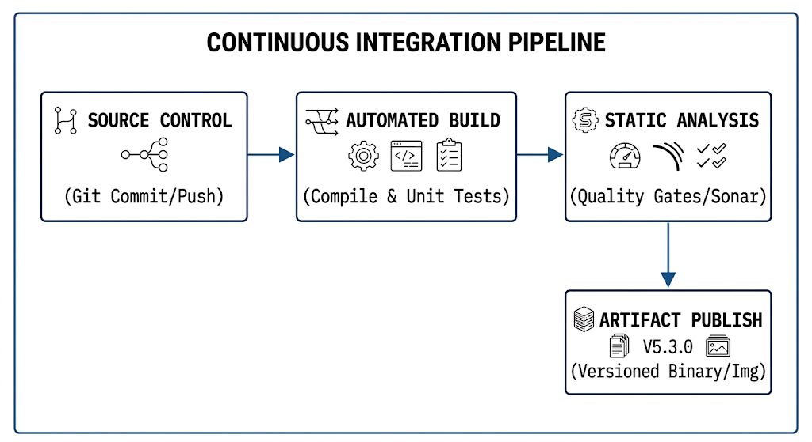
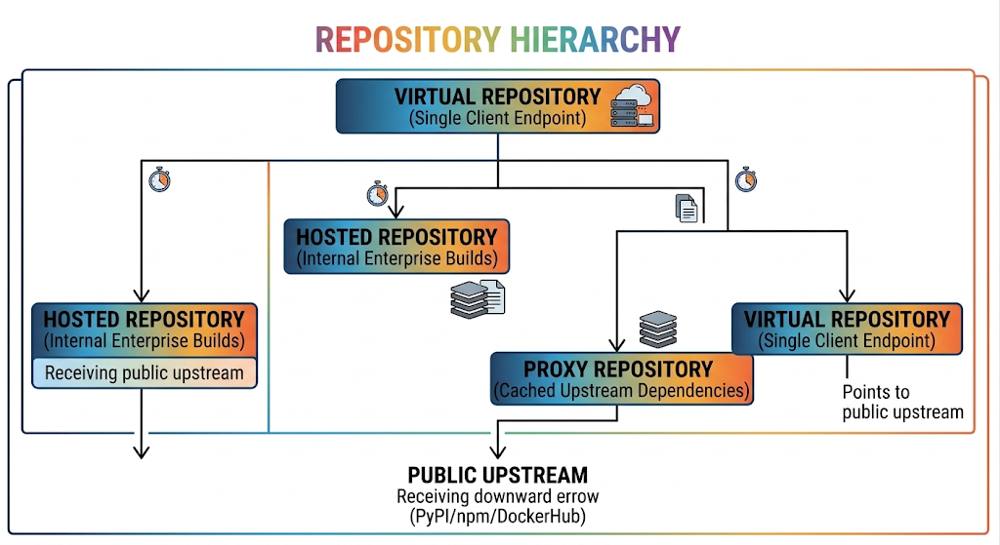

# Chapter 18: Continuous Integration Architecture

This chapter covers enterprise Continuous Integration (CI) architectures, artifact lifecycle management, dependency caching mechanisms, static code quality gates, and secure private registries, aligning with the **LPI 701-200 DevOps Tools Engineer Exam Objectives** under Subject Area 702 (Continuous Delivery and Infrastructure Automation).

## 18.1 Continuous Integration Core Principles and Artifact Management

Continuous Integration (CI) is a software engineering practice where developers regularly merge their code changes into a central repository. Every push triggers an automated build and test sequence to detect integration bugs early and ensure trunk stability.

### Core CI Principles



1. **Single Source Repository:** All project assets—including source code, IaC templates, configuration scripts, and pipeline definitions—must reside in a centralized, version-controlled repository.
2. **Automated Build Execution:** Every commit to the primary branch (or via pull/merge requests) automatically initiates an isolated build environment without manual intervention.
3. **Self-Testing Builds:** The build pipeline must execute comprehensive unit and integration test suites. A build is marked as successful only if all tests pass.
4. **Immediate Feedback:** Build and test results are reported to the developer within minutes to maintain fast development loops.
5. **Build Idempotency & Immutaibility:** A built artifact (e.g., Jar, Wheel, Container Image) is compiled **once** during the CI phase and promoted through environments (Staging, Production) without recompilation.

### The Build Artifact Lifecycle

An **artifact** is a compiled, versioned, and deployable file generated during the CI process.

```
[ Developer Commit ] ──► [ CI Engine Compilation ] ──► [ Package & Version Artifact ] ──► [ Publish to Registry ] ──► [ CD Deployment ]
```

* **Transient Workspace Files:** Intermediate files (such as `.o`, `.class`, or temporary test logs) generated during compilation that are discarded after build completion.
* **Release Artifacts:** Immutable binary archives (e.g., `.tar.gz`, `.rpm`, `.deb`, `.jar`, `.whl`) or OCI container images tagged with unique, immutable versions (semantic versioning or Git commit SHAs).

## 18.2 Artifact Registries (Nexus, JFrog Artifactory, Container Registries)

In enterprise ecosystems, raw binaries and container images should never be checked directly into Git repositories. Instead, **Artifact Registries** act as single sources of truth for storing, versioning, scanning, and distributing build outputs.

### Enterprise Registry Types

| Registry Category | Examples | Target Formats & Ecosystems |
| --- | --- | --- |
| **Generic Binary Repositories** | Sonatype Nexus, JFrog Artifactory | Zip, Tarballs, Raw Binaries, ISOs, Custom Releases |
| **Language Package Registries** | Nexus, Artifactory, PyPI, npm, Maven | `.whl` (Python), `.jar` (Java), Node modules, Gems |
| **OS Package Repositories** | Nexus, Artifactory, Aptly, Repoman | `.deb` (Debian/Ubuntu), `.rpm` (RHEL/Rocky/Fedora) |
| **Container & Helm Registries** | Harbor, Quay, AWS ECR, Docker Hub | OCI Container Images, Helm Charts (`.tgz`) |

### Proxy, Hosted, and Virtual Repositories

Enterprise registries like Nexus and Artifactory structure repositories into three operational modes:

1. **Hosted Repositories:** Internal repositories used to store proprietary artifacts published by local CI/CD pipelines.
2. **Proxy Repositories:** External mirror caches pointing to public upstream repositories (e.g., PyPI, npm registry, Maven Central, Docker Hub). They cache external dependencies locally to accelerate builds and ensure availability during upstream outages.
3. **Virtual Repositories:** Unified logical endpoints combining multiple Hosted and Proxy repositories under a single access URL.



## 18.3 Automated Build Engines and Dependency Caching Strategies

Continuous Integration engines (such as GitLab CI runners, GitHub Actions runners, or Jenkins agents) download project dependencies during build steps. Without caching, downloading external packages repeatedly slows down pipelines and increases bandwidth usage.

### Dependency Caching vs. Build Artifacts

* **Cache:** Temporary storage for external dependencies (e.g., `~/.m2`, `node_modules/`, `~/.cache/pip`). Caches persist across pipeline runs to speed up execution, but missing cache entries do not break the build.
* **Artifacts:** Formal outputs generated by a pipeline stage (e.g., compiled binary, code coverage report) that are explicitly passed to subsequent pipeline stages or published to a registry.

### Enterprise Caching Strategies in GitLab CI & GitHub Actions

#### 1. Caching Dependencies in GitLab CI (`.gitlab-ci.yml`)

```yaml
# .gitlab-ci.yml
stages:
  - build
  - test

variables:
  PIP_CACHE_DIR: "$CI_PROJECT_DIR/.cache/pip"

# Shared cache configuration using the lockfile hash as the key
cache:
  key:
    files:
      - requirements.txt
  paths:
    - .cache/pip/
    - venv/

build_job:
  stage: build
  script:
    - python3 -m venv venv
    - source venv/bin/activate
    - pip install -r requirements.txt
  artifacts:
    paths:
      - venv/
    expire_in: 2 hours

test_job:
  stage: test
  script:
    - source venv/bin/activate
    - pytest tests/
```

#### 2. Docker Layer Caching (BuildKit & Inline Cache)

To accelerate container image compilation inside CI pipelines, leverage Docker BuildKit multi-stage builds and inline remote caching (`--cache-from`).

```bash
# Enable Docker BuildKit
export DOCKER_BUILDKIT=1

# Pull previous image layer cache from enterprise container registry
docker pull registry.enterprise.internal/app/backend:latest || true

# Build new container image leveraging layer cache
docker build \
  --build-arg BUILDKIT_INLINE_CACHE=1 \
  --cache-from registry.enterprise.internal/app/backend:latest \
  -t registry.enterprise.internal/app/backend:v1.2.0 .
```

## 18.4 Code Quality Gates and Static Analysis Integration

Static Application Security Testing (SAST) and code quality analysis inspect source code without executing it. Integrating quality gates into CI pipelines enforces coding standards and blocks vulnerability accumulation early in the lifecycle.

### Static Analysis Components

1. **Linters:** Enforce syntax rules, styling guidelines, and code formatting standards (e.g., `flake8`, `eslint`, `rubocop`).
2. **SAST Scanners:** Identify security anti-patterns, hardcoded credentials, SQL injection vectors, and buffer overflows (e.g., `bandit`, `semgrep`, `SonarQube`).
3. **Software Composition Analysis (SCA):** Scans open-source library dependencies for known Common Vulnerabilities and Exposures (CVEs) (e.g., `trivy`, `dependency-check`, `snyk`).

### Quality Gate Pipeline Integration

A **Quality Gate** is a policy threshold (e.g., zero critical security vulnerabilities, test coverage $\ge 80\%$, zero hardcoded secrets) that must pass before code can be merged or published.

```yaml
# Example SAST & SCA Integration Stage
stage_quality:
  stage: test
  script:
    # 1. Run Python SAST scanner
    - bandit -r src/ -f json -o bandit-report.json

    # 2. Run SCA dependency check
    - trivy fs --exit-code 1 --severity CRITICAL,HIGH .
  artifacts:
    reports:
      sast: bandit-report.json

```

## 18.5 Hands-On Lab: Setting Up a Local Private Container and Artifact Registry with Access Controls

### Lab Scenario

You are tasked with deploying a secure, production-grade local container and artifact registry infrastructure using **Distribution Registry** and **htpasswd** authentication. You will configure basic access controls, generate TLS encryption certificates, authenticate via Docker CLI, and manage image artifacts.

### Step 1: Directory & Security Certificate Initialization

Create the project workspace and generate self-signed TLS certificates for local encryption:

```bash
mkdir -p ~/private_registry_lab/{certs,data,auth}
cd ~/private_registry_lab

# Generate a self-signed TLS Certificate for secure HTTPS transport
openssl req -x509 -nodes -days 365 -newkey rsa:4096 \
  -keyout certs/domain.key \
  -out certs/domain.crt \
  -subj "/CN=registry.local/O=CyberGate Services/C=LK" \
  -addext "subjectAltName=DNS:registry.local,IP:127.0.0.1"
```

### Step 2: Configure Authentication Credentials

Create an encrypted user credential database using `htpasswd`:

```bash
# Ensure apache2-utils or httpd-tools is installed
sudo apt-get update && sudo apt-get install -y apache2-utils

# Create admin user credentials inside the auth directory
htpasswd -B -c auth/htpasswd admin
# Enter Password: AdminRegistryPass2026!

# Add a read-only developer user
htpasswd -B auth/htpasswd developer
# Enter Password: DevRegistryPass2026!
```

### Step 3: Deploy the Private Container Registry Service

Create a Docker Compose definition (`docker-compose.yml`) to run the isolated private container registry with TLS and htpasswd auth enabled:

```yaml
# docker-compose.yml
version: '3.8'

services:
  registry:
    image: registry:2.8.3
    container_name: private_registry
    restart: always
    ports:
      - "5000:5000"
    environment:
      REGISTRY_AUTH: htpasswd
      REGISTRY_AUTH_HTPASSWD_REALM: "Enterprise Secure Registry"
      REGISTRY_AUTH_HTPASSWD_PATH: /auth/htpasswd
      REGISTRY_HTTP_TLS_CERTIFICATE: /certs/domain.crt
      REGISTRY_HTTP_TLS_KEY: /certs/domain.key
      REGISTRY_STORAGE_DELETE_ENABLED: "true"
    volumes:
      - ./data:/var/lib/registry
      - ./certs:/certs
      - ./auth:/auth
```

Launch the registry container:

```bash
docker compose up -d
```

Verify service execution:

```bash
docker ps -f name=private_registry

```

---

### Step 4: Configure Local DNS and Trust TLS Certificates

To allow the local system to resolve `registry.local` and trust the self-signed TLS certificate:

```bash
# 1. Map hostname in local /etc/hosts file
echo "127.0.0.1 registry.local" | sudo tee -a /etc/hosts

# 2. Add local certificate to system CA trust store
sudo mkdir -p /usr/local/share/ca-certificates/registry
sudo cp certs/domain.crt /usr/local/share/ca-certificates/registry/domain.crt
sudo update-ca-certificates

# 3. Add certificate trust for Docker engine
sudo mkdir -p /etc/docker/certs.d/registry.local:5000
sudo cp certs/domain.crt /etc/docker/certs.d/registry.local:5000/ca.crt
sudo systemctl restart docker
```

### Step 5: Authenticate, Push, and Manage Artifacts

#### 1. Authenticate against the Private Registry

```bash
docker login registry.local:5000 -u admin -p AdminRegistryPass2026!
```

#### 2. Pull, Tag, and Push a Test Image

```bash
# Pull a lightweight base image
docker pull alpine:3.19

# Tag the image for the private registry namespace
docker tag alpine:3.19 registry.local:5000/infrastructure/alpine:v3.19

# Push the image to the private registry
docker push registry.local:5000/infrastructure/alpine:v3.19
```

#### 3. Verify Stored Artifact Catalog via API

Query the registry HTTP API to verify stored image repositories and tags:

```bash
# List all repositories in the registry
curl -u admin:AdminRegistryPass2026! --cacert certs/domain.crt \
  https://registry.local:5000/v2/_catalog

# Output: {"repositories":["infrastructure/alpine"]}

# List tags for the specific repository
curl -u admin:AdminRegistryPass2026! --cacert certs/domain.crt \
  https://registry.local:5000/v2/infrastructure/alpine/tags/list

# Output: {"name":"infrastructure/alpine","tags":["v3.19"]}
```

## Self-Assessment & Exam Practice Questions

**Question 1**: An enterprise team wants to ensure that external Python dependencies downloaded from PyPI are cached locally so builds succeed even during external internet outages. Which artifact repository configuration mode should be used?

A) Hosted Repository
B) Virtual Repository
C) Proxy Repository
D) Snapshot Repository

**Answer**: **C**

*Explanation*: A **Proxy Repository** acts as a local mirror cache for public upstream package registries (e.g., PyPI, npm, Maven Central), guaranteeing build reproducibility and resilience against upstream downtime.

**Question 2**: What is the primary functional difference between a build **Cache** and a build **Artifact** in a CI/CD pipeline?

A) Caches are versioned and immutable; artifacts are temporary files deleted after execution.
B) Caches speed up builds by storing reusable dependencies across pipeline runs; artifacts are formal build outputs passed between stages or published to a registry.
C) Artifacts are used exclusively for Docker images; caches are used exclusively for source code files.
D) Caches require an external database; artifacts require a Git repository.

**Answer**: **B**

*Explanation*: Caches store temporary external dependencies across builds to accelerate runtime, whereas artifacts are the formal compiled outputs generated by a build stage.

**Question 3**: In an enterprise CI quality gate, which type of tool analyzes compiled dependencies against databases of known Common Vulnerabilities and Exposures (CVEs)?

A) Linter
B) Static Application Security Testing (SAST)
C) Software Composition Analysis (SCA)
D) Dynamic Application Security Testing (DAST)

**Answer**: **C**

*Explanation*: **Software Composition Analysis (SCA)** tools scan project dependency manifests and third-party libraries against known CVE databases to flag security risks in open-source components.
