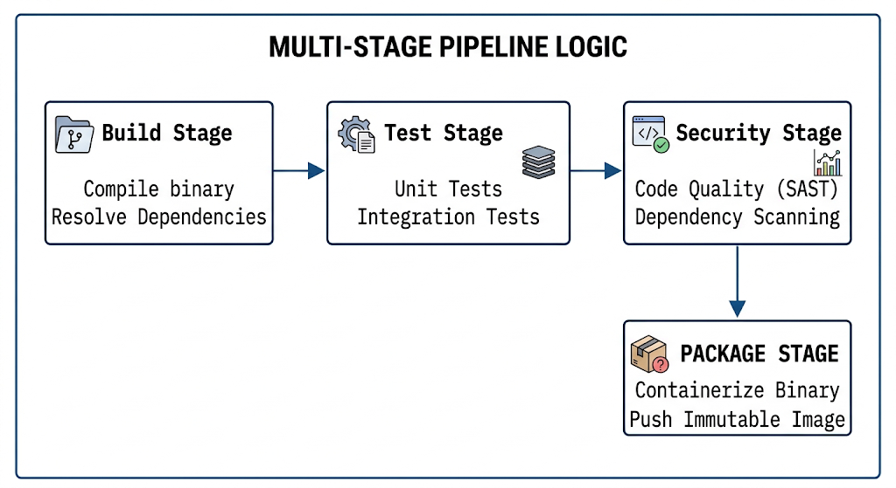

# Chapter 19: Enterprise CI/CD Pipeline Automation

This chapter covers the creation, scaling, and security of end-to-end continuous integration and delivery pipelines, focusing on declarative syntaxes, robust artifact handling, security integration, and optimizing build performance.

---

## 19.1 Declarative Pipelines in Jenkins, GitLab CI, and GitHub Actions

Modern DevOps practices lean heavily toward **Declarative Pipelines**, which are configuration files stored alongside the source code in version control. This approach defines the expected final state of the pipeline, and the automation engine manages the steps to achieve it. This contrasts with Scripted Pipelines, which can lead to maintainability challenges.

Declarative pipelines offer:

* **Pipeline-as-Code (PaC):** Storing pipeline definitions in git, allowing for code review, versioning, and rollback.
* **Predictability:** Each run uses the exact configuration defined in the file.
* **Maintainability:** Easier to read and update than complex imperative scripts.

### 19.1.1 Jenkins (Jenkinsfile)

Jenkins has fully embraced Declarative syntax. A `Jenkinsfile` provides a structured, predictable layout.

```groovy
pipeline {
    agent any // Define where the pipeline should run

    environment {
        // Define global environment variables
        REGISTRY = "registry.local:5000"
    }

    stages {
        stage('Build') {
            steps {
                echo 'Building application binary...'
                // Implementation...
            }
        }
        stage('Test') {
            steps {
                echo 'Running unit tests...'
                // Implementation...
            }
        }
    }
}

```

### 19.1.2 GitLab CI (`.gitlab-ci.yml`)

GitLab CI defines the entire lifecycle in a single YAML file, integrating seamlessly with the GitLab workflow.

```yaml
stages:
  - build
  - test
  - publish

variables:
  # Use defined environment variables
  CONTAINER_REGISTRY: "registry.local:5000"

build_job:
  stage: build
  script:
    - echo "Building the application binary..."
    # Implementation...

test_job:
  stage: test
  script:
    - echo "Running all automated unit tests..."
    # Implementation...

```

### 19.1.3 GitHub Actions (`.github/workflows/ci.yml`)

GitHub Actions uses YAML files to define "workflows," which are triggered by events and contain jobs and steps.

```yaml
name: Production CI

on:
  push:
    branches: [ main ] # Trigger on pushes to the main branch

env:
  # Define global environment variables
  AWS_REGION: "us-east-1"

jobs:
  build_and_test:
    runs-on: ubuntu-latest # Specify the runner environment
    steps:
      - uses: actions/checkout@v4 # Standard action to check out code

      - name: Build
        run: echo "Building application binary..."
        # Implementation...

      - name: Test
        run: echo "Running unit tests..."
        # Implementation...

```

---

## 19.2 Pipeline Runners, Agents, and Scalable Execution Environments

Running a large enterprise CI/CD environment requires robust infrastructure. The code compilation and testing don't happen on the Jenkins master; they occur on dedicated **Agents** or **Runners**.

* **Agents/Nodes (Jenkins):** Machines that connect to the master to execute builds. They must contain all necessary build dependencies (e.g., JDK, Docker).
* **Runners (GitLab/GitHub):** Processes (often containers) that pick up and run CI/CD jobs.

### 19.2.1 Scalable Strategies

Enterprise DevOps teams must move beyond static agents toward dynamic scaling.

1. **Static Agents:** Cost-inefficient, prone to "snowflakes" (unique, manual configurations).
2. **VM Scale Sets:** Auto-scaling VMs based on demand (e.g., Azure Scale Sets, AWS EC2 Auto Scaling), which clean up after the job.
3. **Containerized Execution (Kubernetes):** This is the **most modern approach**. Runners or agents are spun up dynamically as temporary pods on a Kubernetes cluster. When the job finishes, the pod is destroyed.

---

## 19.3 Multi-Stage Pipelines: Build, Test, Security Scan, and Package

A linear "Build and Test" pipeline is rarely enough for enterprise needs. Modern pipelines are modular, with clearly defined stages that act as quality gates.

### 19.3.1 Defining the Standard Multi-Stage Pipeline

A robust enterprise pipeline follows a specific logical flow:

```mermaid
graph LR
    subgraph pipeline [MULTI-STAGE PIPELINE LOGIC]
    direction LR
        A[<b>Build Stage</b><br>Compile binary<br>Resolve Dependencies] -->|Success| B
        B[<b>Test Stage</b><br>Unit Tests<br>Integration Tests] -->|Success| C
        C[<b>Security Stage</b><br>Code Quality (SAST)<br>Dependency Scanning] -->|Success| D
        D[<b>Package Stage</b><br>Containerize Binary<br>Push Immutable Image]
    end

```



### 19.3.2 Stage Breakdown

* **Build:** The first stage. Compiles the source code into a binary artifact (e.g., a `.jar`, `.tar.gz`, or executable). Dependencies are resolved here.
* **Test:** Executes automated test suites. This includes fast unit tests and slower integration tests. **Test results must be published** for visibility (e.g., JUnit XML results).
* **Security Scan:** This is the critical **"Shift Left"** component.
* **SAST (Static Application Security Testing):** Analyzing the source code itself for common anti-patterns or hardcoded secrets (e.g., SonarQube).
* **Dependency/Composition Analysis:** Scanning the included open-source libraries for known Common Vulnerabilities and Exposures (CVEs) (e.g., Snyk or Trivy).


* **Package:** The final stage of CI. The compiled, tested binary is packaged—most modernly as an immutable OCI-compliant container image—and pushed to an enterprise registry (like Harbor or Artifactory).

---

## 19.4 Pipeline Caching, Parameterization, and Trigger Mechanics

Optimizing the pipeline for speed and flexibility is essential for enterprise DevOps tools engineers.

### 19.4.1 Dependency Caching

Enterprise builds download hundreds of megabytes of dependencies (Java Maven, Node modules, Python pip). We must **cache these** between pipeline runs. Caching is different from artifacts:

* **Artifacts:** Formally produced files (e.g., a `.tar.gz` executable) passed from stage to stage.
* **Cache:** Temporary storage of downloaded dependencies (e.g., `~/.m2`, `node_modules`).

**Example: Caching in GitLab CI**

```yaml
# .gitlab-ci.yml
cache:
  key:
    files:
      - requirements.txt # Use the lockfile's hash as the cache key
  paths:
    - .cache/pip/ # Path to the cache directory
    - venv/

```

### 19.4.2 Parameterization and Triggers

Enterprise pipelines must handle variation. **Parameterization** allows the pipeline configuration to be tweaked at runtime without altering the source code (e.g., `TARGET_ENV=production`).

**Trigger Mechanics** are the rules deciding **when** a pipeline runs:

* **Merge Requests:** Run the pipeline when a developer requests to merge into `main`.
* **Commit Triggers:** Run on every push to specific branches.
* **Tag Triggers:** Run the full "publish and release" workflow only when a semantic version tag (e.g., `v1.2.0`) is pushed.

---

## 19.5 Hands-On Lab: Writing a Production-Grade Multi-Stage Pipeline in GitLab CI / Jenkins

### Lab Scenario

As a DevOps engineer, you must create a fully automated, production-grade CI/CD pipeline for a new application. The pipeline must be declarative, multi-stage, secure, optimized with caching, and designed to generate an immutable Docker image.

### Objectives

* Define a four-stage pipeline.
* Implement caching for Maven dependencies.
* Integrate a code linter and a dependency security scanner.
* Package the binary into a Docker image and push it to a registry.

---

### Step 1: Pre-requisites and Infrastructure Setup

For this lab, you will use GitLab CI.

1. Access to a GitLab instance and project.
2. A functional **GitLab Runner** with the **Docker executor** configured.
3. An **Enterprise Container Registry** (e.g., `registry.local:5000`) available for push operations.

---

### Step 2: Implement the Java Multi-Stage Pipeline

Create a file named `.gitlab-ci.yml` in the root of your Java project repository.

```yaml
# Define the strict sequence of operational quality gates
stages:
  - build
  - test
  - security
  - package

# Define global variables
variables:
  MAVEN_OPTS: "-Dmaven.repo.local=$CI_PROJECT_DIR/.m2/repository" # Specify the local Maven repository path
  DOCKER_REGISTRY: "registry.local:5000"
  IMAGE_NAME: "$DOCKER_REGISTRY/cyber/my-app"
  JAVA_IMAGE: "maven:3.9.6-eclipse-temurin-17"
  TRIVY_IMAGE: "aquasec/trivy:0.48.0"

# GLOBAL CACHE: Accelerate builds by reusing downloaded Java Maven dependencies
cache:
  key: "$CI_COMMIT_REF_SLUG" # Unique key for each branch/ref
  paths:
    - .m2/repository/ # Direct GitLab CI to cache the Maven repository path

# 1. BUILD STAGE: Compile source code, resolve dependencies, and create the immutable binary
compile_and_package:
  stage: build
  image: $JAVA_IMAGE
  script:
    - echo "Building Java application..."
    - mvn clean package -DskipTests # Compile source code and create the binary
  artifacts:
    paths:
      - target/my-app.jar # Define the artifact to pass to subsequent stages
    expire_in: 2 hours

# 2. TEST STAGE: Run comprehensive unit and integration automated test suites
run_automated_tests:
  stage: test
  image: $JAVA_IMAGE
  script:
    - echo "Running all unit and integration automated test suites..."
    - mvn test
  artifacts:
    when: always # Always publish results, even on test failure
    reports:
      junit: target/surefire-reports/TEST-*.xml # Direct GitLab to parse JUnit results for visibility

# 3. SECURITY STAGE (SHIFT LEFT): Block pushes containing CVEs or coding anti-patterns
vulnerability_dependency_scan:
  stage: security
  image: $TRIVY_IMAGE
  script:
    - echo "Scanning application dependencies for known CVEs..."
    # Scan the project filesystem, blocking critical CVEs with exit code 1
    - trivy fs --exit-code 1 --severity CRITICAL .

# 4. PACKAGE STAGE: Containerize the application binary into an immutable image
publish_docker_image:
  stage: package
  image: docker:24.0.5 # Use a Docker-in-Docker capable image
  services:
    - docker:24.0.5-dind # Direct GitLab CI to provide a sidecar Docker daemon
  script:
    - echo "Containerizing the application binary and pushing immutable image..."
    - docker login -u "$REGISTRY_USER" -p "$REGISTRY_PASSWORD" $DOCKER_REGISTRY
    - docker build -t "$IMAGE_NAME:$CI_COMMIT_SHORT_SHA" . # Tag with the unique commit SHA
    - docker push "$IMAGE_NAME:$CI_COMMIT_SHORT_SHA"
  # Optional: Apply specific triggers (branch rules)
  rules:
    - if: '$CI_COMMIT_BRANCH == "main"' # Only run packaging on the main branch

```

---

### Step 3: Formatting, Validation, and Execution

The pipeline automation engineer must validate their work before committing.

```bash
# 1. Format the file using a YAML linter (best practice)
yamllint .gitlab-ci.yml

# 2. Use the GitLab CI Lint API (if available via CLI)
# glab ci lint # Assuming glab CLI is installed

# 3. Commit and push the verified configuration to trigger execution
git add .gitlab-ci.yml
git commit -m "CHORE-101: Define Java multi-stage enterprise CI pipeline with security gates"
git push

```

---

### Step 4: Verification

Go to the GitLab project sidebar -> **CI/CD** -> **Pipelines** and examine the execution graph. Ensure:

1. The `security` stage successfully executed and blocked critical dependencies.
2. The `package` stage executed and pushed an image (check your registry).
3. The intermediate artifact (`target/my-app.jar`) was available for packaging.

---

## Self-Assessment & Exam Practice Questions

**Question 1:** An enterprise pipeline is taking 25 minutes to complete because it downloads 400MB of Maven Java dependencies on every run. Which component of the CI configuration must be utilized to accelerate subsequent pipeline execution?

* A) Artifacts
* B) Cache
* C) Scripted Pipeline syntax
* D) Static runners

**Answer:** **B**
*Explanation:* **Cache** is used specifically to store downloaded external dependencies (like Maven repositories or `node_modules`) between pipeline runs, accelerating execution by avoiding duplicate downloads.

**Question 2:** When migrating from a scripted Jenkins pipeline to a declarative Jenkinsfile, which block becomes the primary container for all major functional phases (such as Build, Test, and Package)?

* A) `pipeline`
* B) `agent`
* C) `stages`
* D) `steps`

**Answer:** **C**
*Explanation:* The **`stages`** block defines the sequential and parallel functional phases (or quality gates) of the declarative pipeline, separating logic like building, testing, security, and packaging.

**Question 3:** Which specific trigger mechanic is a best practice for a CD workflow, ensuring that full artifact publication and deployment to production only occur when a stable semantic version tag is pushed?

* A) Commit Triggers
* B) Scheduled Triggers
* C) Parameterization
* D) Tag Triggers

**Answer:** **D**
*Explanation:* **Tag Triggers** allow the CD logic to be decoupled from every commit, ensuring that full release automation is only initiated upon explicit semantic version tagging (e.g., `v1.2.0`).
