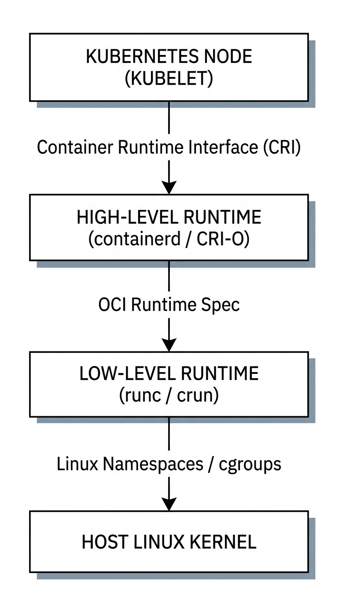
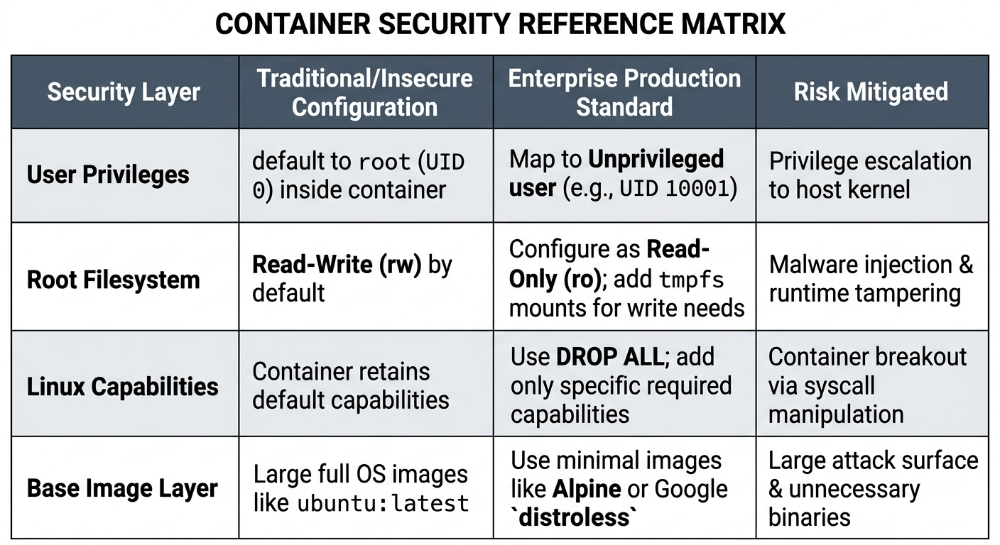

# Chapter 2: Containerization, Orchestration & Microservices Infrastructure

## Executive Overview & Exam Blueprint Alignment

This chapter addresses **Objective 701.2: Standard Components and Platforms for Software** from the **LPI DevOps Tools Engineer Exam 701**. Modern enterprise software systems rely on containerization to guarantee portability, immutability, and resource isolation across heterogeneous environments.

This chapter provides an enterprise-level, hands-on deep dive into core containerization and orchestration architectures:

* **OCI Standards & Image Engineering:** Open Container Initiative (OCI) runtime and image specifications, multi-stage Dockerfile construction, image size optimization, and minimal base layers (`distroless`, Alpine).
* **Security & Privilege Isolation:** Non-root execution, Linux capabilities (`CAP_SYS_ADMIN`, `CAP_NET_BIND_SERVICE`), and read-only root filesystems.
* **Microservices Deployment Topologies:** Multi-container pod patterns (Sidecar, Ambassador, Adapter) and container orchestration runtime interfaces (CRI-O, containerd).
* **Health Checks & Lifecycle Management:** Liveness, readiness, and startup probes to automate self-healing and zero-downtime rollouts.

---

## 1. Enterprise Container Architecture & Security Best Practices

### 1.1 Container Runtime Architecture: OCI, containerd, and CRI-O

In enterprise Kubernetes environments, high-level container runtimes interact with low-level runtimes using the Open Container Initiative (OCI) specification.



### 1.2 Enterprise Security Matrix for Containerized Workloads


| Security Layer | Traditional/Insecure Configuration | Enterprise Production Standard | Risk Mitigated |
| --- | --- | --- | --- |
| **User Privileges** | `root` (UID 0) inside container | Unprivileged user (e.g., `UID 10001`) | Privilege escalation to host kernel |
| **Root Filesystem** | Read-Write (`rw`) | Read-Only (`ro`) with explicit `tmpfs` mounts | Malware injection & runtime tampering |
| **Linux Capabilities** | Default capabilities enabled | `DROP ALL`, add explicit capabilities (`NET_BIND_SERVICE`) | Container breakout via syscall manipulation |
| **Base Image Layer** | `ubuntu:latest` or `debian:latest` | Minimal Alpine or Google `distroless` | Unnecessary binaries & CVE attack surface |

---

## 2. Hands-On Laboratory: Securing and Orchestrating Microservices

In this enterprise hands-on lab, you will engineer a secure, highly optimized multi-stage OCI container image for a microservice and deploy it using an **Ambassador Sidecar pattern** with custom health probes and security contexts.

```
                          ┌────────────────────────────────────────────────┐
                          │                   POD BOUNDARY                 │
                          │                                                │
                          │  ┌───────────────────┐  ┌───────────────────┐  │
                          │  │   MAIN CONTAINER  │  │ SIDECAR CONTAINER │  │
                          │  │                   │  │                   │  │
Client Request ───────────┼─>│   Microservice    │─>│ Ambassador Proxy  │──┼─> Outbound Service
(Port 8080)               │  │  (Unprivileged)   │  │   (Localhost:9000)│  │   (External API)
                          │  └─────────┬─────────┘  └───────────────────┘  │
                          │            │                                   │
                          │            v                                   │
                          │   ┌─────────────────┐                          │
                          │   │ Liveness Probe  │                          │
                          │   │ /healthz        │                          │
                          │   └─────────────────┘                          │
                          └────────────────────────────────────────────────┘

```

---

### Step 1: Environment & Workspace Preparation

Execute the following commands on a Debian/Ubuntu enterprise host to prepare the container build workspace:

```bash
# Update system repositories and install Podman / Docker utilities
sudo apt-get update && sudo apt-get install -y \
    podman \
    build-essential \
    curl \
    jq

# Create directory hierarchy for the microservice project
mkdir -p ~/container-lab/{src,config} && cd ~/container-lab

# Initialize Python microservice source file
cat << 'EOF' > src/app.py
import http.server
import socketserver
import json
import sys
import os

PORT = 8080

class HealthHandler(http.server.SimpleHTTPRequestHandler):
    def do_GET(self):
        if self.path == '/healthz':
            self.send_response(200)
            self.send_header('Content-type', 'application/json')
            self.end_headers()
            self.wfile.write(json.dumps({"status": "HEALTHY", "service": "order-processor"}).encode())
        elif self.path == '/ready':
            # Check if temporary runtime path is writeable
            if os.access('/tmp', os.W_OK):
                self.send_response(200)
                self.send_header('Content-type', 'application/json')
                self.end_headers()
                self.wfile.write(json.dumps({"status": "READY"}).encode())
            else:
                self.send_response(500)
                self.end_headers()
        else:
            self.send_response(200)
            self.send_header('Content-type', 'text/plain')
            self.end_headers()
            self.wfile.write(b"Microservice Processing Requests Successfully.")

if __name__ == "__main__":
    print(f"Starting unprivileged service on port {PORT}...")
    with socketserver.TCPServer(("", PORT), HealthHandler) as httpd:
        httpd.serve_forever()
EOF

```

---

### Step 2: Enterprise Multi-Stage Dockerfile Construction

Create a minimal, production-hardened `Dockerfile` utilizing build stages to minimize image size and eliminate build tools from the final image runtime layer.

```dockerfile
# Stage 1: Build & Dependency Resolution Stage
FROM python:3.11-slim AS builder

WORKDIR /app

# Install build-time dependencies only
RUN apt-get update && apt-get install -y --no-install-recommends \
    gcc \
    && rm -rf /var/lib/apt/lists/*

COPY src/ /app/src/

# Compile Python byte code for improved container cold start times
RUN python -m compileall /app/src

# Stage 2: Hardened Runtime Stage
FROM python:3.11-slim AS runner

# Create a dedicated non-root user and group (UID/GID 10001)
RUN groupadd -g 10001 appgroup && \
    useradd -u 10001 -g appgroup -s /sbin/nologin -M appuser

WORKDIR /app

# Copy compiled resources from builder stage
COPY --from=builder /app/src /app/src

# Set strict ownership rights
RUN chown -R appuser:appgroup /app

# Enforce Non-Root Execution
USER 10001:10001

# Expose non-privileged service port
EXPOSE 8080

# Configure Health Check Directive
HEALTHCHECK --interval=10s --timeout=3s --start-period=5s --retries=3 \
    CMD python3 -c "import urllib.request; urllib.request.urlopen('http://localhost:8080/healthz')" || exit 1

ENTRYPOINT ["python3", "/app/src/app.py"]

```

---

### Step 3: Container Image Build and Inspection

Build the OCI container image using Podman/Docker and verify security compliance:

```bash
# Build the enterprise image
podman build -t order-processor:v1.0.0 .

# Inspect binary size and layer count
podman images order-processor:v1.0.0

# Verify non-root configuration via OCI image inspection
podman inspect order-processor:v1.0.0 | jq '.[0].Config.User'

```

---

### Step 4: Multi-Container Pod Configuration (Ambassador Pattern)

Create a Pod declaration (`pod-manifest.yaml`) featuring the main application container and an **Ambassador Sidecar Proxy** container.

```yaml
apiVersion: v1
kind: Pod
metadata:
  name: order-processor-pod
  labels:
    app.kubernetes.io/name: order-processor
    app.kubernetes.io/part-of: e-commerce-system
spec:
  securityContext:
    runAsNonRoot: true
    runAsUser: 10001
    runAsGroup: 10001
    fsGroup: 10001
    seccompProfile:
      type: RuntimeDefault

  containers:
    # Main Application Container
    - name: main-processor
      image: order-processor:v1.0.0
      imagePullPolicy: Never
      ports:
        - containerPort: 8080
          name: http-api
      securityContext:
        allowPrivilegeEscalation: false
        readOnlyRootFilesystem: true
        capabilities:
          drop:
            - ALL
      volumeMounts:
        - name: tmp-volume
          mountPath: /tmp

      # Kubernetes Health Probes
      livenessProbe:
        httpGet:
          path: /healthz
          port: 8080
        initialDelaySeconds: 5
        periodSeconds: 10
      readinessProbe:
        httpGet:
          path: /ready
          port: 8080
        initialDelaySeconds: 2
        periodSeconds: 5

    # Sidecar Ambassador Container (HAProxy / Proxy pattern)
    - name: ambassador-proxy
      image: alpine:3.19
      command: ["/bin/sh", "-c", "while true; do sleep 3600; done"]
      securityContext:
        allowPrivilegeEscalation: false
        readOnlyRootFilesystem: true
        capabilities:
          drop:
            - ALL

  volumes:
    - name: tmp-volume
      emptyDir: {}

```

---

### Step 5: Executing and Testing Hardened Container Workloads

Launch the pod locally using Podman pod abstractions to simulate Kubernetes container runtime behavior:

```bash
# Create local sandbox pod
podman pod create --name order-system-pod -p 8080:8080

# Launch main service container within the shared pod network namespace
podman run -d \
    --pod order-system-pod \
    --name main-processor-container \
    --read-only \
    --cap-drop=ALL \
    --user 10001:10001 \
    --tmpfs /tmp \
    order-processor:v1.0.0

# Verify running container status inside pod
podman pod ps

```

---

## 3. Advanced Microservices Patterns & Health Probes

### 3.1 Pod Design Patterns

1. **Sidecar Pattern:** Enhances or extends the main container's functionality without changing its code (e.g., log shippers like Fluentd, service mesh proxies like Envoy).
2. **Ambassador Pattern:** Acts as a network proxy for the main container, abstracting access to external services (e.g., routing traffic to database clusters or external APIs).
3. **Adapter Pattern:** Standardizes output or metrics from heterogeneous application runtimes into a uniform format expected by monitoring tools (e.g., exposing Prometheus metrics).

---

### 3.2 Liveness, Readiness, and Startup Probes

```
                       CONTAINER LIFECYCLE
                                │
                                v
                     ┌─────────────────────┐
                     │    STARTUP PROBE    │ ─── Fail? ──> Restart Container
                     └──────────┬──────────┘
                                │ Success
                                v
                     ┌─────────────────────┐
                     │   READINESS PROBE   │ ─── Fail? ──> Remove from Service Endpoints
                     └──────────┬──────────┘
                                │ Success
                                v
                     ┌─────────────────────┐
                     │   LIVENESS PROBE    │ ─── Fail? ──> Restart Container
                     └─────────────────────┘

```

* **Startup Probe:** Validates whether the application within the container has initialized. All other probes are disabled until the startup probe succeeds.
* **Readiness Probe:** Determines whether the container is ready to accept inbound network traffic. If it fails, the container is removed from service load balancer endpoints.
* **Liveness Probe:** Checks whether the container process is alive. If it fails, the runtime kills and restarts the container based on its restart policy.

---

## 4. Verification & Troubleshooting

### Pipeline Verification Walkthrough

1. Verify local container endpoint response:
```bash
curl -i http://localhost:8080/healthz

```


**Expected Response:**
```http
HTTP/1.1 200 OK
Content-type: application/json

{"status": "HEALTHY", "service": "order-processor"}

```


2. Test readiness endpoint:
```bash
curl -i http://localhost:8080/ready

```


3. Confirm non-root container isolation:
```bash
podman exec -it main-processor-container id

```


**Expected Response:**
```text
uid=10001(appuser) gid=10001(appgroup) groups=10001(appgroup)

```


---

### Common Field Failures & Remediation Matrix

| Issue | Root Cause | Remediation Procedure |
| --- | --- | --- |
| `CrashLoopBackOff` | Application failed to start, or liveness probe timed out. | Inspect container logs: `podman logs <container-id>` or `kubectl logs <pod-name>`. |
| `Read-only file system` Error | Application attempted to write runtime logs or PID files to a read-only root partition. | Mount an `emptyDir` or `tmpfs` volume explicitly to writeable paths like `/tmp` or `/var/log`. |
| `Permission denied` on port binding | Container process attempted to bind to a privileged port (< 1024) while running as non-root without `CAP_NET_BIND_SERVICE`. | Reconfigure the application to use non-privileged ports (e.g., 8080, 8443) or add `CAP_NET_BIND_SERVICE`. |
| `ImagePullBackOff` | Invalid image path, missing registry authentication, or tag mismatch. | Verify image tags, repository permissions, and pull credentials (`podman login`). |
