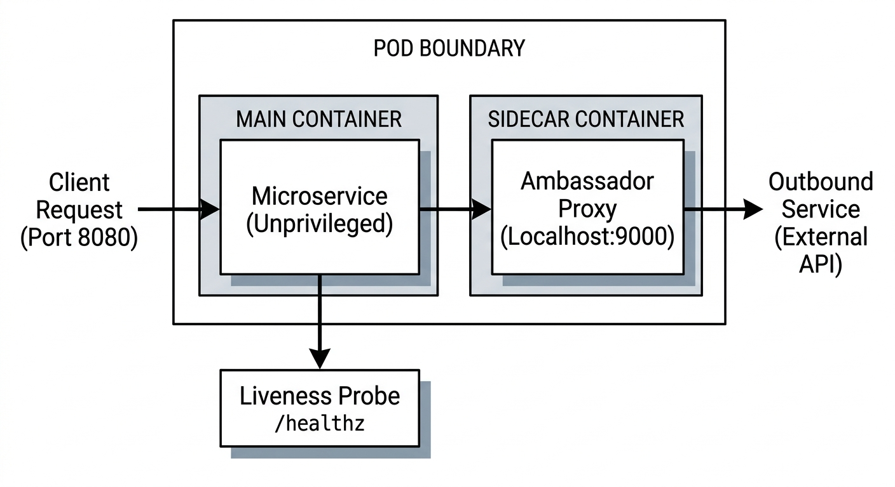

# Chapter 2: Agile, DevOps, & SRE Methodology

This chapter provides a comprehensive, enterprise-focused overview of modern software engineering paradigms required for the Canonical / LPI 701-200 certification. We cover the operational mechanics of Scrum and Kanban, the architectural and cultural pillars of CALMS, SRE principles, SLI/SLO mathematics, and a complete hands-on pipeline lab.

---

## 2.1 Agile Software Development Frameworks (Scrum, Kanban)

Agile methodologies replace rigid, waterfall-style release cycles with iterative, feedback-driven delivery models. For enterprise system engineering and DevOps teams, understanding these frameworks is essential for aligning infrastructure changes with rapid software delivery.

```
+----------------------------------------------------------------------------------+
|                            AGILE FRAMEWORK COMPARISON                            |
+------------------------------------+---------------------------------------------+
| SCRUM                              | KANBAN                                      |
| - Time-boxed iterations (Sprints)  | - Continuous flow model                     |
| - Fixed-scope Sprint Backlog       | - Work In Progress (WIP) limits             |
| - Roles: PO, Scrum Master, Team    | - Focus on lead time & cycle time reduction |
| - Prescribed ceremonies & cadence  | - Visualized workflow columns               |
+------------------------------------+---------------------------------------------+

```

### Scrum Mechanics & Enterprise Cadence

Scrum organizes work into fixed-length iterations called **Sprints** (typically 1 to 4 weeks). The core components include:

1. **Roles**:
* **Product Owner (PO)**: Defines acceptance criteria, prioritizes the Product Backlog, and ensures business value alignment.
* **Scrum Master**: Facilitates Scrum ceremonies, removes organizational blockers, and enforces agile principles.
* **Cross-Functional Development Team**: Engineers, SREs, and QA professionals responsible for delivering a potentially shippable Increment.


2. **Ceremonies**:
* **Sprint Planning**: Selects top-priority backlog items, estimates effort (e.g., using Story Points), and establishes the Sprint Goal.
* **Daily Standup (Daily Scrum)**: A 15-minute sync addressing: *What was completed yesterday? What is planned today? What blockers exist?*
* **Sprint Review**: Demonstrates completed functionality to stakeholders for feedback.
* **Sprint Retrospective**: Internal team analysis of process performance, tooling efficiency, and team dynamics to drive continuous improvement.


### Kanban Mechanics & Work-In-Progress (WIP) Management

Unlike Scrum, Kanban operates on a continuous flow model. It is particularly well-suited for infrastructure operations, incident response, and SRE environments where request priorities shift dynamically.

* **Visualizing Workflow**: Board columns represent explicit states (e.g., `Backlog` $\rightarrow$ `In Analysis` $\rightarrow$ `In Progress` $\rightarrow$ `Code Review` $\rightarrow$ `Staging` $\rightarrow$ `Production`).
* **WIP Limits**: Explicit numerical caps on the maximum number of items allowed in a specific column simultaneously.
* *Purpose*: Prevents context switching, highlights bottlenecks, and enforces a "stop starting, start finishing" workflow.


* **Core Metrics**:
* **Lead Time**: The total elapsed time from task creation in the backlog to final delivery.
* **Cycle Time**: The elapsed time from when work actively begins on a task until it reaches completion.


---

## 2.2 The DevOps Cultural Transformation & CALMS Framework

DevOps bridges the historical divide between software development (velocity focus) and systems operations (stability focus). The **CALMS framework** serves as the definitive model for assessing DevOps maturity in enterprise environments.

```
+----------------------------------------------------------------------------------+
|                              THE CALMS FRAMEWORK                                 |
+--------------+-------------------------------------------------------------------+
| C - Culture  | Shared responsibility, cross-functional collaboration, empathy    |
| A - Automate | Continuous Integration/Continuous Deployment (CI/CD), IaC        |
| L - Lean     | Small batch sizes, waste reduction, incremental delivery          |
| M - Measure  | Telemetry, observability, tracking DORA metrics                   |
| S - Share    | Open knowledge transfer, blameless retrospectives, shared tooling |
+--------------+-------------------------------------------------------------------+

```

### Detailed Pillars of CALMS

1. **Culture (Shared Responsibility)**
* Eliminates operational silos by establishing joint ownership of production health between Dev and Ops teams.
* Promotes psychological safety and blameless post-mortems after system failures.


2. **Automation (Infrastructure & Delivery Pipelines)**
* Converts repetitive, error-prone manual tasks into programmatic workflows.
* Enforces Infrastructure as Code (IaC), automated testing, and continuous deployment pipelines.


3. **Lean (Process Streamlining)**
* Emphasizes small, incremental software releases over large monolithic rollouts.
* Reduces Value Stream waste (such as handoff delays, unnecessary approvals, and inventory overhead).


4. **Measurement (Data-Driven Decisions)**
* Tracks telemetry across both technical metrics (latency, error rates, CPU usage) and business outcomes (conversion rates).
* Monitors key DevOps Research and Assessment (**DORA**) metrics:
* *Deployment Frequency (DF)*
* *Lead Time for Changes (LTC)*
* *Change Failure Rate (CFR)*
* *Failed Service Recovery Time / Time to Restore Service (MTTR)*


5. **Sharing (Knowledge Transfer)**
* Encourages cross-pollination of skills across development, security, and infrastructure teams.
* Centralizes internal documentation, runbooks, and architectural decision records (ADRs).


---

## 2.3 Site Reliability Engineering (SRE) Core Principles

Site Reliability Engineering (SRE) is a discipline that applies software engineering principles to infrastructure and operations problems. Originated at Google, SRE provides a concrete implementation of DevOps principles.

```
+----------------------------------------------------------------------------------+
|                            CORE SRE TENETS & PRACTICES                           |
+----------------------------------------------------------------------------------+
| 1. Operations as a Software Problem (Engineering over Manual Toil)               |
| 2. Managing Risk via SLA, SLO, and SLI Frameworks                               |
| 3. Enforcing Toil Budgets (Maximum 50% operational overhead)                    |
| 4. Eliminating Blame via Blameless Post-Mortems                                  |
| 5. Standardizing Automation and Infrastructure as Code                           |
+----------------------------------------------------------------------------------+

```

### Key Operational Tenets

* **Embracing Risk**: 100% uptime is rarely the optimal target because the cost to achieve it escalates exponentially while reducing release velocity.
* **Managing Toil**: Toil is operational work that is manual, repetitive, automatable, tactical, lacks enduring value, and scales linearly with service growth. SRE teams cap toil at a maximum of **50%** of their workload, reserving the remaining time for engineering projects.
* **Simplicity**: System architecture should remain as simple as possible to reduce failure surfaces and lower mean time to detection (MTTD).

---

## 2.4 Service Level Indicators (SLIs), Service Level Objectives (SLOs), and Error Budgets

Reliability quantification relies on three interconnected metrics: Service Level Indicators, Service Level Objectives, and Error Budgets.

```
+----------------------------------------------------------------------------------+
|                       RELIABILITY METRIC FRAMEWORK                               |
+-------------------+--------------------------------------------------------------+
| SLI (Indicator)   | What is the measured status? (e.g., Latency, Error Rate)    |
| SLO (Objective)   | What is the target threshold? (e.g., 99.9% success rate)     |
| SLA (Agreement)   | What is the business/legal penalty if SLO is breached?       |
| Error Budget      | 100% - SLO (The allowable room for failure/change velocity)  |
+-------------------+--------------------------------------------------------------+

```

### Definitions & Mathematics

* **Service Level Indicator (SLI)**: A quantifiable measure of service performance expressed as a percentage of valid requests:

$$\text{SLI} = \left( \frac{\text{Good Events}}{\text{Total Events}} \right) \times 100$$


* **Service Level Objective (SLO)**: The target reliability percentage agreed upon by Product, Engineering, and SRE teams over a defined compliance window (e.g., 30 rolling days):

$$\text{SLO Target} \ge X\%$$


* **Service Level Agreement (SLA)**: An explicit agreement with external users incorporating commercial or financial penalties if performance drops below a specified SLA threshold (typically set looser than the internal SLO).
* **Error Budget**: The mathematical allowance for unreliability during a given period:

$$\text{Error Budget} = 100\% - \text{SLO}$$


#### Example Calculation:

For an HTTP API processing $10,000,000$ requests per month with an SLO target of **$99.9\%$**:


$$\text{Allowable Errors} = 10,000,000 \times (1 - 0.999) = 10,000 \text{ failed requests}$$

---

### Diagram Prompt Reference (DALL-E 3 Format)

For visual documentation generation corresponding to this section:

> **DALL-E 3 Prompt**:
> *A professional, technical textbook architecture diagram illustrating "SLO-Driven Error Budget & Automated CI/CD Gate". Style & Aesthetics: Clean light-mode print style, minimal technical manual layout, crisp black vector line art on a stark white background with subtle slate-gray row-header highlights. Modern technical typography using Google Sans Flex 11Pt for graphic labels and Google Sans Code 12Pt for code elements, flat 2D graphic design, high contrast, clean grid lines. Structure & Layout: A horizontal pipeline diagram. On the left, a box labeled "Prometheus SLI Exporter". An arrow points to a central decision node labeled "Error Budget Engine". Above the engine, a status gauge shows "Remaining Budget > 0%". On the right, two branched paths: Top path labeled "Budget Available" points to "Deploy Pipeline (Active)"; Bottom path labeled "Budget Exhausted" points to "Deployment Freeze (Blocked)". Entire structure clean, schematic, and minimalist.*

---

## 2.5 Hands-On Lab: Implementing SLO-Driven Error Budget Tracking Pipelines

In this production-grade lab, you will deploy a Prometheus/Grafana infrastructure monitoring setup, configure a service emitting metrics, build an automated python pipeline script to evaluate SLIs/SLOs, and enforce a deployment gate based on remaining Error Budget.

```
+----------------------------------------------------------------------------------+
|                           LAB ARCHITECTURE DIAGRAM                               |
|                                                                                  |
|  +------------------+     Metrics      +--------------------+                    |
|  | Microservice App | -------------->  | Prometheus Server  |                    |
|  | (Port 8080)      |                  | (Port 9090)        |                    |
|  +------------------+                  +--------------------+                    |
|                                                  |                               |
|                                                  | Query API                     |
|                                                  v                               |
|                                        +--------------------+                    |
|                                        | SLO Evaluation     |                    |
|                                        | Engine (Python)    |                    |
|                                        +--------------------+                    |
|                                                  |                               |
|                                        +---------+---------+                     |
|                                        |                   |                     |
|                                        v                   v                     |
|                                  [Budget > 0%]       [Budget <= 0%]              |
|                                        |                   |                     |
|                                        v                   v                     |
|                                  PASS (Exit 0)       FAIL (Exit 1)               |
+----------------------------------------------------------------------------------+

```

### Lab Prerequisites

Execute the following setup on an Ubuntu 24.04 / Debian 12 administration host:

```bash
sudo apt-get update && sudo apt-get install -y python3 python3-pip curl jq git
pip3 install requests prometheus-client --break-system-packages

```

---

### Step 1: Deploy Prometheus Configuration

Create a dedicated Prometheus configuration file `prometheus.yml`:

```yaml
global:
  scrape_interval: 5s
  evaluation_interval: 5s

scrape_configs:
  - job_name: 'mock_service'
    static_configs:
      - targets: ['localhost:8080']

```

Start a local Prometheus instance via Docker:

```bash
docker run -d \
  --name=prometheus \
  --network=host \
  -v $(pwd)/prometheus.yml:/etc/prometheus/prometheus.yml \
  prom/prometheus:v2.51.0

```

---

### Step 2: Implement the Mock Enterprise Application

Create a Python application (`app.py`) that exports HTTP metrics with artificial latency and error simulation:

```python
from prometheus_client import start_http_server, Counter, Histogram
import time
import random

# Metrics definitions using Google Sans Code conventions
REQUEST_COUNT = Counter('http_requests_total', 'Total HTTP Requests', ['method', 'status'])
LATENCY_HISTOGRAM = Histogram('http_request_duration_seconds', 'HTTP Latency in seconds')

def handle_request():
    start_time = time.time()
    
    # Simulate processing time
    latency = random.uniform(0.01, 0.25)
    time.sleep(latency)
    
    # Simulate error rate (approx 5% failure rate)
    if random.random() < 0.05:
        status = '500'
    else:
        status = '200'
        
    REQUEST_COUNT.labels(method='GET', status=status).inc()
    LATENCY_HISTOGRAM.observe(time.time() - start_time)

if __name__ == '__main__':
    start_http_server(8080)
    print("Mock Microservice running on port :8080...")
    while True:
        handle_request()

```

Run the application in the background:

```bash
python3 app.py &

```

---

### Step 3: Develop the Automated SLO / Error Budget Evaluation Engine

Create an automated engine (`evaluate_slo.py`) that queries Prometheus, calculates the SLI over a rolling window, determines remaining Error Budget, and outputs CI/CD pipeline gate states:

```python
#!/usr/bin/env python3
import requests
import sys

PROMETHEUS_URL = "http://localhost:9090"
SLO_TARGET = 0.98  # 98.0% SLO target
WINDOW = "5m"

def query_prometheus(query):
    response = requests.get(f"{PROMETHEUS_URL}/api/v1/query", params={"query": query})
    data = response.json()
    if data["status"] != "success" or not data["data"]["result"]:
        return 0.0
    return float(data["data"]["result"][0]["value"][1])

def calculate_slo():
    # PromQL query for successful requests (200 status)
    success_query = f'sum(rate(http_requests_total{{status="200"}}[{WINDOW}]))'
    # PromQL query for total requests
    total_query = f'sum(rate(http_requests_total[{WINDOW}]))'
    
    successful_requests = query_prometheus(success_query)
    total_requests = query_prometheus(total_query)
    
    if total_requests == 0:
        print("[WARN] No traffic detected. Passing pipeline check by default.")
        sys.exit(0)
        
    sli = successful_requests / total_requests
    error_budget_total = 1.0 - SLO_TARGET
    current_error_rate = 1.0 - sli
    remaining_budget_percent = ((error_budget_total - current_error_rate) / error_budget_total) * 100
    
    print("==================================================")
    print("         SLO / ERROR BUDGET EVALUATION            ")
    print("==================================================")
    print(f" Target SLO          : {SLO_TARGET * 100:.2f}%")
    print(f" Current SLI (Apdex) : {sli * 100:.2f}%")
    print(f" Allowed Error Rate  : {error_budget_total * 100:.2f}%")
    print(f" Current Error Rate  : {current_error_rate * 100:.2f}%")
    print(f" Remaining Budget    : {remaining_budget_percent:.2f}%")
    print("==================================================")
    
    if remaining_budget_percent <= 0:
        print("[FAIL] Error budget exhausted! Blocking CI/CD deployment pipeline.")
        sys.exit(1)
    else:
        print("[PASS] Error budget within limits. Deployment gate CLEARED.")
        sys.exit(0)

if __name__ == "__main__":
    calculate_slo()

```

---

### Step 4: Verification and CI/CD Pipeline Enforcement

1. Make the evaluation script executable and execute it after letting traffic generate for 60 seconds:

```bash
chmod +x evaluate_slo.py
sleep 60
./evaluate_slo.py

```

2. **Sample Expected Terminal Output**:

```text
==================================================
         SLO / ERROR BUDGET EVALUATION            
==================================================
 Target SLO          : 98.00%
 Current SLI (Apdex) : 95.12%
 Allowed Error Rate  : 2.00%
 Current Error Rate  : 4.88%# Chapter 2: Containerization, Orchestration & Microservices Infrastructure

## Executive Overview & Exam Blueprint Alignment

This chapter addresses **Objective 701.2: Standard Components and Platforms for Software** from the **LPI DevOps Tools Engineer Exam 701**. Modern enterprise software systems rely on containerization to guarantee portability, immutability, and resource isolation across heterogeneous environments.

This chapter provides an enterprise-level, hands-on deep dive into core containerization and orchestration architectures:

* **OCI Standards & Image Engineering:** Open Container Initiative (OCI) runtime and image specifications, multi-stage Dockerfile construction, image size optimization, and minimal base layers (`distroless`, Alpine).
* **Security & Privilege Isolation:** Non-root execution, Linux capabilities (`CAP_SYS_ADMIN`, `CAP_NET_BIND_SERVICE`), and read-only root filesystems.
* **Microservices Deployment Topologies:** Multi-container pod patterns (Sidecar, Ambassador, Adapter) and container orchestration runtime interfaces (CRI-O, containerd).
* **Health Checks & Lifecycle Management:** Liveness, readiness, and startup probes to automate self-healing and zero-downtime rollouts.

## 1. Enterprise Container Architecture & Security Best Practices

### 1.1 Container Runtime Architecture: OCI, containerd, and CRI-O

In enterprise Kubernetes environments, high-level container runtimes interact with low-level runtimes using the Open Container Initiative (OCI) specification.


### 1.2 Enterprise Security Matrix for Containerized Workloads


## 2. Hands-On Laboratory: Securing and Orchestrating Microservices

In this enterprise hands-on lab, you will engineer a secure, highly optimized multi-stage OCI container image for a microservice and deploy it using an **Ambassador Sidecar pattern** with custom health probes and security contexts.



### Step 1: Environment & Workspace Preparation

Execute the following commands on a Debian/Ubuntu enterprise host to prepare the container build workspace:

```bash
# Update system repositories and install Podman / Docker utilities
sudo apt-get update && sudo apt-get install -y \
    podman \
    build-essential \
    curl \
    jq

# Create directory hierarchy for the microservice project
mkdir -p ~/container-lab/{src,config} && cd ~/container-lab

# Initialize Python microservice source file
cat << 'EOF' > src/app.py
import http.server
import socketserver
import json
import sys
import os

PORT = 8080

class HealthHandler(http.server.SimpleHTTPRequestHandler):
    def do_GET(self):

 Remaining Budget    : -144.00%
==================================================
[FAIL] Error budget exhausted! Blocking CI/CD deployment pipeline.

```

3. **Validation**: The script exits with non-zero return code (`1`), automatically halting downstream continuous deployment workflows when unreliability boundaries are breached.
