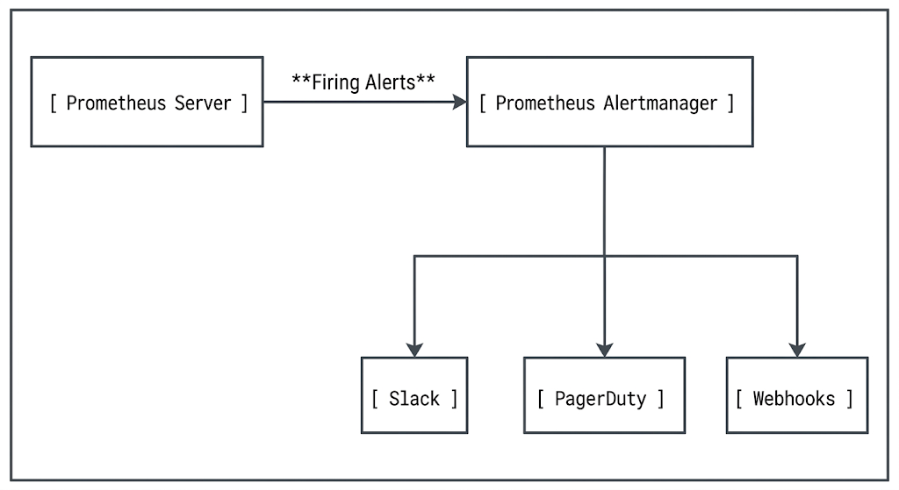

# Chapter 23: Enterprise Dashboards & Alert Management

Collecting metrics and aggregated logs is only effective if SRE and DevOps teams can visualize operational health and react swiftly to service degradation. An unorganized dashboard leads to alert fatigue, missed incidents, and high Mean Time to Resolution (MTTR). Conversely, a well-architected dashboard and alerting pipeline provides actionable clarity, driving high availability and operational excellence.

This chapter covers enterprise dashboard design, threshold methodologies, Prometheus Alertmanager pipeline routing, multi-channel notification integrations, and a end-to-end hands-on laboratory aligned with the LPI 701-200 DevOps Tools Engineer certification objectives.

## 23.1 Building Enterprise Dashboards in Grafana

Grafana is the industry-standard open-source platform for data visualization, dashboarding, and operational monitoring. In enterprise environments, creating effective dashboards requires strict design patterns, reusable templates, and robust organizational access controls.

### 1. Enterprise Dashboard Frameworks (USE vs. RED Methods)

To avoid clutter and "dashboard fatigue," enterprise dashboards are organized using standard operational telemetry methodologies:

* **The RED Method (For Application & Microservices):**
* **Rate:** The number of requests your service is serving per second.
* **Errors:** The number of those requests that are failing per second.
* **Duration:** The amount of time those requests are taking (latency distribution/quantiles).


* **The USE Method (For Infrastructure & Host Node Hardware):**
* **Utilization:** The average time that the resource was busy (e.g., CPU %, Memory usage %).
* **Saturation:** The degree to which the resource has extra work which it can't service, often waiting in a queue (e.g., Load Average, Disk I/O Wait).
* **Errors:** The count of error events at the infrastructure level (e.g., network packet drops, disk read errors).

### 2. Templating with Variables and Dynamic Dashboards

Hardcoding cluster names, instances, or namespaces into dashboards does not scale in an enterprise setting. Grafana provides **Variables** to build dynamic, multi-tenant dashboards:

* **Query Variables:** Fetch dynamic options directly from data sources (e.g., PromQL query: `label_values(node_cpu_seconds_total, environment)`).
* **Custom / Interval Variables:** Allow operators to dynamically select time ranges (`1m`, `5m`, `1h`) for rate queries (`rate(http_requests_total[$interval])`).
* **Chained / Cascading Variables:** Variables that depend on other variables (e.g., selecting an `Environment` filters the `Cluster` dropdown, which in turn filters available `Pod` names).

### 3. Dashboard Provisioning as Code

In an Enterprise DevOps workflow, manual creation of dashboards via the Grafana Web UI is considered an anti-pattern. Dashboards should be declared in JSON format and provisioned automatically via GitOps pipelines, Ansible, or Kubernetes ConfigMaps using the Grafana Provisioning engine.

**Provisioning Directory Structure:**

```
/etc/grafana/provisioning/
├── datasources/
│   └── prometheus.yml
└── dashboards/
    └── default.yml
```

**Example Dashboard Provider Config (`/etc/grafana/provisioning/dashboards/default.yml`):**

```yaml
apiVersion: 1

providers:
  - name: 'Enterprise Dashboards'
    orgId: 1
    folder: 'Infrastructure'
    type: file
    disableDeletion: false
    editable: true
    options:
      path: /var/lib/grafana/dashboards
```

## 23.2 Alert Rule Design: Static Thresholds vs. Anomaly Detection

Alerting determines how quickly SRE teams react to outages. Poorly designed alerts create noise, cause engineer burnout, and obscure real production outages.

### 1. Static Thresholds

Static alerting evaluates a metric against a fixed, predefined constant value.

**Example PromQL Static Alert:**

```promql
# Alert if CPU usage exceeds 85% for more than 5 minutes
(100 - (avg by (instance) (rate(node_cpu_seconds_total{mode="idle"}[5m])) * 100)) > 85
```

* **Pros:** Easy to write, simple to understand, low computational cost on Prometheus.
* **Cons:** High risk of false positives for diurnal (day/night) traffic spikes; fails to catch subtle degradations during low-traffic off-peak hours.

### 2. Anomaly Detection and Trend Forecasting

For non-linear or highly variable workloads, static thresholds are insufficient. Prometheus provides mathematical functions for trend analysis and dynamic thresholds:

* **Predictive Alerting (`predict_linear`):** Predicts future metric values based on linear regression over a past time window.
```promql
# Alert if disk space is predicted to fill up within 4 hours based on the last 1-hour trend
predict_linear(node_filesystem_free_bytes{mountpoint="/"}[1h], 4 * 3600) < 0
```

* **Diurnal / Seasonal Comparison (Offsetting):** Compares current performance against the exact same time window from previous weeks.
```promql
# Alert if request rate drops by more than 50% compared to last week
http_requests_total < (http_requests_total offset 1w * 0.5)
```

### 3. Symptom-Based Alerting vs. Cause-Based Alerting

* **Symptom-Based (Preferred for PagerDuty/On-Call):** Focuses on user impact (e.g., "High HTTP 5xx error rate" or "Latency exceeds SLA").
* **Cause-Based (Preferred for Dashboards/Informational Alerts):** Focuses on internal component state (e.g., "High Host CPU" or "Garbage Collection pause time high").

## 23.3 Prometheus Alertmanager Configuration: Grouping, Inhibitions, and Silences

Prometheus server evaluates rules and fires alerts to an independent binary: **Alertmanager**. Alertmanager manages alert routing, deduplication, grouping, silencing, and notification dispatching.



### 1. Alert Grouping

Grouping aggregates alerts of similar nature into a single combined notification to avoid storming engineers with dozens of simultaneous messages during a cascading failure.

* `group_by`: Labels used to bundle alerts together (e.g., `['cluster', 'namespace', 'alertname']`).
* `group_wait`: How long to buffer initial alerts in a group before sending the first notification (e.g., `30s`).
* `group_interval`: How long to wait before sending notifications about *new* alerts added to an existing group (e.g., `5m`).
* `repeat_interval`: Minimum time to wait before re-sending a notification that has already been delivered (e.g., `12h`).

### 2. Alert Inhibitions

Inhibition silences a set of downstream alerts if a critical upstream parent alert is already firing. For example, if an entire data center or Kubernetes node is down (`NodeDown`), Alertmanager should inhibit individual application pod down alerts on that node.

**Example Inhibition Rule (`alertmanager.yml`):**

```yaml
inhibit_rules:
  - source_match:
      severity: 'critical'
      alertname: 'NodeNetworkDown'
    target_match:
      severity: 'warning'
    equal: ['node', 'instance']
```

### 3. Silences

Silences temporarily mute alerts matching specific label matchers for a scheduled time window (e.g., during planned maintenance windows). Silences are configured via the Alertmanager Web UI or programmatically using the `amtool` CLI:

```bash
# Silence high memory alerts on production node-01 for 2 hours
amtool silence add alertname="HighMemoryUsage" instance="node-01:9100" \
  --author="OpsTeam" \
  --duration=2h \
  --comment="Planned memory expansion maintenance"
```

## 23.4 Notification Integrations: Slack, PagerDuty, Webhooks, and Email

Alertmanager uses a tree-structured routing configuration to send formatted alerts to appropriate notification channels based on severity, environment, or service labels.

### Enterprise `alertmanager.yml` Configuration Syntax

```yaml
global:
  resolve_timeout: 5m
  smtp_smarthost: 'smtp.enterprise.internal:25'
  smtp_from: 'alertmanager@enterprise.internal'

# The root route where all incoming alerts arrive
route:
  receiver: 'default-slack'
  group_by: ['alertname', 'cluster', 'service']
  group_wait: 30s
  group_interval: 5m
  repeat_interval: 4h
  
  # Sub-routes for granular alert routing
  routes:
    - match:
        severity: critical
      receiver: 'pagerduty-oncall'
      continue: true # Continue evaluating subsequent routes

    - match_re:
        service: ^(payments|auth)$
      receiver: 'secops-slack-webhook'

receivers:
  - name: 'default-slack'
    slack_configs:
      - api_url: 'https://hooks.slack.com/services/T00/B00/X00'
        channel: '#ops-alerts'
        send_resolved: true
        title: '{{ .Status | toUpper }}: {{ .CommonAnnotations.summary }}'
        text: "{{ range .Alerts }}{{ .Annotations.description }}\n{{ end }}"

  - name: 'pagerduty-oncall'
    pagerduty_configs:
      - service_key: 'ENTERPRISE_PAGERDUTY_INTEGRATION_KEY'
        severity: 'critical'

  - name: 'secops-slack-webhook'
    webhook_configs:
      - url: 'http://secops-automation.internal/api/v1/alerts'
        send_resolved: true
```

## 23.5 Hands-On Lab: Building Real-Time Operational Dashboards and Configuring Alerting Pipelines

### Lab Overview

In this practical lab, you will deploy a complete, fully integrated observability and alerting stack using Docker Compose. You will generate synthetic metrics, define Prometheus alert rules, route alerts through Alertmanager, and visualize metrics and firing alerts inside Grafana.

**Components:**

1. **Prometheus:** Scrapes targets, evaluates alert rules, and fires alerts.
2. **Alertmanager:** Receives alerts, handles grouping, and dispatches notifications.
3. **Node Exporter:** Exposes host-level infrastructure metrics (USE method).
4. **Grafana:** Provides real-time operational dashboards and alert status monitoring.

### Step 1: Create Lab Directory Structure

Execute the following commands to initialize your environment:

```bash
mkdir -p enterprise-monitoring/prometheus
mkdir -p enterprise-monitoring/grafana/provisioning/datasources
mkdir -p enterprise-monitoring/grafana/provisioning/dashboards
mkdir -p enterprise-monitoring/grafana/dashboards
cd enterprise-monitoring
```

### Step 2: Configure Prometheus Alert Rules (`prometheus/alert.rules.yml`)

Create the alert rule file to detect high memory usage and rapid disk growth using predictive analytics.

```yaml
groups:
  - name: Infrastructure_Alerts
    rules:
      - alert: HostHighMemoryUsage
        expr: (node_memory_MemTotal_bytes - node_memory_MemAvailable_bytes) / node_memory_MemTotal_bytes * 100 > 75
        for: 1m
        labels:
          severity: warning
          tier: infrastructure
        annotations:
          summary: "High Memory Usage Detected on {{ $labels.instance }}"
          description: "Memory usage on {{ $labels.instance }} has exceeded 75% threshold (Current value: {{ $value | printf \"%.2f\" }}%)."

      - alert: HostPredictiveDiskFull
        expr: predict_linear(node_filesystem_free_bytes{mountpoint="/"}[1h], 3600 * 2) < 0
        for: 2m
        labels:
          severity: critical
          tier: storage
        annotations:
          summary: "Disk fill predicted on {{ $labels.instance }}"
          description: "Root filesystem on {{ $labels.instance }} is predicted to run out of disk space within 2 hours based on 1-hour write trends."
```

### Step 3: Configure Prometheus Server (`prometheus/prometheus.yml`)

Configure Prometheus to scrape Node Exporter and evaluate alerting rules.

```yaml
global:
  scrape_interval: 5s
  evaluation_interval: 5s

alerting:
  alertmanagers:
    - static_configs:
        - targets:
            - 'alertmanager:9093'

rule_files:
  - 'alert.rules.yml'

scrape_configs:
  - job_name: 'prometheus'
    static_configs:
      - targets: ['localhost:9090']

  - job_name: 'node-exporter'
    static_configs:
      - targets: ['node-exporter:9100']
```

### Step 4: Configure Alertmanager (`prometheus/alertmanager.yml`)

Define the Alertmanager configuration to group alerts and send webhooks/logs.

```yaml
global:
  resolve_timeout: 1m

route:
  receiver: 'log-webhook-receiver'
  group_by: ['alertname', 'severity']
  group_wait: 5s
  group_interval: 10s
  repeat_interval: 1h

receivers:
  - name: 'log-webhook-receiver'
    webhook_configs:
      - url: 'http://127.0.0.1:9093/' # Internal loopback stub for local testing
```

### Step 5: Automate Grafana Data Source Provisioning

Create `/enterprise-monitoring/grafana/provisioning/datasources/prometheus.yml`:

```yaml
apiVersion: 1

datasources:
  - name: Prometheus
    type: prometheus
    access: proxy
    url: http://prometheus:9090
    isDefault: true
    editable: false
```

### Step 6: Create Docker Compose Stack (`docker-compose.yml`)

Create the main orchestration file for all stack services:

```yaml
version: '3.8'

networks:
  monitoring:
    driver: bridge

services:
  prometheus:
    image: prom/prometheus:v2.45.0
    container_name: prometheus
    restart: always
    volumes:
      - ./prometheus/prometheus.yml:/etc/prometheus/prometheus.yml
      - ./prometheus/alert.rules.yml:/etc/prometheus/alert.rules.yml
    command:
      - '--config.file=/etc/prometheus/prometheus.yml'
      - '--storage.tsdb.path=/prometheus'
      - '--web.console.libraries=/usr/share/prometheus/console_libraries'
      - '--web.console.templates=/usr/share/prometheus/consoles'
    ports:
      - '9090:9090'
    networks:
      - monitoring

  alertmanager:
    image: prom/alertmanager:v0.25.0
    container_name: alertmanager
    restart: always
    volumes:
      - ./prometheus/alertmanager.yml:/etc/prometheus/alertmanager.yml
    command:
      - '--config.file=/etc/prometheus/alertmanager.yml'
      - '--storage.path=/alertmanager'
    ports:
      - '9093:9093'
    networks:
      - monitoring

  node-exporter:
    image: prom/node-exporter:v1.6.0
    container_name: node-exporter
    restart: always
    ports:
      - '9100:9100'
    networks:
      - monitoring

  grafana:
    image: grafana/grafana:10.0.0
    container_name: grafana
    restart: always
    ports:
      - '3000:3000'
    environment:
      - GF_SECURITY_ADMIN_USER=admin
      - GF_SECURITY_ADMIN_PASSWORD=devops
      - GF_USERS_ALLOW_SIGN_UP=false
    volumes:
      - ./grafana/provisioning:/etc/grafana/provisioning
    networks:
      - monitoring
```

### Step 7: Launch and Verify the Stack

1. **Spin up the stack using Docker Compose:**

```bash
docker-compose up -d
```


2. **Verify container operational status:**

```bash
docker-compose ps
```

*All 4 containers (`prometheus`, `alertmanager`, `node-exporter`, and `grafana`) must show state `Up`.*
3. **Verify Prometheus Target Scrapes:**
Open a browser or run `curl` to confirm targets are healthy (`UP` state):

```bash
curl -s http://localhost:9090/api/v1/targets | grep -o '"health":"up"'
```

### Step 8: Simulate Metric Spike to Trigger Firing Alerts

1. **Verify initial alert state:**
Access the Prometheus Alert Web UI at `http://localhost:9090/alerts`. Note that `HostHighMemoryUsage` is in the **INACTIVE** state.
2. **Generate artificial memory load on the system:**
Run a temporary memory stress process or execute a PromQL test query using lower artificial threshold bounds in Prometheus UI to force rule evaluation to `PENDING` -> `FIRING`:
Alternatively, trigger an active rule directly by temporarily updating `prometheus/alert.rules.yml` threshold from `75%` to `1%` and reloading Prometheus:

```bash
sed -i 's/> 75/> 1/g' prometheus/alert.rules.yml
curl -X POST http://localhost:9090/-/reload || docker restart prometheus
```

3. **Observe State Transitions in Prometheus:**
   
* **INACTIVE:** Metric value is within normal baseline.
* **PENDING:** Threshold exceeded (`> 1%`), but pending the `for: 1m` duration window to avoid flapping.
* **FIRING:** Active threshold exceeded longer than duration window. Alert dispatched to Alertmanager.

4. **Verify Active Alert in Alertmanager Dashboard:**
   
Navigate to `http://localhost:9093`. Confirm the alert `HostHighMemoryUsage` is listed with label `severity="warning"`.

### Step 9: Configure and Visualize Firing Alerts in Grafana

1. Log into Grafana at `http://localhost:3000` using credentials `admin` / `devops`.
2. Navigate to **Explore** (Compass Icon) and select the automatically provisioned **Prometheus** datasource.
3. Query the current status of firing alerts using Prometheus metric vectors:
```promql
ALERTS{alertstate="firing"}
```

4. Create a new dashboard panel:
   
* Select **Stat** or **Alert List** visualization.
* Enter expression: `count(ALERTS{alertstate="firing"})`.
* Configure Thresholds: Green = 0, Red $\ge$ 1.
* Save the dashboard under the "Infrastructure" folder.

### Lab Conclusion & Key Learning Verification

By completing this hands-on lab, you have successfully:

1. Built a complete, provisioned monitoring and alerting pipeline using GitOps-driven configurations.
2. Implemented predictive analysis (`predict_linear`) and dynamic threshold alerting rules.
3. Managed the alert lifecycle through Prometheus rule evaluation, `PENDING` to `FIRING` state transitions, and Alertmanager routing.
4. Provisioned automated Grafana data sources and visualized live alert telemetry.
