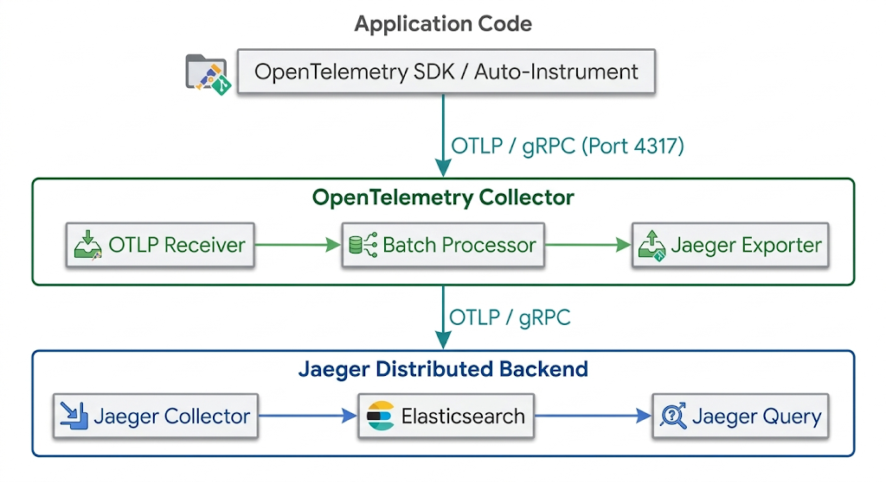
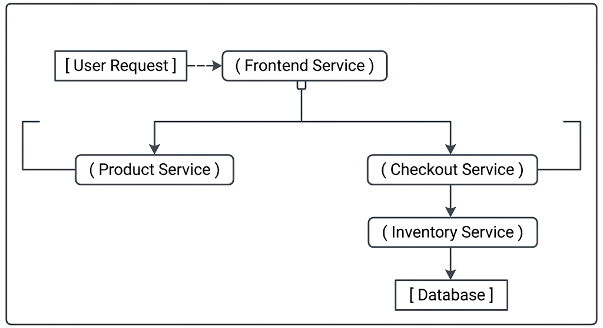

# Chapter 24: Observability, Tracing, & Incident Management

Modern enterprise architectures are increasingly distributed, ephemeral, and complex. Legacy monitoring tools that simply tell you if a server is up or down are no longer sufficient. When a single user request traverses dozens of microservices, service meshes, databases, and third-party APIs, troubleshooting requires deep visibility.

This chapter shifts from traditional monitoring to the concept of **Observability**, introduces **Distributed Tracing** as the critical component for microservices, explores the **OpenTelemetry** standard and **Jaeger**, and concludes with necessary organizational protocols for **Incident Response** and **Post-Mortems**.

## 24.1 The Three Pillars of Observability: Metrics, Logs, and Traces

While "monitoring" tells you that a system is broken, "observability" is the measure of how well you can understand a system's internal state from its external outputs. It allows you to ask "Why?" instead of just "What?".

To achieve observability in an enterprise environment, we rely on three distinct but interconnected data types, known as the "Three Pillars."

### 1. Metrics (What is happening?)

Metrics are numeric measurements recorded over time. They are aggregate data points used to assess the overall health, performance, and resource usage of the system.

* **Characteristics:** Highly compact, efficient to store and query, excellent for dashboarding and alerting.
* **Examples:** CPU usage, memory consumption, HTTP requests per second, error rates, queue depth.
* **Enterprise Tooling:** Prometheus, Grafana, Datadog.

### 2. Logs (Why is it happening in a specific process?)

Logs are structured or unstructured text records of discrete events that occurred within an application or the infrastructure.

* **Characteristics:** Detailed context about a specific execution path, high volume, expensive to index and search, excellent for forensic analysis.
* **Examples:** Application stack traces, kernel panic messages, security access logs, Nginx access logs.
* **Enterprise Tooling:** ELK/EFK Stack (Elasticsearch, Logstash/Fluentd, Kibana), Grafana Loki.

### 3. Traces (Where is it happening in the system?)

Traces follow the path of a single request or transaction as it propagates through a multi-service architecture.

* **Characteristics:** Visualizes dependencies between components, highlights latency bottlenecks, captures context across service boundaries.
* **Examples:** A user request hits a Frontend API Gateway, which calls an Auth Service, which calls a Payment Gateway, which writes to a Postgres Database. The trace connects all these events.
* **Enterprise Tooling:** Jaeger, Tempo, OpenTelemetry.

## 24.2 Distributed Tracing Fundamentals: Spans, Traces, and Context Propagation

Distributed tracing is the specialized capability required to observe microservices. Without it, debugging a latency spike in a complex application is nearly impossible, as each service only logs its local processing time.

### Key Concepts

#### 1. Trace

A trace represents the entire lifecycle of a request or workflow as it moves through a system. A trace has a unique ID (e.g., `Trace ID: a1b2c3d4e5f6478987654321fedcba09`).

#### 2. Span

A span is the fundamental workflow unit of a trace. It represents a discrete action or operation within a single service, with a start and end time. Spans have their own IDs and reference their Parent Span ID.

* **Example Span:** "Processing `/api/v1/orders`" in the Order Service.

#### 3. Span Attributes and Events

Spans can be enriched with detailed metadata:

* **Attributes (Tags):** Key-value pairs used to query traces. Examples: `http.method="POST"`, `http.status_code="500"`, `db.statement="SELECT * FROM users"`, `customer_id="enterprise_1"`.
* **Events (Logs):** Timestamped notes within a span. Examples: "Connecting to database", "Cache miss", "Payment accepted".

#### 4. Trace View (The DAG)

When visualized, a trace forms a Directed Acyclic Graph (DAG) or a timeline view, showing the sequence and nesting of spans. This clearly shows which services were involved and how much time was spent in each.

### Context Propagation

The most critical aspect of distributed tracing is **Context Propagation**. This is the mechanism by which the Trace ID and Parent Span ID are transferred across network boundaries and process threads.

When Service A calls Service B via HTTP, Service A must inject the tracing context (Trace ID, Parent Span ID) into the HTTP headers of the outgoing request. Service B must then extract this context and use it to create its own child spans.

**Common Header Formats:**

* **W3C Trace Context (Standard):** Uses headers like `traceparent` (e.g., `00-4bf92f3577b34da6a3ce929d0e0e4736-00f067aa0ba902b7-01`).
* **B3 (Zipkin Legacy):** Uses headers like `X-B3-TraceId`, `X-B3-SpanId`.

If context propagation fails at any point in the chain, the trace is fragmented, and cross-service visibility is lost.

## 24.3 OpenTelemetry Architecture and Jaeger Collector Deployment

In the past, tracing required proprietary agent installation. Today, the industry has standardized on **OpenTelemetry (OTel)**, a CNCF vendor-neutral standard that provides a single, unified set of APIs, SDKs, and tooling to collect, process, and export telemetry data (metrics, logs, and traces).

### OpenTelemetry Architecture

OTel is not a backend store. It is the ingestion and pipeline infrastructure that sits between your application and your observability storage backends (like Jaeger, Prometheus, or Tempo).



1. **OTel SDK:** Libraries integrated into the application (via code or zero-code auto-instrumentation) to generate spans, metrics, and logs.
2. **OTLP Protocol:** OpenTelemetry Line Protocol, a standardized, high-performance protocol (usually running over gRPC or HTTP/protobuf) for transmitting telemetry data.
3. **OTel Collector:** A vendor-neutral proxy/agent that receives, processes, filters, transforms, and exports telemetry. This decouples application runtime dependencies from storage backends.

### Jaeger Architecture

Jaeger is a widely deployed, open-source distributed tracing backend originally developed at Uber.

* **Jaeger Collector:** Receives traces from OTel Collectors or agents, validates them, and persists them into long-term storage.
* **Jaeger Query:** Fetches traces from persistent storage and serves the REST API for the Jaeger UI.
* **Jaeger UI:** The web interface for trace searching, latency breakdown, and root-cause visualization.
* **Storage Backends:** Production Jaeger deployments rely on persistent databases like **Elasticsearch** or **OpenSearch**. For local development or lightweight testing, in-memory storage is used.

**Enterprise Deployment Considerations:**

1. **Elasticsearch/OpenSearch Backing:** Essential for production Jaeger deployments to support indexing and rapid search across millions of spans.
2. **Sampling Strategies:** Generating and storing 100% of traces in high-throughput enterprise systems creates immense storage and processing overhead. Use OTel Collectors to implement **Head-based Sampling** (sampling at request start) or **Tail-based Sampling** (sampling decisions made after inspecting the full trace, e.g., keep 100% of errors and latencies > 2s, but only 1% of HTTP 200 requests).

## 24.4 Incident Response Protocols, Post-Mortems, and Blameless Culture

The technical capability to trace a bottleneck must be paired with operational protocols to respond to and learn from production incidents.

### Incident Response Protocols

When an automated observability alert triggers, a structured incident response workflow (aligned with SRE and ITIL practices) begins:

**Key Roles:**

1. **Incident Commander (IC):** Holds single-point accountability for directing the response. The IC does not troubleshoot code directly; they focus on coordination, task delegation, and overall triage strategy.
2. **Communications Lead (Comm Lead):** Responsible for maintaining stakeholder updates, customer status pages, and internal executive communications.
3. **Technical Operations / Subject Matter Experts (SMEs):** Engineers actively investigating telemetry, executing playbooks, and performing technical mitigations.

**Response Sequence:**

* **Triage & Declaration:** Assess severity (e.g., P1/SEV1 - Total service outage; P2/SEV2 - Core feature degraded). Assign an IC and establish a dedicated incident bridge/channel.
* **Mitigation (First Priority):** The primary objective during an incident is to **restore service health**, not to fix the underlying root cause. Common mitigation tactics include rolling back recent deployments, toggling feature flags, shedding non-critical load, or scaling horizontally.
* **Resolution:** Applied after service stabilization to permanently fix the underlying technical issue.

### Post-Mortems (Incident Reports)

A Post-Mortem is a formal, retrospective document created after an incident is mitigated. It serves as a structured mechanism for organizational learning.

**Key Sections of an Enterprise Post-Mortem:**

* **Executive Summary:** High-level description of what happened, customer impact, and resolution.
* **Timeline:** Detailed chronological log of events (trigger time, alert detection time, incident declaration, mitigation steps, final resolution).
* **Root Cause Analysis (RCA):** Systematic investigation into the systemic failure (utilizing tools like the "5 Whys" methodology).
* **Action Items (Preventative Remediation):** Concrete, prioritized tasks assigned to engineering owners with strict completion dates to ensure the failure mode cannot recur.

### Blameless Culture

The core foundation of modern Site Reliability Engineering (SRE) incident management is a **Blameless Culture**.

Post-mortems must focus strictly on system flaws rather than human errors. Assigning personal fault causes engineers to hide mistakes, delaying incident detection and inhibiting organizational learning.

**Core Tenets:**

1. **Assume Good Intent:** Engineers make decisions based on the best information available to them at the time.
2. **Design Resilient Systems:** If a single human mistake (e.g., a typo in a CLI command) causes a production outage, the failure belongs to the system safety design, lack of automated validation guards, or deployment controls—not the engineer.
3. **Shift Focus from "Who" to "How" and "Why":** Replace "Who ran the script?" with "Why was the script executed without pre-flight validation?" and "How can our deployment pipelines automatically detect invalid configurations?".

## 24.5 Hands-On Lab: End-to-End Distributed Tracing Analysis for Microservice Bottlenecks

### Lab Overview

In this lab, you will troubleshoot a multi-tier microservice architecture experiencing severe latency issues during user requests.

**Target Architecture:**

* **Frontend Service (Python/Flask):** Exposes public HTTP endpoints.
* **Product Service (Python/Flask):** Returns product catalog details.
* **Inventory Service (Python/Flask):** Checks product stock levels against a backend database.
* **Checkout Service (Python/Flask):** Handles payment processing workflows.
* **OpenTelemetry Auto-Instrumentation:** Injects context headers and extracts span data.
* **Jaeger Server:** Collects OTLP spans and visualizes traces.



### Step 1: Lab Environment Setup

1. Create a project workspace directory:
```bash
mkdir -p ~/tracing-lab && cd ~/tracing-lab
```


2. Create a unified `docker-compose.yml` defining the observability stack and microservices:

```yaml
version: '3.8'

services:
  # Jaeger Backend with integrated OTLP Receiver
  jaeger:
    image: jaegertracing/all-in-one:1.50
    container_name: jaeger
    ports:
      - "16686:16686" # Jaeger Web UI
      - "4317:4317"   # OTLP gRPC receiver
      - "4318:4318"   # OTLP HTTP receiver
    environment:
      - COLLECTOR_OTLP_ENABLED=true
    networks:
      - obs-net

  # Product Service
  product-service:
    image: python:3.10-slim
    container_name: product-service
    volumes:
      - ./services:/app
    working_dir: /app
    command: >
      sh -c "pip install flask opentelemetry-sdk opentelemetry-api opentelemetry-exporter-otlp opentelemetry-instrumentation-flask requests &&
             opentelemetry-instrument --traces_exporter otlp_proto_grpc --exporter_otlp_endpoint http://jaeger:4317 --service_name product-service python product.py"
    networks:
      - obs-net

  # Inventory Service (Contains Latency Issue)
  inventory-service:
    image: python:3.10-slim
    container_name: inventory-service
    volumes:
      - ./services:/app
    working_dir: /app
    command: >
      sh -c "pip install flask opentelemetry-sdk opentelemetry-api opentelemetry-exporter-otlp opentelemetry-instrumentation-flask requests &&
             opentelemetry-instrument --traces_exporter otlp_proto_grpc --exporter_otlp_endpoint http://jaeger:4317 --service_name inventory-service python inventory.py"
    networks:
      - obs-net

  # Checkout Service
  checkout-service:
    image: python:3.10-slim
    container_name: checkout-service
    volumes:
      - ./services:/app
    working_dir: /app
    command: >
      sh -c "pip install flask opentelemetry-sdk opentelemetry-api opentelemetry-exporter-otlp opentelemetry-instrumentation-flask opentelemetry-instrumentation-requests requests &&
             opentelemetry-instrument --traces_exporter otlp_proto_grpc --exporter_otlp_endpoint http://jaeger:4317 --service_name checkout-service python checkout.py"
    networks:
      - obs-net

  # Frontend Service
  frontend-service:
    image: python:3.10-slim
    container_name: frontend-service
    ports:
      - "5000:5000"
    volumes:
      - ./services:/app
    working_dir: /app
    command: >
      sh -c "pip install flask opentelemetry-sdk opentelemetry-api opentelemetry-exporter-otlp opentelemetry-instrumentation-flask opentelemetry-instrumentation-requests requests &&
             opentelemetry-instrument --traces_exporter otlp_proto_grpc --exporter_otlp_endpoint http://jaeger:4317 --service_name frontend-service python frontend.py"
    networks:
      - obs-net

networks:
  obs-net:
    driver: bridge
```

3. Create the service code directory:

```bash
mkdir -p services

```


4. Create `services/frontend.py`:

```python
import os
import requests
from flask import Flask, request, jsonify

app = Flask(__name__)

PRODUCT_URL = os.getenv("PRODUCT_URL", "http://product-service:5001")
CHECKOUT_URL = os.getenv("CHECKOUT_URL", "http://checkout-service:5002")

@app.route("/api/v1/purchase", methods=["POST"])
def purchase():
    data = request.get_json() or {}
    item_id = data.get("item_id", "item_default")

    # Call Product Service
    prod_resp = requests.get(f"{PRODUCT_URL}/product/{item_id}")

    # Call Checkout Service
    checkout_resp = requests.post(f"{CHECKOUT_URL}/checkout", json={"item_id": item_id})

    return jsonify({
        "status": "completed",
        "product": prod_resp.json(),
        "checkout": checkout_resp.json()
    }), 200

if __name__ == "__main__":
    app.run(host="0.0.0.0", port=5000)
```

5. Create `services/product.py`:

```python
from flask import Flask, jsonify

app = Flask(__name__)

@app.route("/product/<item_id>", methods=["GET"])
def get_product(item_id):
    return jsonify({"item_id": item_id, "name": "Enterprise Workstation", "price": 2400.00})

if __name__ == "__main__":
    app.run(host="0.0.0.0", port=5001)
```


6. Create `services/checkout.py`:

```python
import os
import requests
from flask import Flask, request, jsonify

app = Flask(__name__)

INVENTORY_URL = os.getenv("INVENTORY_URL", "http://inventory-service:5003")

@app.route("/checkout", methods=["POST"])
def checkout():
    data = request.get_json() or {}
    item_id = data.get("item_id", "item_default")

    # Query inventory before completing transaction
    inv_resp = requests.get(f"{INVENTORY_URL}/inventory/{item_id}")

    return jsonify({
        "transaction_id": "tx_998877",
        "inventory_status": inv_resp.json()
    })

if __name__ == "__main__":
    app.run(host="0.0.0.0", port=5002)
```


7. Create `services/inventory.py`:

```python
import time
from flask import Flask, jsonify

app = Flask(__name__)

@app.route("/inventory/<item_id>", methods=["GET"])
def check_inventory(item_id):
    # Simulate an unindexed database query delay for specific items
    if item_id == "slow_item":
        time.sleep(2.8)  # Bottleneck injection
    else:
        time.sleep(0.05)

    return jsonify({"item_id": item_id, "in_stock": True, "quantity": 42})

if __name__ == "__main__":
    app.run(host="0.0.0.0", port=5003)
```

### Step 2: Provision the Stack & Generate Traffic

1. Launch all containers in detached mode:

```bash
docker-compose up -d
```

2. Monitor container startup until all services are healthy:

```bash
docker-compose ps
```


3. Execute a normal, low-latency API transaction:

```bash
curl -X POST http://localhost:5000/api/v1/purchase \
     -H "Content-Type: application/json" \
     -d '{"item_id": "standard_laptop"}'
```

*Expected Output:* Sub-second response time.

4. Execute a transaction containing the simulated database bottleneck:

```bash
curl -X POST http://localhost:5000/api/v1/purchase \
     -H "Content-Type: application/json" \
     -d '{"item_id": "slow_item"}'
```


*Expected Output:* The HTTP client blocks for ~3 seconds before receiving the HTTP 200 response.

### Step 3: Distributed Tracing Analysis in Jaeger UI

1. Open your browser and navigate to `http://localhost:16686`.

2. In the Jaeger UI left panel:

* **Service:** Select `frontend-service`.

* **Operation:** Select `POST /api/v1/purchase`.

* Click **Find Traces**.


3. Locate the two traces displayed in the search results:

* Trace 1: Duration ~60ms - 100ms.

* Trace 2: Duration ~2.85s - 3.00s.

4. Click on the slow trace (~3.00s duration) to open the **Timeline Span View**.

5. Inspect the parent-child span hierarchy:

* Root Span: `frontend-service: POST /api/v1/purchase` (Duration: 2.89s)

* Child Span 1: `product-service: GET /product/slow_item` (Duration: ~12ms)

* Child Span 2: `checkout-service: POST /checkout` (Duration: 2.85s)

* Grandchild Span: `inventory-service: GET /inventory/slow_item` (Duration: 2.82s)

```
--------------------------------------------------------------------------------
Service / Operation                        Timeline (0s -------- 1.5s -------- 3.0s)
--------------------------------------------------------------------------------
frontend-service: POST /api/v1/purchase    |===================================| (2.89s)
  product-service: GET /product/...        |=                                  | (12ms)
  checkout-service: POST /checkout         |  =================================| (2.85s)
    inventory-service: GET /inventory/...  |    ===============================| (2.82s)
--------------------------------------------------------------------------------
```

6. Click directly on the `inventory-service` span to expand its attributes panel.

* Observe standard OpenTelemetry HTTP tags automatically populated by instrumentation:

* `http.status_code`: `200`

* `http.target`: `/inventory/slow_item`

* `http.method`: `GET`


* Notice that while `frontend-service` and `checkout-service` completed successfully, the bulk of execution time was consumed within `inventory-service`.

### Step 4: Verification of W3C Context Propagation Headers

1. Inspect the logs of `checkout-service` to confirm auto-instrumentation injected and extracted W3C headers across network boundaries:

```bash
docker-compose logs checkout-service
```


2. Observe how OpenTelemetry automatically attached the `traceparent` HTTP header to outgoing requests made via the Python `requests` library.

3. Identify the structure of a W3C `traceparent` header during inter-service calls:

```text
traceparent: 00-4bf92f3577b34da6a3ce929d0e0e4736-00f067aa0ba902b7-01
             |  |                                |                |
             |  +--> Trace ID                    +--> Parent Span +--> Trace Flags
             +-----> Version                          ID               (01 = Sampled)
```

### Step 5: Post-Mortem Remediation Simulation

Having pinpointed `inventory-service` as the bottleneck via Jaeger, simulate applying an emergency performance optimization:

1. Edit `services/inventory.py` to fix the delay:

```python
import time
from flask import Flask, jsonify

app = Flask(__name__)

@app.route("/inventory/<item_id>", methods=["GET"])
def check_inventory(item_id):
    # Database query optimization applied (Index created)
    time.sleep(0.02)  # Reduced processing latency
    return jsonify({"item_id": item_id, "in_stock": True, "quantity": 42})

if __name__ == "__main__":
    app.run(host="0.0.0.0", port=5003)
```


2. Restart the updated service container:

```bash
docker-compose restart inventory-service
```


3. Re-run the request:

```bash
curl -X POST http://localhost:5000/api/v1/purchase \
     -H "Content-Type: application/json" \
     -d '{"item_id": "slow_item"}'
```


4. Refresh the Jaeger UI. Verify that the trace duration for `/api/v1/purchase` with `slow_item` drops from **~2.89 seconds** down to **~35 milliseconds**.
5. Clean up the lab environment:

```bash
docker-compose down -v
```

### Lab Summary

In this lab, you successfully:

1. Deployed a distributed Python microservice application instrumented with OpenTelemetry.

2. Exported trace spans via OTLP/gRPC to a Jaeger distributed backend.

3. Utilized Jaeger's timeline DAG visualization to isolate a latency bottleneck across service boundaries.

4. Analyzed context propagation headers (`traceparent`) linking HTTP client/server spans.
5. Validated performance remediation using observability metrics and trace verification.
