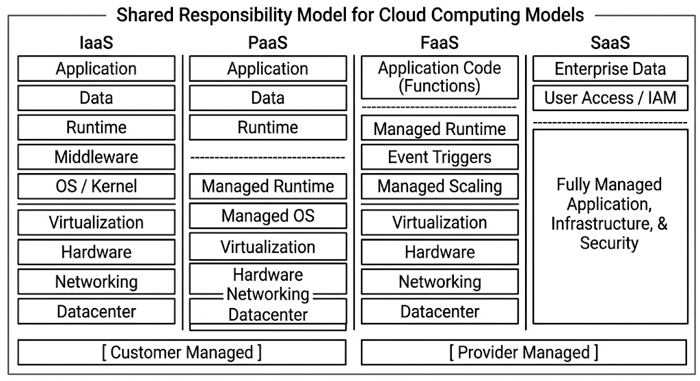
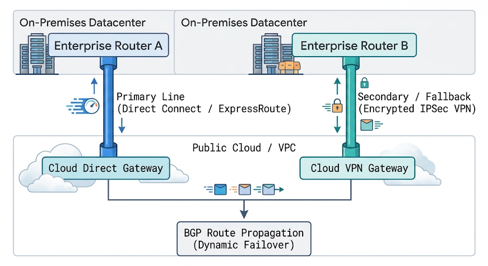
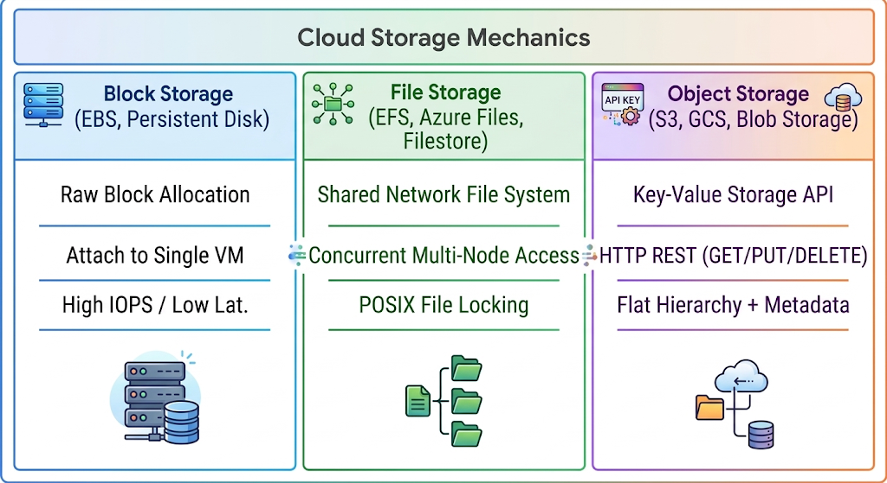
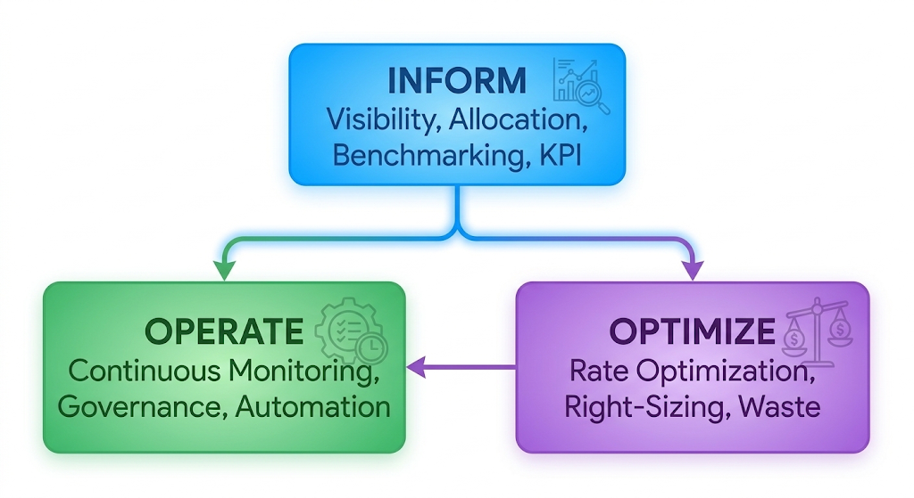

# Chapter 25: Multi-Cloud Architectures & Service Models

Modern enterprise infrastructure has evolved beyond single-datacenter or single-cloud footprints. Organizations increasingly adopt multi-cloud and hybrid cloud deployment models to avoid vendor lock-in, ensure strict data sovereignty compliance, optimize infrastructure costs, and leverage best-of-breed specialized services from different cloud providers.

This chapter covers the core mechanics of cloud service models, the network and security design patterns behind hybrid interconnects, storage tiering strategies, FinOps practices, and a hands-on lab demonstrating multi-provider infrastructure orchestration.

## 25.1 Cloud Computing Models: IaaS, PaaS, SaaS, and FaaS

Understanding the division of responsibility between the enterprise and the cloud service provider (CSP) is essential for architectural governance, operational efficiency, and security compliance.

### The Shared Responsibility Model



### 1. Infrastructure as a Service (IaaS)

IaaS provides raw, virtualized computing resources (virtual machines, block storage, software-defined networks, and firewalls) over the internet.

* **Customer Scope:** Operating system installation, patching, runtime configuration, network security rules, middleware, and application code.

* **Provider Scope:** Hypervisor execution, physical hardware, rack power/cooling, and physical network infrastructure.

* **Enterprise Use Case:** Legacy workload migration ("lift-and-shift"), custom kernel-level performance tuning, and strict compliance environments requiring direct OS control.

* **Examples:** AWS EC2, Google Compute Engine (GCE), Azure VMs, OpenStack.

### 2. Platform as a Service (PaaS)

PaaS abstracts away underlying virtual machines, operating systems, and runtime management, providing a managed platform where developers deploy code without managing infrastructure.

* **Customer Scope:** Application code, environment variables, dependencies, and database schemas.

* **Provider Scope:** OS provisioning and patching, runtime maintenance (e.g., Node.js, Python, Java runtime updates), container orchestration, and underlying scaling infrastructure.

* **Enterprise Use Case:** Rapid development velocity, standardized runtime environments, reducing sysadmin overhead for web applications.

* **Examples:** AWS Elastic Beanstalk, Red Hat OpenShift, Google App Engine, Heroku.

### 3. Function as a Service (FaaS / Serverless)

FaaS executes code in short-lived, event-driven containers that are spun up dynamically per request and immediately destroyed upon execution completion.

* **Customer Scope:** Individual function logic, event trigger definitions, execution timeout configurations, and memory allocation settings.

* **Provider Scope:** Complete infrastructure, zero-to-N autoscaling, request routing, execution environment initialization, and concurrency limits.

* **Enterprise Use Case:** Asynchronous background job processing, webhooks, real-time file processing, microservice event routing.

* **Examples:** AWS Lambda, Google Cloud Functions, Azure Functions, OpenFaaS.

### 4. Software as a Service (SaaS)

SaaS delivers complete, fully managed applications directly to end consumers or enterprise users via web browsers or APIs.

* **Customer Scope:** User access management (IAM/SSO), data classification, and application-level configuration settings.

* **Provider Scope:** End-to-end management of software code, database engines, infrastructure, security patching, and uptime SLAs.

* **Examples:** Salesforce, Microsoft 365, Google Workspace, GitHub Enterprise SaaS.

## 25.2 Hybrid Cloud and Multi-Cloud Interconnect Design

Connecting on-premises datacenters to public cloud providers—or establishing direct links between different cloud platforms—requires dedicated, high-availability network topologies.

### Interconnect Options Comparison

| Interconnect Type | Latency | Bandwidth / Throughput | Reliability / SLA | Cost Profile |
| --- | --- | --- | --- | --- |
| **Site-to-Site IPsec VPN** | Variable (Internet-bound) | Up to 1–10 Gbps (Bonded) | Best Effort (No network SLA) | Low (Uses existing internet bandwidth) |
| **Direct Dedicated Connection** | Low & Deterministic (<5ms) | 1 Gbps to 100 Gbps | High (Enterprise SLA) | High (Fixed port fees + circuit provisioning) |
| **Cloud Exchange / Multi-Cloud Hub** | Low (<10ms between clouds) | Flexible (100 Mbps to 10 Gbps) | High (Layer 2/3 Provider SLA) | Moderate to High (Usage/Bandwidth based) |

### Enterprise Hybrid Topology: Direct Interconnect with IPsec VPN Backup

For enterprise-critical operations, a single network line is a single point of failure (SPOF). Production hybrid architecture utilizes a high-bandwidth Dedicated Connection as the primary pipeline, with an encrypted IPsec VPN tunnel acting as an automated fallback mechanism over the public internet.



### BGP Routing & Dynamic Failover

To achieve seamless automated traffic rerouting during a transport failure, enterprise routers establish **Border Gateway Protocol (BGP)** sessions with cloud gateways:

* **Primary Path:** Configured with higher **BGP Local Preference** (or lower **MED - Multi-Exit Discriminator**) over the Dedicated Circuit.
* **Secondary Path:** Configured over the IPsec tunnel. If the primary BGP session drops, routes automatically update within seconds without manual intervention.

---

## 25.3 Cloud Storage Architecture: Object, Block, and File Storage Mechanics

Choosing the correct storage architecture impacts system throughput, access patterns, application refactoring effort, and ongoing monthly spend.



### 1. Block Storage

Block storage exposes raw, unformatted storage volumes to compute instances, behaving like local physical hard drives or SAN (Storage Area Network) arrays.

* **Protocol / Interface:** NVMe, iSCSI, proprietary hypervisor volume drivers.

* **Access Pattern:** High-performance, low-latency random read/write operations. Volumes are formatted with filesystems (e.g., `ext4`, `xfs`) by the instance OS.

* **Use Cases:** Relational Database management systems (PostgreSQL, MySQL), transactional log stores, OS boot disks.

* **Examples:** AWS EBS, Google Cloud Persistent Disk, Azure Managed Disks.

### 2. File Storage

File storage provides network-attached filesystem capabilities accessible simultaneously across multiple compute nodes.

* **Protocol / Interface:** NFSv3/NFSv4, SMB/CIFS.

**Access Pattern:** Hierarchical tree directory structure supporting POSIX file permissions, concurrent multi-writer support, and file locking mechanisms.

* **Use Cases:** Shared application assets, enterprise content management, shared configuration hubs, legacy enterprise applications requiring shared filesystems.

* **Examples:** AWS EFS, Google Cloud Filestore, Azure Files.

### 3. Object Storage

Object storage manages data as discrete, independent objects within flat namespace buckets, accessible over HTTP REST APIs rather than standard block or filesystem drivers.

* **Protocol / Interface:** HTTP/HTTPS REST APIs (S3 API standard).

* **Access Pattern:** Write-once-read-many (WORM) access, unstructured data stores. Each object consists of raw data, a unique key, and arbitrary custom metadata tags.

* **Use Cases:** Data lakes, backup archives, static asset distribution, media hosting, log storage.

* **Examples:** AWS S3, Google Cloud Storage, Ceph RADOS Gateway, MinIO.

### Object Lifecycle Management

To control cost growth in object storage, lifecycle rules automate data transitions between performance and archive storage classes based on access frequency or age:

1. **Standard Hot Storage:** High availability, immediate access, standard pricing per GB (e.g., Active application uploads).

2. **Infrequent Access (Cool):** Lower storage cost, small retrieval fee per GB, milliseconds access time (e.g., Logs > 30 days old).

3. **Cold Archive (Glacier / Deep Archive):** Extremely low storage cost per GB, retrieval time takes minutes to hours (e.g., Compliance backups > 90 days old).

---

## 25.4 Cost Optimization, FinOps, and Resource Management Strategies

**FinOps** (Cloud Financial Operations) is an operational framework that brings financial accountability to the variable spend model of cloud computing. It combines engineering, finance, and technology practices to optimize infrastructure costs without sacrificing system agility or scale.



### Core FinOps Phases

1. **Inform:** Establish full visibility into cloud costs. Implement tag-based cost allocation (e.g., `CostCenter`, `Owner`, `Environment`, `Project`) to attribute every cloud dollar directly to engineering teams or business units.

2. **Optimize:** Identify cost-saving opportunities through right-sizing, terminating idle resources, reserving capacity, and leveraging spot instances.

3. **Operate:** Continuously monitor cost metrics, enforce automated budget alerts, integrate cost checks into CI/CD deployment pipelines, and establish governance policies.

### Resource Optimization Strategies

#### 1. Compute Right-Sizing

Continuously track CPU utilization, memory consumption, disk IOPS, and network I/O across compute fleets. Scale down over-provisioned instances (e.g., changing an instance with continuous 5% average CPU utilization from `m5.2xlarge` to `m5.large`).

#### 2. Pricing Architecture Selection

* **On-Demand / Pay-As-You-Go:** No commitment, highest hourly rate. Best for unpredictable workloads, temporary testing, or initial development.

* **Reserved Instances / Savings Plans:** 1-year or 3-year commitment to a specific volume of compute usage in exchange for up to 60–72% cost reductions compared to On-Demand rates. Ideal for baseline production capacity.

* **Spot / Preemptible Instances:** Bidding on unused cloud capacity at discounts up to 80–90%. The cloud provider can reclaim these instances with short notice (e.g., 30–120 seconds). Ideal for stateless, fault-tolerant workloads, batch processing, and Kubernetes worker nodes running non-critical tasks.

#### 3. Storage Garbage Collection & Automated Pruning

* Identify and delete orphaned Block Storage volumes (e.g., EBS volumes left behind after VM termination).

* Delete obsolete snapshot trees and stale container image tags in container registries.

* Enforce S3 non-current object version expiration rules for buckets with object versioning enabled.

## 25.5 Hands-On Lab: Orchestrating Infrastructure Deployments Across Hybrid Cloud Interfaces

### Lab Overview

In this lab, you will orchestrate a multi-provider infrastructure scenario using **Terraform/OpenTofu** alongside **MinIO** (simulating an on-premises enterprise object storage server) and **AWS S3** (representing public cloud storage). You will deploy unified, cross-cloud infrastructure components, configure automated cross-provider object replication, and apply tag-based FinOps governance.

```
+-----------------------------------------------------------------------------------+
|                               Local Host Terminal                                 |
|                                        |                                          |
|                         [ Terraform / OpenTofu Plan ]                             |
|                                        |                                          |
|              +-------------------------+-------------------------+                |
|              |                                                   |                |
v              v                                                   v                v
+------------------------------------+               +------------------------------+
|     On-Premises / Local Layer      |               |     Public Cloud (AWS S3)    |
|  +------------------------------+  |               |  +------------------------+  |
|  | MinIO Storage Server         |  | S3 API Sync   |  | Production Cloud       |  |
|  | (Port 9000 / 9001)           |==|==============>|  | Offsite Backup Bucket  |  |
|  | Bucket: local-datacenter-data|  | (Cross-Cloud) |  | Bucket: cloud-backup-..|  |
|  +------------------------------+  |               |  +------------------------+  |
+------------------------------------+               +------------------------------+

```

### Step 1: Environment Setup & Local MinIO Deployment

1. Create a workspace directory for the multi-cloud project:

```bash
mkdir -p ~/multicloud-lab && cd ~/multicloud-lab
```


2. Deploy a local MinIO container to simulate an on-premises enterprise S3-compatible storage cluster:

```bash
docker run -d \
  --name minio-onprem \
  -p 9000:9000 \
  -p 9001:9001 \
  -e "MINIO_ROOT_USER=enterprise_admin" \
  -e "MINIO_ROOT_PASSWORD=EnterpriseSecurePassword123!" \
  minio/minio server /data --console-address ":9001"
```

3. Verify that the MinIO server is running:

```bash
docker ps -f name=minio-onprem
```

### Step 2: Define Multi-Provider Infrastructure Code

1. Create `providers.tf` to define both the MinIO provider (on-premises interface) and the AWS provider (public cloud interface):

```hcl
terraform {
  required_version = ">= 1.5.0"
  required_providers {
    minio = {
      source  = "aminueza/minio"
      version = "~> 1.10.0"
    }
    aws = {
      source  = "hashicorp/aws"
      version = "~> 5.0"
    }
  }
}

# On-Premises Provider Interface (MinIO)
provider "minio" {
  minio_server   = "localhost:9000"
  minio_user     = "enterprise_admin"
  minio_password = "EnterpriseSecurePassword123!"
  minio_ssl      = false
}

# Public Cloud Provider Interface (AWS S3 / Localstack / Simulated AWS)
provider "aws" {
  region                      = "us-east-1"
  skip_credentials_validation = true
  skip_requesting_account_id  = true
  skip_metadata_api_check     = true

  # Utilizing mock endpoint if running without direct AWS access key
  endpoints {
    s3 = "http://localhost:9000" # Mapping to local endpoint for standalone execution
  }
}
```


2. Create `main.tf` to define the storage buckets across both environments, including lifecycle policies and governance tags:

```hcl
# --------------------------------------------------
# ON-PREMISES INFRASTRUCTURE: Primary Data Ingestion
# --------------------------------------------------
resource "minio_s3_bucket" "onprem_primary" {
  bucket = "datacenter-primary-ingest"
  acl    = "private"
}

# --------------------------------------------------
# PUBLIC CLOUD INFRASTRUCTURE: Offsite Archive
# --------------------------------------------------
resource "aws_s3_bucket" "cloud_archive" {
  bucket        = "enterprise-offsite-archive-bucket"
  force_destroy = true

  tags = {
    Environment = "Production"
    CostCenter  = "CC-7782-STORAGE"
    Owner       = "DataOps-Team"
    FinOpsPolicy = "AutoArchive-Standard"
  }
}
# FinOps Governance: Lifecycle configuration for Public Cloud Bucket
resource "aws_s3_bucket_lifecycle_configuration" "archive_lifecycle" {
  bucket = aws_s3_bucket.cloud_archive.id

  rule {
    id     = "transition-old-logs-to-glacier"
    status = "Enabled"

    filter {
      prefix = "logs/"
    }

    transition {
      days          = 30
      storage_class = "GLACIER"
    }

    expiration {
      days = 365
    }
  }
}
```

### Step 3: Initialize and Provision Cross-Cloud Infrastructure

1. Initialize the Terraform workspace and download required provider plugins:

```bash
terraform init
```


2. Review the execution plan to verify the resources that will be created across both provider interfaces:

```bash
terraform plan
```


3. Apply the configuration to provision the multi-cloud storage infrastructure:

```bash
terraform apply -auto-approve
```


*Expected Output Snippet:*

```text
Apply complete! Resources: 3 added, 0 changed, 0 destroyed.
```

### Step 4: Configure & Test Hybrid Object Synchronization Script

1. Install the MinIO Client (`mc`) CLI utility or use Docker to execute synchronization between local on-premises buckets and public cloud targets:

```bash
# Set alias for local MinIO on-premises cluster
docker exec -it minio-onprem mc alias set onprem http://localhost:9000 enterprise_admin EnterpriseSecurePassword123!
```


2. Create a dummy sample payload representing enterprise log files:

```bash
mkdir -p /tmp/hybrid-data
echo "TIMESTAMP,EVENT,USER_ID" > /tmp/hybrid-data/audit_log.csv
echo "2026-10-04T12:00:00Z,LOGIN_SUCCESS,usr_99182" >> /tmp/hybrid-data/audit_log.csv
```

3. Upload the data payload into the local on-premises primary bucket:

```bash
docker exec -i minio-onprem mc cp - onprem/datacenter-primary-ingest/logs/audit_log.csv < /tmp/hybrid-data/audit_log.csv
```

4. Execute a dry-run cross-cloud synchronization from the on-premises bucket to the archive bucket:

```bash
docker exec -it minio-onprem mc mirror --dry-run onprem/datacenter-primary-ingest onprem/enterprise-offsite-archive-bucket
```

5. Execute the actual cross-cloud synchronization:

```bash
docker exec -it minio-onprem mc mirror onprem/datacenter-primary-ingest onprem/enterprise-offsite-archive-bucket
```

6. Verify the contents of the public cloud archive target bucket:

```bash
docker exec -it minio-onprem mc ls onprem/enterprise-offsite-archive-bucket/logs/
```

### Step 5: FinOps Compliance & Tag Audit Verification

1. Inspect the local Terraform state file to audit resource tags for FinOps compliance tracking:

```bash
terraform show | grep -A 8 "tags"
```


2. Verify that all public cloud resources have required metadata tags (`Environment`, `CostCenter`, `Owner`) assigned to ensure cost attribution:

```text
tags = {
    "CostCenter"   = "CC-7782-STORAGE"
    "Environment"  = "Production"
    "FinOpsPolicy" = "AutoArchive-Standard"
    "Owner"        = "DataOps-Team"
}
```

3. Clean up the lab environment:

```bash
terraform destroy -auto-approve
docker stop minio-onprem && docker rm minio-onprem
rm -rf /tmp/hybrid-data ~/multicloud-lab
```

### Lab Summary

In this lab, you successfully:

1. Deployed an on-premises S3-compatible storage cluster using MinIO alongside public cloud abstractions via Terraform.
2. Configured cross-provider Infrastructure-as-Code definitions isolating local ingest buckets from public cloud archive buckets.
3. Enforced FinOps governance by applying cost-allocation tagging and lifecycle rules for automated storage tiering.
4. Executed cross-cloud data replication protocols simulating a hybrid cloud disaster recovery and archiving topology.
