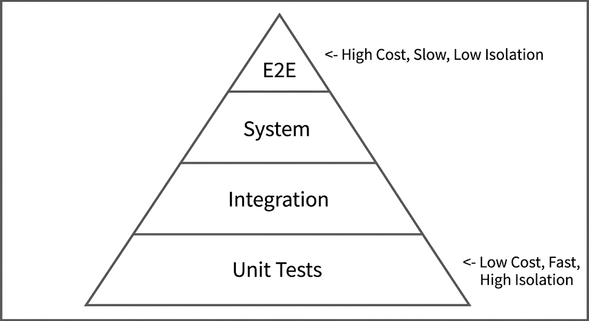

# Chapter 26: Continuous Testing Frameworks

Modern enterprise continuous integration and continuous delivery (CI/CD) pipelines rely on automated continuous testing to maintain high software deployment velocity while mitigating operational risk. Without robust automated quality gates, rapid deployments increase the probability of severe production outages, security vulnerabilities, and performance degradation.

This chapter explores the architectural mechanics of continuous testing, from the traditional testing pyramid to automated pipeline smoke/acceptance checks, performance testing tools (k6, Locust), test design paradigms (TDD/BDD), and a hands-on laboratory integrating performance quality gates directly into a modern pipeline workflow.

## 26.1 The Automated Testing Pyramid: Unit, Integration, System, and End-to-End

The **Automated Testing Pyramid** provides a structural model for balancing test velocity, execution cost, operational reliability, and isolation depth across software release cycles.



### 1. Unit Testing

Unit tests isolate individual procedures, methods, functions, or modules from external dependencies (such as databases, remote network sockets, message queues, or third-party APIs).

*   **Scope:** Function and method logic validation.
*   **Dependencies:** Completely mocked or stubbed out using mock objects, stubs, or test doubles.
*   **Pipeline Stage:** Triggered during the initial `compile` or `build` phase on every pull request or git push.
*   **Execution Time:** Milliseconds to seconds.
*   **Target Coverage:** High (80%+ code line/branch coverage).

### 2. Integration Testing
Integration tests evaluate interactions between combined modules or external sub-systems (e.g., verifying that an ORM repository executes correct SQL queries against an isolated database instance or container).

*   **Scope:** Module-to-module communication, database interactions, messaging brokers, storage adapters.
*   **Dependencies:** Real lightweight instances, often provisioned dynamically using ephemeral containers (e.g., Testcontainers or Docker Compose).
*   **Pipeline Stage:** Run during post-build validation before artifact publishing.
*   **Execution Time:** Seconds to minutes.

### 3. System Testing
System testing validates the completely assembled application in an integrated environment to ensure it adheres to specified business requirements.

*   **Scope:** End-to-end application lifecycle within simulated target platforms.
*   **Dependencies:** Fully deployed application stack, including microservice backends, caches, and dependent service mocks.
*   **Pipeline Stage:** Executed in staging or pre-production deployment environments.
*   **Execution Time:** Minutes.

### 4. End-to-End (E2E) & User Interface Testing
E2E tests simulate authentic user interactions across the entire system layer—including front-end web browser interfaces, API gateways, databases, and background async queue workers.

*   **Scope:** Business workflows (e.g., user registration, cart checkout, payment processing).
*   **Tools:** Playwright, Cypress, Selenium.
*   **Pipeline Stage:** Executed scheduled nightly or as part of pre-release staging candidate validation.
*   **Execution Time:** Minutes to hours.

### Strategic Test Pyramid Metrics Comparison

| Test Layer | Execution Velocity | Maintenance Overhead | Determinism / Flakiness | Infrastructure Cost |
| :--- | :--- | :--- | :--- | :--- |
| **Unit** | Extremely Fast (<100ms) | Low | High (Non-Flaky) | Near Zero |
| **Integration** | Fast (1s - 30s) | Moderate | High | Low (Ephemeral Containers) |
| **System** | Moderate (1m - 5m) | High | Moderate | Moderate (Staging Envs) |
| **E2E / UI** | Slow (5m - 60m+) | Very High | Low (Higher Flakiness) | High (Full Enterprise Stack) |

## 26.2 Automated Acceptance and Smoke Testing in Pipelines

Deploying build artifacts to target environments without rapid verification risks breaking live staging or production services. Smoke tests and acceptance tests act as deployment firewalls.

```
+------------------+     +-------------------+     +---------------------+     +--------------------+
| Artifact Build   | --> | Deploy to Staging | --> | Run Smoke Suite     | --> | Run Acceptance     |
| & Unit Passing   |     | Target            |     | (Pass: Health Check)|     | Regression Suite   |
+------------------+     +-------------------+     +---------------------+     +--------------------+
| (Fail)                    | (Fail)
v                           v
+------------------------------------------------+
| Automated Pipeline Abort & Instant Rollback    |
+------------------------------------------------+
```

### Smoke Testing Mechanics
Smoke tests ("Sanity Checks") consist of a small set of fast, non-destructive tests designed to verify that the core functionality of a newly deployed environment is stable before executing deeper regression suites.

*   **Objective:** Confirm that services respond over network interfaces, basic routes exist, databases are reachable, and primary API endpoints return HTTP 200/201 series status codes.
*   **Execution Duration:** < 30 seconds.
*   **Action on Failure:** Immediate, automated pipeline termination and deployment rollback.

#### Example: Shell-based Pipeline Smoke Test (`smoke_test.sh`)
```bash
#!/usr/bin/env bash
set -euo pipefail

TARGET_URL="${1:-http://localhost:8080}"
MAX_RETRIES=5
RETRY_INTERVAL=3

echo "[INFO] Commencing Smoke Test against ${TARGET_URL}"

for ((i=1; i<=MAX_RETRIES; i++)); do
    HTTP_STATUS=$(curl -s -o /dev/null -w "%{http_code}" "${TARGET_URL}/health" || true)
    if [ "${HTTP_STATUS}" -eq 200 ]; then
        echo "[SUCCESS] Health check passed (HTTP 200)."
        exit 0
    fi
    echo "[WARN] Health check attempt ${i} returned ${HTTP_STATUS}. Retrying in ${RETRY_INTERVAL}s..."
    sleep "${RETRY_INTERVAL}"
done

echo "[FATAL] Smoke Test Failed: Target environment unavailable or unhealthy."
exit 1

```

### User Acceptance Testing (UAT)

Acceptance tests verify that software meets user specifications and business requirements. In continuous delivery pipelines, acceptance tests are fully automated using framework tooling (e.g., Cucumber, Behave, Robot Framework) or programmatic API suites.

## 26.3 Load and Stress Performance Testing Frameworks (k6, Locust)

Evaluating system response times, throughput (RPS), and failure boundaries under expected or extreme traffic load is critical for preventing enterprise system outages during traffic spikes.

### Performance Testing Concepts

* **Load Testing:** Assessing system performance under expected peak operational loads.
* **Stress Testing:** Pushing the system beyond normal load thresholds to determine maximum limits and observe how gracefully system recovery occurs.
* **Spike Testing:** Injecting sudden, extreme increases in traffic to evaluate autoscaling latency and circuit breaker behavior.

### k6 Framework (Developer-Centric & Modern Scripting)

**k6** is a developer-centric, high-performance load testing engine written in Go and scripted in JavaScript (ES6).

* **Key Advantage:** Native CLI integration, ultra-low memory usage, seamless Git/CI pipeline execution, embedded assertion support via thresholds.

#### Example k6 Performance Test (`k6_load_test.js`)

```javascript
import http from 'k6/http';
import { check, sleep } from 'k6';

export const options = {
  stages: [
    { duration: '10s', target: 20 }, // Ramp-up to 20 virtual users
    { duration: '20s', target: 20 }, // Sustained load
    { duration: '5s', target: 0 },   // Ramp-down
  ],
  thresholds: {
    http_req_duration: ['p(95)<200'], // 95% of requests must complete under 200ms
    http_req_failed: ['rate<0.01'],   // Error rate must be less than 1%
  },
};

export default function () {
  const res = http.get('http://localhost:8080/api/v1/resource');
  check(res, {
    'status is 200': (r) => r.status === 200,
    'response time < 200ms': (r) => r.timings.duration < 200,
  });
  sleep(1);
}
```

### Locust Framework (Python-Native & Distributed User Modeling)

**Locust** is an open-source load testing framework written in Python, allowing users to define complex user interactions using real Python code.

* **Key Advantage:** Highly readable Python code syntax, native real-time Web UI, easily scalable distributed worker model for high-concurrency simulation.

#### Example Locust Test (`locustfile.py`)

```python
from locust import HttpUser, task, between

class EnterpriseUserBehavior(HttpUser):
    wait_time = between(1, 3)

    @task(3)
    def fetch_catalog(self):
        self.client.get("/api/v1/products", headers={"Accept": "application/json"})

    @task(1)
    def submit_order(self):
        payload = {"product_id": "item_9012", "quantity": 1}
        self.client.post("/api/v1/orders", json=payload)
```

## 26.4 Test-Driven Development (TDD) & Behavior-Driven Development (BDD) Paradigms

```
+-----------------------------------------------------------------------------------+
|                        Development Paradigm Workflows                             |
+-----------------------------------------------------------------------------------+
| TDD Cycle:  [ Write Failing Test ] -> [ Write Minimal Code ] -> [ Refactor ]       |
|                                                                                   |
| BDD Cycle:  [ Define Feature File] -> [ Implement Step Defs] -> [ Run Pipeline ]  |
|             (Gherkin Syntax)          (Glue Code)               (Automated UAT)   |
+-----------------------------------------------------------------------------------+
```

### Test-Driven Development (TDD)

TDD is an iterative engineering process centered on writing test cases before writing production application code.

#### The Red-Green-Refactor Loop:

1. **RED:** Write a precise unit test for a desired feature. Execute the test and verify that it **fails** (since feature code does not exist yet).
2. **GREEN:** Write the minimal necessary production code to make the test pass.
3. **REFACTOR:** Clean up and optimize the implementation code while ensuring all unit tests remain green.

### Behavior-Driven Development (BDD)

BDD extends TDD by expressing application behavioral requirements in clear, natural human language using **Gherkin syntax** (`Given-When-Then`).

* **Objective:** Eliminate ambiguity between business stakeholders, QA engineers, and software developers.

#### Gherkin Feature File Syntax (`payment_processing.feature`)

```gherkin
Feature: Payment Gateway Processing
  As an authenticated user
  I want to process payments via credit card
  So that I can complete orders successfully

  Scenario: Successful authorization with valid credentials
    Given the user account balance is 500.00 USD
    And the credit card details are valid
    When the user requests a payment of 150.00 USD
    Then the payment transaction should be "APPROVED"
    And the new account balance should be 350.00 USD
```

## 26.5 Hands-On Lab: Embedding Load Testing and Quality Gates into an Automated Pipeline

### Lab Overview

In this lab, you will build an automated local testing and deployment validation pipeline. You will set up an API service, execute a k6 performance load test, enforce automated SLA quality gate assertions, and automate pipeline execution using a local runner script.

```
+-----------------------------------------------------------------------------------+
|                                Local Pipeline Execution                           |
|                                                                                   |
|  +--------------------+     +---------------------+     +----------------------+  |
|  | Start Target API   | --> | Execute k6 Load     | --> | SLA Assertion Gate   |  |
|  | Container          |     | Performance Engine  |     | (P95 < 200ms, err<1%)|  |
|  +--------------------+     +---------------------+     +----------------------+  |
|                                                                    |              |
|                                                                    v              |
|                                                         [ PASS: Release Build ]   |
|                                                         [ FAIL: Abort Release ]   |
+-----------------------------------------------------------------------------------+

```

### Step 1: Provision target API service

1. Create a lab workspace:

```bash
mkdir -p ~/pipeline-testing-lab && cd ~/pipeline-testing-lab
```


2. Create a mock Node.js/Express target service (`server.js`):

```javascript
const express = require('express');
const app = express();
app.use(express.json());

// Simulated processing latency
app.get('/api/v1/resource', (req, res) => {
    const simulatedLatency = Math.floor(Math.random() * 80) + 20; // 20-100ms
    setTimeout(() => {
        res.status(200).json({ status: "SUCCESS", data: "Payload retrieved" });
    }, simulatedLatency);
});

app.get('/health', (req, res) => {
    res.status(200).send("OK");
});

app.listen(8080, () => {
    console.log('Target service listening on port 8080');
});
```

3. Create `package.json` and install Express:

```bash
cat << 'EOF' > package.json
{
  "name": "lab-api-target",
  "version": "1.0.0",
  "main": "server.js",
  "dependencies": {
    "express": "^4.18.2"
  }
}
EOF
npm install
```


4. Start the mock target API in the background:

```bash
node server.js &
SERVER_PID=$!
echo $SERVER_PID > server.pid
sleep 2
```

### Step 2: Define k6 Load Script with Strict SLA Quality Gates

1. Write the load test script with embedded threshold assertions (`performance_gate.js`):

```javascript
import http from 'k6/http';
import { check, sleep } from 'k6';

export const options = {
  stages: [
    { duration: '5s', target: 10 },
    { duration: '10s', target: 10 },
    { duration: '2s', target: 0 },
  ],
  thresholds: {
    http_req_duration: ['p(95)<150'], // Quality Gate: 95% of requests must complete in under 150ms
    http_req_failed: ['rate<0.01'],   // Quality Gate: Errors must be less than 1%
  },
};

export default function () {
  const res = http.get('http://localhost:8080/api/v1/resource');
  check(res, {
    'status is 200': (r) => r.status === 200,
  });
  sleep(0.1);
}

```

### Step 3: Construct Pipeline Automator Script

1. Create a pipeline runner script (`run_pipeline.sh`) to handle end-to-end execution, smoke testing, load testing, and quality gate assertions:

```bash
#!/usr/bin/env bash
set -euo pipefail

echo "=================================================="
echo " STAGE 1: Automated Smoke Testing"
echo "=================================================="
HTTP_CODE=$(curl -s -o /dev/null -w "%{http_code}" http://localhost:8080/health || true)

if [ "${HTTP_CODE}" -ne 200 ]; then
    echo "[ERROR] Smoke Test Failed! Service returned HTTP ${HTTP_CODE}."
    exit 1
fi
echo "[SUCCESS] Smoke Test Passed (HTTP 200 OK)."

echo ""
echo "=================================================="
echo " STAGE 2: Performance Testing & Quality Gate Checks"
echo "=================================================="

# Running k6 via Docker container
if docker run --rm -i --net="host" grafana/k6 run - < performance_gate.js; then
    echo ""
    echo "=================================================="
    echo "[PASS] Quality Gates Passed: Build Approved for Deployment."
    echo "=================================================="
    exit 0
else
    echo ""
    echo "=================================================="
    echo "[FAIL] Quality Gate Failed! SLA thresholds exceeded."
    echo "=================================================="
    exit 1
fi

```

2. Make the script executable:

```bash
chmod +x run_pipeline.sh
```

### Step 4: Execute the Pipeline Verification

1. Run the local automated pipeline:

```bash
./run_pipeline.sh
```

*Expected Output Snippet:*

```text
==================================================
 STAGE 1: Automated Smoke Testing
==================================================
[SUCCESS] Smoke Test Passed (HTTP 200 OK).

==================================================
 STAGE 2: Performance Testing & Quality Gate Checks
==================================================
       ✓ status is 200

       ✓ http_req_duration..............: p(95)=78.12ms  < 150ms
       ✓ http_req_failed................: 0.00%          < 1%

==================================================
[PASS] Quality Gates Passed: Build Approved for Deployment.
==================================================
```

### Step 5: Lab Teardown

1. Stop the target service process and clean up temporary directory files:

```bash
if [ -f server.pid ]; then
    kill $(cat server.pid) || true
    rm server.pid
fi
cd ~ && rm -rf ~/pipeline-testing-lab
```

### Lab Summary

In this lab, you successfully:

1. Built a target REST API microservice with simulated latency profiles.

2. Formulated a k6 load script incorporating strict performance SLA thresholds (`p(95)<150ms`).

3. Automated end-to-end pipeline verification steps using bash scripting.

4. Validated quality gates to approve or reject releases based on performance telemetry.
