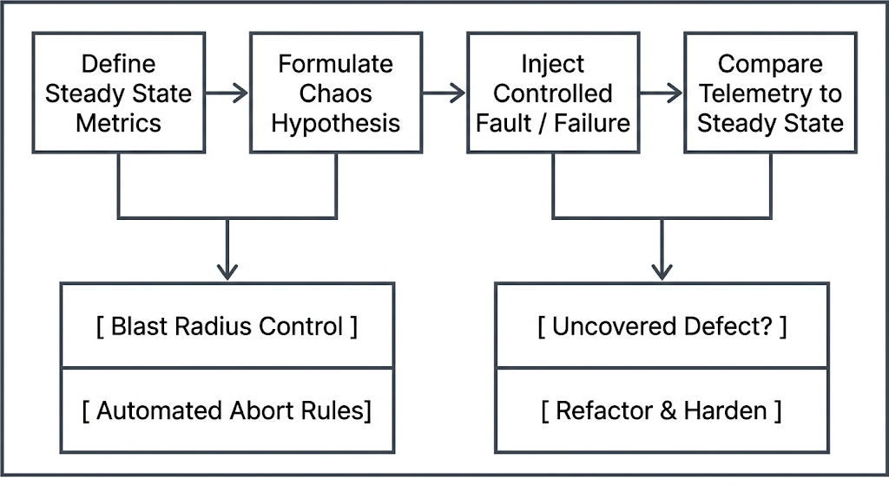

# Chapter 27: Enterprise Chaos Engineering & Fault Injection

Modern distributed architectures—comprising microservices, container orchestrators, and multi-region network fabrics—are inherently complex. While automated testing validates how code behaves under expected conditions, it cannot predict how complex systems degrade when underlying infrastructure components fail unpredictably. 

**Chaos Engineering** is the discipline of experimenting on a system to build confidence in its capability to withstand turbulent conditions in production. Rather than waiting for outages to occur, enterprise engineering teams proactively inject controlled faults to surface hidden architectural flaws, validate resilience mechanisms, and measure steady-state recovery metrics.

This chapter covers the foundational principles of chaos engineering, infrastructure failure simulation techniques, Kubernetes-native fault injection engines (Chaos Mesh and Gremlin), resiliency telemetry, and a hands-on lab executing automated fault-injection experiments against microservice workloads.\

## 27.1 Principles of Chaos Engineering and Hypothesis-Driven Experiments

Chaos Engineering is not random destruction; it is a structured, scientific methodology for uncovering systemic vulnerabilities before they trigger customer-impacting incidents.




### The Core Principles

#### 1. Define 'Steady State' as a Measurable Output
Before injecting failures, you must define normal behavior using key performance indicators (KPIs) and service level indicators (SLIs), such as HTTP 2xx response rate, overall transaction throughput, or end-to-end user latency (e.g., $P_{99} < 150\text{ms}$). Technical metrics (such as CPU or RAM utilization) are secondary to business-level steady-state metrics.

#### 2. Hypothesize that Steady State Will Persist
Formulate a precise, testable hypothesis before executing an experiment: *"Even if 50% of the payment-service pod instances in availability zone us-east-1a are terminated, overall checkout transaction throughput will remain within 98% of steady state due to automated load balancer health checks."*

#### 3. Vary Real-World Events
Simulate real-world operational degradation: hardware node crashes, network partition splits, severe network latency spikes, disk fill-ups, memory leaks, clock drift, or dependent third-party API outages.

#### 4. Run Experiments in Production (or Staging-at-Scale)
While early experiments begin in pre-production, real-world traffic patterns, real data distributions, and actual network topologies exist only in production. To build true confidence, experiments must eventually run against live production systems.

#### 5. Minimize Blast Radius and Automate Abort Conditions
Chaos experiments must be controlled to prevent catastrophic outages.
*   **Targeting:** Start with a single pod or instance before scaling to an availability zone.
*   **Automated Stop-Loss (Circuit Breakers):** If predefined safety metrics (e.g., error rate exceeding 2%) are breached, the chaos engine must instantly halt fault injection and automatically rollback the system to a clean state.

## 27.2 Simulating Infrastructure Failures: Network Latency, Node Failures, and Packet Loss

Executing realistic failure scenarios requires manipulating Linux kernel-level interfaces, networking protocols, and system resources.

```

+-----------------------------------------------------------------------------------+
|                        Linux Kernel & Chaos Interfaces                            |
+------------------------------------+----------------------------------------------+
| Fault Type                         | Underlying Kernel / System Mechanism         |
+------------------------------------+----------------------------------------------+
| Network Latency / Packet Loss      | `tc` (Traffic Control) & `netem` (Network    |
|                                    | Emulation) via eBPF or cgroups               |
| Disk I/O & Storage Exhaustion      | `dd`, `fio`, or kernel I/O fault injection   |
| Memory Exhaustion                  | Cgroup memory limits, cgroup OOM triggers    |
| Process Termination / Node Failure | `kill -9`, SIGKILL, cgroup freezes, EC2 API  |
+------------------------------------+----------------------------------------------+

```

### 1. Network Fault Emulation with `tc` and `netem`

Linux provides native traffic control (`tc`) tools leveraging the `netem` (network emulation) queueing discipline (`qdisc`) module. Chaos tools leverage these lower-level primitives to simulate bad network conditions.

#### Simulating Network Latency

Adding a deterministic 200ms delay with a 20ms jitter to interface `eth0`:
```bash
sudo tc qdisc add dev eth0 root netem delay 200ms 20ms

```

#### Simulating Packet Loss

Dropping 15% of packets pseudo-randomly on `eth0`:

```bash
sudo tc qdisc add dev eth0 root netem loss 15%
```

#### Reverting Network Faults

Clearing all network queuing rules to restore normal operation:

```bash
sudo tc qdisc del dev eth0 root
```

### 2. Computing Node Failures

Node failure testing validates that control planes (such as Kubernetes or Auto Scaling Groups) re-schedule workloads, re-route network traffic, and maintain capacity during physical machine or hypervisor crashes.

* **Soft Failures:** Graceful shutdown signals (`SIGTERM`, `systemctl stop kubelet`).
* **Hard Failures:** Hard node power-off (`sysrq` triggers, AWS `ec2-stop-instances`, or GCP `compute instances stop`).

## 27.3 Chaos Mesh and Gremlin Engine Deployment in Kubernetes Environments

Modern cloud-native systems rely on specialized chaos orchestration frameworks to safely inject faults into containerized workloads.

### 1. Chaos Mesh

**Chaos Mesh** is an open-source, Cloud Native Computing Foundation (CNCF) hosted Kubernetes-native chaos engineering platform. It uses Custom Resource Definitions (CRDs) to orchestrate complex failure modes across pods, network interfaces, filesystems, and Linux kernels.

```
+-----------------------------------------------------------------------------------+
|                            Chaos Mesh Architecture                                |
|                                                                                   |
|    +-------------------------------------------------------------------------+    |
|    | Chaos Dashboard / CRDs (PodChaos, NetworkChaos, StressChaos)          |    |
|    +------------------------------------v------------------------------------+    |
|                                         |                                         |
|    +------------------------------------v------------------------------------+    |
|    | Chaos Controller Manager (Reconciles CRDs & Schedules Faults)           |    |
|    +------------------------------------v------------------------------------+    |
|                                         |                                         |
|                   +---------------------+---------------------+                   |
|                   |                                           |                   |
|                   v                                           v                   |
|    +-----------------------------+             +-----------------------------+    |
|    | Chaos Daemon (DaemonSet)    |             | Chaos Daemon (DaemonSet)    |    |
|    | Node A (Applies tc / ptrace)|             | Node B (Applies tc / ptrace)|    |
|    +-----------------------------+             +-----------------------------+    |
+-----------------------------------------------------------------------------------+

```

#### Key Architecture Components:

* **Chaos Controller Manager:** Orchestrates chaos experiments and reconciles custom resources.

* **Chaos Daemon:** Deployed as a `DaemonSet` on every node with elevated privileges (`CAP_SYS_ADMIN`) to manipulate network interfaces (`tc`), mount filesystems, and inject system call errors into target containers via `ptrace` or eBPF.

#### Example: Chaos Mesh `PodChaos` Manifest (`pod_failure.yaml`)

```yaml
apiVersion: chaos-mesh.org/v1alpha1
kind: PodChaos
metadata:
  name: order-service-pod-kill
  namespace: production
spec:
  action: pod-failure
  mode: fixed
  value: '2'
  duration: '5m'
  selector:
    namespaces:
      - production
    labelSelectors:
      'app': 'order-service'
  scheduler:
    cron: '@every 1h'
```

#### Example: Chaos Mesh `NetworkChaos` Manifest (`network_delay.yaml`)

```yaml
apiVersion: chaos-mesh.org/v1alpha1
kind: NetworkChaos
metadata:
  name: payment-delay
  namespace: production
spec:
  action: delay
  mode: all
  selector:
    namespaces:
      - production
    labelSelectors:
      'app': 'payment-gateway'
  delay:
    latency: '300ms'
    jitter: '50ms'
  direction: to
  target:
    selector:
      namespaces:
        - production
      labelSelectors:
        'app': 'database'
  duration: '10m'
```

### 2. Gremlin

**Gremlin** is an enterprise-grade, fully managed Chaos-as-a-Service platform offering fine-grained access control, safety guardrails, continuous reliability testing, and native integration into CI/CD pipelines.

#### Feature Comparison: Chaos Mesh vs. Gremlin

| Feature | Chaos Mesh | Gremlin Engine |
| --- | --- | --- |
| **License Model** | Open-Source (CNCF) | Commercial SaaS / Enterprise |
| **Control Plane** | Self-hosted inside Kubernetes | Fully Managed SaaS Control Plane |
| **Target Platform** | Primarily Kubernetes / Containers | VMs, Bare Metal, Containers, K8s, Serverless |
| **Safety Guardrails** | Manual CRD deletion / Status Hooks | Automated Status Checks & Dead Man Switches |
| **RBAC / Security** | Kubernetes RBAC Integration | Enterprise SAML/SSO & Audit Logs |

## 27.4 Measuring System Resiliency and Steady-State Recovery

Quantifying system resiliency requires tracking recovery timelines and service availability metrics during and after fault injection experiments.

```
Service
Performance
   |
   | Steady-State Baseline
---|===================\                           /===================== (Recovered)
   |                    \                         /
   |                     \ Failure Introduced    /
   |                      \                     /
   |                       \-------------------/ 
   |                            Degraded State
   +----------------------------------------------------------------------> Time
                         |<---->|             |<---->|
                          MTTD                  MTTR

```

### Key Metrics for Resiliency Analysis

#### 1. Mean Time to Detect (MTTD)

The time elapsed between the injection of a fault and the moment alerting systems detect the anomaly (e.g., Prometheus alert firing, PagerDuty incident triggered).

#### 2. Mean Time to Recover (MTTR)

The total time from initial degradation until the system automatically recovers to baseline steady-state metrics without human intervention.

#### 3. Error Budget Impact

The calculated percentage of the service's monthly error budget consumed during a chaos experiment. Chaos experiments should never consume more than a pre-allocated fraction of the monthly error budget (e.g., max 5%).

#### 4. Resiliency Score

$$\text{Resiliency Score (\%)} = \left( \frac{\text{Transactions Succeeded During Fault}}{\text{Total Expected Steady-State Transactions}} \right) \times 100$$

## 27.5 Hands-On Lab: Running Automated Fault-Injection Experiments on Production Workloads

### Lab Overview

In this hands-on lab, you will deploy a microservice application into a local Kubernetes cluster, establish steady-state telemetry monitoring, deploy **Chaos Mesh**, execute a hypothesis-driven network delay experiment, observe real-time degradation and recovery, and enforce an automated circuit breaker halt.

```
+-----------------------------------------------------------------------------------+
|                                  Lab Architecture                                 |
|                                                                                   |
|  +-----------------------------------------------------------------------------+  |
|  | Kubernetes Cluster                                                          |  |
|  |                                                                             |  |
|  |  +---------------------------+              +----------------------------+  |  |
|  |  | App: checkout-service     | ===HTTP===>  | App: payment-api           |  |  |
|  |  | (Client Target)           |              | (Injected Target)          |  |  |
|  |  +---------------------------+              +----------------------------+  |  |
|  |                ^                                         ^                  |  |
|  |                |                                         |                  |  |
|  |  +-------------+-----------------------------------------+---------------+  |  |
|  |  | Chaos Mesh Controller Daemon (Injects 500ms Network Latency via `tc`)   |  |  |
|  |  +-----------------------------------------------------------------------+  |  |
|  +-----------------------------------------------------------------------------+  |
+-----------------------------------------------------------------------------------+

```

### Step 1: Prepare Local Kubernetes Cluster & Microservice Deployment

1. Create a workspace directory:

```bash
mkdir -p ~/chaos-lab && cd ~/chaos-lab
```


2. Ensure `kind` or `minikube` is running, then create the `demo` namespace:

```bash
kubectl create namespace demo
```


3. Deploy the target `payment-api` microservice (`payment-api.yaml`):

```yaml
cat << 'EOF' > payment-api.yaml
apiVersion: apps/v1
kind: Deployment
metadata:
  name: payment-api
  namespace: demo
  labels:
    app: payment-api
spec:
  replicas: 2
  selector:
    matchLabels:
      app: payment-api
  template:
    metadata:
      labels:
        app: payment-api
    spec:
      containers:
      - name: web
        image: nginx:alpine
        ports:
        - containerPort: 80
        resources:
          requests:
            cpu: "50m"
            memory: "64Mi"
---
apiVersion: v1
kind: Service
metadata:
  name: payment-api-svc
  namespace: demo
spec:
  selector:
    app: payment-api
  ports:
  - protocol: TCP
    port: 80
    targetPort: 80
EOF
kubectl apply -f payment-api.yaml

```

4. Deploy a client traffic generator simulating constant user checkouts (`traffic-generator.yaml`):

```yaml
cat << 'EOF' > traffic-generator.yaml
apiVersion: apps/v1
kind: Deployment
metadata:
  name: traffic-generator
  namespace: demo
spec:
  replicas: 1
  selector:
    matchLabels:
      app: traffic-generator
  template:
    metadata:
      labels:
        app: traffic-generator
    spec:
      containers:
      - name: worker
        image: curlimages/curl:latest
        command: ["/bin/sh", "-c"]
        args:
        - |
          while true; do
            START=$(date +%s%3N)
            STATUS=$(curl -s -o /dev/null -w "%{http_code}" [http://payment-api-svc.demo.svc.cluster.local:80](http://payment-api-svc.demo.svc.cluster.local:80))
            END=$(date +%s%3N)
            LATENCY=$((END-START))
            echo "[$(date -u +%T)] HTTP $STATUS - Latency: ${LATENCY}ms"
            sleep 0.5
          done
EOF
kubectl apply -f traffic-generator.yaml
```


5. Verify that initial steady-state latency is under 15ms:

```bash
kubectl logs -n demo -l app=traffic-generator --tail=10 -f
```

*(Press Ctrl+C to stop log streaming)*

### Step 2: Install Chaos Mesh

1. Install Chaos Mesh using the official installation script:

```bash
curl -sSL [https://mirrors.chaos-mesh.org/v2.6.2/install.sh](https://mirrors.chaos-mesh.org/v2.6.2/install.sh) | bash -s -- --local kind
```

2. Verify that all Chaos Mesh controller and daemon pods are running in the `chaos-mesh` namespace:

```bash
kubectl get pods -n chaos-mesh
```

### Step 3: Define Experiment & Formulate Chaos Hypothesis

#### Hypothesis Definition:

* **Target:** `payment-api` microservice in `demo` namespace.

* **Injected Fault:** Introduce 500ms network egress delay with 50ms jitter.

* **Hypothesis:** Traffic generator will experience response times of approximately $500\text{ms} \pm 50\text{ms}$, but HTTP status code success rates will remain 100% (HTTP 200 OK).

1. Create the `NetworkChaos` experiment manifest (`network-delay-experiment.yaml`):

```yaml
cat << 'EOF' > network-delay-experiment.yaml
apiVersion: chaos-mesh.org/v1alpha1
kind: NetworkChaos
metadata:
  name: payment-delay-experiment
  namespace: demo
spec:
  action: delay
  mode: all
  selector:
    namespaces:
      - demo
    labelSelectors:
      'app': 'payment-api'
  delay:
    latency: '500ms'
    jitter: '50ms'
  direction: to
  duration: '2m'
EOF
```

### Step 4: Inject Fault and Monitor System Telemetry

1. Execute the fault injection experiment:

```bash
kubectl apply -f network-delay-experiment.yaml
```

2. Observe the impact on client traffic in real time:

```bash
kubectl logs -n demo -l app=traffic-generator --tail=20 -f
```

*Expected Output Snippet during active Chaos Experiment:*

```text
HTTP 200 - Latency: 512ms
HTTP 200 - Latency: 488ms
HTTP 200 - Latency: 535ms
HTTP 200 - Latency: 501ms
```

3. Inspect the Chaos Mesh status to confirm active fault injection:

```bash
kubectl describe networkchaos payment-delay-experiment -n demo
```

### Step 5: Validate Automated Rollback and Steady-State Recovery

1. Manually abort the experiment early (simulating an automated safety circuit-breaker trigger):

```bash
kubectl delete -f network-delay-experiment.yaml
```

2. Observe the traffic generator logs to confirm immediate return to steady-state baseline performance:

```bash
kubectl logs -n demo -l app=traffic-generator --tail=10
```

*Expected Output Snippet post-recovery:*

```text
HTTP 200 - Latency: 4ms
HTTP 200 - Latency: 3ms
```

### Step 6: Lab Cleanup

1. Clean up all created resources:

```bash
kubectl delete namespace demo
curl -sSL [https://mirrors.chaos-mesh.org/v2.6.2/install.sh](https://mirrors.chaos-mesh.org/v2.6.2/install.sh) | bash -s -- --action uninstall
rm -rf ~/chaos-lab
```

### Lab Summary

In this lab, you successfully:

1. Deployed an enterprise microservice stack alongside an active telemetry traffic monitor.
   
3. Installed the CNCF Chaos Mesh fault-injection engine onto a Kubernetes cluster.
   
5. Defined a structured, hypothesis-driven `NetworkChaos` experiment using Kubernetes CRDs.
   
7. Injected kernel-level network latency using `tc`/`netem` primitives abstracted by Chaos Mesh.
   
9. Measured $P_{99}$ latency degradation during fault injection and verified steady-state recovery following experiment teardown.
