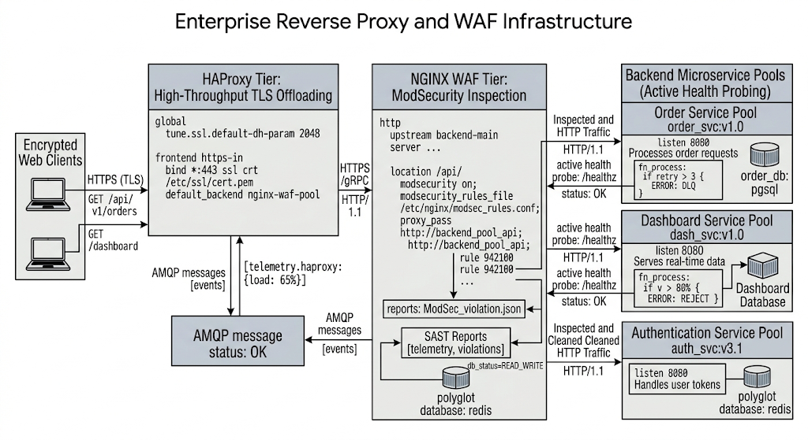
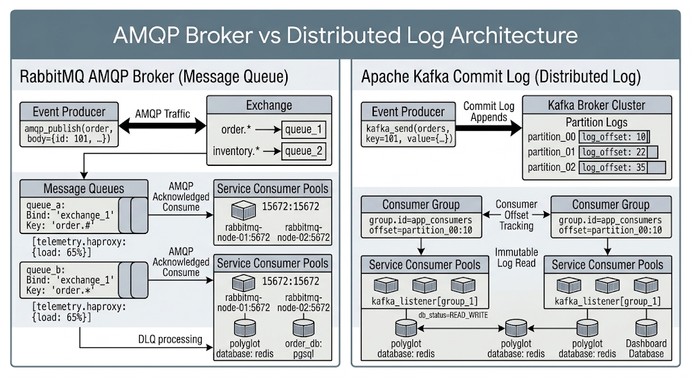
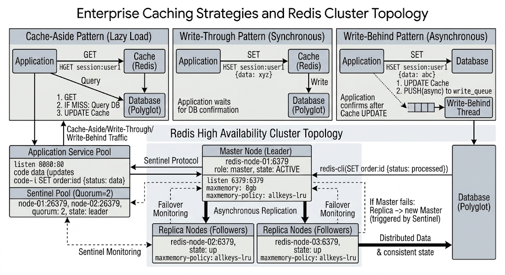
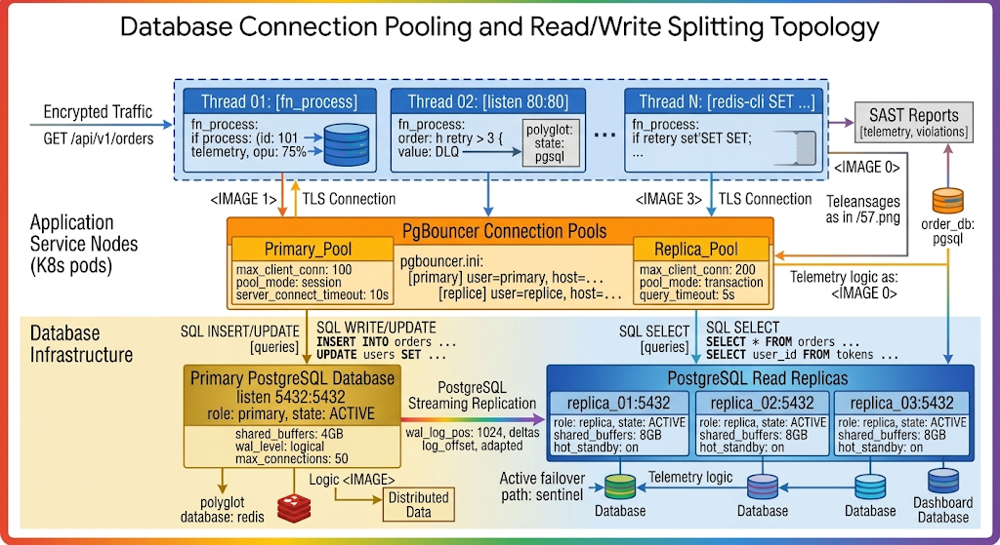
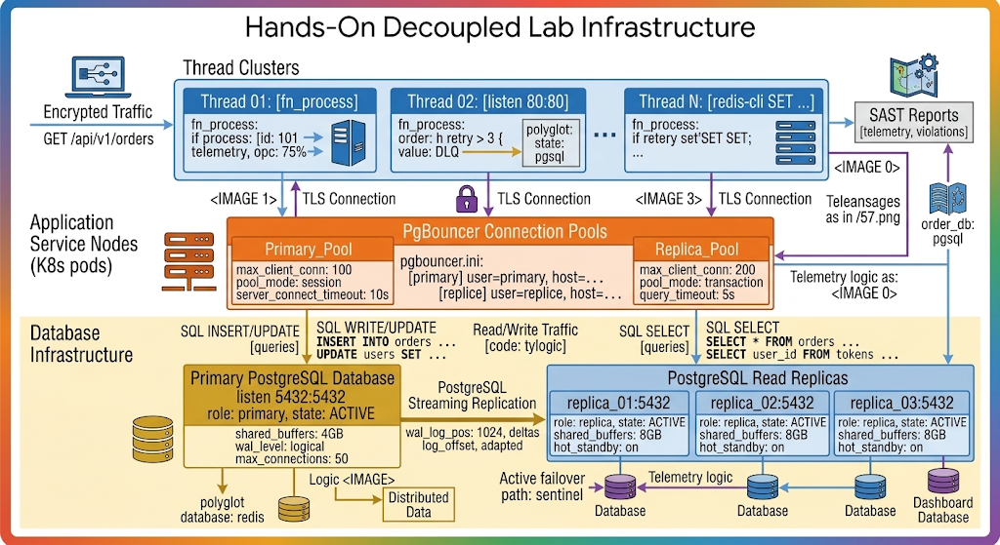

# Chapter 4: Enterprise Middleware & Application Services

## 4.1 Reverse Proxies and Web Application Firewalls (NGINX, HAProxy)

In enterprise infrastructure, reverse proxies and Web Application Firewalls (WAF) sit at the edge of network zones. They act as front-line gateways, handling TLS termination, load balancing across application pools, enforcing rate limits, and protecting internal services from malicious payloads.



### HAProxy High-Performance Configuration

HAProxy provides low-latency, high-concurrency Layer 4 (TCP) and Layer 7 (HTTP) load balancing. The configuration below implements SSL/TLS termination, custom health checks, and path-based routing.

```haproxy
# /etc/haproxy/haproxy.cfg
global
    log /dev/log local0 info
    maxconn 50000
    user haproxy
    group haproxy
    daemon
    ssl-default-bind-ciphers ECDHE-ECDSA-AES128-GCM-SHA256:ECDHE-RSA-AES128-GCM-SHA256
    ssl-default-bind-options ssl-min-ver TLSv1.2 no-tls-ticket

defaults
    log     global
    mode    http
    option  httplog
    option  dontlognull
    timeout connect 5s
    timeout client  50s
    timeout server  50s

frontend api_gateway
    bind :80
    bind :443 ssl crt /etc/haproxy/certs/site.pem alpn h2,http/1.1
    redirect scheme https code 301 if !{ ssl_fc }

    # ACL rules for microservice routing
    acl is_orders path_beg /api/v1/orders
    acl is_users  path_beg /api/v1/users

    use_backend orders_backend if is_orders
    use_backend users_backend if is_users
    default_backend main_website

backend orders_backend
    balance roundrobin
    option httpchk GET /healthz
    http-check expect status 200
    server order-app-1 10.0.10.11:8080 check inter 2000ms rise 2 fall 3
    server order-app-2 10.0.10.12:8080 check inter 2000ms rise 2 fall 3

backend users_backend
    balance leastconn
    option httpchk GET /healthz
    server user-app-1 10.0.10.21:8080 check inter 2000ms
    server user-app-2 10.0.10.22:8080 check inter 2000ms

backend main_website
    balance roundrobin
    server web-1 10.0.10.31:80 check
```

## 4.2 Enterprise Messaging Brokers (RabbitMQ, Apache Kafka)

Asynchronous messaging decouples application tiers, preventing cascade failures and allowing services to process spikes in traffic without degrading user experience.



### Advanced RabbitMQ Exchange Topology & Dead Lettering

RabbitMQ routes messages through exchanges using bindings. Dead Letter Exchanges (DLX) handle unprocessed or rejected messages to ensure zero data loss.

```bash
# Set up a Dead Letter Exchange and Queue via RabbitMQ CLI
rabbitmqadmin declare exchange name=dlx.exchange type=direct

rabbitmqadmin declare queue name=orders.dlq durable=true
rabbitmqadmin declare binding source=dlx.exchange destination=orders.dlq routing_key=dead-letter

# Declare primary queue with DLX arguments
rabbitmqadmin declare queue name=orders.primary durable=true arguments='{
  "x-dead-letter-exchange": "dlx.exchange",
  "x-dead-letter-routing-key": "dead-letter",
  "x-message-ttl": 60000
}'
```

## 4.3 In-Memory Caching Strategies (Redis, Memcached)

In-memory data stores drastically decrease database read pressure and reduce endpoint response latency from milliseconds to microseconds.



### Enterprise Redis Sentinel Configuration

Redis Sentinel ensures high availability through automated monitoring, notifications, and master-replica failover.

```text
# /etc/redis/sentinel.conf
port 26379
daemonize yes
pidfile /var/run/redis-sentinel.pid
logfile /var/log/redis/sentinel.log
dir /var/lib/redis

# Monitor master node 'mymaster' at 10.0.20.10:6379 with a quorum of 2 sentinels
sentinel monitor mymaster 10.0.20.10 6379 2
sentinel auth-pass mymaster SecureClusterPassword123

# Failover parameters
sentinel down-after-milliseconds mymaster 5000
sentinel parallel-syncs mymaster 1
sentinel failover-timeout mymaster 15000
```

## 4.4 Database Connection Pooling and Read/Write Splitting

Direct application database connections can deplete database connection limits under heavy traffic. Connection proxies and read/write splitters maximize database throughput and protect database servers.



**Database Connection Pooling and Read/Write Splitting Topology**

### Encrypted Traffic

* `GET /api/v1/orders`

### Application Service Nodes (K8s pods)

#### Thread Pool

*Dashed Border Container*

* **Thread 01: [fn_process]**
* `fn_process:`
* `if process: (id: 101`
* `telemetry, cpu: 75%`


* **Thread 02: [listen 80:80]**
* `fn_process:`
* `order: ft retry > 3 { value: DLQ`


* **Thread N: [redis-cli SET ... ]**
* `fn_process:`
* `if retery set'SET SET`

### Connection Management and Caching

---

#### Telemetry

* `polyglot:`
* `state:`
* `pgsql`

#### SAST Reports

* `[telemetry, violations]`

#### PgBouncer Connection Pools

* **Primary_Pool**
* `max_client_conn: 100`
* `pool_mode: session`
* `server_connect_timeout: 10s`

* **pgbouncer.ini:**
* `[primary] user=primary, host= ...`
* `[replice] user=replice, host= ...`

* **Replica_Pool**
* `max_client_conn: 200`
* `pool_mode: transaction`
* `query_timeout: 5s`

#### Inter-Node Logic

* `Teleansages as in /57.png`
* `Telemetry logic as: <IMAGE 0>`

### Database Infrastructure

#### Database Nodes

* `polyglot database: redis`
* `order_db: pgsql`
* `Database`
* `Dashboard Database`

#### Primary PostgreSQL Database

* `listen 5432:5432`
* `role: primary, state: ACTIVE`
* `shared_buffers: 4GB`
* `wal_level: logical`
* `max_connections: 50`

#### Replication

* **PostgreSQL Streaming Replication**
* `wal_log_pos: 1024, deltas`
* `log_offset, adapted`

#### PostgreSQL Read Replicas

* **replica_01:5432**
* `role: replica, state: ACTIVE`
* `shared_buffers: 8GB`
* `hot_standby: on`

* **replica_02:5432**
* `role: replica, state: ACTIVE`
* `shared_buffers: 8GB`
* `hot_standby: on`


* **replica_03:5432**
* `role: replica, state: ACTIVE`
* `shared_buffers: 8GB`
* `hot_standby: on`

### Logic and Operations

#### SQL Commands

* **INSERT/UPDATE**
* `SQL INSERT/UPDATE [queries]`
* `SQL WRITE/UPDATE INSERT INTO orders ... UPDATE users SET ...`

* **SELECT**
* `SQL SELECT [queries]`
* `SQL SELECT SELECT * FROM orders ... SELECT user_id FROM tokens ...`

#### Operational Logic

* `Logic <IMAGE>`
* `Distributed Data`
* `Active failover path: sentinel`
* `Telemetry logic`
### PgBouncer Transaction Pooling Configuration

PgBouncer manages client connections efficiently, reducing overhead on PostgreSQL database instances.

```ini
; /etc/pgbouncer/pgbouncer.ini
[databases]
* = host=127.0.0.1 port=5432

[pgbouncer]
logfile = /var/log/postgresql/pgbouncer.log
pidfile = /var/run/postgresql/pgbouncer.pid
listen_addr = *
listen_port = 6432
auth_type = md5
auth_file = /etc/pgbouncer/userlist.txt

; Connection Pool Settings
pool_mode = transaction
max_client_conn = 10000
default_pool_size = 50
min_pool_size = 10
reserve_pool = 5
reserve_pool_timeout = 5
```

## 4.5 Hands-On Lab: Provisioning an HAProxy, Redis, and RabbitMQ Application Stack

### Lab Scenario

You are tasked with building a resilient enterprise middleware tier. The application stack requires HAProxy to act as an edge load balancer, routing incoming traffic to an ingestion service. This service publishes order events to a RabbitMQ message broker, which worker instances consume and cache in a high-availability Redis instance.



# Hands-On Decoupled Lab Infrastructure

## Overview

This diagram illustrates the infrastructure and request flow for a decoupled, high-performance web application lab environment. It features separate read/write paths, connection pooling, database replication, and a comprehensive telemetry/reporting stack.

## High-Level Request Flow

The following describes the end-to-end journey of user requests through the system.

### 1. Ingest

* **Encrypted Traffic** enters the system via an HTTPS GET request: `GET /api/v1/orders`.

### 2. Processing (Application Service Nodes - K8s Pods)

The traffic is processed by application logic running in multiple threads.

* **Thread Clusters** (A collection of three distinct processing flows):
* **Thread 01: [fn_process]** (Primary write-heavy logic)
* Contains internal service icons.
* Action: `fn_process: if process: (id: 101) telemetry, cpu: 75%`.

* **Thread 02: [listen 80:80]** (Service endpoint/listener)
* Contains internal service icons.
* Action: `fn_process: order: if retry > 3 { value: DLQ }`. (If retry count for an order is greater than 3, move request to a Dead Letter Queue.)
* Connected to: `polyglot: state: pgsql`.

* **Thread N: [redis-cli SET ...]** (Interaction with cache)
* Contains internal service icons.
* Action: `fn_process: if retery set’SET SET;`.
* A dashed box surrounds all three Thread Clusters.
* The entire processing layer interacts with a backend monitoring system.
* A blue arrow leads from Thread 01 to the monitoring dashboard icon (top-right).
* **Monitoring System Dashboard** (Top-right): Features map/location/geospatial icons, indicating geographic telemetry.

### 3. Connection Pooling (PgBouncer)

To efficiently manage database connections, requests pass through a **PgBouncer** layer.

* Communication is secured via a `TLS Connection` (indicated by lock icons) between the thread layer and the pooling layer.
* **PgBouncer Connection Pools**:
* This is a large, central orange box.
* It contains the central config, `pgbouncer.ini`, which defines the backend databases: `[primary] user=primary, host=...` and `[replice] user=replice, host=...`.
* Two distinct pools exist:
* **Primary_Pool** (Gold box): Configured for `max_client_conn: 100` and `pool_mode: session`, with a `server_connect_timeout: 10s`.
* **Replica_Pool** (Orange box): Configured for `max_client_conn: 200` and `pool_mode: transaction`, with a `query_timeout: 5s`.

### 4. Database Infrastructure (Read/Write Splitting)

This is the core storage layer. Requests are routed to either the primary or replica databases based on the operation.

* **Traffic Split** (Indicated by blue arrows):
* Write/Update traffic flows from the `Primary_Pool` to the `Primary PostgreSQL Database`.
* Read traffic flows from the `Replica_Pool` to the `PostgreSQL Read Replicas`.

#### Write Path

* **Queries** (Text): `SQL INSERT/UPDATE [queries]`.
* **SQL WRITE/UPDATE [queries]** (Text): Contains example commands: `INSERT INTO orders ...` and `UPDATE users SET ...`.
* **Primary PostgreSQL Database** (Large gold box):
* Configuration details: `listen 5432:5432`, `role: primary, state: ACTIVE`.
* Parameters: `shared_buffers: 4GB`, `wal_level: logical`, `max_connections: 50`.

#### Read Path

* **Queries** (Text): `SQL SELECT [queries]`.
* **SQL SELECT [queries]** (Text): Contains example commands: `SELECT * FROM orders ...` and `SELECT user_id FROM tokens ...`.
* **PostgreSQL Read Replicas** (Large blue box):
* This box contains three individual replica nodes.
* `replica_01:5432`
* `replica_02:5432`
* `replica_03:5432`

* Each replica node shares identical configuration details: `role: replica, state: ACTIVE`, `shared_buffers: 8GB`, `hot_standby: on`.

## Infrastructure Management & Telemetry

Beyond the basic request flow, the lab includes robust management and data collection components.

### 1. Database Replication

Data consistency between the Primary and Replicas is maintained via streaming.

* **PostgreSQL Streaming Replication** (Gold horizontal arrow): Communicates data from the Primary to the Read Replicas.
* Technical details: `wal_log_pos: 1024, deltas log_offset, adapted`.

### 2. Polyglot Persistence & Distributed Data

The lab showcases polyglot persistence, using different database types for specialized needs.

* **Distributed Data** (Small gold box): Represents a highly-distributed datastore (e.g., Apache Cassandra, DynamoDB).
* **polyglot database: redis** (Text): Associated with the stack of server icons (bottom-left).
* A `Logic <IMAGE>` tag connects to the `Distributed Data` box.

### 3. Failover and Telemetry Logic

The diagram provides insight into system monitoring and resilience.

* **Active failover path: sentinel** (Text): Connected to a purple component (bottom-right), indicating use of Redis Sentinel or a similar technology for high availability and failover management.
* **Telemetry logic** (Text): Flows from the central `PgBouncer Connection Pools` (via a green arrow) down to the series of database icons and failover logic at the bottom.
* **Dashboard Database** (Bottom-right, purple): A specialized database to support the geometric telemetry dashboard shown at the top-right.

### 4. SAST Reporting

The infrastructure includes a security component.

* **SAST Reports [telemetry, violations]** (Top-right gray box): Collects security telemetry and lists code violations. Connected to `order_db: pgsql`.

### 5. Supplemental Content Tags

Throughout the diagram, text placeholders indicate links to supplemental, image-specific learning materials for lab students.

* `<IMAGE 0>` is referenced twice: Once in the DAST/Monitoring section (top-right) and once as `Telemetry logic as: <IMAGE 0>` in the central PgBouncer block.
* `<IMAGE 1>` and `<IMAGE 3>` are both referenced to supplemental `TLS Connection` tags between the Thread Clusters and PgBouncer.
* `Logic <IMAGE>` is referenced next to Distributed Data (bottom-left).
* A reference to `Teleansages as in /57.png` is placed next to the `PgBouncer` block.

### Step-by-Step Implementation

#### Step 1: Define Stack via Docker Compose (`docker-compose.yml`)

```yaml
version: '3.8'

services:
  haproxy:
    image: haproxy:2.8-alpine
    container_name: lab_haproxy
    ports:
      - "80:80"
      - "7000:7000" # Stats Page
    volumes:
      - ./haproxy.cfg:/usr/local/etc/haproxy/haproxy.cfg:ro
    depends_on:
      - app_service
    networks:
      - app_net

  app_service:
    image: nginx:alpine
    container_name: lab_app
    networks:
      - app_net

  rabbitmq:
    image: rabbitmq:3.12-management-alpine
    container_name: lab_rabbitmq
    ports:
      - "5672:5672"   # AMQP Protocol
      - "15672:15672" # Management Dashboard
    environment:
      RABBITMQ_DEFAULT_USER: admin
      RABBITMQ_DEFAULT_PASS: EnterprisePass123
    networks:
      - app_net

  redis:
    image: redis:7.2-alpine
    container_name: lab_redis
    command: redis-server --requirepass RedisSecurePass123 --maxmemory 256mb --maxmemory-policy allkeys-lru
    ports:
      - "6379:6379"
    networks:
      - app_net

networks:
  app_net:
    driver: bridge
```

#### Step 2: Configure HAProxy Load Balancer (`haproxy.cfg`)

```haproxy
global
    log stdout format raw local0

defaults
    mode http
    timeout connect 5000ms
    timeout client 50000ms
    timeout server 50000ms

frontend http_front
    bind *:80
    default_backend app_back

frontend stats_front
    bind *:7000
    stats enable
    stats uri /
    stats refresh 5s

backend app_back
    balance roundrobin
    server app1 lab_app:80 check
```

#### Step 3: Verification and Functional Testing

1. **Deploy Stack:**
   ```bash
   docker-compose up -d
   ```

2. **Verify Broker Connectivity:**
   ```bash
   docker exec -it lab_rabbitmq rabbitmqctl status
   ```

3. **Verify Redis Eviction & Authentication:**
   ```bash
   docker exec -it lab_redis redis-cli -a RedisSecurePass123 INFO memory
   ```

4. **Test HAProxy Gateway:**
   ```bash
   curl -I http://localhost:80
   ```

### Key Exam Takeaways (LPI 701-200)

* **Reverse Proxies vs. Load Balancers:** Reverse proxies like NGINX manage HTTP headers, TLS termination, and request routing, while dedicated load balancers like HAProxy excel at high-performance traffic distribution across layers 4 and 7.

* * **Message Decoupling:** RabbitMQ provides complex routing through AMQP bindings and queues, whereas Apache Kafka acts as a high-throughput, log-based event streaming platform.

* **Caching Eviction Policies:** Redis supports robust eviction policies (`allkeys-lru`, `volatile-lru`) to maintain performance when memory limits are reached.

* **Connection Pooling:** PgBouncer prevents database resource exhaustion by re-using connection pools and managing transaction states efficiently.
