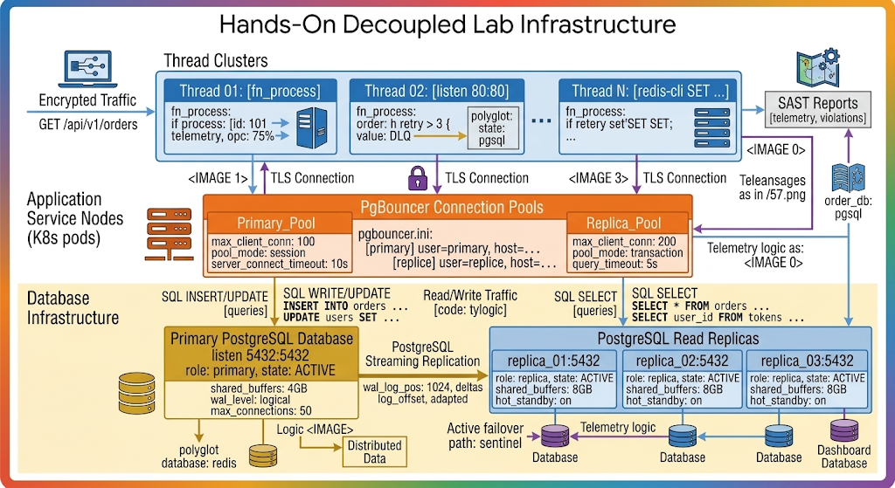
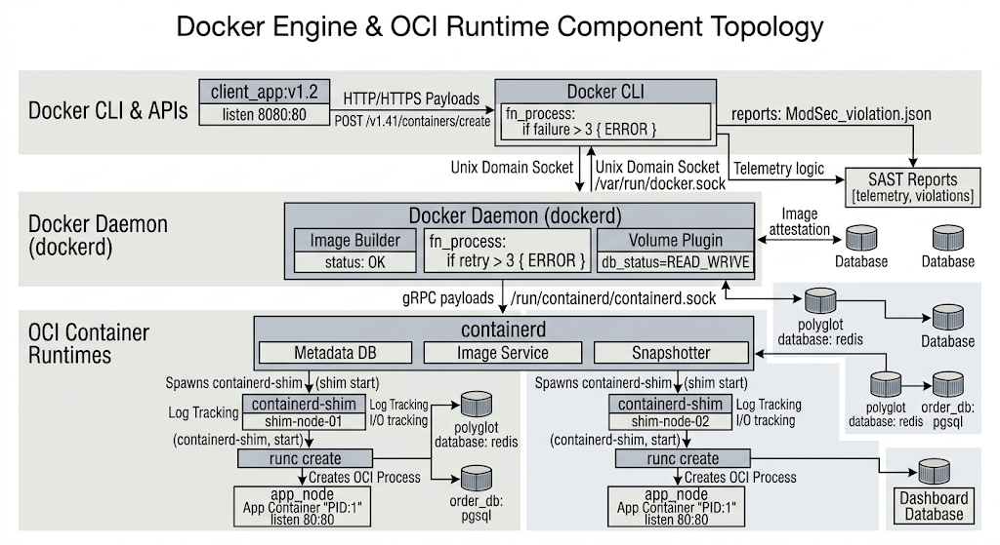

# Chapter 5: Docker Containerization Architecture & Core Operations

## 5.1 Container Internals: Namespaces, cgroups, and OverlayFS

Unlike full hardware virtualization provided by hypervisors, containers leverage Linux kernel primitives to achieve isolate processes. Understanding these core Linux kernel mechanics—Linux Namespaces, Control Groups (cgroups), and OverlayFS—is fundamental for troubleshooting and securing enterprise container environments.




### Deep Dive: Kernel Namespaces and Isolation

Namespaces wrap global system resources in abstractions. A process within a namespace sees only its isolated instance of that resource:

1. **PID Namespace (`clone` flag `CLONE_NEWPID`):** Isolates process IDs. The main process inside a container becomes PID 1, while maintaining a standard PID on the host system.
2. **NET Namespace (`CLONE_NEWNET`):** Provides isolated network devices, IP routing tables, port bindings, and firewall rules.
3. **MNT Namespace (`CLONE_NEWNS`):** Isolates file system mount points, ensuring process file system operations do not leak into the host.
4. **IPC Namespace (`CLONE_NEWIPC`):** Isolates System V IPC and POSIX message queues.
5. **UTS Namespace (`CLONE_NEWUTS`):** Isolates hostnames and NIS domain names.
6. **USER Namespace (`CLONE_NEWUSER`):** Maps container root users (UID 0) to non-privileged UIDs on the host system for enhanced security.

To inspect namespaces of running processes on an enterprise host:

```bash
# Obtain PID of a containerized application process
CONTAINER_PID=$(docker inspect --format '{{ .State.Pid }}' enterprise_app)

# Inspect namespace associations for the container PID
ls -l /proc/$CONTAINER_PID/ns

# Execute a command inside a specific namespace without entering the container runtime
sudo nsenter --target $CONTAINER_PID --net --pid ip addr show
```

### Control Groups v2 (cgroups)

Control groups restrict and account for system resource consumption. Under cgroups v2, resource tracking uses a unified hierarchy, preventing resource starvation attacks.

```bash
# Creating a custom cgroup v2 slice for an application under systemd
# /etc/systemd/system/enterprise-app.slice
[Slice]
MemoryAccounting=true
MemoryHigh=1G
MemoryMax=1.5G
CPUAccounting=true
CPUQuota=200%
IOAccounting=true
IOWeight=100
```

### OverlayFS Storage Driver

OverlayFS combines two directories on a single host host into a single merged view using Copy-on-Write (CoW):

* **`lowerdir`:** Read-only image layers stacked sequentially.
* **`upperdir`:** Read-write container layer storing file modifications, additions, and deletions.
* **`workdir`:** Internal staging directory used by OverlayFS to prepare files before committing to `upperdir`.
* **`merged`:** The unified view presented to the containerized application process.

```bash
# Inspecting OverlayFS mount details of an active container
docker inspect enterprise_app --format '{{ json .GraphDriver.Data }}' | jq .
```

---

## 5.2 Docker Engine Architecture: Docker Daemon, containerd, and runc

Modern Docker uses a modular, decoupled architecture rather than a single monolithic daemon. This structure adheres to Open Container Initiative (OCI) standards for runtime and image specifications.



### Component Breakdown & Execution Lifecycle

1. **Docker Daemon (`dockerd`):** Exposes the REST API, manages Docker networks, volumes, image builds, and orchestrates calls to `containerd`.
2. **`containerd`:** An industry-standard container runtime manager. It handles image distribution, storage management, container execution lifecycle, and supervisor operations.
3. **`containerd-shim`:** A lightweight daemon process spawned for each container. It allows daemonless containers—enabling `dockerd` or `containerd` to be restarted or upgraded without stopping running containers.
4. **`runc`:** The lightweight CLI tool built according to OCI specifications. It interacts directly with the kernel to configure namespaces and cgroups, starts the container process, and then terminates.

To directly monitor `containerd` activities bypassing the Docker daemon:

```bash
# List active containers via containerd CLI tool (ctr)
sudo ctr --namespace moby containers list

# Pull image directly using containerd
sudo ctr images pull docker.io/library/alpine:latest
```

---

## 5.3 Writing Enterprise Dockerfiles & Multi-Stage Builds

Enterprise container build pipelines must produce secure, minimal, and deterministic images. Multi-stage builds decouple the compilation toolchain from the final operational runtime image, dramatically shrinking the attack surface and image size.

```
+---------------------------------------------------------------------------------------------------+
|                                  MULTI-STAGE BUILD ARCHITECTURE                                   |
+---------------------------------------------------------------------------------------------------+
| [Stage 1: Build Environment]                                                                      |
| Golang SDK + GCC + Build Tools + Dependencies ---> Compile Binary ---> artifact: /app/server       |
|                                                                                 |                 |
|                                                                                 v (Copy Only)     |
| [Stage 2: Runtime Environment]                                                                    |
| Distroless / Alpine Minimal Base Layer <----------------------------------------+                 |
| Final Hardened Production Container Image (No Compiler, No Shell, Minimal Libraries)             |
+---------------------------------------------------------------------------------------------------+

```

### Image Prompt 3: Multi-Stage Container Build Pipeline

> **Prompt:** A professional technical architecture diagram titled "Enterprise Multi-Stage Container Build Workflow". Style & Aesthetics: Clean light-mode print style, minimal layout, crisp black vector line art on a stark white background with slate-gray header highlights. Text labels use clear sans-serif typography, and Dockerfile directives use fixed-width code typography. Structure & Layout: A two-stage pipeline process. Stage 1 (Builder): Shows `golang:1.22-alpine` compiling source code with CGO disabled and outputting an executable binary. Stage 2 (Production): Shows a minimal `gcr.io/distroless/static-debian12` image copying only the compiled binary from Stage 1 using `COPY --from=builder`. Highlight drastic reduction in total file size and removed shell/tools. High-contrast technical schematic style. Do not display font name.

### Enterprise Multi-Stage `Dockerfile` Example

The following Dockerfile demonstrates a production-grade build for a Go application using non-root execution and minimal dependencies.

```dockerfile
# =================----------------=============================================
# STAGE 1: Build & Compilation Environment
# =================----------------=============================================
FROM golang:1.22-alpine AS builder

# Install security certificates and build tools
RUN apk add --no-cache ca-certificates git

WORKDIR /src

# Leverage layer caching by copying dependency manifests first
COPY go.mod go.sum ./
RUN go mod download && go mod verify

# Copy application source code
COPY . .

# Compile static binary (CGO_ENABLED=0 prevents dynamic glibc binding)
RUN CGO_ENABLED=0 GOOS=linux GOARCH=amd64 go build \
    -ldflags="-w -s -extldflags '-static'" \
    -o /bin/enterprise-service ./cmd/api

# =================----------------=============================================
# STAGE 2: Hardened Runtime Environment
# =================----------------=============================================
FROM gcr.io/distroless/static-debian12:nonroot

LABEL org.opencontainers.image.title="Enterprise Core API" \
      org.opencontainers.image.vendor="Enterprise IT Ops" \
      org.opencontainers.image.version="1.4.0"

WORKDIR /app

# Import compiled static binary from builder stage
COPY --from=builder /bin/enterprise-service /app/enterprise-service

# Import system CA certificates from builder stage
COPY --from=builder /etc/ssl/certs/ca-certificates.crt /etc/ssl/certs/

# Expose internal service port
EXPOSE 8080

# Enforce non-root execution (UID 65532 is built-in distroless nonroot user)
USER 65532:65532

# Set entrypoint execution
ENTRYPOINT ["/app/enterprise-service"]
```

---

## 5.4 Image Optimization, Layer Caching, and Security Hardening

Securing enterprise container images requires a defense-in-depth approach. Every statement in a Dockerfile creates an immutable layer. Optimizing these layers speeds up build times, minimizes network bandwidth usage, and limits security exposure.

```
+---------------------------------------------------------------------------------------------------+
|                               CONTAINER SECURITY HARDENING CHECKLIST                              |
+-----------------------+------------------------------------+--------------------------------------+
| Strategy              | Implementation Technique           | Security Benefit                     |
+-----------------------+------------------------------------+--------------------------------------+
| Minimal Base Images   | Use Distroless or Alpine bases     | Eliminates shells, utilities, & CVEs |
| Non-Root Execution    | Define explicit `USER 10001:10001` | Prevents privilege escalation        |
| Read-Only Root FS     | Container flag `--read-only`       | Prevents runtime malware persistence |
| Dropping Capabilities | Container flag `--cap-drop=ALL`    | Restricts kernel system calls        |
| Secrets Prevention    | BuildKit `--mount=type=secret`     | Prevents secrets leaking into layers |
+-----------------------+------------------------------------+--------------------------------------+

```

### Image Prompt 4: Layer Caching and Hardening Security Stack

> **Prompt:** A professional technical comparison diagram titled "Container Layer Optimization & Runtime Hardening". Style & Aesthetics: Clean light-mode print style, minimal layout, crisp black vector line art on a stark white background with slate-gray header highlights. Text labels use clear sans-serif typography, and CLI commands use fixed-width code typography. Structure & Layout: Split diagram layout. Left side: "Unoptimized Dockerfile" showing inefficient layer order triggering full cache invalidation and inclusion of debug utilities (`curl`, `bash`, `gcc`). Right side: "Optimized & Hardened Image" showing ordered dependency caching, multi-stage artifact extraction, non-root user execution (`USER 10001`), and dropped Linux kernel capabilities (`--cap-drop=ALL`). High-contrast technical schematic style. Do not display font name.

### Secrets Handling with Docker BuildKit

Never hardcode or pass sensitive credentials using build arguments (`ARG`), as they persist in the image metadata. Instead, utilize BuildKit secret mounts.

```bash
# Dockerfile leveraging BuildKit secret mounts
# syntax=docker/dockerfile:1.4
FROM alpine:3.19

RUN --mount=type=secret,id=api_token \
    TOKEN=$(cat /run/secrets/api_token) && \
    curl -H "Authorization: Bearer $TOKEN" https://internal.repo/config -o /app/config.json
```

Execute the secure build command:

```bash
# Execute build mounting the secret securely without persisting it in layer history
DOCKER_BUILDKIT=1 docker build --secret id=api_token,src=./tokens/prod_token.txt -t enterprise-app:v1 .
```

---

## 5.5 Hands-On Lab: Constructing Minimalistic, Hardened Multi-Stage Container Images

### Lab Scenario

You are tasked with refactoring an insecure, legacy Node.js application container configuration into an enterprise-ready, hardened multi-stage image. You will write the optimized `Dockerfile`, construct a custom `.dockerignore` file, enforce non-root execution, and scan the final artifact for vulnerability compliance using Trivy.

```
+---------------------------------------------------------------------------------------------------+
|                                      LAB EXECUTION PIPELINE                                       |
+---------------------------------------------------------------------------------------------------+
|  [Raw Node.js App] ---> [Configure .dockerignore] ---> [Multi-Stage Dockerfile Compilation]       |
|                                                                  |                                |
|                                                                  v                                |
|  [Security Scan (Trivy)] <--- [Non-root Runtime Execution] <--- [Layer Caching & Pruning]         |
+---------------------------------------------------------------------------------------------------+

```

### Image Prompt 5: Hardened Lab Build and Inspection Workflow

> **Prompt:** A professional technical architecture diagram titled "Hands-On Hardened Build & Scanning Pipeline". Style & Aesthetics: Clean light-mode print style, minimal layout, crisp black vector line art on a stark white background with slate-gray header highlights. Text labels use clear sans-serif typography, and verification commands use fixed-width code typography. Structure & Layout: Sequential lab procedure diagram. Step 1: Filtering source directory via `.dockerignore`. Step 2: Running `docker buildx` multi-stage build stage. Step 3: Verifying layer security and image size using `docker history`. Step 4: Executing `trivy image --severity HIGH,CRITICAL` security gate. High-contrast technical schematic style. Do not display font name.

### Step-by-Step Implementation

#### Step 1: Create `.dockerignore`

Exclude unnecessary files to accelerate build contexts and prevent sensitive leakages into the daemon.

```
# .dockerignore
.git
.gitignore
node_modules
npm-debug.log
Dockerfile
README.md
.env*
coverage/
dist/
```

#### Step 2: Author the Hardened `Dockerfile`

Create an optimized multi-stage `Dockerfile` leveraging Node.js Alpine base images.

```dockerfile
# =================----------------=============================================
# STAGE 1: Build Dependencies and Transpile
# =================----------------=============================================
FROM node:20-alpine AS build-stage

WORKDIR /usr/src/app

# Install package manifests
COPY package*.json ./

# Clean install all dependencies (including devDependencies)
RUN npm ci

# Copy application source code
COPY . .

# Transpile/Build application artifacts
RUN npm run build

# Prune development dependencies to retain only production packages
RUN npm prune --production

# =================----------------=============================================
# STAGE 2: Hardened Production Runtime
# =================----------------=============================================
FROM node:20-alpine AS production-stage

ENV NODE_ENV=production

WORKDIR /usr/src/app

# Create a explicit system user and group for non-root execution
RUN addgroup -g 10001 -S appgroup && \
    adduser -u 10001 -S appuser -G appgroup

# Copy production node_modules and built code from build-stage
COPY --chown=appuser:appgroup --from=build-stage /usr/src/app/node_modules ./node_modules
COPY --chown=appuser:appgroup --from=build-stage /usr/src/app/dist ./dist
COPY --chown=appuser:appgroup --from=build-stage /usr/src/app/package.json ./

# Switch execution context to non-root user
USER appuser

EXPOSE 3000

# Set health check for container health monitoring
HEALTHCHECK --interval=30s --timeout=3s --start-period=5s --retries=3 \
  CMD wget --no-verbose --tries=1 --spider http://localhost:3000/healthz || exit 1

CMD ["node", "dist/server.js"]
```

#### Step 3: Build, Verify Layer History, and Validate Security

1. **Build the container using Docker BuildKit:**

   ```bash
   DOCKER_BUILDKIT=1 docker build -t enterprise/node-app:1.0.0 .
   ```

2. **Inspect Layer Sizes and Metadata:**

   ```bash
   docker history enterprise/node-app:1.0.0
   ```

3. **Verify Non-Root Process Isolation at Runtime:**

   ```bash
   docker run -d --name test-hardened -p 3000:3000 enterprise/node-app:1.0.0
   docker exec test-hardened id
   ```

   *Expected Output:* `uid=10001(appuser) gid=10001(appgroup) groups=10001(appgroup)`

4. **Execute Security Vulnerability Scan using Trivy:**

   ```bash
   trivy image --severity HIGH,CRITICAL enterprise/node-app:1.0.0
   ```

---

### Key Exam Takeaways (LPI 701-200)

* **Linux Namespaces vs cgroups:** Namespaces provide **isolation** (what a process can see), whereas Control Groups (cgroups) provide **resource limits** (what a process can use).
* **Decoupled Architecture:** The Docker CLI communicates via REST API to `dockerd`, which delegates container life-cycle operations to `containerd` via gRPC. `containerd` relies on `containerd-shim` to execute containers via `runc`.
* **Multi-Stage Build Efficiency:** Multi-stage builds reduce total container image size and eliminate security vulnerabilities by keeping compilers, SDKs, and source code out of the production layer.
* **Security Controls:** Production containers must avoid running as `root` (UID 0), utilize read-only root filesystems where possible, drop unneeded Linux capabilities (`--cap-drop=ALL`), and mount secrets dynamically via BuildKit rather than storing them in environment variables or layers.
