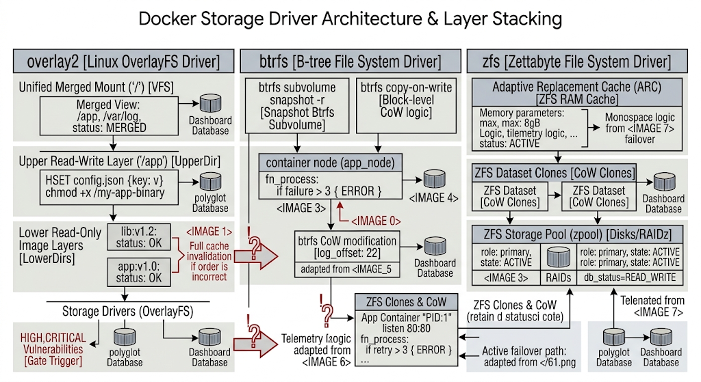

# Chapter 6: Advanced Container Storage & Overlay Networking

When deploying containerized workloads at enterprise scale, state management and network connectivity present the most critical operational challenges. While stateless microservices are easy to deploy, real-world architectures require durable data persistence, high-performance storage backends, and secure, cross-host network communication. To pass the LPI 701-200 exam and manage production environments effectively, system engineers must understand the low-level Linux kernel abstractions—such as Copy-on-Write (CoW) filesystems, network namespaces, virtual Ethernet pairs, and VXLAN tunnels—that make modern container storage and networking possible.

## 6.1 Docker Storage Drivers (Overlay2, btrfs, zfs)

Docker uses storage drivers to manage the image layers and the writable container layer. Understanding how these drivers handle storage allocation, layer stacking, and Copy-on-Write (CoW) operations is essential for tuning high-throughput enterprise systems.

```
+--------------------------------------------------------------------------------------------------+
|                               DOCKER STORAGE DRIVER ARCHITECTURE                                 |
+---------------------+-------------------------------+--------------------------------------------+
| Storage Driver      | Primary File-System Backend   | Enterprise Use Cases & Performance         |
+---------------------+-------------------------------+--------------------------------------------+
| overlay2            | ext4 / xfs (with ftype=1)     | Default standard; high speed, low memory   |
| btrfs               | Native btrfs filesystem       | Block-level CoW, subvolume snapshotting    |
| zfs                 | Native ZFS pool (zpool)       | High data integrity, deduplication, ARC    |
+---------------------+-------------------------------+--------------------------------------------+
```

### Image Prompt 1: Linux Storage Drivers Architecture

> **Prompt:** A professional technical architecture diagram titled "Docker Storage Driver Architecture & Layer Stacking". Style & Aesthetics: Clean light-mode print style, minimal layout, crisp black vector line art on a stark white background with slate-gray header highlights. Text labels use Google Sans Flex 12Pt for standard text and Google Sans Code 12Pt for system commands and driver parameters. Structure & Layout: A three-column comparative stack diagram showing overlay2, btrfs, and zfs storage driver backends. Left column: overlay2 showing lowerdir image layers, upperdir container layer, workdir, and unified merged mount on ext4/xfs. Middle column: btrfs demonstrating subvolume snapshots and block-level Copy-on-Write. Right column: zfs demonstrating ZFS storage pool (zpool), Adaptive Replacement Cache (ARC), and dataset clones. High-contrast technical schematic style. Do not display font name.

---




### Deep Dive: Storage Driver Mechanics

#### 1. `overlay2`
`overlay2` is the recommended default storage driver for Docker on modern Linux distributions. It operates at the directory level rather than the block level, union-mounting multiple directories into a single unified view.

* **Lowerdir:** Read-only image layers stacked on top of one another.
* **Upperdir:** Read-write container layer where runtime modifications are written.
* **Merged:** The unified view accessible inside the container filesystem.
* **Workdir:** Internal directory used by Linux kernel OverlayFS to prepare atomic file operations.

> **Enterprise Note:** Ensure underlying `xfs` filesystems are formatted with `ftype=1`. Without d_type support, `overlay2` will fail to process rename and copy operations correctly.

```bash
# Verify xfs d_type support on host filesystem
xfs_info /var/lib/docker | grep ftype
```

#### 2. `btrfs` and `zfs`
For storage systems requiring native snapshotting, enterprise backup integration, or multi-disk pooling:

* **`btrfs`:** Works at the subvolume level. When a container is modified, `btrfs` performs block-level Copy-on-Write, making layer creation and snapshotting fast, though heavy write workloads can cause allocation fragmentation over time.
* **`zfs`:** Uses ZFS storage pools (`zpool`). It offers robust features like data deduplication, checksumming, and memory caching via the Adaptive Replacement Cache (ARC). However, ARC can conflict with host memory if limits are not explicitly set in `/etc/modprobe.d/zfs.conf`.

---

## 6.2 Persistent Volumes, Bind Mounts, and Tmpfs Mounts

Container filesystems are ephemeral by design; when a container is destroyed, its writable layer is deleted along with it. Enterprise workloads require persistent, high-performance storage abstractions that bypass the container's storage driver.

```
+--------------------------------------------------------------------------------------------------+
|                                DOCKER STORAGE MOUNT MECHANISMS                                   |
+---------------------+-------------------------------+--------------------------------------------+
| Mount Type          | Host System Location          | Managed by Docker? | Enterprise Utility   |
+---------------------+-------------------------------+--------------------------------------------+
| Volume              | /var/lib/docker/volumes/      | Yes                | Databases, Persistent |
| Bind Mount          | Any arbitrary host path       | No                 | Configs, Source Code |
| Tmpfs Mount         | Host System Memory (RAM)      | Yes (In-Memory)    | Secrets, API Keys    |
+---------------------+-------------------------------+--------------------------------------------+
```

### Image Prompt 2: Docker Storage Mount Types

> **Prompt:** A professional technical architecture diagram titled "Docker Storage Mount Types & Host Binding Isolation". Style & Aesthetics: Clean light-mode print style, minimal layout, crisp black vector line art on a stark white background with slate-gray header highlights. Text labels use Google Sans Flex 12Pt for standard text and Google Sans Code 12Pt for file paths and flags. Structure & Layout: A host system diagram displaying three storage mechanisms targeting an isolated container. Left: Managed Volume linked from /var/lib/docker/volumes/production_db/_data into /var/lib/mysql. Middle: Bind Mount mapping host system directory /etc/app/config.json into container /app/config.json. Right: Tmpfs mount writing directly to volatile host RAM (tmpfs) for sensitive runtime secrets. High-contrast technical schematic style. Do not display font name.

---

### Storage Implementation Strategies

#### 1. Docker Volumes (Managed Storage)
Docker Volumes are stored in host storage managed by the Docker daemon (`/var/lib/docker/volumes/`). They bypass the storage driver, offering native performance equal to host I/O.

```bash
# Create a managed volume with custom storage driver options (NFS example)
docker volume create --driver local \
  --opt type=nfs \
  --opt o=addr=10.100.0.50,rw,nfsvers=4 \
  --opt device=: /exports/appdata \
  enterprise_nfs_vol
```

#### 2. Bind Mounts
Bind mounts map an arbitrary file or directory from the host system directly into the container.

```bash
# Attach host configuration file using read-only bind mount
docker run -d \
  --name production_web \
  --mount type=bind,source=/etc/nginx/nginx.conf,target=/etc/nginx/nginx.conf,readonly \
  nginx:alpine
```

#### 3. Tmpfs Mounts
Tmpfs mounts store data exclusively in host memory (RAM), ensuring sensitive information like keys or credentials never hit non-volatile disk storage.

```bash
# Mount 512MB volatile memory buffer into container runtime
docker run -d \
  --name secure_service \
  --mount type=tmpfs,target=/tmp/secrets,tmpfs-size=536870912,tmpfs-mode=1770 \
  enterprise_app:v2
```

---

## 6.3 Docker Networking Drivers: Bridge, Host, Macvlan, and Overlay

Docker abstracts Linux network namespaces, virtual interfaces, and firewall rules into modular networking drivers.

```
+--------------------------------------------------------------------------------------------------+
|                               DOCKER NETWORK DRIVERS COMPARISON                                  |
+------------------+------------------------------+------------------------------------------------+
| Network Driver   | Scope                        | Network Isolation & Topology                   |
+------------------+------------------------------+------------------------------------------------+
| bridge           | Single Host                  | NAT via docker0 virtual bridge & iptables      |
| host             | Single Host                  | No isolation; shares host network stack        |
| macvlan          | Single / Multi Host          | Direct layer-2 MAC address allocation on host  |
| overlay          | Multi-Host (Swarm/K8s)       | Layer-2 VXLAN encapsulation over Layer-3 IP    |
+------------------+------------------------------+------------------------------------------------+
```

### Image Prompt 3: Docker Network Drivers Architecture

> **Prompt:** A professional technical architecture diagram titled "Docker Network Driver Topologies". Style & Aesthetics: Clean light-mode print style, minimal layout, crisp black vector line art on a stark white background with slate-gray header highlights. Text labels use Google Sans Flex 12Pt for standard text and Google Sans Code 12Pt for network commands and IP addresses. Structure & Layout: A four-quadrant network topology diagram. Top-Left (Bridge): Container namespaces attached via veth pairs to a docker0 bridge routing through host NAT/iptables. Top-Right (Host): Container process binding directly to host eth0 network stack without namespace isolation. Bottom-Left (Macvlan): Containers assigned distinct MAC and sub-IP addresses directly on physical network interface eth0. Bottom-Right (Overlay): Multi-host setup showing VXLAN tunnel (UDP 4789) encapsulating container traffic between host nodes. High-contrast technical schematic style. Do not display font name.

---

### Driver Technical Mechanics

1. **Bridge:** The default network driver. Creates a virtual bridge (e.g., `docker0`) on the host. Containers connect via virtual Ethernet (`veth`) pairs, using NAT (Network Address Translation) and `iptables` rules to communicate externally.
2. **Host:** Removes network isolation between the container and the host. The container binds directly to host ports, eliminating NAT performance overhead at the expense of port collision safety.
3. **Macvlan:** Allows containers to appear as physical devices on the enterprise network. Each container gets a unique MAC address assigned from the underlying host physical interface (`eth0`).
4. **Overlay:** Enables multi-host networking by creating a distributed overlay network on top of host-level physical networks using VXLAN (Virtual Extensible LAN) encapsulation.

---

## 6.4 Enterprise Multi-Host Networking Configuration

In multi-host production deployments, containers across different physical or virtual nodes must communicate securely without requiring complex host port-mapping or NAT configurations.

```
+--------------------------------------------------------------------------------------------------+
|                           ENTERPRISE OVERLAY NETWORK ARCHITECTURE                                |
+--------------------------------------------------------------------------------------------------+
| [ Node A: 10.10.0.11 ]                                            [ Node B: 10.10.0.12 ]         |
| +--------------------+                                            +--------------------+         |
| | Container A        |                                            | Container B        |         |
| | IP: 10.200.0.5     |                                            | IP: 10.200.0.6     |         |
| +---------+----------+                                            +---------+----------+         |
|           | (Virtual Ethernet)                                              |                    |
| +---------v----------+                                            +---------v----------+         |
| | overlay_br0        |                                            | overlay_br0        |         |
| +---------+----------+                                            +---------+----------+         |
|           | (VXLAN Encapsulation)                                           |                    |
| +---------v----------+     UDP Port 4789 (VXLAN Tunnel)           +---------v----------+         |
| | vxlan0 (VNI 4096)  |===========================================>| vxlan0 (VNI 4096)  |         |
| +--------------------+                                            +--------------------+         |
+--------------------------------------------------------------------------------------------------+
```

### Image Prompt 4: Multi-Host Overlay VXLAN Tunneling

> **Prompt:** A professional technical architecture diagram titled "Enterprise Multi-Host VXLAN Overlay Architecture". Style & Aesthetics: Clean light-mode print style, minimal layout, crisp black vector line art on a stark white background with slate-gray header highlights. Text labels use Google Sans Flex 12Pt for standard text and Google Sans Code 12Pt for IP and UDP port configurations. Structure & Layout: Horizontal multi-node diagram containing Node A (Host IP: 10.10.0.11) and Node B (Host IP: 10.10.0.12). Shows Container A (10.200.0.5) sending packets through virtual switch overlay_br0 to VXLAN interface vxlan0. Highlight UDP port 4789 encapsulation wrapping inner Layer-2 frame into outer Layer-3 packet transmitted over host eth0. Node B unwraps outer packet and delivers raw inner frame to Container B (10.200.0.6). High-contrast technical schematic style. Do not display font name.

---

### VXLAN Mechanics & Control Plane Synchronization

1. **Virtual Extensible LAN (VXLAN):** Encapsulates Layer-2 Ethernet frames inside standard Layer-3 IPv4/UDP packets (destination port `4789`). This creates an isolated virtual network spanning multiple physical host subnets.
2. **VXLAN Network Identifier (VNI):** A 24-bit integer providing up to 16 million isolated overlay segments, preventing cross-tenant packet leakage.
3. **Control Plane Operations:** Managed via Docker Swarm or external key-value stores (e.g., `etcd`, `Consul`). It tracks container locations, IP assignments, and MAC addresses across hosts, updating host ARP and FDB (Forwarding Database) tables automatically.

---

## 6.5 Hands-On Lab: Configuring Cross-Node Container Overlay Networks with Custom Subnets

### Lab Scenario
You need to build a multi-host overlay network spanning two nodes (`node-01` and `node-02`). You will set up an encrypted custom overlay network, deploy container workloads across both nodes, verify cross-host IP connectivity, and inspect the underlying VXLAN tunnel traffic.

```
+--------------------------------------------------------------------------------------------------+
|                                  LAB EXECUTION PIPELINE                                          |
+--------------------------------------------------------------------------------------------------+
|  [1. Swarm Init & Join] ---> [2. Create Encrypted Overlay Network] ---> [3. Deploy Services]     |
|                                                                                |                 |
|                                                                                v                 |
|  [5. Inspect Packet Capture] <--- [4. Execute Ping Tests] <--------------------+                 |
+--------------------------------------------------------------------------------------------------+
```

### Image Prompt 5: Hands-On Overlay Network Topology Lab

> **Prompt:** A professional technical architecture diagram titled "Hands-On Cross-Node Overlay Lab Configuration". Style & Aesthetics: Clean light-mode print style, minimal layout, crisp black vector line art on a stark white background with slate-gray header highlights. Text labels use Google Sans Flex 12Pt for standard text and Google Sans Code 12Pt for CLI verification commands. Structure & Layout: Sequential multi-stage lab setup. Step 1: Docker Swarm cluster init connecting node-01 (Manager) and node-02 (Worker). Step 2: Overlay network creation command showing subnet 10.200.0.0/16 and AES encryption flag (--opt encrypted). Step 3: Deployment of multi-replica service across nodes. Step 4: Verification step using ping and tcpdump port 4789 packet capture. High-contrast technical schematic style. Do not display font name.

---

### Step-by-Step Implementation

#### Step 1: Initialize Swarm Cluster
On `node-01` (Manager):
```bash
# Initialize Swarm cluster management plane
docker swarm init --advertise-addr 10.10.0.11
```
*Copy the generated join token and execute it on `node-02` (Worker):*
```bash
# Join worker node to cluster
docker swarm join --token SWMTKN-1-356abc... 10.10.0.11:2377
```

#### Step 2: Create Custom Encrypted Overlay Network
On `node-01` (Manager):
```bash
# Create custom multi-host overlay network with IPSEC encryption
docker network create \
  --driver overlay \
  --subnet 10.200.0.0/16 \
  --gateway 10.200.0.1 \
  --opt encrypted \
  --attachable \
  prod_secure_overlay
```

#### Step 3: Deploy Workloads Across Nodes
```bash
# Deploy isolated container on node-01
docker run -d \
  --name web_service_node1 \
  --network prod_secure_overlay \
  alpine sleep 3600

# Deploy second isolated container targeting node-02
docker run -d \
  --name web_service_node2 \
  --network prod_secure_overlay \
  alpine sleep 3600
```

#### Step 4: Verify Cross-Host Network Connectivity
```bash
# Retrieve internal overlay IP assigned to web_service_node2
NODE2_IP=$(docker inspect -f '{{range .NetworkSettings.Networks}}{{.IPAddress}}{{end}}' web_service_node2)

# Ping web_service_node2 directly from inside web_service_node1 across the VXLAN tunnel
docker exec -it web_service_node1 ping -c 4 $NODE2_IP
```

#### Step 5: Capture and Inspect Encapsulated VXLAN Traffic
Run `tcpdump` on the host interface of `node-01` to capture encrypted UDP port 4789 packets moving between nodes:
```bash
# Capture raw host-level VXLAN encapsulated frame flow
sudo tcpdump -i eth0 -n udp port 4789 -c 5
```

---

### Key Exam Takeaways (LPI 701-200)

* **Storage Driver vs. Volumes:** Storage drivers use Copy-on-Write (`overlay2`, `btrfs`, `zfs`) to manage immutable container layers, adding performance overhead. **Volumes** bypass storage drivers completely, providing raw disk I/O performance.
* **Network Isolation:** The `bridge` driver provides single-host NAT isolation. The `host` driver bypasses container network namespaces. The `macvlan` driver assigns layer-2 MAC addresses to containers directly on host networks.
* **Overlay Tunneling:** Docker overlay networks use **VXLAN** encapsulation running over **UDP port 4789**. Control planes synchronize state using Swarm Raft or distributed key-value databases.
* **Tmpfs Mounts:** Tmpfs mounts store sensitive runtime data purely in **host system memory**, ensuring sensitive keys or tokens are never saved to non-volatile disk storage.
