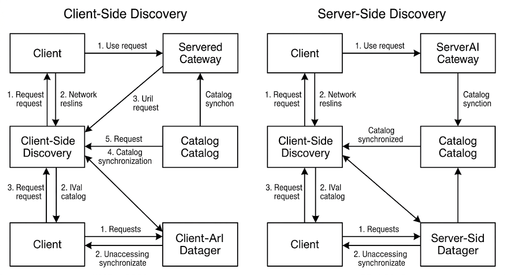
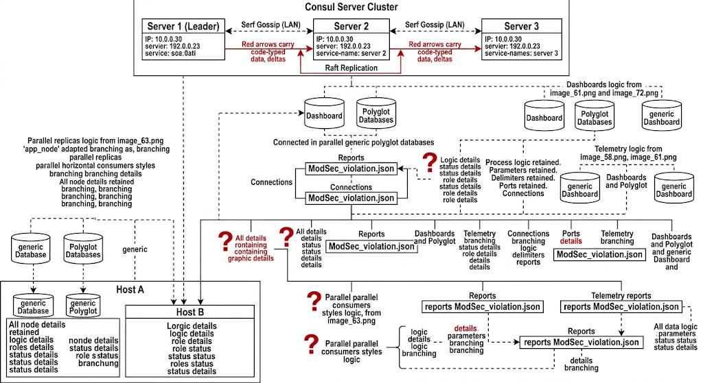

# Chapter 7: Service Discovery & Dynamic Routing

In traditional static IT infrastructure, service endpoints are bound to predictable IP addresses and fixed port numbers. Modern microservice architectures, containerized workloads, and auto-scaling compute groups break this model entirely. Ephemeral containers spin up and tear down on dynamically assigned network interfaces and high-numbered ports across distributed nodes. Hardcoding backend locations or maintaining static load balancer configurations creates fragile infrastructure that fails under scale and deployment frequency.

This chapter details the mechanisms of dynamic service discovery and automated reverse proxying required for the LPI DevOps Tools Engineer (701-200) exam. You will explore server-side and client-side discovery patterns, deploy resilient HashiCorp Consul clusters, configure dynamic routing engines (Traefik and NGINX), and build self-healing edge routing topologies.

## 7.1 Principles of Service Discovery in Distributed Systems

### The Fallacy of Static Addressing in Cloud-Native Architectures

In containerized environments orchestrated by platforms like Kubernetes or Nomad, instances are short-lived. A host failure, continuous deployment rollout, or horizontal auto-scaling event continuously shifts network locations. Routing traffic to these workloads requires a decoupled control plane: **Service Discovery**.

Service discovery automates three primary functions:

1. **Registration:** Storing the IP, port, health state, and operational metadata of application instances as they start.
2. **Resolution:** Querying a central catalog to locate healthy endpoints for a given service name.
3. **Health Monitoring:** Continually evaluating whether registered instances can accept traffic, pruning unhealthy nodes dynamically.



### Discovery Architecture Models: Client-Side vs. Server-Side

#### Client-Side Discovery

The client application queries the Service Registry (such as HashiCorp Consul or Etcd) to retrieve available IP and port mappings. The client then applies internal client-side load-balancing algorithms (e.g., Round-Robin, Least Connections) and establishes a direct connection to the target service instance.

* **Advantages:** Eliminates network hops through middle proxies; provides granular control over load-balancing strategy within application logic.
* **Disadvantages:** Couples application code to specific discovery APIs; requires client-side libraries in every language stack utilized within the enterprise architecture.

#### Server-Side Discovery

The client sends requests to an edge router or load balancer proxy. The proxy queries the Service Registry or list of targets, resolves the network location of an operational service instance, and routes the request down to the endpoint.

* **Advantages:** Abstracted completely from application code; uniform access mechanisms across polyglot microservice environments.
* **Disadvantages:** Introduces an additional network hop; requires maintaining highly available proxy infrastructure.

### Consensus Protocols and Distributed Catalogs: Raft Overview

Service registries must maintain absolute consistency and state integrity across cluster partitions. HashiCorp Consul uses the **Raft Consensus Algorithm** to maintain a replicated log among its server nodes.

Raft divides cluster nodes into three states:

* **Leader:** Manages all client write requests, log replication, and heartbeat emission.
* **Follower:** Fully passive state; responds to log entry replication RPCs from the leader.
* **Candidate:** Intermediate state during an election to choose a new Leader.

To maintain quorum and tolerate hardware failures without split-brain scenarios, a Consul cluster requires an odd number of server nodes ($N$). The consensus quorum size needed to commit log entries is defined mathematically:

$$\text{Quorum} = \left\lfloor \frac{N}{2} \right\rfloor + 1$$

* A 3-node cluster tolerates **1** node failure ($\lfloor 3/2 \rfloor + 1 = 2$ nodes required for quorum).
* A 5-node cluster tolerates **2** node failures ($\lfloor 5/2 \rfloor + 1 = 3$ nodes required for quorum).

## 7.2 HashiCorp Consul Cluster Deployment and Service Registration

HashiCorp Consul operates as a single binary executing in either **Server** or **Agent/Client** mode. Server agents participate in Raft consensus, store catalog state, and process queries. Client agents run on every workload host, running health checks, caching DNS responses, and forwarding RPCs to the server cluster.

### Deploying a Production-Grade Consul Cluster



#### Production Server Configuration (`/etc/consul.d/consul.hcl`)

Deploy the following declarative configuration file across a 3-node server cluster, adjusting node names and static bind addresses accordingly:

```hcl
# /etc/consul.d/consul.hcl
node_name        = "consul-server-01"
data_dir         = "/var/lib/consul"
log_level        = "INFO"
server           = true
bootstrap_expect = 3

# Network Binds
bind_addr   = "192.168.10.11"
client_addr = "0.0.0.0"

# Clustering & Discovery
retry_join = ["192.168.10.11", "192.168.10.12", "192.168.10.13"]

# UI Configuration
ui_config {
  enabled = true
}

# Connect Service Mesh / ACL Enforcement
acl {
  enabled                  = true
  default_policy           = "deny"
  enable_token_persistence = true
}

performance {
  raft_multiplier = 1
}

```

Start the service using systemd across all nodes:

```bash
sudo systemctl enable --now consul

```

Verify cluster initialization and consensus topology:

```bash
consul members
consul operator raft list-peers

```

Output:

```
Node              Address             Status  Type    Build   Protocol  DC    Partition  Segment
consul-server-01  192.168.10.11:8301  alive   server  1.16.0  2         dc1   default    <all>
consul-server-02  192.168.10.12:8301  alive   server  1.16.0  2         dc1   default    <all>
consul-server-03  192.168.10.13:8301  alive   server  1.16.0  2         dc1   default    <all>

```

### Registering Services via HCL Declarations and HTTP API

Services are declared on Consul agents using static HCL definitions or injected dynamically over the HTTP API endpoints.

#### Declaring a Service via HCL File (`/etc/consul.d/payment-service.hcl`)

```hcl
service {
  id      = "payment-api-v1-01"
  name    = "payment-api"
  tags    = ["production", "v1", "traefik.enable=true"]
  port    = 8443
  address = "192.168.10.50"

  check {
    id       = "payment-api-check"
    name     = "HTTP API Health Check"
    http     = "https://192.168.10.50:8443/healthz"
    tls_skip_verify = true
    interval = "10s"
    timeout  = "2s"
  }
}

```

Reload the Consul configuration to process local registration files:

```bash
consul reload

```

#### Registering a Service Dynamic via HTTP API

Deployments in continuous integration/delivery (CI/CD) pipelines register instances via Consul's REST API:

```bash
curl --request PUT \
  --url http://127.0.0.1:8500/v1/agent/service/register \
  --header 'Content-Type: application/json' \
  --data '{
    "ID": "order-api-01",
    "Name": "order-api",
    "Tags": ["v2", "web"],
    "Address": "192.168.10.51",
    "Port": 8080,
    "Check": {
      "HTTP": "http://192.168.10.51:8080/health",
      "Interval": "5s",
      "Timeout": "1s"
    }
  }'

```

### Catalog Querying: DNS Interface vs. HTTP REST API

Consul provides native resolution via DNS on port `8600` and REST API endpoints on port `8500`.

#### Resolving Endpoints via DNS

Query service records using standard system utilities like `dig`. Consul constructs domain names using the format `<service>.service.<datacenter>.consul`:

```bash
dig @127.0.0.1 -p 8600 order-api.service.dc1.consul SRV

```

Example DNS Response Payload:

```text
;; QUESTION SECTION:
;order-api.service.dc1.consul. IN SRV

;; ANSWER SECTION:
order-api.service.dc1.consul. 0 IN SRV 1 1 8080 192-168-10-51.node.dc1.consul.

;; ADDITIONAL SECTION:
192-168-10-51.node.dc1.consul. 0 IN A 192.168.10.51

```

#### Resolving Endpoints via HTTP REST API

```bash
curl -s http://127.0.0.1:8500/v1/health/service/order-api?passing=true | jq .

```

---

## 7.3 Dynamic Reverse Proxying with Traefik and NGINX

Dynamic reverse proxies act as entry points (edge routers) to distributed clusters. Rather than manually editing proxy routing tables and executing reload commands whenever backends change, dynamic reverse proxies poll or listen to the service discovery catalog, updating routing rules immediately.

```
┌────────────────────────────────────────────────────────────────────────┐
│                   DYNAMIC REVERSE PROXY FLOW                          │
│                                                                        │
│   Incoming Client HTTP Request                                         │
│                │                                                       │
│                v                                                       │
│   +─────────────────────────+                                          │
│   |  Edge Router / Proxy    | <────── Auto-discovers endpoints         │
│   |  (Traefik / NGINX)      |         and updates routing table        │
│   +────────────┬────────────+                                          │
│                │                                                       │
│        Dynamic Routing                                                 │
│     ┌──────────┴──────────┐                                            │
│     │                     │                                            │
│     v                     v                                            │
│  +─────────────────+   +─────────────────+                             │
│  | Service A       |   | Service B       |                             │
│  | Host 1: 10.0.0.1|   | Host 2: 10.0.0.2|                             │
│  +─────────────────+   +─────────────────+                             │
└────────────────────────────────────────────────────────────────────────┘

```

```
[DALL-E 3 Image Generation Prompt]
A clean light-mode diagram representing the dynamic routing execution flow of an edge reverse proxy (Traefik/NGINX) auto-discovering endpoints from a backend service registry. Professional technical documentation style on pure white background (#FFFFFF). High-contrast black outlines and text, sharp geometric shapes. Clean arrows showing incoming HTTP client requests hitting the edge router, which continuously synchronizes with dynamic service backends. Monospaced font for IP definitions, standard sans-serif for components.

```

### Traefik Architecture and Providers

Traefik uses two core concepts:

1. **Entrypoints:** Network ports receiving incoming requests (e.g., `:80`, `:443`).
2. **Providers:** Infrastructure engines (Consul Catalog, Docker, Kubernetes) that expose service declarations.

Traefik builds routing trees automatically using **Routers** (which match incoming requests by host, path, or header) and **Services** (which load-balance traffic to healthy backend IP/port targets).

#### Static Traefik Configuration (`/etc/traefik/traefik.yml`)

```yaml
entryPoints:
  web:
    address: ":80"
  websecure:
    address: ":443"

providers:
  consulCatalog:
    refreshInterval: 5s
    endpoint:
      address: "127.0.0.1:8500"
      scheme: "http"
    exposedByDefault: false
    defaultRule: "Host(`{{ .Name }}.example.com`)"

api:
  dashboard: true
  insecure: true

```

#### Dynamic Registration via Consul Tags

To expose a service through Traefik, add specific metadata tags during Consul service registration:

```json
{
  "ID": "user-service-01",
  "Name": "user-service",
  "Address": "10.0.1.20",
  "Port": 9000,
  "Tags": [
    "traefik.enable=true",
    "traefik.http.routers.users.rule=Host(`users.enterprise.internal`)",
    "traefik.http.routers.users.entrypoints=web",
    "traefik.http.services.users.loadbalancer.server.port=9000"
  ],
  "Check": {
    "HTTP": "http://10.0.1.20:9000/health",
    "Interval": "10s"
  }
}

```

### Dynamic NGINX Management with Consul-Template

Unlike Traefik, standard NGINX requires updating `nginx.conf` files on disk and issuing a reload command (`nginx -s reload`). **Consul-Template** automates this by watching Consul key-value stores or service catalogs and rendering dynamic configuration files.

```
┌────────────────────────────────────────────────────────────────────────┐
│                 CONSUL-TEMPLATE WITH NGINX PIPELINE                    │
│                                                                        │
│  +────────────────+      1. Watch Events     +──────────────────────+  │
│  | Consul Cluster | <─────────────────────── | Consul-Template      |  │
│  +────────────────+                          | Daemon               |  │
│          │                                   +──────────┬───────────+  │
│          │ 2. Return Service Catalog Changes            │              │
│          └──────────────────────────────────────────────┤              │
│                                                         │ 3. Render    │
│                                                         v              │
│                                              +──────────────────────+  │
│                                              | Dynamic nginx.conf   |  │
│                                              +──────────┬───────────+  │
│                                                         │              │
│                                                         │ 4. Exec Reload
│                                                         v              │
│                                              +──────────────────────+  │
│                                              | NGINX Process        |  │
│                                              +──────────────────────+  │
└────────────────────────────────────────────────────────────────────────┘

```

```
[DALL-E 3 Image Generation Prompt]
A detailed technical workflow diagram showcasing Consul-Template watching a Consul Service Catalog, updating dynamic nginx.conf files, and sending a reload signal to the NGINX master process. Minimalist light-mode style, pure white canvas background, crisp black outlines, standard sans-serif for workflow step text, monospaced font for file configurations. Pure high-contrast technical line art.

```

#### NGINX Template (`/etc/consul-template/templates/nginx.conf.ctmpl`)

```nginx
{{ range services }}
upstream {{ .Name }} {
  least_conn;
  {{ range service .Name }}
  server {{ .Address }}:{{ .Port }} max_fails=3 fail_timeout=10s;
  {{ else }}
  server 127.0.0.1:65535; # Backup down host
  {{ end }}
}
{{ end }}

server {
    listen 80;
    server_name apps.enterprise.internal;

    {{ range services }}
    location /{{ .Name }}/ {
        proxy_pass http://{{ .Name }}/;
        proxy_set_header Host $host;
        proxy_set_header X-Real-IP $remote_addr;
        proxy_set_header X-Forwarded-For $proxy_add_x_forwarded_for;
    }
    {{ end }}
}

```

#### Consul-Template System Configuration (`/etc/consul-template/config.hcl`)

```hcl
consul {
  address = "127.0.0.1:8500"
}

template {
  source      = "/etc/consul-template/templates/nginx.conf.ctmpl"
  destination = "/etc/nginx/conf.d/default.conf"
  command     = "systemctl reload nginx"
}

```

Run Consul-Template as a persistent system daemon:

```bash
consul-template -config=/etc/consul-template/config.hcl

```

---

## 7.4 Health Checking and Automated Traffic Rerouting

Service discovery registries must actively confirm that backends are functional before routing client traffic. If a backend degrades or crashes, the control plane updates the service catalog, causing edge proxies to remove the endpoint.

```
┌────────────────────────────────────────────────────────────────────────┐
│                   HEALTH CHECK REROUTING MECHANISM                     │
│                                                                        │
│                        +──────────────────────+                        │
│                        |    Consul Agent      |                        │
│                        +──────────┬───────────+                        │
│                                   │                                    │
│             1. Continuous Health  │ Check (HTTP / TCP / Script)        │
│             ┌─────────────────────┴─────────────────────┐              │
│             │                                           │              │
│             v                                           v              │
│  +─────────────────────+                     +─────────────────────+   │
│  | App Instance A      |                     | App Instance B      |   │
│  | State: PASSING (200)|                     | State: CRITICAL(500)|   │
│  +──────────┬──────────+                     +─────────────────────+   │
│             │                                           │              │
│             │ 2. Included in Catalog                    │ 3. Pruned    │
│             v                                           x              │
│  +─────────────────────────────────────────────────────────────────+   │
│  |                      Traefik Dynamic Proxy                      |   │
│  +──────────────────────────────────┬──────────────────────────────+   │
│                                     │                                  │
│                                     │ 4. Route Requests Exclusively    │
│                                     v                                  │
│                         Healthy App Instance A                         │
└────────────────────────────────────────────────────────────────────────┘

```

```
[DALL-E 3 Image Generation Prompt]
A technical light-mode diagram demonstrating automated health checking and traffic rerouting. Consul Agent performs health checks against App Instance A (Passing status, green light vector indicator, solid flow arrow) and App Instance B (Critical state, red light vector, struck-out arrow). Traefik dynamic proxy receives catalog updates and routes all live traffic exclusively to App Instance A. High-contrast crisp black print aesthetic on pure white canvas.

```

### Health Check Protocols in Consul

```
+----------------+--------------------------------------+------------------------------------+
| Check Type     | Example Configuration Snippet        | Evaluation Criteria                |
+----------------+--------------------------------------+------------------------------------+
| HTTP Check     | http = "http://10.0.1.5:8080/health" | 2xx status code = Pass; else Fail  |
| TCP Check      | tcp  = "10.0.1.5:5432"               | Successful TCP socket handshake    |
| Script Check   | args = ["/usr/local/bin/check.sh"]   | Exit Code 0 = Pass; 2 = Critical   |
| gRPC Check     | grpc = "10.0.1.5:9000/Health"        | gRPC Health Checking Protocol status|
+----------------+--------------------------------------+------------------------------------+

```

```
[DALL-E 3 Image Generation Prompt]
A high-contrast light-mode reference table outlining "Consul Health Check Types, Configurations, and Evaluation Criteria". Pure white canvas (#FFFFFF), bold monospaced headers, crisp black cell borders. Standard clear print typography, readable font rendering, optimized for technical engineering handbooks.

```

#### Advanced Health Check Definition (`/etc/consul.d/checks.hcl`)

```hcl
service {
  id   = "auth-service-01"
  name = "auth-service"
  port = 8081

  check {
    id                             = "auth-http-check"
    name                           = "Auth Service HTTP Endpoint Check"
    http                           = "http://127.0.0.1:8081/healthz"
    method                         = "GET"
    interval                       = "5s"
    timeout                        = "1s"
    deregister_critical_service_after = "1m"
  }

  check {
    id       = "auth-memory-check"
    name     = "Host Memory Utilization Check"
    args     = ["/usr/lib/consul/scripts/check_mem.py", "-w", "80", "-c", "90"]
    interval = "15s"
    timeout  = "5s"
  }
}

```

### Circuit Breaking and Outlier Detection

To prevent cascading failures across microservices, edge routers employ **Circuit Breaking**. If a backend service repeatedly times out or returns HTTP 5xx errors, the proxy trips the circuit, isolating the service instance for a cooldown window.

#### Traefik Circuit Breaker Configuration via Consul Tags

```json
{
  "ID": "inventory-api-01",
  "Name": "inventory-api",
  "Address": "10.0.2.15",
  "Port": 8080,
  "Tags": [
    "traefik.enable=true",
    "traefik.http.routers.inventory.rule=Host(`inventory.enterprise.internal`)",
    "traefik.http.middlewares.inventory-cb.circuitbreaker.expression=NetworkErrorRatio() > 0.3",
    "traefik.http.routers.inventory.middlewares=inventory-cb@consulcatalog"
  ]
}

```

---

## 7.5 Hands-On Lab: Integrating HashiCorp Consul with Traefik for Automatic Dynamic Routing

This hands-on exercise guides you through building a complete, dynamic edge-routing pipeline. You will set up HashiCorp Consul alongside Traefik, deploy containerized API backends, register them dynamically with Consul, and demonstrate automatic traffic rerouting during host failures.

```
┌────────────────────────────────────────────────────────────────────────┐
│                        LAB ARCHITECTURE TARGET                         │
│                                                                        │
│                       Incoming Client Requests                         │
│                                  │                                     │
│                                  v                                     │
│                     +──────────────────────────+                       │
│                     | Traefik Edge Router      |                       │
│                     | Port 80                  |                       │
│                     +────────────┬─────────────+                       │
│                                  │                                     │
│             1. Watches Catalog   │ 2. Dynamic Routing                  │
│             ┌────────────────────┴────────────────────┐                │
│             v                                         v                │
│  +─────────────────────+                   +─────────────────────+     │
│  | Consul Server Node  |                   | Backends (Docker)   |     │
│  | Port 8500           |                   |                     |     │
│  +─────────────────────+                   | App Instance 1      |     │
│                                            | Port 8081           |     │
│                                            |                     |     │
│                                            | App Instance 2      |     │
│                                            | Port 8082           |     │
│                                            +─────────────────────+     │
└────────────────────────────────────────────────────────────────────────┘

```

```
[DALL-E 3 Image Generation Prompt]
A clean light-mode infrastructure diagram showing the Hands-On Lab target state: Traefik dynamic edge router processing requests on Port 80, querying a Consul Server instance on Port 8500, and load-balancing incoming requests dynamically across two containerized Go web applications running on ports 8081 and 8082. Clean high-contrast line drawing on a solid white canvas (#FFFFFF). Crisp black borders, standard print font style for labels, monospaced for ports and paths.

```

### Lab Prerequisites

* Ubuntu 22.04 LTS host with root or `sudo` privileges.
* Docker Engine installed and running (`docker info`).
* Basic networking setup (ports `80`, `8500`, `8081`, and `8082` available locally).

---

### Step 1: Deploy HashiCorp Consul in Dev Mode

Run a local Consul server instance using Docker:

```bash
docker run -d --name=consul-dev \
  -p 8500:8500 \
  -p 8600:8600/udp \
  hashicorp/consul:latest agent -dev -client=0.0.0.0

```

Verify that Consul is responding:

```bash
curl -s http://localhost:8500/v1/status/leader

```

---

### Step 2: Deploy Traefik Edge Router

Create a local dynamic configuration file for Traefik (`traefik.yml`):

```yaml
entryPoints:
  web:
    address: ":80"

providers:
  consulCatalog:
    refreshInterval: 3s
    endpoint:
      address: "172.17.0.1:8500" # Docker bridge gateway IP
      scheme: "http"
    exposedByDefault: false

api:
  dashboard: true
  insecure: true

```

Start the Traefik container:

```bash
docker run -d --name=traefik-proxy \
  -p 80:80 \
  -p 8080:8080 \
  -v $(pwd)/traefik.yml:/etc/traefik/traefik.yml \
  traefik:v2.10

```

---

### Step 3: Deploy Backend Services and Register into Consul

Deploy two distinct instances of a simple web server using Docker.

#### Launch Instance 1 (Port 8081):

```bash
docker run -d --name=web-backend-01 \
  -p 8081:80 \
  e2e-web-app:1.0

```

Register Instance 1 into Consul with Traefik integration tags:

```bash
curl --request PUT \
  --url http://localhost:8500/v1/agent/service/register \
  --header 'Content-Type: application/json' \
  --data '{
    "ID": "web-backend-8081",
    "Name": "catalog-api",
    "Address": "172.17.0.1",
    "Port": 8081,
    "Tags": [
      "traefik.enable=true",
      "traefik.http.routers.catalog.rule=Host(`catalog.lab.local`)",
      "traefik.http.routers.catalog.entrypoints=web",
      "traefik.http.services.catalog.loadbalancer.server.port=8081"
    ],
    "Check": {
      "HTTP": "http://172.17.0.1:8081/",
      "Interval": "3s",
      "Timeout": "1s"
    }
  }'

```

#### Launch Instance 2 (Port 8082):

```bash
docker run -d --name=web-backend-02 \
  -p 8082:80 \
  e2e-web-app:1.0

```

Register Instance 2 into Consul:

```bash
curl --request PUT \
  --url http://localhost:8500/v1/agent/service/register \
  --header 'Content-Type: application/json' \
  --data '{
    "ID": "web-backend-8082",
    "Name": "catalog-api",
    "Address": "172.17.0.1",
    "Port": 8082,
    "Tags": [
      "traefik.enable=true",
      "traefik.http.routers.catalog.rule=Host(`catalog.lab.local`)",
      "traefik.http.routers.catalog.entrypoints=web",
      "traefik.http.services.catalog.loadbalancer.server.port=8082"
    ],
    "Check": {
      "HTTP": "http://172.17.0.1:8082/",
      "Interval": "3s",
      "Timeout": "1s"
    }
  }'

```

---

### Step 4: Validate Dynamic Load Balancing

Execute curl requests against Traefik using the configured Virtual Host header:

```bash
for i in {1..6}; do
  curl -s -H "Host: catalog.lab.local" http://localhost/
done

```

Observed Output (showing round-robin load balancing across backends):

```text
Response from Backend Container ID: 4a8f9b1c2d3e (Port 8081)
Response from Backend Container ID: 8e7f6a5b4c3d (Port 8082)
Response from Backend Container ID: 4a8f9b1c2d3e (Port 8081)
Response from Backend Container ID: 8e7f6a5b4c3d (Port 8082)
Response from Backend Container ID: 4a8f9b1c2d3e (Port 8081)
Response from Backend Container ID: 8e7f6a5b4c3d (Port 8082)

```

---

### Step 5: Test Automated Failover and Rerouting

Simulate an instance failure by stopping Instance 1 (`web-backend-01`):

```bash
docker stop web-backend-01

```

Wait 5 seconds for Consul's health check to fail and transition the instance state to `critical`:

```bash
curl -s http://localhost:8500/v1/health/state/critical | jq .

```

Re-execute client requests through Traefik:

```bash
for i in {1..4}; do
  curl -s -H "Host: catalog.lab.local" http://localhost/
done

```

Observed Output (Traefik automatically routes traffic *only* to the healthy instance):

```text
Response from Backend Container ID: 8e7f6a5b4c3d (Port 8082)
Response from Backend Container ID: 8e7f6a5b4c3d (Port 8082)
Response from Backend Container ID: 8e7f6a5b4c3d (Port 8082)
Response from Backend Container ID: 8e7f6a5b4c3d (Port 8082)

```

Restart the stopped container:

```bash
docker start web-backend-01

```

Within 3 seconds, Consul health checks pass, the backend is restored to the active routing pool, and round-robin load balancing resumes automatically across both containers without human intervention or service reloads.

---

### Verification Checklist

* Consul raft server consensus established and returning active leader address.
* Traefik provider connected to Consul Catalog endpoint (`:8500`).
* Dynamic HTTP tags processed and exposed on Traefik edge router (`:80`).
* Health checks automatically pruning failed instances and restoring traffic upon recovery.

---

For additional practice with LPI 701-200 objectives, check out this walkthrough on [LPI 701-200 Exam Practice Questions](https://www.youtube.com/watch?v=NLzHA3CBXV4) which reviews key DevOps exam topics.
