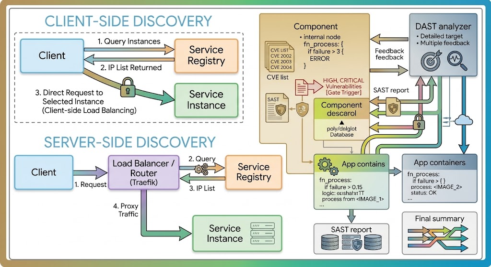
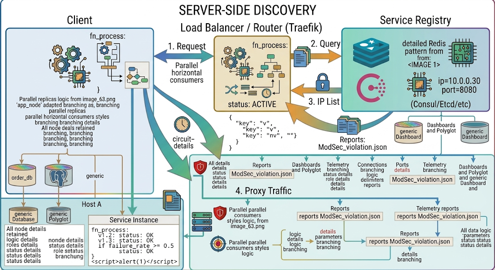
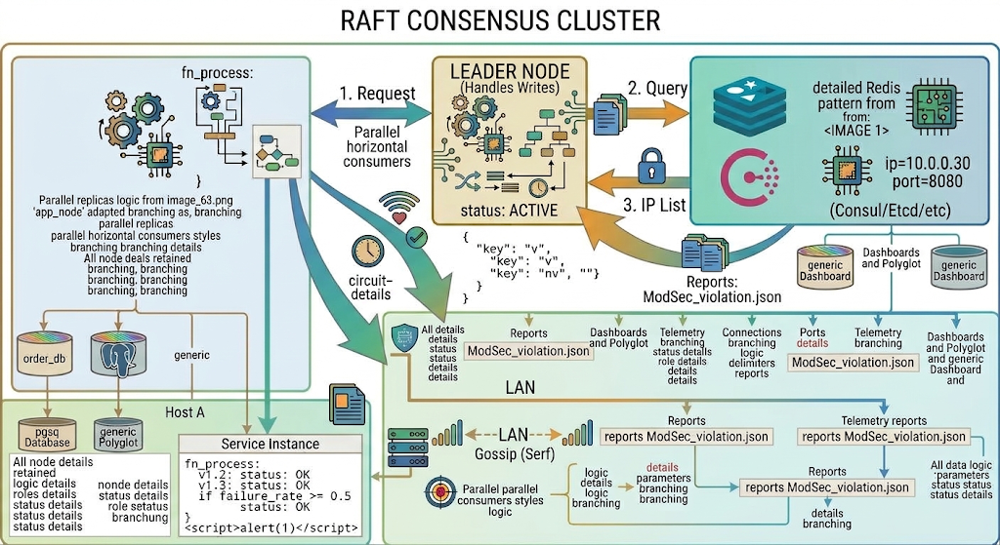

# Chapter 7: Service Discovery & Dynamic Routing

## 7.1 Principles of Service Discovery in Distributed Systems

In monolithic architectures, service communication relies on static hostnames, fixed IP addresses, or internal loopback interfaces. However, highly dynamic microservice environments—characterized by auto-scaling groups, short-lived container instances, and frequent rolling deployments—render static configurations unusable. Service discovery provides a mechanism that allows network locations (IP addresses and ports) of service instances to be dynamically discovered as they are provisioned, updated, or terminated.

### Client-Side Discovery vs. Server-Side Discovery





#### Client-Side Discovery

In client-side discovery, the client application queries the Service Registry directly to discover available service instances. The client executes its own load-balancing algorithm (e.g., Round-Robin, Least Connections, Random) and sends traffic straight to the target instance.

*   **Advantages**:
    *   Eliminates extra network hops by bypassing an intermediate API gateway or dedicated load balancer.
    *   Eliminates a single point of failure in the traffic path.
*   **Disadvantages**:
    *   Tightly couples the client application to the Service Registry API.
    *   Requires implementing discovery and load-balancing logic across every programming language and framework used across teams.

#### Server-Side Discovery
In server-side discovery, the client issues a standard network request to a router or load balancer (e.g., Traefik, NGINX, HAProxy). This intermediate component queries the Service Registry, selects a healthy endpoint, and proxies the client's request accordingly.

*   **Advantages**:
    *   Decouples discovery implementation details completely from client applications.
    *   Simplifies client code since services make calls to predictable, static logical endpoints.
*   **Disadvantages**:
    *   Introduces an additional network hop, slightly increasing request latency.
    *   Requires managing high-availability clusters for the load balancers/routers.

### Service Registry Architecture & Consensus Algorithms

The Service Registry acts as the central source of truth for the location, status, and metadata of microservices across an infrastructure. Because a compromised or stale registry causes widespread cascading system outages, registries must be distributed, highly available, and strongly consistent.

Modern registries use consensus algorithms—primarily **Raft**—to maintain consistency across cluster nodes.



#### Raft Protocol Essentials
*   **Leader-Based System**: A cluster consists of a single **Leader** and multiple **Followers**. All state modifications (such as registering services or updating health statuses) must pass through the Leader node.
*   **Log Replication**: When a write occurs, the Leader appends it to its log and replicates the entry to all Follower nodes.
*   **Quorum**: A write is committed only after a majority (Quorum) of cluster nodes acknowledge the log entry:
    $$\text{Quorum} = \lfloor N / 2 \rfloor + 1$$
    *(Where $N$ is the total number of server nodes).*
*   **Leader Elections**: If Followers stop receiving periodic heartbeats from the Leader within a randomized timeout window, a Follower converts to a **Candidate** state and initiates an election.

#### Failure Modes and Split-Brain Prevention
When network partitions divide a 5-node cluster into two groups—3 nodes on Side A and 2 nodes on Side B:
*   **Side A (3 nodes)**: Meets quorum ($\lfloor 5/2 \rfloor + 1 = 3$), accepts read/write transactions, and elects/maintains a Leader.
*   **Side B (2 nodes)**: Fails to establish quorum ($2 < 3$). Writes are rejected, preventing state divergence (**Split-Brain**).

---

### Key-Value Stores for Configuration Management

Service discovery solutions frequently incorporate key-value (KV) stores. These distributed KV engines store runtime parameters, secrets, feature flags, and dynamic routing configurations.

*   **Dynamic Updates**: Applications or proxies subscribe to changes in key paths using HTTP long polling or WebSocket-like primitives (e.g., Consul Watches, etcd Watchers).
*   **Hierarchical Namespace**: Keys are stored using Unix-like directory structures (e.g., `config/production/db_connection_string`).
*   **Atomic Transactions**: Multi-key operations succeed or fail in a single step, preserving data integrity across configuration changes.

---

## 7.2 HashiCorp Consul Cluster Deployment and Service Registration

HashiCorp Consul is a widely adopted enterprise solution for service discovery, key-value configuration, and service mesh architecture.

### Consul Architecture & Components

```
+---------------------------------------------------------------------------------------+
|                                CONSUL DATACENTER                                      |
|                                                                                       |
|   +-------------------------------------------------------------------------------+   |
|   |                           CONSUL SERVER CLUSTER                               |   |
|   |                                                                               |   |
|   |   +------------------+     Serf LAN Gossip    +------------------+            |   |
|   |   | Consul Server 1  | <--------------------> | Consul Server 2  |            |   |
|   |   | (Raft Leader)    |                        | (Raft Follower)  |            |   |
|   |   +------------------+                        +------------------+            |   |
|   |            ^                                           ^                      |   |
|   +------------|-------------------------------------------|----------------------+   |
|                | RPC Requests                              | RPC Requests             |
|                v                                           v                          |
|   +-----------------------------+             +-----------------------------+         |
|   |  Node A: Consul Agent Client|             |  Node B: Consul Agent Client|         |
|   |  +-----------------------+  |             |  +-----------------------+  |         |
|   |  |   Local App Service   |  |             |  |   Local App Service   |  |         |
|   |  +-----------------------+  |             |  +-----------------------+  |         |
|   +-----------------------------+             +-----------------------------+         |
+---------------------------------------------------------------------------------------+
```

*   **Consul Server**: Manages the Raft consensus, maintains the cluster state, processes RPC queries, and backs up key-value data.
*   **Consul Client**: A lightweight, stateless agent that runs on every physical host or virtual machine. It forwards RPC queries to Servers and performs localized health checks.
*   **Datacenter**: A local, low-latency network environment hosting connected Clients and Servers.
*   **Gossip Protocols (Serf)**:
    *   **LAN Gossip**: Uses memberlist libraries over UDP/TCP to manage local node membership and failure detection.
    *   **WAN Gossip**: Connects distinct Consul Server clusters across geographically separated datacenters.

---

### Deploying a Production-Grade 3-Node Consul Cluster

Below is an enterprise HCL configuration deployed identically across 3 Consul Server nodes (`10.0.10.11`, `10.0.10.12`, `10.0.10.13`).

#### Server 1 Configuration File (`/etc/consul.d/consul.hcl`)

```hcl
# Node Identity & Network Configuration
node_name  = "consul-server-01"
datacenter = "dc-enterprise-01"
data_dir   = "/var/lib/consul"
log_level  = "INFO"

# Binding and Advertising Setup
bind_addr   = "10.0.10.11"
client_addr = "0.0.0.0"

# Server & Cluster Formation Parameters
server           = true
bootstrap_expect = 3
retry_join       = ["10.0.10.11", "10.0.10.12", "10.0.10.13"]

# UI Enablement
ui_config {
  enabled = true
}

# Performance Tuning
performance {
  raft_multiplier = 1
}

# Enterprise Security & Telemetry Options
addresses {
  http = "0.0.0.0"
  dns  = "0.0.0.0"
}

connect {
  enabled = true
}
```

To configure Nodes 2 and 3, adjust `node_name` and `bind_addr` accordingly (`10.0.10.12` and `10.0.10.13`).

---

### Service Registration Methods

Consul supports service registration via declarative JSON/HCL configuration files read by the local agent, or dynamically through its HTTP API.

#### 1. Static Agent-Based Declarative Registration

Create `/etc/consul.d/order-service.hcl`:

```hcl
service {
  id      = "order-service-api-01"
  name    = "order-service"
  tags    = ["production", "v2.1", "api"]
  port    = 8080
  address = "10.0.10.25"

  meta = {
    owner      = "payments-team"
    git_commit = "a1b2c3d4"
  }

  check {
    id       = "order-service-check"
    name     = "HTTP Health Check on Port 8080"
    http     = "http://10.0.10.25:8080/health"
    method   = "GET"
    interval = "10s"
    timeout  = "2s"

    deregister_critical_service_after = "1m"
  }
}
```

Apply this configuration by executing:
```bash
consul reload
```

#### 2. Dynamic HTTP API Registration

Submit a JSON payload directly to the local Consul Client daemon:

```bash
curl --request PUT \
  --url http://127.0.0.1:8500/v1/agent/service/register \
  --header 'Content-Type: application/json' \
  --data '{
    "ID": "inventory-service-api-01",
    "Name": "inventory-service",
    "Tags": ["production", "v1.0"],
    "Address": "10.0.10.26",
    "Port": 9090,
    "Check": {
      "HTTP": "http://10.0.10.26:9090/actuator/health",
      "Interval": "15s",
      "Timeout": "3s"
    }
  }'
```

---

### Consul KV Operations and CLI Command Usage

Consul offers an enterprise key-value store accessible via both CLI and RESTful API endpoints.

```bash
# Write key-value records
consul kv put config/database/host "db-primary.internal"
consul kv put config/database/max_connections "200"

# Read key-value records
consul kv get config/database/host

# Obtain detailed metadata for a given key
consul kv get -detailed config/database/host

# List all keys under a specific path prefix
consul kv get -recurse config/

# Delete key-value records
consul kv delete config/database/max_connections
consul kv delete -recurse config/
```

#### REST API Equivalence

```bash
# Read key via REST API (Returns Base64 encoded payload)
curl -s http://127.0.0.1:8500/v1/kv/config/database/host | jq .

# Decode returned value using standard utilities
curl -s http://127.0.0.1:8500/v1/kv/config/database/host | jq -r '.[0].Value' | base64 --decode
```

---

## 7.3 Dynamic Reverse Proxying with Traefik and NGINX

Dynamic reverse proxies sit at the edge or ingress boundary of an enterprise network, automatically tracking changes in service infrastructure to route external requests without manual intervention or service restarts.

---

### Traefik: Edge Router Architecture

Unlike traditional proxies, Traefik natively discovers backend services by integrating directly with orchestrators and service registries (e.g., Docker, Kubernetes, Consul, etcd).

```
 +-------------------------------------------------------------------------------+
 |                              TRAEFIK ARCHITECTURE                             |
 |                                                                               |
 | [ Client Requests ]                                                           |
 |        |                                                                      |
 |        v                                                                      |
 |  +-----------+     Matches Rules     +------------+     Executes     +------+ |
 |  | EntryPoint| --------------------> |   Routers  | ----------------> | Middle|
 |  | (:80/:443)|                       +------------+    Transformations| wares| |
 |  +-----------+                             |                         +------+ |
 |                                            v                            |     |
 |                                      +------------+                     |     |
 |                                      |  Services  | <-------------------+     |
 |                                      +------------+                           |
 |                                            |                                  |
 |                                            v Directs Traffic                  |
 |                                  +-------------------+                        |
 |                                  | Backend Pods/VMs  |                        |
 |                                  +-------------------+                        |
 +-------------------------------------------------------------------------------+
```

#### Key Components
1.  **EntryPoints**: Network listeners bound to specific ports (e.g., port `80`, `443`).
2.  **Routers**: Analyzes incoming requests against defined criteria (e.g., Host, Path, Headers) to select the correct target service.
3.  **Middlewares**: Modifies requests or responses before they reach the backend service (e.g., path rewriting, rate limiting, header injection, authentication).
4.  **Services**: Configures target backend instances and manages load-balancing algorithms and health checks.

---

### Deploying Traefik with Consul Catalog Integration

#### Traefik Static Configuration (`/etc/traefik/traefik.yml`)

```yaml
global:
  checkNewVersion: false
  sendAnonymousUsage: false

log:
  level: INFO
  format: json

entryPoints:
  web:
    address: ":80"
  websecure:
    address: ":443"

providers:
  consulCatalog:
    refreshInterval: 15s
    prefix: "traefik"
    endpoint:
      address: "127.0.0.1:8500"
      scheme: "http"
    exposedByDefault: false

api:
  dashboard: true
  insecure: true
```

#### Registering Consul Services with Traefik Tags

To expose a service through Traefik using Consul, apply the required configuration tags (`traefik.enable=true`, `Host(...)`, etc.) during registration:

```hcl
service {
  id      = "payment-api-01"
  name    = "payment-service"
  port    = 8000
  address = "10.0.10.45"

  tags = [
    "traefik.enable=true",
    "traefik.http.routers.payments.rule=Host(`api.enterprise.internal`) && PathPrefix(`/payments`)",
    "traefik.http.routers.payments.entrypoints=web",
    "traefik.http.middlewares.payments-strip.stripprefix.prefixes=/payments",
    "traefik.http.routers.payments.middlewares=payments-strip@consulcatalog"
  ]

  check {
    id       = "payment-api-health"
    name     = "HTTP Payment Service Check"
    http     = "http://10.0.10.45:8000/health"
    interval = "5s"
    timeout  = "2s"
  }
}
```

---

### NGINX Integration with Consul Template

NGINX lacks native support for querying Consul directly. To achieve dynamic reverse proxying with NGINX, deploy **Consul Template**—a lightweight daemon that monitors Consul, renders updated NGINX configuration templates, and signals NGINX to reload gracefully when changes occur.

```
+-------------------------------------------------------------------------------+
|                      NGINX + CONSUL TEMPLATE ARCHITECTURE                     |
|                                                                               |
| +---------------+   Watch for Changes   +-----------------+                   |
| | Consul Server | --------------------> | Consul Template |                   |
| +---------------+                       +-----------------+                   |
|                                                  |                            |
|                                                  | 1. Renders Template File   |
|                                                  v                            |
|                                      +-----------------------+                |
|                                      | nginx.conf (Generated)|                |
|                                      +-----------------------+                |
|                                                  |                            |
|                                                  | 2. Triggers Reload         |
|                                                  v                            |
|                                      +-----------------------+                |
|                                      | NGINX Master Process  |                |
|                                      +-----------------------+                |
+-------------------------------------------------------------------------------+
```

#### Consul Template Configuration File (`/etc/consul-template/config.hcl`)

```hcl
consul {
  address = "127.0.0.1:8500"
}

template {
  source      = "/etc/nginx/templates/app.conf.tpl"
  destination = "/etc/nginx/conf.d/app.conf"
  command     = "systemctl reload nginx"
  perms       = 0644
}
```

#### NGINX Template File (`/etc/nginx/templates/app.conf.tpl`)

```nginx
upstream billing_backend {
  zone billing_backend 64k;
{{ range service "billing-service" }}
  server {{ .Address }}:{{ .Port }} max_fails=3 fail_timeout=10s;
{{ else }}
  # Fallback to prevent invalid NGINX syntax when no instances exist
  server 127.0.0.1:8080 down;
{{ end }}
}

server {
    listen 80;
    server_name billing.enterprise.internal;

    location / {
        proxy_pass http://billing_backend;
        proxy_set_header Host $host;
        proxy_set_header X-Real-IP $remote_addr;
        proxy_set_header X-Forwarded-For $proxy_add_x_forwarded_for;
        proxy_set_header X-Forwarded-Proto $scheme;
    }
}
```

#### Running Consul Template
```bash
consul-template -config=/etc/consul-template/config.hcl
```

---

## 7.4 Health Checking and Automated Traffic Rerouting

Automated health checks ensure that traffic is sent only to healthy service instances. When an instance fails, the service registry updates its status and signals edge proxies to reroute incoming traffic.

---

### Health Check Mechanisms in Consul

Consul supports several health check types:

| Health Check Type | Configuration Syntax Example | Use Case |
| :--- | :--- | :--- |
| **HTTP Check** | `http = "http://localhost:8080/health"` | Web applications, REST APIs, microservices exposing status endpoints. |
| **TCP Check** | `tcp = "localhost:5432"` | Databases (PostgreSQL, MySQL), Redis caches, raw TCP sockets. |
| **gRPC Check** | `grpc = "127.0.0.1:50051"` | High-performance microservices implementing gRPC health protocol. |
| **Script Check** | `args = ["/usr/local/bin/check_disk.sh"]` | Checking local host disk space, system memory, or OS-level metrics. |
| **TTL Check** | `"ttl": "30s"` | Internal jobs, cron tasks, batch workers reporting status periodically. |

#### Comprehensive Health Check Declarations in HCL

```hcl
service {
  id      = "user-auth-service-01"
  name    = "user-auth"
  port    = 8443
  address = "10.0.20.10"

  # 1. HTTP Endpoint Check
  check {
    id       = "auth-http-check"
    name     = "HTTP Health Endpoint"
    http     = "https://10.0.20.10:8443/actuator/health"
    tls_skip_verify = true
    interval = "10s"
    timeout  = "2s"
  }

  # 2. Local OS Disk Space Script Check
  check {
    id       = "auth-disk-check"
    name     = "Disk Space Evaluation"
    args     = ["/usr/lib/nagios/plugins/check_disk", "-w", "20%", "-c", "10%", "-p", "/var"]
    interval = "60s"
    timeout  = "5s"
  }
}
```

---

### Automated Failover and Circuit Breaking

Circuit breaking prevents cascading system failures by failing fast when downstream dependencies degrade or become unavailable.

```
                 +-----------------------------------+
                 |        CIRCUIT BREAKER STATES     |
                 |                                   |
                 |             +-------+             |
                 |   +-------> | CLOSED| <-------+   |
                 |   |         +-------+         |   |
                 | Success      |       | Threshold  |
                 | Threshold    |       | Exceeded   |
                 | Reached      v       v            |
                 |     +-------------------+         |
                 |     |     HALF-OPEN     |         |
                 |     +-------------------+         |
                 |              ^       ^            |
                 |   Timeout    |       | Consecutive|
                 |   Expires    |       | Failures   |
                 |              |       v            |
                 |             +---------+           |
                 |             |   OPEN  |           |
                 |             +---------+           |
                 +-----------------------------------+
```

#### Traefik Circuit Breaker Configuration
In Traefik, circuit breakers are declared using middleware tags registered alongside Consul services:

```hcl
service {
  id      = "order-processing-01"
  name    = "order-processor"
  port    = 8080
  address = "10.0.20.50"

  tags = [
    "traefik.enable=true",
    "traefik.http.routers.orders.rule=Host(`orders.enterprise.internal`)",
    # Trigger circuit breaker if 30% or more requests return 5xx HTTP codes over a evaluated window
    "traefik.http.middlewares.order-breaker.circuitbreaker.expression=NetworkErrorRatio() > 0.30",
    "traefik.http.routers.orders.middlewares=order-breaker@consulcatalog"
  ]
}
```

When triggered:
1.  **Closed State**: Normal operation. All traffic is routed to backend instances.
2.  **Open State**: When error conditions are met, Traefik trips the breaker and rejects requests immediately with `HTTP 503 Service Unavailable`, protecting downstream services from cascading overload.
3.  **Half-Open State**: After a configurable cooldown period, Traefik passes a limited number of test requests to verify recovery. If successful, the breaker resets to Closed; otherwise, it returns to Open.

---

## 7.5 Hands-On Lab: Integrating HashiCorp Consul with Traefik for Automatic Dynamic Routing

### Scenario Overview
An enterprise web platform requires dynamic routing for a microservices infrastructure using Traefik and Consul running within a Docker environment:

*   **Consul Server**: Operates as the central service registry on port `8500`.
*   **Traefik Edge Proxy**: Listens on port `80` for public HTTP traffic and port `8080` for its administrative dashboard.
*   **Microservice - Web API (Version 1)**: Scaling dynamically across multiple container instances.
*   **Microservice - Web API (Version 2)**: Scaled alongside V1 using dynamic routing tags to allow canary testing.

---

### Step 1: Create the Project Structure and Docker Compose Environment

Create an isolated directory for the deployment files:
```bash
mkdir -p ~/consul-traefik-lab/{consul-config,traefik-config}
cd ~/consul-traefik-lab
```

#### Create the Docker Compose File (`docker-compose.yml`)

```yaml
version: '3.8'

networks:
  microservices-net:
    driver: bridge
    ipam:
      config:
        - subnet: 172.28.0.0/16

services:
  consul:
    image: hashicorp/consul:1.16
    container_name: consul-server
    restart: always
    command: "agent -server -bootstrap-expect=1 -ui -client=0.0.0.0 -bind=172.28.0.2"
    networks:
      microservices-net:
        ipv4_address: 172.28.0.2
    ports:
      - "8500:8500"
      - "8600:8600/udp"
    healthcheck:
      test: ["CMD", "consul", "members"]
      interval: 5s
      timeout: 3s
      retries: 5

  traefik:
    image: traefik:v2.10
    container_name: traefik-proxy
    restart: always
    depends_on:
      consul:
        condition: service_healthy
    command:
      - "--api.insecure=true"
      - "--providers.consulcatalog=true"
      - "--providers.consulcatalog.endpoint.address=172.28.0.2:8500"
      - "--providers.consulcatalog.exposedByDefault=false"
      - "--entrypoints.web.address=:80"
    networks:
      - microservices-net
    ports:
      - "80:80"
      - "8080:8080"

  web-service-v1:
    image: nginxdemos/hello
    container_name: web-service-v1
    restart: always
    depends_on:
      consul:
        condition: service_healthy
    environment:
      - CONSUL_HTTP_ADDR=172.28.0.2:8500
    networks:
      - microservices-net
    entrypoint: >
      /bin/sh -c "
      apk add --no-cache curl jq &&
      curl -X PUT http://172.28.0.2:8500/v1/agent/service/register -H 'Content-Type: application/json' -d '{
        \"ID\": \"web-v1-instance-01\",
        \"Name\": \"web-app\",
        \"Tags\": [
          \"traefik.enable=true\",
          \"traefik.http.routers.webapp.rule=Host(\\`app.enterprise.internal\\`)\",
          \"traefik.http.routers.webapp.entrypoints=web\"
        ],
        \"Address\": \"web-service-v1\",
        \"Port\": 80,
        \"Check\": {
          \"HTTP\": \"http://web-service-v1:80\",
          \"Interval\": \"5s\",
          \"Timeout\": \"2s\"
        }
      }' && nginx -g 'daemon off;'"

  web-service-v2:
    image: nginxdemos/hello
    container_name: web-service-v2
    restart: always
    depends_on:
      consul:
        condition: service_healthy
    networks:
      - microservices-net
    entrypoint: >
      /bin/sh -c "
      apk add --no-cache curl jq &&
      curl -X PUT http://172.28.0.2:8500/v1/agent/service/register -H 'Content-Type: application/json' -d '{
        \"ID\": \"web-v2-instance-01\",
        \"Name\": \"web-app\",
        \"Tags\": [
          \"traefik.enable=true\",
          \"traefik.http.routers.webapp.rule=Host(\\`app.enterprise.internal\\`)\",
          \"traefik.http.routers.webapp.entrypoints=web\"
        ],
        \"Address\": \"web-service-v2\",
        \"Port\": 80,
        \"Check\": {
          \"HTTP\": \"http://web-service-v2:80\",
          \"Interval\": \"5s\",
          \"Timeout\": \"2s\"
        }
      }' && nginx -g 'daemon off;'"
```

---

### Step 2: Deploy the Infrastructure Stack

Launch all services in detached mode:
```bash
docker compose up -d
```

Verify that all containers are up and healthy:
```bash
docker compose ps
```

---

### Step 3: Validate Consul Registration and Traefik Routing Configuration

#### 1. Validate Consul Node and Service Registration
Verify that the `web-app` service and its two instances are registered in Consul:

```bash
curl -s http://127.0.0.1:8500/v1/catalog/service/web-app | jq .
```

Expected Output Excerpt:
```json
[
  {
    "ServiceID": "web-v1-instance-01",
    "ServiceName": "web-app",
    "ServiceTags": [
      "traefik.enable=true",
      "traefik.http.routers.webapp.rule=Host(`app.enterprise.internal`)",
      "traefik.http.routers.webapp.entrypoints=web"
    ],
    "ServiceAddress": "web-service-v1",
    "ServicePort": 80
  },
  {
    "ServiceID": "web-v2-instance-01",
    "ServiceName": "web-app",
    "ServiceTags": [
      "traefik.enable=true",
      "traefik.http.routers.webapp.rule=Host(`app.enterprise.internal`)",
      "traefik.http.routers.webapp.entrypoints=web"
    ],
    "ServiceAddress": "web-service-v2",
    "ServicePort": 80
  }
]
```

#### 2. Query Traefik API Routing State
Inspect Traefik's dynamic catalog configuration directly via its REST API:

```bash
curl -s http://127.0.0.1:8080/api/http/routers | jq .
```

Confirm that `webapp@consulcatalog` is listed with status `enabled`.

---

### Step 4: Verify Dynamic Load Balancing across Backend Endpoints

Send repeated HTTP requests specifying the configured `Host` header to verify round-robin routing across `web-service-v1` and `web-service-v2`:

```bash
for i in {1..6}; do
  curl -s -H "Host: app.enterprise.internal" http://127.0.0.1/ | grep -i "Server Name"
done
```

Sample Output:
```text
<p>Server Name: web-service-v1</p>
<p>Server Name: web-service-v2</p>
<p>Server Name: web-service-v1</p>
<p>Server Name: web-service-v2</p>
<p>Server Name: web-service-v1</p>
<p>Server Name: web-service-v2</p>
```

---

### Step 5: Test Automated Failover via Simulated Health Check Failure

Simulate a failure in `web-service-v1` by stopping its container:

```bash
docker stop web-service-v1
```

#### 1. Observe Consul Health Check Updates
Query Consul for critical health checks:

```bash
curl -s http://127.0.0.1:8500/v1/health/state/critical | jq .
```

#### 2. Test Traffic Rerouting
Re-run the traffic test loop. Traefik should detect the failure from Consul's status change and route all incoming requests exclusively to the healthy `web-service-v2` instance:

```bash
for i in {1..4}; do
  curl -s -H "Host: app.enterprise.internal" http://127.0.0.1/ | grep -i "Server Name"
done
```

Expected Output:
```text
<p>Server Name: web-service-v2</p>
<p>Server Name: web-service-v2</p>
<p>Server Name: web-service-v2</p>
<p>Server Name: web-service-v2</p>
```

#### 3. Restore Service and Verify Recovery
Restart the container and confirm automatic recovery in Traefik's load balancer pool:

```bash
docker start web-service-v1
sleep 10

for i in {1..4}; do
  curl -s -H "Host: app.enterprise.internal" http://127.0.0.1/ | grep -i "Server Name"
done
```

Traffic automatically redistributes across both healthy backends.

---

### Step 6: Environment Clean Up

Tear down the lab containers and associated networks:

```bash
docker compose down -v
```

---

## Quick-Reference Summary & Verification Flashcards

| Concept / Objective | Primary Tool / Mechanism | Critical Command or File Path | Key Operational Metric / Behavioral Result |
| :--- | :--- | :--- | :--- |
| **Raft Quorum Calculation** | Consensus Algorithm | $\lfloor N / 2 \rfloor + 1$ | $N=3 \rightarrow Q=2$; $N=5 \rightarrow Q=3$. Prevents split-brain state during network partitions. |
| **Consul Configuration** | Declarative HCL Setup | `/etc/consul.d/consul.hcl` | `bootstrap_expect` defines required node count for cluster bootstrap. |
| **Consul Service Registration** | REST API Payload | `PUT /v1/agent/service/register` | Updates catalogue; includes HTTP, TCP, or script-based health checks. |
| **Traefik Dynamic Provider** | Consul Catalog Integration | `--providers.consulcatalog=true` | Reads tags dynamically from Consul to configure routers, entrypoints, and middlewares without restarts. |
| **NGINX Template Updates** | Consul Template Daemon | `consul-template -config=cfg.hcl` | Renders configuration files dynamically and triggers graceful reloads (`systemctl reload nginx`). |
| **Circuit Breaking** | Traefik Middleware | `circuitbreaker.expression` | Trips to `Open` state when error thresholds are crossed, returning `HTTP 503` to prevent cascading failures. |
