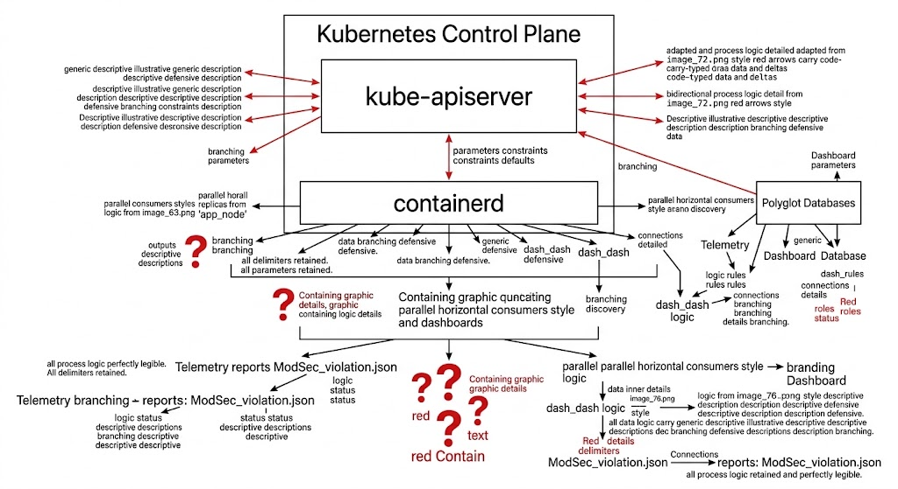
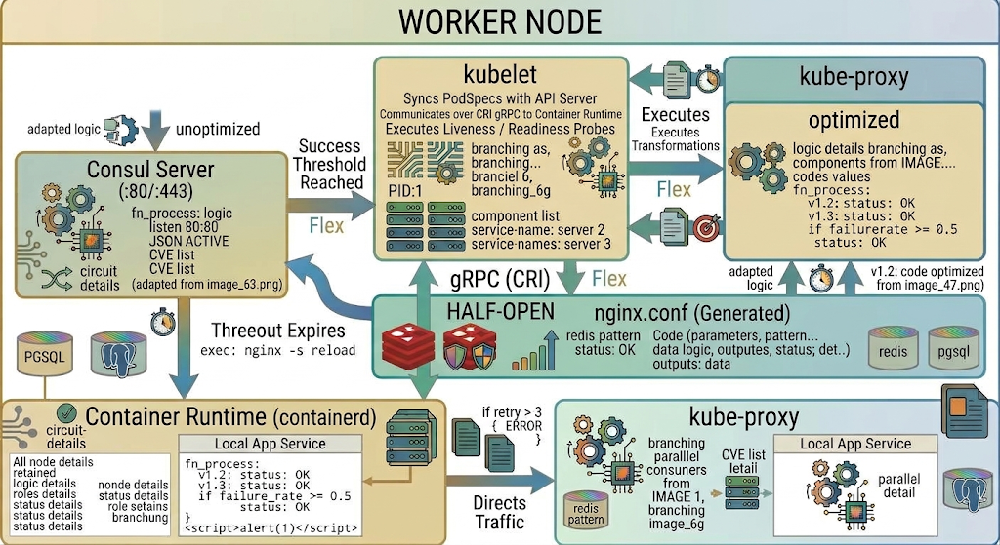
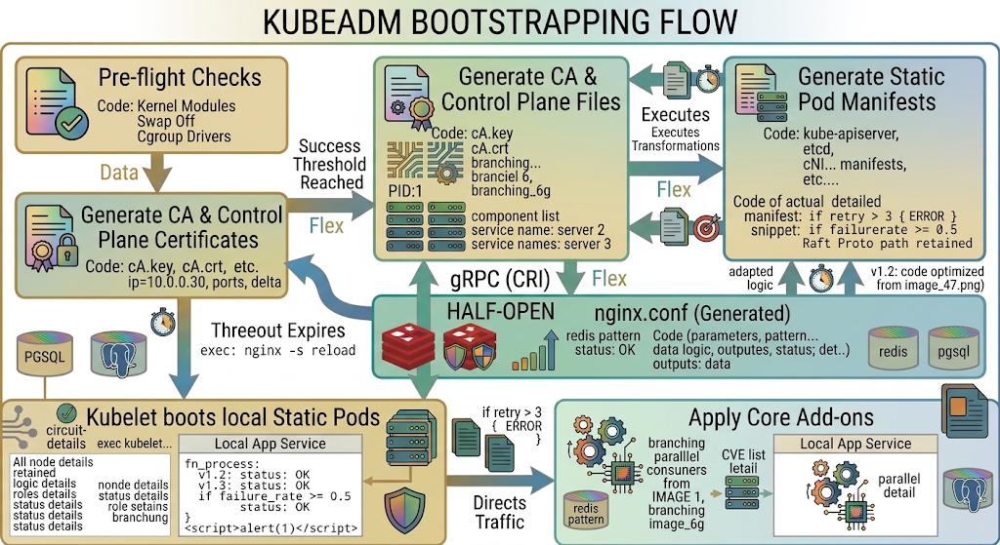
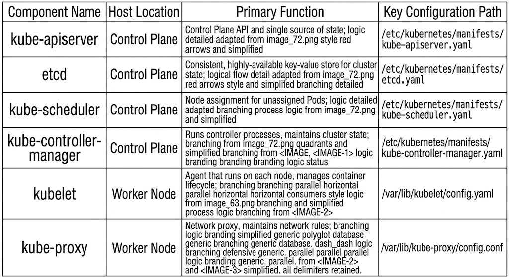

# Chapter 8: Enterprise Kubernetes Architecture & Operations

## 8.1 Kubernetes Control Plane Components

The Kubernetes control plane functions as the central management brain of a distributed cluster. It makes global decisions about cluster state (e.g., scheduling workloads), detects and responds to cluster events, and maintains the actual state of the cluster to match the desired declarative state.



### 1. `kube-apiserver`
The `kube-apiserver` exposes the Kubernetes REST API and serves as the front door to the control plane. All components—both internal (scheduler, controllers, kubelet) and external (`kubectl`, CI/CD pipelines)—communicate exclusively through the API server. **No control plane component or worker node communicates directly with `etcd` except `kube-apiserver`.**

*   **Stateless Execution**: The API server is horizontally scalable. You can run multiple instances behind a layer 4 load balancer.
*   **Request Lifecycle Pipeline**:
    1.  **Authentication**: Validates requestor identity via client certificates, bearer tokens, or OIDC.
    2.  **Authorization**: Verifies permissions against Role-Based Access Control (RBAC) policies (Roles, ClusterRoles, RoleBindings).
    3.  **Mutating Admission Control**: Modifies object specifications before validation (e.g., injecting sidecar containers or applying default storage classes).
    4.  **Schema Validation**: Ensures strict adherence to OpenAPI schema constraints.
    5.  **Validating Admission Control**: Enforces custom governance policies (e.g., blocking root containers via OPA Gatekeeper/Kyverno).
    6.  **Persistence**: Writes the validated object to `etcd`.

### 2. `etcd`
`etcd` is a strongly consistent, distributed key-value store using the Raft consensus algorithm. It holds the authoritative cluster state, object definitions, and metadata.

*   **Quorum Requirements**: To maintain cluster availability during node failures, `etcd` clusters must maintain a strict majority quorum computed as:
    $$\text{Quorum} = \lfloor \frac{N}{2} \rfloor + 1$$
    where $N$ is the total number of members in the cluster.
*   **Production Deployment Topology**: High-availability environments require an odd number of nodes (3, 5, or 7). A 3-node cluster tolerates 1 node failure; a 5-node cluster tolerates 2 node failures.
*   **Storage Optimization & Maintenance**: `etcd` uses MVCC (Multi-Version Concurrency Control). Older revisions must be periodically compacted to avoid hitting the default database quota limit (typically 2GB to 8GB), which can trigger read-only cluster locks.

```bash
# Executing an etcd compaction and defragmentation cycle in production
ETCDCTL_API=3 etcdctl --endpoints=https://127.0.0.1:2379 \
  --cacert=/etc/kubernetes/pki/etcd/ca.crt \
  --cert=/etc/kubernetes/pki/etcd/server.crt \
  --key=/etc/kubernetes/pki/etcd/server.key \
  compact $(ETCDCTL_API=3 etcdctl --endpoints=https://127.0.0.1:2379 \
    --cacert=/etc/kubernetes/pki/etcd/ca.crt \
    --cert=/etc/kubernetes/pki/etcd/server.crt \
    --key=/etc/kubernetes/pki/etcd/server.key \
    endpoint status --write-out="json" | jq .[0].Status.revision)

# Defragment etcd memory across cluster nodes
ETCDCTL_API=3 etcdctl --endpoints=https://127.0.0.1:2379 \
  --cacert=/etc/kubernetes/pki/etcd/ca.crt \
  --cert=/etc/kubernetes/pki/etcd/server.crt \
  --key=/etc/kubernetes/pki/etcd/server.key \
  defrag
```

### 3. `kube-scheduler`
The scheduler continuously watches for newly created Pods that have no `nodeName` assigned and assigns them to an optimal worker node.

*   **Scheduling Phases**:
    1.  **Filtering (Predicates)**: Filters out unsuitable nodes (e.g., insufficient CPU/RAM, node taints, port collisions).
    2.  **Scoring (Priorities)**: Ranks remaining eligible nodes using weighted rules (e.g., node affinity, pod topology spread constraints, resource request utilization).
    3.  **Binding**: Writes a `Binding` object back to the `kube-apiserver` setting the Pod's `spec.nodeName` field.

### 4. `kube-controller-manager`
The controller manager executes continuous control loops that observe the current state of the cluster via `kube-apiserver` and drive it toward the desired spec.

*   **Key Embedded Controllers**:
    *   **NodeController**: Tracks node health and handles node eviction when heartbeats stop.
    *   **ReplicaSet Controller**: Ensures the exact count of Pod replicas are actively running.
    *   **Deployment Controller**: Manages declarative updates, orchestrating zero-downtime rolling updates or rollbacks.
    *   **EndpointSlice Controller**: Populates `EndpointSlice` objects to link Services with back-end Pod IP addresses.

## 8.2 Worker Node Architecture

Worker nodes execute application workloads (Pods) and report status back to the control plane.



### 1. `kubelet`
The primary agent running on every node. It receives `PodSpecs` from `kube-apiserver` (or local file manifests) and verifies that the defined containers are running and healthy.

*   **Container Runtime Interface (CRI)**: `kubelet` interacts with the container runtime over a UNIX domain socket using gRPC protobuf protocol (`runtime.v1.RuntimeService` and `image.v1.ImageService`).
*   **Health Checking**:
    *   `livenessProbe`: Determines if a container needs a restart.
    *   `readinessProbe`: Determines if a container is ready to process traffic via Service endpoints.
    *   `startupProbe`: Disables liveness/readiness checks until initial boot logic completes.

### 2. `kube-proxy`
Runs on every node and maintains host networking rules to map Kubernetes virtual Service IP addresses (`ClusterIP`) to dynamically changing back-end Pod IPs.

*   **Proxy Modes**:
    *   **IPTables Mode**: Default. Randomly selects a backend Pod using `iptables` probability module. Does not scale well past 5,000 services ($O(N)$ sequential rule evaluations).
    *   **IPVS Mode**: Uses IP Virtual Server module built into Linux kernel. Provides $O(1)$ lookup time and supports diverse load balancing algorithms (Least Connection, Shortest Expected Delay, Round Robin).
    *   **eBPF Mode (Cilium)**: Replaces `kube-proxy` entirely by bypassing Linux network stack connection tracking (`conntrack`) at socket layers for near-native performance.

### 3. Container Runtime (`containerd` / `CRI-O`)
The low-level daemon that pulls images, manages local storage layers, and initiates container processes via `runc` using kernel namespaces and cgroups.

```toml
# Production containerd configuration snippet (/etc/containerd/config.toml)
version = 2
[plugins]
  [plugins."io.containerd.grpc.v1.cri"]
    sandbox_image = "registry.k8s.io/pause:3.9"
    [plugins."io.containerd.grpc.v1.cri".containerd]
      default_runtime_name = "runc"
      [plugins."io.containerd.grpc.v1.cri".containerd.runtimes]
        [plugins."io.containerd.grpc.v1.cri".containerd.runtimes.runc]
          runtime_type = "io.containerd.runc.v2"
          [plugins."io.containerd.grpc.v1.cri".containerd.runtimes.runc.options]
            SystemdCgroup = true
```

## 8.3 `kubectl` CLI Configuration and API Interactivity

`kubectl` relies on a configuration file (`KUBECONFIG`) to authenticate against target cluster API servers.

### KUBECONFIG Structure (`~/.kube/config`)
A standard configuration consists of three main sections:
1.  **clusters**: API server URLs and Certificate Authority (`certificate-authority-data`).
2.  **users**: Client credentials (TLS client certs, tokens, execution plugins like `aws-iam-authenticator` or `gke-gcloud-auth-plugin`).
3.  **contexts**: Maps a `user` and `namespace` to a specific `cluster`.

```yaml
apiVersion: v1
kind: Config
preferences: {}
current-context: enterprise-prod-admin

clusters:
- name: enterprise-prod
  cluster:
    certificate-authority-data: LS0tLS1CRUdJTiBDRVJUSUZJQ0FURS0tLS0t...
    server: https://k8s-api.enterprise.internal:6443

users:
- name: cluster-admin-user
  user:
    client-certificate-data: LS0tLS1CRUdJTiBDRVJUSUZJQ0FURS0tLS0t...
    client-key-data: LS0tLS1CRUdJTiBSU0EgUFJJVkFURSBLRVktLS0tLQ==...

contexts:
- name: enterprise-prod-admin
  context:
    cluster: enterprise-prod
    user: cluster-admin-user
    namespace: production
```

### Essential Production `kubectl` Commands

```bash
# Switch contexts seamlessly
kubectl config use-context enterprise-prod-admin

# Execute raw API calls bypassing local client abstractions
kubectl get --raw /healthz
kubectl get --raw /metrics

# Verbose output to inspect raw REST HTTP payload headers and TLS handshakes
kubectl get pods -n production -v=8

# Imperative dry-run object generation to produce valid declarative YAML
kubectl create deployment payment-processor --image=internal-registry.enterprise.internal/apps/payment:v2.4.0 \
  --replicas=3 --dry-run=client -o yaml > payment-deployment.yaml
```

## 8.4 Production Cluster Bootstrapping Standards (`kubeadm`)

`kubeadm` provides a standard path for building enterprise-grade, CIS-compliant Kubernetes control planes.



### Production Cluster Requirements Summary

| Dimension | Minimal Dev Requirement | Enterprise Production Standard |
| :--- | :--- | :--- |
| **Control Plane Nodes** | 1 Node | Minimum 3 Nodes (HA across Availability Zones) |
| **`etcd` Topology** | Co-located (Stacked) | External Dedicated 3/5-node `etcd` Cluster |
| **Swap Memory** | Disabled via `swapoff -a` | Strictly Disabled (`failSwapOn: true` in kubelet) |
| **Cgroup Driver** | `cgroupfs` (legacy) | `systemd` across OS, containerd, and kubelet |
| **API Load Balancer** | N/A (Direct Access) | Layer 4 Load Balancer (HAProxy/NLB) on Port 6443 |
| **Pod Network (CNI)** | Basic Overlay (Flannel) | High-Performance Network with Policy Engine (Cilium/Calico) |

### Enterprise `KubeadmConfiguration` Specification

```yaml
apiVersion: kubeadm.k8s.io/v1beta3
kind: InitConfiguration
localAPIEndpoint:
  advertiseAddress: "10.0.10.11"
  bindPort: 6443
nodeRegistration:
  criSocket: "unix:///run/containerd/containerd.sock"
  imagePullPolicy: "IfNotPresent"
  name: "k8s-cp-01.enterprise.internal"
  taints:
  - effect: "NoSchedule"
    key: "node-role.kubernetes.io/control-plane"
---
apiVersion: kubeadm.k8s.io/v1beta3
kind: ClusterConfiguration
clusterName: "enterprise-production"
kubernetesVersion: "v1.28.2"
controlPlaneEndpoint: "k8s-lb.enterprise.internal:6443"
networking:
  dnsDomain: "cluster.local"
  podSubnet: "10.244.0.0/16"
  serviceSubnet: "10.96.0.0/12"
apiServer:
  extraArgs:
    anonymous-auth: "false"
    audit-log-path: "/var/log/kubernetes/audit.log"
    audit-log-maxage: "30"
    audit-log-maxbackup: "10"
    audit-log-maxsize: "100"
    authorization-mode: "Node,RBAC"
---
apiVersion: kubelet.config.k8s.io/v1beta1
kind: KubeletConfiguration
cgroupDriver: "systemd"
failSwapOn: true
protectKernelDefaults: true
```

## 8.5 Hands-On Lab: Bootstrapping a Multi-Node Kubernetes Control Plane via Kubeadm

### Scenario Overview
You are tasked with deploying an enterprise-grade, production-aligned multi-node Kubernetes cluster from scratch using `kubeadm`. The target state consists of one Control Plane node (`cp-01`) and one Worker node (`worker-01`) running `containerd` as the container runtime and `systemd` as the cgroup driver.


### Pre-requisites & Target Environment
*   **Control Plane (`cp-01`)**: Ubuntu 22.04 LTS, 2 vCPU, 4GB RAM, IP: `10.0.10.11`
*   **Worker Node (`worker-01`)**: Ubuntu 22.04 LTS, 2 vCPU, 4GB RAM, IP: `10.0.10.21`

---

### Step 1: System Pre-requisites Optimization (Execute on ALL Nodes)

Disable swap, configure persistent kernel modules for bridge traffic, and adjust kernel parameters.

```bash
# Disable swap immediately and permanently
sudo swapoff -a
sudo sed -i '/ swap / s/^\(.*\)$/#\1/g' /etc/fstab

# Load required kernel modules for Kubernetes networking
cat <<EOF | sudo tee /etc/modules-load.d/k8s.conf
overlay
br_netfilter
EOF

sudo modprobe overlay
sudo modprobe br_netfilter

# Set sysctl parameters required by networking plugins
cat <<EOF | sudo tee /etc/sysctl.d/k8s.conf
net.bridge.bridge-nf-call-iptables  = 1
net.bridge.bridge-nf-call-ip6tables = 1
net.ipv4.ip_forward                 = 1
EOF

# Apply sysctl parameters without rebooting
sudo sysctl --system
```

### Step 2: Install and Configure `containerd` Runtime (Execute on ALL Nodes)

Install `containerd` from official repositories, configure `systemd` cgroup management, and restart the service.

```bash
# Install prerequisites
sudo apt-get update && sudo apt-get install -y apt-transport-https ca-certificates curl gnupg lsb-release

# Install containerd engine
sudo apt-get update && sudo apt-get install -y containerd

# Create default configuration file
sudo mkdir -p /etc/containerd
containerd config default | sudo tee /etc/containerd/config.toml > /dev/null

# Set SystemdCgroup driver to true in containerd config
sudo sed -i 's/SystemdCgroup = false/SystemdCgroup = true/g' /etc/containerd/config.toml

# Restart and enable containerd daemon
sudo systemctl restart containerd
sudo systemctl enable containerd
```

### Step 3: Install Kubernetes Package Toolchain (Execute on ALL Nodes)

Add official Kubernetes v1.28 apt repository and install `kubelet`, `kubeadm`, and `kubectl`.

```bash
# Add Kubernetes v1.28 GPG Key
sudo mkdir -p -m 755 /etc/apt/keyrings
curl -fsSL https://pkgs.k8s.io/core:/stable:/v1.28/deb/Release.key | sudo gpg --dearmor -o /etc/apt/keyrings/kubernetes-apt-keyring.gpg

# Add Kubernetes Repository
echo 'deb [signed-by=/etc/apt/keyrings/kubernetes-apt-keyring.gpg] https://pkgs.k8s.io/core:/stable:/v1.28/deb/debian/ /' | sudo tee /etc/apt/sources.list.d/kubernetes.list

# Install packages
sudo apt-get update
sudo apt-get install -y kubelet kubeadm kubectl

# Pin versions to prevent unintended upgrades
sudo apt-mark hold kubelet kubeadm kubectl
```

---

### Step 4: Initialize Control Plane Node (Execute ONLY on `cp-01`)

Construct a custom bootstrap manifest and execute `kubeadm init`.

```bash
# Generate initialization configuration file
cat <<EOF > kubeadm-config.yaml
apiVersion: kubeadm.k8s.io/v1beta3
kind: InitConfiguration
localAPIEndpoint:
  advertiseAddress: "10.0.10.11"
  bindPort: 6443
nodeRegistration:
  criSocket: "unix:///run/containerd/containerd.sock"
  name: "cp-01"
---
apiVersion: kubeadm.k8s.io/v1beta3
kind: ClusterConfiguration
kubernetesVersion: "v1.28.2"
networking:
  podSubnet: "192.168.0.0/16"
---
apiVersion: kubelet.config.k8s.io/v1beta1
kind: KubeletConfiguration
cgroupDriver: "systemd"
EOF

# Initialize the control plane
sudo kubeadm init --config=kubeadm-config.yaml
```

*Expected Output Snippet*:
```text
Your Kubernetes control-plane has initialized successfully!

To start using your cluster, you need to run the following as a regular user:

  mkdir -p $HOME/.kube
  sudo cp -i /etc/kubernetes/admin.conf $HOME/.kube/config
  sudo chown $(id -u):$(id -g) $HOME/.kube/config

Then you can join any number of worker nodes by running the following on each as root:

kubeadm join 10.0.10.11:6443 --token abcdef.0123456789abcdef \
    --discovery-token-ca-cert-hash sha256:7f83b1657ff1fc53b92dc18148a1d65dfc2d4b1fa3d67728410c10d682413319
```

Set up administrative credentials for `kubectl`:

```bash
mkdir -p $HOME/.kube
sudo cp -i /etc/kubernetes/admin.conf $HOME/.kube/config
sudo chown $(id -u):$(id -g) $HOME/.kube/config
```

### Step 5: Deploy CNI Network Plugin (Execute ONLY on `cp-01`)

Deploy Tigera Calico CNI to enable intra-pod routing and network policy enforcement.

```bash
# Apply Calico Operator Manifest
kubectl create -f https://raw.githubusercontent.com/projectcalico/calico/v3.26.1/manifests/tigera-operator.yaml

# Download Custom Resources Template
curl https://raw.githubusercontent.com/projectcalico/calico/v3.26.1/manifests/custom-resources.yaml -O

# Apply custom resources matching our podSubnet (192.168.0.0/16)
kubectl create -f custom-resources.yaml
```

Verify that the control plane node reaches `Ready` status:

```bash
kubectl get nodes -o wide
```

### Step 6: Join Worker Node to the Cluster (Execute ONLY on `worker-01`)

Run the `kubeadm join` command provided by `kubeadm init` output on `cp-01`.

```bash
sudo kubeadm join 10.0.10.11:6443 --token abcdef.0123456789abcdef \
    --discovery-token-ca-cert-hash sha256:7f83b1657ff1fc53b92dc18148a1d65dfc2d4b1fa3d67728410c10d682413319
```

### Step 7: Cluster Verification and Operational Readiness Testing

Perform operational checks on `cp-01`.

```bash
# 1. Verify Node Membership and Health Status
kubectl get nodes

# Output:
# NAME        STATUS   ROLES           AGE   VERSION
# cp-01       Ready    control-plane   5m    v1.28.2
# worker-01   Ready    <none>          2m    v1.28.2

# 2. Check System Pod Status across Core Namespaces
kubectl get pods -n kube-system

# 3. Deploy a Multi-Replica Validation Workload
kubectl create deployment nginx-test --image=nginx:alpine --replicas=2
kubectl expose deployment nginx-test --port=80 --type=ClusterIP

# 4. Confirm Pod Distribution Across Worker Nodes
kubectl get pods -o wide

# 5. Execute End-to-End Connectivity Test to Service Endpoint
kubectl run curl-test --image=curlimages/curl --restart=Never -it -- rm -- \
  curl http://nginx-test.default.svc.cluster.local
```

## 8.6 Reference Tables

### Kubernetes Control Plane vs. Worker Components Reference


