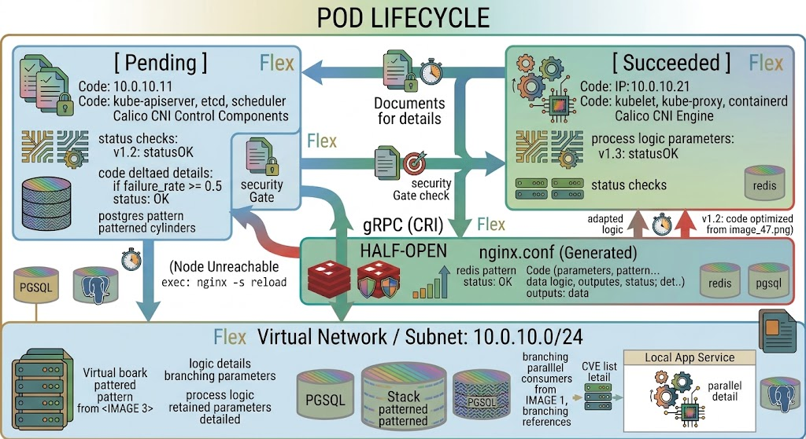
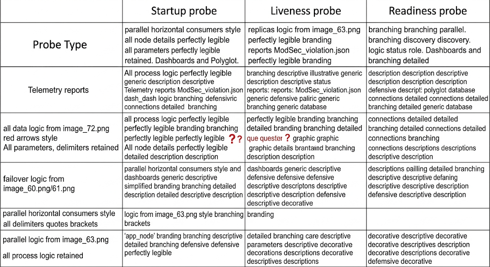
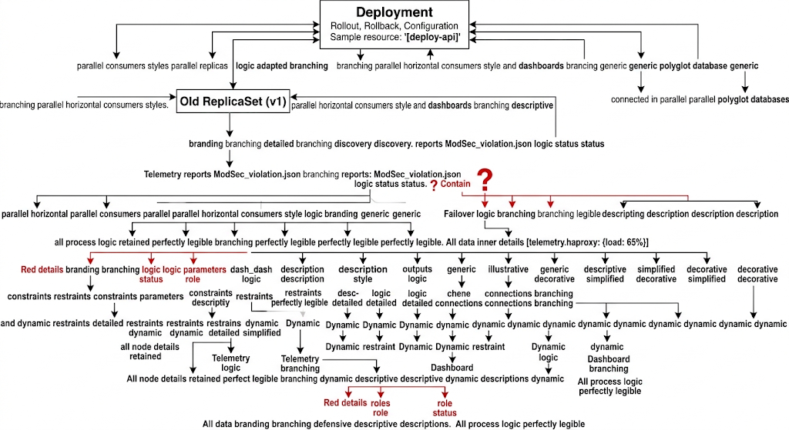
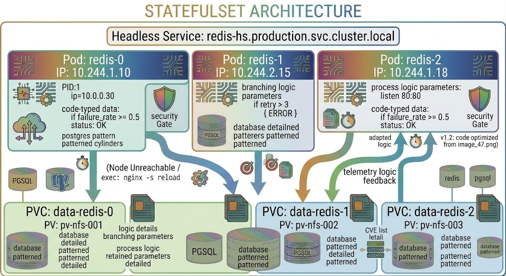
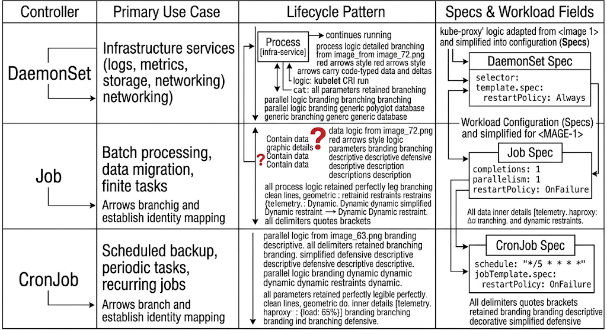

# Chapter 9: Kubernetes Workload Management

In enterprise production environments, managing applications on Kubernetes demands a deep understanding of workload primitives, stateful versus stateless abstractions, declarative deployment strategies, and traffic routing mechanisms. This chapter delivers an operational guide designed for platform engineers and operators preparing for the LPI 701-200 DevOps Tools Engineer exam objectives.

## 9.1 Pod Lifecycle, Phase Transitions, and Health Probes

A Pod is the smallest deployable atomic unit in Kubernetes. Understanding its lifecycle phases, container state transitions, and health monitoring hooks is essential for ensuring application availability and self-healing.

### Pod Lifecycle Phases & State Machine

A Pod passes through distinct phases during its lifetime:



1. **Pending**: The API server has accepted the Pod manifest, but one or more containers have not been scheduled or created. This includes time spent downloading container images over the network.
2. **Running**: The Pod has been bound to a worker node, and all containers have been created. At least one container is currently running, or is in the process of starting or restarting.
3. **Succeeded**: All containers in the Pod have terminated successfully (exit code `0`) and will not be restarted (typical for `Job` workloads).
4. **Failed**: All containers in the Pod have terminated, and at least one container has terminated in failure (non-zero exit code).
5. **Unknown**: The state of the Pod cannot be obtained, typically due to a communication failure between the control plane (`kube-apiserver`) and the node (`kubelet`).

### Init Containers vs. App Containers

* **Init Containers**: Run sequentially to completion before any primary application containers start. If an init container fails, the `kubelet` restarts it according to the Pod's `restartPolicy`. They are ideal for pre-flight tasks such as database schema migrations, dynamic configuration rendering, or waiting for dependent network services to become reachable.
* **App Containers**: Run in parallel after all init containers complete successfully.

### Pod Restart Policies

Defined via `spec.restartPolicy`:
* `Always` (Default): Restarts the container automatically if it exits, regardless of exit code. Used for long-running services (Deployments, StatefulSets).
* `OnFailure`: Restarts the container only if it exits with a non-zero exit code. Used for batch jobs.
* `Never`: Does not restart the container under any circumstance.

### Container Health Probes: Liveness, Readiness, and Startup

The `kubelet` uses three types of health probes to monitor container health and manage runtime behavior:
 


#### Probe Mechanisms

1. `httpGet`: Performs an HTTP `GET` request against the container's IP on a specified port and path. Status codes $\ge 200$ and $< 400$ indicate success.
2. `tcpSocket`: Attempts to establish a TCP connection to the specified port. If open, the probe succeeds.
3. `exec`: Runs a specific command inside the container. Exit code `0` indicates success.
4. `grpc`: Checks the health status using the gRPC Health Checking Protocol.

#### Production Production-Ready Manifest with Probes
```yaml
apiVersion: v1
kind: Pod
metadata:
  name: enterprise-app
  namespace: production
  labels:
    app.kubernetes.io/name: enterprise-app
    app.kubernetes.io/tier: backend
spec:
  restartPolicy: Always
  initContainers:
  - name: init-db-check
    image: busybox:1.36
    command: ['sh', '-c', 'until nc -z -w 2 postgres-db.production.svc.cluster.local 5432; do echo waiting for db; sleep 2; done;']
  containers:
  - name: primary-api
    image: registry.enterprise.internal/apps/api:v2.1.0
    ports:
    - containerPort: 8080
      name: http
    startupProbe:
      httpGet:
        path: /healthz/startup
        port: http
      initialDelaySeconds: 5
      periodSeconds: 5
      failureThreshold: 30 # Allows up to 150 seconds for initial startup
    livenessProbe:
      httpGet:
        path: /healthz/liveness
        port: http
      periodSeconds: 10
      timeoutSeconds: 2
      failureThreshold: 3
    readinessProbe:
      httpGet:
        path: /healthz/readiness
        port: http
      periodSeconds: 5
      timeoutSeconds: 2
      successThreshold: 1
      failureThreshold: 2
```

---

## 9.2 Deployments, Rollouts, and Rollback Mechanics

A `Deployment` controller manages declarative updates for stateless applications by orchestrating underlying `ReplicaSets`.

### Deployment Architecture & Controller Hierarchy



### Update Strategies: RollingUpdate vs. Recreate

#### 1. Recreate Strategy (`spec.strategy.type: Recreate`)
Kills all existing Pods simultaneously before creating new Pods. Causes application downtime, but prevents multi-version concurrency issues during database updates.

#### 2. RollingUpdate Strategy (`spec.strategy.type: RollingUpdate`)
Gradually replaces old Pods with new ones without downtime. Behavior is governed by two parameters:
* `maxSurge`: The maximum number of Pods that can be created above the desired number of Pods during an update. Can be an absolute number (e.g., `2`) or a percentage (e.g., `25%`).
* `maxUnavailable`: The maximum number of Pods that can be unavailable during the update process. Can be an absolute number or a percentage.

```yaml
spec:
  replicas: 10
  strategy:
    type: RollingUpdate
    rollingUpdate:
      maxSurge: 25%        # Up to 13 Pods total during rollout
      maxUnavailable: 10%  # At least 9 Pods must remain active
```

### Rollout Lifecycle Commands and Revision Management

Execute deployments and monitor revision histories using native `kubectl` commands:

```bash
# Trigger a rolling update by updating the container image
kubectl set image deployment/payment-api payment-api=registry.enterprise.internal/apps/payment:v2.2.0 -n production

# Monitor rollout status in real-time
kubectl rollout status deployment/payment-api -n production

# View deployment revision history
kubectl rollout history deployment/payment-api -n production

# Inspect detailed information of a specific revision
kubectl rollout history deployment/payment-api --revision=3 -n production

# Pause rollout (useful for canary testing)
kubectl rollout pause deployment/payment-api -n production

# Resume paused rollout
kubectl rollout resume deployment/payment-api -n production

# Rollback to the immediate previous revision
kubectl rollout undo deployment/payment-api -n production

# Rollback to a specific target revision
kubectl rollout undo deployment/payment-api --to-revision=2 -n production
```

---

## 9.3 StatefulSets: Ordered Provisioning and Persistent Identity

`StatefulSet` is the workload API object used to manage stateful applications, such as distributed databases (e.g., PostgreSQL, Cassandra) or message queues (e.g., Apache Kafka).

### Key Features of StatefulSets

1. **Unique Network Identifier**: Pods receive a deterministic, sticky ordinal index ($0, 1, 2, \dots$) and stable DNS names formatted as `<pod-name>.<service-name>.<namespace>.svc.cluster.local`.
2. **Stable Storage**: Storage is provisioned via `volumeClaimTemplates`. Each Pod gets its own `PersistentVolumeClaim` (PVC) that persists across Pod reschedules or deletions.
3. **Ordered Deployment and Scaling**: By default, Pods are created sequentially from $0$ to $N-1$, and terminated in reverse order ($N-1$ down to $0$).



### Production StatefulSet Manifest with Headless Service

```yaml
apiVersion: v1
kind: Service
metadata:
  name: redis-hs
  namespace: production
  labels:
    app: redis
spec:
  clusterIP: None # Defines this as a Headless Service
  ports:
  - port: 6379
    name: redis
  selector:
    app: redis
---
apiVersion: apps/v1
kind: StatefulSet
metadata:
  name: redis
  namespace: production
spec:
  serviceName: "redis-hs"
  replicas: 3
  podManagementPolicy: OrderedReady # Options: OrderedReady or Parallel
  updateStrategy:
    type: RollingUpdate
  selector:
    matchLabels:
      app: redis
  template:
    metadata:
      labels:
        app: redis
    spec:
      containers:
      - name: redis
        image: redis:7.2-alpine
        ports:
        - containerPort: 6379
          name: redis
        volumeMounts:
        - name: redis-data
          mountPath: /data
  volumeClaimTemplates:
  - metadata:
      name: redis-data
    spec:
      accessModes: [ "ReadWriteOnce" ]
      storageClassName: "managed-csi-premium"
      resources:
        requests:
          storage: 10Gi
```

## 9.4 DaemonSets, Jobs, and CronJobs

Specialized workload controllers address infrastructure-level management and scheduled or batch operations.



### 1. DaemonSets
Ensures that all (or some) Nodes run a copy of a Pod. As nodes are added to the cluster, Pods are automatically added to them. Common uses include log collectors (`fluentbit`), CNI plugins (`calico`), and monitoring agents (`node-exporter`).

```yaml
apiVersion: apps/v1
kind: DaemonSet
metadata:
  name: node-exporter
  namespace: kube-system
spec:
  selector:
    matchLabels:
      app: node-exporter
  template:
    metadata:
      labels:
        app: node-exporter
    spec:
      tolerations:
      - operator: Exists # Ensures deployment onto control-plane nodes as well
      containers:
      - name: node-exporter
        image: prom/node-exporter:v1.7.0
        ports:
        - containerPort: 9100
          hostPort: 9100
          name: metrics
```

### 2. Jobs
Creates one or more Pods and ensures that a specified number of them successfully terminate.
* `completions`: Total number of successful Pod completions required.
* `parallelism`: Maximum number of Pods running concurrently.
* `backoffLimit`: Specifies the number of retries before marking the Job as failed.

```yaml
apiVersion: batch/v1
kind: Job
metadata:
  name: DB-batch-migration
  namespace: production
spec:
  completions: 1
  backoffLimit: 4
  template:
    spec:
      restartPolicy: OnFailure
      containers:
      - name: migrator
        image: registry.enterprise.internal/tools/db-migrator:v1.0
        command: ["/bin/sh", "-c", "python manage.py db upgrade"]
```

### 3. CronJobs
Runs Jobs on a time-based schedule using standard Cron format syntax (`minute hour day-of-month month day-of-week`).
* `concurrencyPolicy`: Controls how execution overlaps (`Allow`, `Forbid`, `Replace`).
* `successfulJobsHistoryLimit`: Number of finished successful jobs to retain for audit.

```yaml
apiVersion: batch/v1
kind: CronJob
metadata:
  name: night-backup
  namespace: production
spec:
  schedule: "0 2 * * *" # Daily at 02:00 AM UTC
  concurrencyPolicy: Forbid
  successfulJobsHistoryLimit: 3
  failedJobsHistoryLimit: 1
  jobTemplate:
    spec:
      template:
        spec:
          restartPolicy: OnFailure
          containers:
          - name: backup-agent
            image: registry.enterprise.internal/tools/backup-agent:v1.0
            command: ["/bin/sh", "-c", "backup-tool --target s3://db-backups"]
```

---

## 9.5 Kubernetes Services and Ingress Controllers

Kubernetes Services expose applications running on a set of Pods as a network service. Ingress manages external access to services, typically via HTTP/HTTPS.

### Service Types Overview

```
+-----------------------------------------------------------------------------------+
|                             KUBERNETES SERVICE TYPES                              |
+-----------------------------------------------------------------------------------+
| Service Type  | Scope & Accessibility           | Operational Routing Mechanism   |
+---------------+---------------------------------+---------------------------------+
| ClusterIP     | Internal to cluster only        | Virtual IP assigned via kube-proxy|
| NodePort      | External via Node IP + Port     | Static Port allocated (30000-32767)|
| LoadBalancer  | Public via Cloud Provider LB    | Provisions External L4 Balancer|
| ExternalName  | External CNAME mapping          | DNS CNAME record redirection    |
+-----------------------------------------------------------------------------------+
```

#### Light-Mode DALL-E 3 Image Generation Prompt
> **Prompt:** A crisp, high-contrast light-mode comparative layout table detailing Kubernetes Service Types (ClusterIP, NodePort, LoadBalancer, ExternalName) on a pure white background (#FFFFFF). High-contrast dark borders. Columns display Service Type, Scope & Accessibility, and Operational Routing Mechanism. Clean sans-serif font for text, and monospaced font for port ranges, syntax parameters, and networking directives. Black-and-white publication visual layout. Do not display font family names in the image.

### Service Traffic Flow Architecture

```
                                  [ External Client ]
                                           |
                                           v
                             +---------------------------+
                             | Cloud Layer 4 LoadBalancer|
                             +-------------+-------------+
                                           |
                                           v  (NodePort: 31200)
                             +---------------------------+
                             |  Worker Node Network IP   |
                             +-------------+-------------+
                                           |
                                           v  (kube-proxy IPTables/IPVS)
                             +---------------------------+
                             | ClusterIP Service (Virtual)|
                             +-------------+-------------+
                                           |
                                           v
                                 +-------------------+
                                 |  Target Pod IP    |
                                 +-------------------+
```

#### Light-Mode DALL-E 3 Image Generation Prompt
> **Prompt:** A high-contrast light-mode network traffic flow diagram tracing client access down through a Cloud LoadBalancer, Worker Node NodePort, ClusterIP virtual service, and destination Pods on a pure white background (#FFFFFF). Linear top-to-bottom vector arrows connecting rectangular system blocks. Crisp dark line art with high contrast. Clean sans-serif labels for system names, and monospaced font for IP addresses, port definitions, and network rules. Professional print manual layout without font annotation metadata.

### Headless Services
When `spec.clusterIP: None` is set, Kubernetes does not allocate a virtual cluster IP. Instead, the cluster DNS returns individual Pod IP addresses directly in response to A/AAAA record queries. This is used for peer discovery in stateful, clustered applications.

### Ingress & Ingress Controllers
An `Ingress` resource defines Layer 7 HTTP/HTTPS routing rules. An `Ingress Controller` (e.g., ingress-nginx, HAProxy, Envoy) processes these rules and proxy-routes traffic accordingly.

```yaml
apiVersion: networking.k8s.io/v1
kind: Ingress
metadata:
  name: enterprise-ingress
  namespace: production
  annotations:
    nginx.ingress.kubernetes.io/ssl-redirect: "true"
    nginx.ingress.kubernetes.io/backend-protocol: "HTTP"
spec:
  ingressClassName: nginx
  tls:
  - hosts:
    - api.enterprise.com
    secretName: enterprise-tls-cert
  rules:
  - host: api.enterprise.com
    http:
      paths:
      - path: /v1
        pathType: Prefix
        backend:
          service:
            name: api-service
            port:
              number: 8080
```

---

## 9.6 Hands-On Lab: Deploying a High-Availability Stateful Workload with Ingress Routing

### Objective
Deploy a complete production setup containing a scaled StatefulSet backed by storage, exposed via a ClusterIP service, and routed externally through an Ingress resource with path rules.

### Lab Step 1: Create Namespace and Storage Class
```bash
kubectl create namespace lab-production

cat <<EOF | kubectl apply -f -
apiVersion: storage.k8s.io/v1
kind: StorageClass
metadata:
  name: lab-local-storage
provisioner: kubernetes.io/no-provisioner
volumeBindingMode: WaitForFirstConsumer
EOF
```

### Lab Step 2: Deploy Headless Service and StatefulSet
```bash
cat <<EOF | kubectl apply -f -
apiVersion: v1
kind: Service
metadata:
  name: web-db-hs
  namespace: lab-production
spec:
  clusterIP: None
  ports:
  - port: 80
    name: http
  selector:
    app: web-db
---
apiVersion: apps/v1
kind: StatefulSet
metadata:
  name: web-db
  namespace: lab-production
spec:
  serviceName: "web-db-hs"
  replicas: 2
  selector:
    matchLabels:
      app: web-db
  template:
    metadata:
      labels:
        app: web-db
    spec:
      containers:
      - name: nginx
        image: nginx:1.25-alpine
        ports:
        - containerPort: 80
          name: http
        volumeMounts:
        - name: web-content
          mountPath: /usr/share/nginx/html
  volumeClaimTemplates:
  - metadata:
      name: web-content
    spec:
      accessModes: [ "ReadWriteOnce" ]
      resources:
        requests:
          storage: 1Gi
EOF
```

### Lab Step 3: Expose Workload via Standard ClusterIP Service
```bash
cat <<EOF | kubectl apply -f -
apiVersion: v1
kind: Service
metadata:
  name: web-db-frontend
  namespace: lab-production
spec:
  type: ClusterIP
  ports:
  - port: 80
    targetPort: 80
    name: http
  selector:
    app: web-db
EOF
```

### Lab Step 4: Configure Layer 7 Ingress Routing
```bash
cat <<EOF | kubectl apply -f -
apiVersion: networking.k8s.io/v1
kind: Ingress
metadata:
  name: web-db-ingress
  namespace: lab-production
  annotations:
    nginx.ingress.kubernetes.io/rewrite-target: /
spec:
  ingressClassName: nginx
  rules:
  - host: app.lab.local
    http:
      paths:
      - path: /
        pathType: Prefix
        backend:
          service:
            name: web-db-frontend
            port:
              number: 80
EOF
```

### Lab Step 5: Verification and Functional Inspection
```bash
# 1. Verify Pod state and ordinal sequence creation
kubectl get pods -n lab-production -l app=web-db -o wide

# 2. Verify creation of persistent volume claims attached to stateful instances
kubectl get pvc -n lab-production

# 3. Test internal DNS resolution for ordinal Pod instances
kubectl run --rm -i --tty dns-test --image=busybox:1.36 --namespace=lab-production -- restart=Never -- nslookup web-db-0.web-db-hs.lab-production.svc.cluster.local

# 4. Verify Ingress rules and endpoints mapping
kubectl get ingress web-db-ingress -n lab-production
kubectl get endpoints web-db-frontend -n lab-production
```

---

## 9.7 Chapter Review and Operational Checklist

Before proceeding to the next chapter, verify your understanding of the following key concepts:

* [ ] Ability to identify Pod lifecycle states (`Pending`, `Running`, `Succeeded`, `Failed`, `Unknown`).
* [ ] Precise configuration of `livenessProbe`, `readinessProbe`, and `startupProbe`.
* [ ] Executing rolling deployments, paused rollouts, and multi-revision rollbacks using `kubectl rollout`.
* [ ] Key architectural differences between `Deployments` and `StatefulSets` (Identity, DNS, PVC mapping).
* [ ] Operational constraints and target execution models for `DaemonSets`, `Jobs`, and `CronJobs`.
* [ ] Network layer differences between `ClusterIP`, `NodePort`, `LoadBalancer`, and `Ingress Controllers`.
