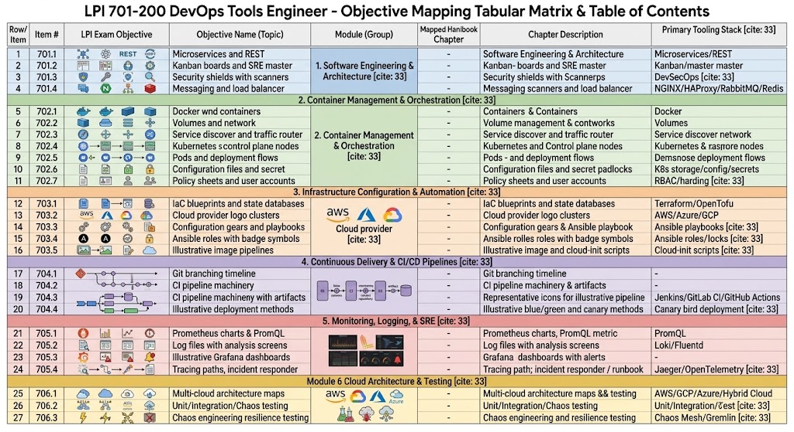

# Navigating the LPI 701-200 Certification Matrix

Welcome! Standard certification blueprints can feel dry and disconnected from real-world engineering. To fix that, this guide and accompanying matrix bridge the gap between abstract exam objectives and practical, hands-on enterprise tools.

Whether you are preparing for the **LPI 701-200 DevOps Tools Engineer** exam, building internal training programs, or structuring a modern infrastructure stack, this resource is designed to help you connect theory directly to implementation.

## How to Use the Matrix

The matrix organizes the entire LPI 701-200 ecosystem into six core modules, breaking down complex topics into clear, manageable steps:

1. **Locate Your Core Focus Area:** Start by identifying the module relevant to your current project or learning goal—ranging from *Software Architecture* (Module 1) to *Cloud Architecture & Testing* (Module 6).
2. **Review Exam Weightings:** Pay attention to the objective weightings (`Topic Weight`). Higher weights (such as Kubernetes Orchestration or CI/CD Automation) signal areas that require deeper practical study.
3. **Map Tools to Concepts:** Use the **Primary Tooling Stack** column to match theoretical principles with industry-standard technology—such as associating *Infrastructure as Code* directly with Terraform or *Metrics Engineering* with Prometheus and PromQL.
4. **Follow the Chapter Structure:** Use the handbook chapter references as a sequential roadmap to build well-rounded, real-world skills.

## Suggested Next Steps

- **Self-Assessment:** Identify 2–3 sub-topics where you feel least experienced and start your review there.
- **Hands-On Labs:** Pair each tooling stack entry with a local sandbox environment (e.g., setting up a local `minikube` cluster for Module 2 or writing playbooks for Module 3).
- **Study Track Creation:** Group chapters into weekly milestones based on topic weight and complexity.
